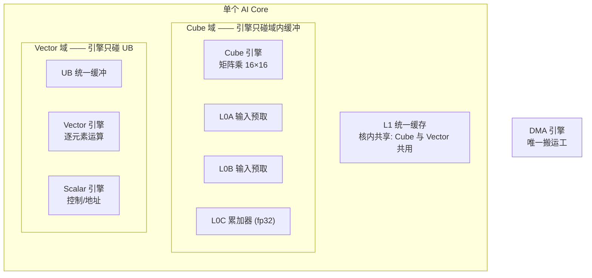
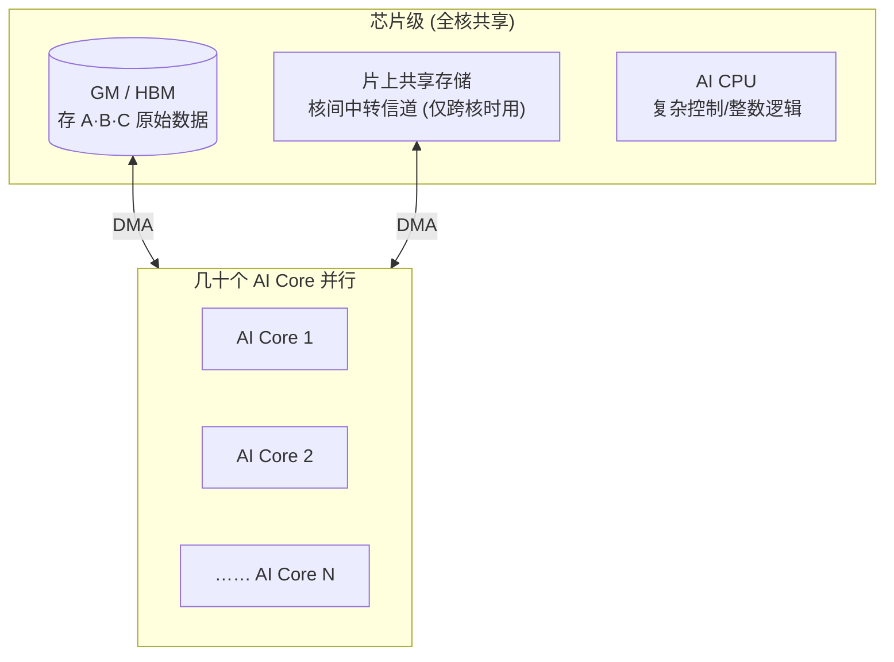

# 01 · 昇腾 AI Core 硬件模型全貌

> 面向 0 到 1 新手的「NPU 体系化架构」第一篇。今天我们回答一个问题：
> **一个算子到底跑在什么样的“物理世界”里？**

---

## 一、概述

昇腾（Ascend）NPU 的算力，核心来自一种叫 **AI Core** 的计算核心。你可以把
AI Core 想成一个「流水线工厂」：里面有四个各司其职的小车间（**Cube、Vector、
Scalar、DMA**），还有一排存放半成品的货架（**L1、L0A/L0B/L0C、UB**）。

这个工厂和一个 CPU 工厂最大的不同是：**每个车间都只认自己眼前的那排货架，
谁也不能跨区拿别人的货**——数据想从一个货架搬到另一个货架，必须走唯一的
“搬运工” **DMA**。

理解 AI Core 的结构，是理解昇腾上一切 GEMM / 卷积算子性能的**起点**。本讲会
从「一个 AI Core 内部」讲到「几十个 AI Core 的芯片级集群」，最后用一条数据流
把整个物理世界串起来。

本仓库的 `CONTEXT.md` 已对这项内容做了严谨建模（术语、访问权域、数据流），
本讲在「严格对齐其术语」的前提下，把面向新手的入门讲解展开得更充分。

---

## 二、定义（先钉住词）

### 2.1 词汇表

| 术语 | 一句话人话 |
| --- | --- |
| **AI Core** | 昇腾的计算核心，一个 AI Core 内含独立的 Cube 单元与 Vector 单元 |
| **AI Core 集群** | 芯片上几十个 AI Core 组成的并行计算阵列，各核并行跑同一个 kernel |
| **Cube 单元** | 专做矩阵乘法（MAC 阵列），以 16×16 为计算粒度，是 GEMM 性能核心 |
| **Vector 单元** | 做逐元素运算（加法/激活/归一化），一次处理一批元素 |
| **Scalar 单元** | 跑循环控制、地址计算、条件判断的“编排小核” |
| **DMA 引擎** | 专职搬运数据的硬件，**不计算，只搬**，是唯一“搬运工” |
| **GM（Global Memory）** | 全局内存，即 HBM 显存，存 A/B/C 原始数据，类比 CPU 的 RAM |
| **片上共享存储** | 芯片级中层内存，AI Core 之间交换数据的“中转站” |
| **AI CPU** | 在芯片上、但不在 AI Core 内的处理器，承接复杂控制/整数逻辑的“脏活” |
| **MAC 阵列** | Cube 单元物理上的乘加器阵列形态，一次完成 16×16×16 的乘加 |

### 2.2 三个关键视角

后续内容始终有三个“看芯片的姿势”，建议牢记：

- **宏观视角**：芯片 = 几十个 AI Core + 一块共享的 GM + 片上共享存储 + AI CPU。
- **中观视角**：一个 AI Core = 四引擎（Cube/Vector/Scalar/DMA）+ 一排片上货架。
- **微观视角**：一次计算 = “搬数据进去 → 引擎算 → 结果放哪 → 要不要再搬”。

> **人话**：AI Core 是一个小的“异构工厂”，里面 3 个算力车间（Cube/Vector/Scalar）
> + 1 个搬运工（DMA）+ 一排货架（L1/L0A/B/C/UB）。

---

## 三、为什么需要看懂它

### 3.1 决定“能不能算快”

GEMM 所有性能优化，本质都是同一句话：

> **尽量把数据搬进片上、喂给 Cube、反复复用，少回 GM 去取。**

看不懂“引擎 + 货架”，你就不知道为什么`tiling`要把矩阵切成 16 的倍数、为什么
要 double buffer、为什么 L0C 要 fp32 累加。看懂之后，这些优化全是“顺理成章”。

### 3.2 决定“怎么写算子”

昇腾的 L1/L0/UB 是**软件显式管理**的，kernel 代码必须用 DMA 手动搬进搬出。
写错域（比如想直接在 L0C 上做 ReLU）在硬件上就不成立。看懂访问权域，
才能写出“硬件允许的代码”。

### 3.3 决定“为什么卡”

工程里 90% 的瓶颈在**搬运**而不是**计算**。看懂数据流，等于拿到一把“性能
放大镜”——一眼看出哪里多搬了一趟、哪里没复用。

> **人话**：不懂硬件模型，你看优化文章只能“跟着抄”，看懂了才能“自己造”。

---

## 四、要点（核心内容）

### 4.1 一个 AI Core 内部的引擎与货架

一个 AI Core 内部包含 4 个引擎和若干片上缓冲：

**四引擎各司其职：**

| 引擎 | 干什么 | 类比 |
| --- | --- | --- |
| **Cube** | 一次算一个 16×16×16 的小矩阵块（MAC 阵列），fp16 进、fp32 累加 | 重型机床 |
| **Vector** | 逐元素：加、激活、归一化，一次处理一批 | 批量流水线 |
| **Scalar** | 循环控制、地址计算、判断，数据进 Cube/Vector 前的“编排” | 调度员 |
| **DMA** | 在 GM/共享存储/L1/L0/UB 之间搬数据，**不计算** | 搬运工 |

> **人话**：Cube 是“速度之王”，Vector 是“杂活王”，Scalar 是“指挥”，DMA 是“搬运工”。

### 4.2 三层世界的芯片级全貌

把镜头拉远到芯片级，看到的是「三层世界」：

**三层各自的角色：**

- **最外层 GM（HBM）**：容量最大、速度最慢，是存放 A/B/C 原始数据的“大仓库”。
- **中间层 片上共享存储**：芯片级的中层内存，是核与核之间的“公共信箱”。
  核 A 的中间结果经它转给核 B。
- **最里层 每个 AI Core 内部**：L1 → L0A/B → Cube → L0C → UB，最快、容量最小。

> **人话**：数据离算力越近越快，但容量越小。高性能算子的全部功课，就是把数据
> 尽量往里层搬、反复复用。

### 4.3 三条物理事实（一切以这为准）

这是理解昇腾硬件的**锚点**，请务必记牢：

1. **存储分两级**：芯片级（GM / 片上共享存储，全核共享）+ 核内（L1/L0A/L0B/L0C/UB，
   每核私有）。
2. **L1 是核内统一缓存，Cube 与 Vector 共用**：Cube 经 L1 灌 L0A/L0B，Vector 经 L1 灌
   UB。L1 不属于任何单一引擎域。
3. **每个引擎只访问“自己名下的缓冲”（访问权域边界）**：
   - **Cube 域**：Cube 引擎 ↔ 只碰 L0A / L0B / L0C。
   - **Vector 域**：Vector 引擎 ↔ 只碰 UB。
4. **DMA 是唯一“搬运工”**：跨存储层移动、跨域搬运（如 L0C→UB），必须经 DMA，
   没有引擎能直接读别的缓冲。

> **人话**：每个引擎都有自己的“领空”；想跨界，只能叫 DMA 帮忙搬货。

### 4.4 多核怎么并行

- **几十个 AI Core 并行干活**：每核独立跑 kernel，各算各的输出分片。
- **片上共享存储是核间唯一信道**：核 A 的中间结果经它转给核 B；单核私有数据可直接
  GM→L1，只有真要跨核才绕共享存储。
- **AI CPU 兜底**：复杂控制流、整数逻辑、地址计算这些 Cube/Vector 接不了的“脏活”。

以 GEMM 为例：**每个 C[i,j] 只依赖 A 的一行 + B 的一列**，天然没有任何核间依赖，
所以可以简单按行/列把输出 C 切成若干块，分给不同 AI Core 各算各的，几乎不用
跨核通信。

> **人话**：GEMM 天然“各核各算各的 C”，多核并行是手到擒来。

### 4.5 一次 GEMM 在 AI Core 上的走位（图文对照）

假设我们要算 `C = A @ B`，其中 A、B 是大矩阵。为了讲清物理世界，我们把切分到
“一个 AI Core 的一个 tile”来看：

| 步骤 | 谁在动 | 数据在哪 | 你该记住的 |
| --- | --- | --- | --- |
| ① | —— | A/B 子块躺在 GM | 原始数据在“仓库” |
| ② | DMA | GM → L1 | 搬进核内的统一缓存 |
| ③ | DMA | L1 → L0A / L0B | 灌进 Cube 的输入预取 |
| ④ | Cube | L0A×L0B → L0C | 16×16 矩阵乘，fp32 累加 |
| ⑤ | DMA | L0C → UB（可选） | 要做 ReLU 才跨域搬到 Vector 眼前 |
| ⑥ | Vector | UB 上加工 | 激活/归一化 |
| ⑦ | DMA | UB → GM | 结果搬回“仓库” |

这一步一步，**都是 kernel 代码显式发起的**——你必须亲手指挥 DMA 每一步。

> **人话**：算 C 的过程 = “把 A/B 搬进厂 → Cube 算 → 想加激活就搬到 UB 加工 →
> 成品搬回仓库”，全程你都得亲自下指令。

### 4.6 一条完整数据流串起来

> 数据从 GM（仓库）出发，经 DMA 穿进 AI Core，喂给 Cube 算完累加在 L0C，
> 要加工就搬到 UB 给 Vector，最后原路 DMA 回 GM。**全程每一级搬运都是 kernel
> 代码显式发起的。**

---

## 五、常见误区（新手必看）

### 5.1 “NPU 也有 cache，我不用管”

**错。** CPU 的 L1/L2 cache 是硬件自动管理，你写代码不用管。昇腾的 L1/L0A/B/C/UB
是**软件显式管理**的片上缓冲——你不搬，数据就不会自己送上门。这是 NPU 与 CPU
最本质的区别，也是新手上手昇腾最容易“翻车”的地方。

### 5.2 “想让 Cube 结果做 ReLU，直接就可以”

**错。** ReLU 是逐元素操作，由 **Vector** 负责。但 Vector 只碰 **UB**，而 Cube
的结果在 **L0C**（Cube 域）。想加工，必须先把 L0C 经 DMA 跨域搬到 UB，
Vector 才能算。这就是“为什么不能在 L0C 上做 ReLU”的硬件原因。

### 5.3 “所有引擎都能访问 GM”

**错。** 没有核/引擎能直接读 GM 的块，一切都要走 DMA。GM 是“仓库”，
要取货必须叫“搬运工”。

### 5.4 “多核越多，GEMM 一定越快”

**要辩证。** 只有当“搬运/通信开销 < 切分省下的计算时间”时才加速。好在 GEMM
天然无核间依赖，是最适合多核并行的一类算子。

> **人话**：记住三句话——货架要自己搬、L0C 不能直连 UB、谁也别直接摸 GM。

---

## 六、人话总结

1. 昇腾 = 芯片级（GM/共享存储/AI CPU）+ 核级（几十个 AI Core）。
2. 一个 AI Core = Cube + Vector + Scalar + DMA 四引擎 + 一排片上货架。
3. 引擎各有“访问权域”，谁也不能跨区拿货；跨域的唯一通道是 **DMA**。
4. L1/L0A-B-C/UB 是软件显式管理，**不是** CPU 那种硬件自动 cache。
5. 高性能算子只做一件事：尽量把数据搬进片上、复用，别老回 GM。

---

## 七、参考资料（官方来源）

> 以下链接均已核实，可在昇腾官方域名下访问。

- 华为昇腾 · Ascend C 编程模型概述（AI Core 硬件基础、SIMD/SIMT、AI CPU）：
  https://asc.gitcode.com/guide/编程指南/编程模型/编程模型概述.html
- 华为昇腾 · C++ Tensor 编程概述（内存层级 GM→L1/L0 与 GM→UB、LocalTensor/GlobalTensor）：
  https://asc.gitcode.com/guide/编程指南/编程模型/AI-Core-SIMD编程/基于Tensor的CPP编程/CPPTensor编程概述.html
- 华为昇腾 · Ascend C 算子开发语言官方首页（CANN 算子开发语言）：
  https://www.hiascend.com/cann/ascend-c
- 华为昇腾 · CANN 社区版 Ascend C 算子开发指南（kernel 直调/内核直调流程）：
  https://www.hiascend.com/document/detail/zh/CANNCommunityEdition/81RC1alpha001/devguide/opdevg/ascendcopdevg/atlas_ascendc_10_0051.html