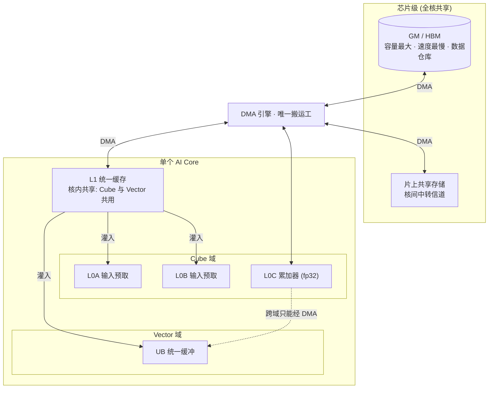
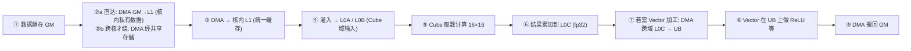

# 02 · 存储层级与访问权域

> 面向 0 到 1 新手的「NPU 体系化架构」第二篇。今天我们回答一个问题：
> **一份数据从一个仓库，是怎么一步步被送到计算引擎眼前的？**

---

## 一、概述

昇腾 NPU 的内存不是一个“大仓库”，而是一整套 **分级存储层级**。从最外层容量
最大的 **GM（HBM）**，到最里层紧贴引擎的 **L0A/L0B/L0C/UB**，每往内一层，容量
越小、速度越快。

更关键的是：**每一层之间没有“自动搬运”，全部要靠显式的 DMA**。这跟 CPU 的
cache 完全不同——CPU 的 cache 由硬件自动管理，你写了就能用；昇腾的片上存储
是**软件显式管理**的，你不搬，数据就不会自己送上门。

本讲将带你：
1. 认知完整的存储层级全景（GM / 片上共享存储 / L1 / L0A-B-C / UB）；
2. 搞懂“访问权域”是谁碰谁、谁不碰谁；
3. 明白 DMA 为什么是**唯一搬运工**；
4. 走一遍完整数据流，并对比“显式内存管理 vs CPU cache”。

本仓库 `CONTEXT.md` 里关于存储的词条（GM / 片上缓冲 / L1 / L0C / L0A-B / UB /
DMA / 数据流）为本讲术语的权威依据，全文严格对齐。

---

## 二、定义（先钉住词）

### 2.1 词汇表

| 术语 | 一句话人话 |
| --- | --- |
| **GM（Global Memory）** | 全局内存，即 HBM 显存，容量大但带宽有限，存 A/B/C 原始数据，类比 CPU 的 RAM |
| **片上共享存储** | 芯片级中层内存，核间交换数据的“中转站”，仅在跨核时使用 |
| **L1** | 核内统一缓存，Cube 与 Vector 共用，存 A/B 子块，类比 GPU 的 shared memory |
| **L0A / L0B** | Cube 的输入预取缓冲，紧贴 Cube，分别喂矩阵乘的 A、B 分块 |
| **L0C** | Cube 的累加器缓冲，fp32 存放矩阵乘中间结果 |
| **UB（Unified Buffer）** | Vector 的“工作台”，逐元素运算（激活/归一化/加偏置）在此做 |
| **DMA 引擎** | 唯一“搬运工”，跨存储层移动、跨域搬运的唯一通道 |
| **访问权域** | 每个引擎只访问“自己名下的缓冲”的边界规则 |

### 2.2 一张图记住位置关系

```text
城外大仓库                 城里一条街               最里层贴着车间
   GM (HBM)   --DMA-->   片上共享存储   --DMA-->   L1 → L0A/B/C、UB
  (最外最大)            (核间中转)             (最里最快最小，每核私有)
```

> **人话**：GM 是城外的大仓库，片上共享存储是城里的集散地，L1/L0A/B/C/UB 是贴
> 着每个车间的小仓，它们之间既不自动补货也不自动退货，全靠 DMA 这个唯一搬运工。

---

## 三、为什么需要存储层级

### 3.1 算力太快，内存跟不上

如果每次要算都去 GM 取原始数据，HBM 的带宽会成为瓶颈，引擎只能“饿着等”。
分级存储让最热的数据留在最小的、最快的缓存里，喂得饱引擎。

### 3.2 计算要复用数据

矩阵乘里一个数据块会被反复使用。把它放进片上缓存，就避免了每次回 GM 重取，
GM 访问次数能降下来好几个数量级——这就是“GM 访问下降 N 倍”的硬件根源。

### 3.3 引擎只碰自己的领地

域边界是硬件规则，软件（kernel）必须遵守。懂了这个，就知道哪些操作“在硬件上
根本不可能”，编程时少踩坑。

> **人话**：存储分级的全部意义，就是**让数据尽量贴着引擎待着**，别来回跑腿。

### 3.4 一句话心法

> **高性能算子只做一件事：尽量把数据搬进片上、反复复用，别老回 GM。**

---

## 四、要点（核心内容）

### 4.1 完整的存储层级全景



**每一级各是什么：**

| 存储 | 谁拥有 | 干什么 |
| --- | --- | --- |
| **GM** | 全核共享 | 存 A/B/C 原始数据，L0A-B-C/UB 无法直接访问它 |
| **片上共享存储** | 全核共享 | 核间中转，只有跨核数据才绕它 |
| **L1** | 每核私有 | 统一缓存，A/B 子块在这，Cube/Vector 都从这取数 |
| **L0A / L0B** | 每核私有 | Cube 的输入预取，喂矩阵乘的 A、B |
| **L0C** | 每核私有 | Cube 累加器，fp32 存中间结果 |
| **UB** | 每核私有 | Vector 的工作台，逐元素运算在这做 |

> **人话**：越往内越靠引擎、越快、越小；所有层间/跨域移动都要 DMA 来搬。

### 4.2 访问权域：谁碰谁，谁不能碰谁

这是昇腾最反直觉、也最关键的一点：

| 引擎 | 能碰的本域缓冲 | 不能碰 |
| --- | --- | --- |
| **Cube** | L0A、L0B、L0C | UB，以及一切别域的缓冲 |
| **Vector** | UB | L0A/L0B/L0C |
| **Scalar** | 与 Vector 共享 UB | —— |

- **L1 不属于任何单一引擎域**：它是核内枢纽，Cube 和 Vector 都从它取数
  （`L1→L0A/L0B`、`L1→UB`）。
- **L0C 到 UB 唯一的路**：必须经 DMA。图里 L0C 与 UB **没有直连**。

### 4.3 域边界带来的三个“硬件事实”

1. **不能在 L0C 上直接做 ReLU**：ReLU 是逐元素操作，归 Vector，而 Vector 只碰 UB；
   Cube 结果在 L0C（Cube 域）。想加工，先把 L0C 经 DMA 搬到 UB。
2. **Cube 和 Vector 不是同一个引擎**：一个管矩阵乘、一个管逐元素，谁也代不了谁；
   结果必须在 L0C 与 UB 之间搬来搬去，正是这坐“筋斗云”。
3. **结果想写回 GM 也要 DMA**：没有任何引擎能直接写 GM，DMA 是唯一“搬运工”。

> **人话**：Cube 碰 L0A/B/C，Vector 碰 UB，大家各管各的摊；想跨界，叫 DMA。

### 4.4 DMA 是唯一搬运工

- **DMA 不计算**，只负责在 GM、片上共享存储、L1、L0、UB 之间搬数据。
- **没有核能直接读别的缓冲/GM 的块**，必须走 DMA。
- 搬运是**显式**的：kernel 代码里的一次次 `T.copy` / `DataCopy`，就是这些 DMA 动作。

### 4.5 数据流全景

把上面串成一条“数据通关地图”：



**每一步要抓住的：**

- ①→⑥ 是 **Cube 通路**（纯矩阵乘），全程没离开 Cube 域。
- ② 是“可选分叉”：单核私有数据走直达；确实要跨核才绕共享存储。
- ⑦→⑧ 是 **可选的 Vector 加工通路**，只有做 ReLU/归一化这类逐元素操作才走，
  且**必须经 DMA 跨域**把 L0C 搬进 UB。
- ⑨ 回写 GM 同样走 DMA。
- **每一步搬运，都是 kernel 代码显式发起的**——这就是“搬运是显式的”。

### 4.6 显式内存管理 vs CPU cache（最本质的区别）

| 对比维度 | CPU 的 cache | 昇腾的 L1/L0/UB |
| --- | --- | --- |
| 谁来管理 | 硬件自动 | **软件（kernel）显式管理** |
| 要不要自己搬 | 不用 | 必须用 DMA 手动搬入搬出 |
| 你写了就用吗 | 是 | 不搬就取不到数据 |
| 是否透明 | 对开发者透明 | 开发者必须关心 |

> **人话**：听到“NPU 的 L1”千万别按 CPU 缓存想；它是显式管理的片上缓冲，
> 数据不会自己送上门，你得亲手搬。

---

## 五、常见误区（新手必看）

### 5.1 “L1 是 cache，会自动缓存”

**错。** L1/L0/UB 是软件显式管理，不是硬件自动 cache。`T.copy` / `DataCopy` 写不写、
数据就不到位。这是和 CPU 最本质的分界线。

### 5.2 “Vector 可以直接读 L0C”

**错。** L0C 在 Cube 域，Vector 只能碰 UB。想读 L0C，必须先 DMA 跨域把结果搬进 UB。

### 5.3 “GM 里的数据随便取”

**错。** 没有引擎能直接读 GM 的块，一切都要走 DMA。GM 是“仓库”，取货要叫搬运工。

### 5.4 “跨核数据不用特殊处理”

**错。** 跨核必须经过片上共享存储（中转站），即“走过两层 DMA”：
GM → 共享存储 → L1。只有纯核内私有数据才直达 GM → L1。

> **人话**：搬要自己搬、跨域要叫 DMA、跨核要绕共享存储、GM 不能直接摸。

---

## 六、TL;DR

1. 存储分层：GM(HBM) → 片上共享存储 → L1 → L0A/L0B/L0C/UB，越内越快越小。
2. 访问权域：Cube 碰 L0A/B/C，Vector 碰 UB，L1 是共用枢纽，谁也不跨界。
3. 唯一搬运工：**DMA**，一切层间/跨域移动都必须走它。
4. 显式 vs 隐式：昇腾片上缓冲是显式管理，不是 CPU 那种自动 cache。
5. 性能心法：尽量把数据搬进片上反复复用，少回 GM。
6. 跨核要绕片上共享存储走两趟 DMA；纯核内私有则 GM→L1 直达。

---

## 七、参考资料（官方来源）

> 以下链接均已核实，可在昇腾官方域名下访问。

- 华为昇腾 · C++ Tensor 编程概述（内存层级、LocalTensor/GlobalTensor）：
  https://asc.gitcode.com/guide/编程指南/编程模型/AI-Core-SIMD编程/基于Tensor的CPP编程/CPPTensor编程概述.html
- 华为昇腾 · Ascend C 编程模型概述（AI Core 硬件基础、存储与访问权域）：
  https://asc.gitcode.com/guide/编程指南/编程模型/编程模型概述.html
- 华为昇腾 · CANN 社区版 Ascend C 算子开发指南（Kernel 实现/数据搬运）：
  https://www.hiascend.com/document/detail/zh/CANNCommunityEdition/81RC1alpha001/devguide/opdevg/ascendcopdevg/atlas_ascendc_10_0051.html