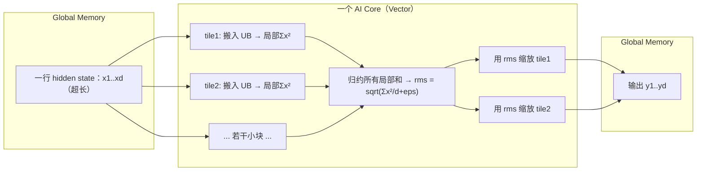
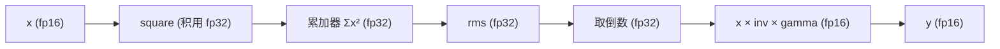

# 02 · RMSNorm（Root Mean Square Layer Normalization）

> 目标读者：已会看代码、想搞懂"为什么 LLM 里到处是归一化"的新手。
> 本文从数学公式出发，讲清 RMSNorm 是什么、为什么需要、朴素怎么写，以及它在昇腾 NPU 上被优化成什么样。

---

## 一、概述

RMSNorm 是 **Layer Normalization（层归一化）的一个轻量变体**，由 Zhang & Sennrich 在 2019 年提出（NeurIPS 2019）。LLaMA 等主流大语言模型里，每个 Transformer 层都会用一次归一化来稳定训练、让数值保持健康,而它们普遍选择 RMSNorm——因为它**去掉了均值计算**，算得更快，效果却几乎不掉。

它本质上是一条对向量逐元素做的三步流水线：

```
对每一行 x（即一个 token 的 hidden state）：
  ① 求均方根 RMS(x)
  ② 每个元素除以 RMS(x)
  ③ 再逐元素乘一个可学习缩放 gamma
```

> 人话：先把"一行数据的能量"归一化到统一的"音量"，再按人的口味放大缩小。

---

## 二、定义

### 2.1 数学定义

设输入 `x ∈ R^d`（d 为特征维 / hidden size），RMSNorm 定义如下：

```
RMS(x) = sqrt( (1/d) · Σ_{i=1}^{d} x_i² + ε )

y_i = (x_i / RMS(x)) · γ_i
```

其中：

- `ε` 是一个很小的常数（如 `1e-6`，也有的实现用 `1e-5`），**只是为了防除零**，不作参数；
- `γ` 是可学习的缩放参数（per-dimension），逐元素作用于归一化结果；
- 与 LayerNorm 不同，RMSNorm **没有均值项、没有可学习的偏置 β**。

### 2.2 与 LayerNorm 的对比

LayerNorm 的公式（Ba et al., 2016）：

```
y_i = (x_i - μ) / σ · γ + β
μ = (1/d) Σ x_i ;   σ = sqrt( (1/d) Σ (x_i - μ)² )
```

RMSNorm 砍掉了 `μ` 和 `β`，只保留"除以 RMS"。作者论证：LayerNorm 提供的"去均值不变性（re-centering invariance）"其实是可有可无的，只保留 **re-scaling 不变性**（缩放不变性）就能稳定训练，还能顺带获得"隐式的学习率自适应"。

```
人话：LayerNorm 是"挪到原点再校准缩放"；RMSNorm 省掉"挪到原点"这一步，只校准缩放，因此便宜、效果还接近。
```

---

## 三、为什么需要它

### 3.1 深层网络的数值在"漂"

训练很深的网络时，各层输出的数值范围会越来越大、分布越来越歪（协变量漂移），让梯度要么爆炸要么消失，模型很难收敛。**归一化**把每层的输出拉回一个"标准身材"，极大缓解这种不稳定。

### 3.2 LayerNorm 有个"多余"的步骤

LayerNorm 要先算均值 `μ`，再算减去均值后的方差 `σ`——这需要**两趟归约**（一趟算均值，一趟算方差）。而且为了输出稳定还带了 `β`。RMSNorm 认为"减均值"这步用处不大，于是**只算均方根、只算一趟归约**，参数也少一个。论文实测在多种模型上比 LayerNorm 快了 `7%~64%`，精度基本持平。

### 3.3 在推理上的额外好处

少了 `μ`、`β`，推理时的**访存和计算都更省**；每层都归一化一次，乘上大模型几十上百层，省下的就是实打实的推理延迟。

---

## 四、朴素实现

### 4.1 Python / NumPy（每行独立）

按定义逐行算（假设输入是 `(batch, d)`，对最后一维归一化）：

```python
import numpy as np

def rmsnorm(x, gamma, eps=1e-6):
    # ① 求每个样本的均方根 RMS
    rms = np.sqrt(np.mean(np.square(x), axis=-1, keepdims=True) + eps)
    # ② 逐元素除以 RMS
    x_norm = x / rms
    # ③ 逐元素乘缩放 gamma
    return x_norm * gamma
```

要点：`axis=-1` 保证了"每行独自归一化，行与行互不干扰"。

### 4.2 分解成可执行的步骤序列

把上面的公式拆成计算机一步一步能做的原语（这条序列也正是稍后 NPU 优化的蓝图）：

```
① x²          （逐元素平方）
② sum(x²)     （沿特征维求和 → 归约）
③ rms = sqrt(sum(x²)/d + eps)
④ inv = 1/rms  （倒数，用乘替代除，更快）
⑤ y = x · inv  （逐元素乘）
⑥ y = y · gamma（逐元素乘，可并入上一步）
```

> 人话：RMSNorm 本质上就是"平方 → 求和 → 开方 → 取倒数 → 逐元素乘两下"。

---

## 五、NPU 上的关键优化点

### 5.1 让数据"赖"在 UB 上，别来回 GM

RMSNorm 是典型的**低算术强度、高访存强度**算子——每个元素只做几次乘加，计算量不大。真正的开销是"把整行从 GM 搬进 UB"和"把结果搬回 GM"。优化的第一原则与 element-wise 一样：**一份输入只在 GM 与 UB 之间走一趟**，中间产物（x²、sum、inv）全部留在 **UB 内**流转，不写回 GM。

### 5.2 Vector 指令一比一来捕捉四步

昇腾的 **Vector 单元**提供了和上面四步一一对应的硬件指令（这就是 CONTEXT.md 里"Vector 只碰 UB"的体现）：

| 算子步骤 | Vector 指令（示意） | 说明 |
|---|---|---|
| ① 平方 | `Mul` / `Square` | 逐元素 |
| ② 求和 | `ReduceSum` | 沿特征维归约，结果放标量缓冲 |
| ③④ 根号+倒数 | `Sqrt` + `Muls` 或求 `Rsqrt` | 常合并算倒数 |
| ⑤⑥ 缩放 | `Muls` / `Axpy` 等 | 逐元素乘 |

**关键手法是"乘倒数"而非"除"**：除法在矢量引擎里贵，把 `x / rms` 变成 `x * (1/rms)`，只要先算一次值的倒数即可，攒下大量逐元素除法。

### 5.3 tiling：一行可能比 UB 还宽

LLaMA 的 hidden size 高达几千到上万个元素，数据量可能塞不进 **UB**。因此要做 **tiling（分块）**：

- 沿 **特征维 d** 切成若干小块，每块先算**局部**的 `Σx²`；
- 把各块的局部和归约成**全局** `Σx²`，算出整个 `rms`；
- 再回头用整个 `rms` 去缩放每个块。

切块要满足对齐要求（搬运单元按 32 字节 / 16 个 fp16 对齐），这也是 CANN Tiling 指南强调的约束。



> 人话：一行数据太长、工作台（UB）装不下，就切成几段各算各的"小和"，再把小和加总成一个"总 RMS"，最后用总 RMS 回头把每段都缩放一遍。

### 5.4 归约本身是最"贵"的一步

`Σx²` 需要把整行的数据都卷进来，这一趟归约会读满 UB 一次。优化里常通过**双缓冲 / 流水线**让"这行还在归约时，下一行的数据已经在搬进来的路上"。归约的写法也决定了可不可以跨多个 AI Core 分摊（每核算一行的一部分，再经**片上共享存储**合并）。

### 5.5 混合精度：归一化更要用 fp32 累加器

归一化正好贴合仓库 CONTEXT.md 强调的**混合精度**原则：

- 输入/输出走 **fp16**（访存省、Vector 主精度）；
- 但求和 `Σx²` 这类 **累积** 必须用 **fp32 累加器**——fp16 尾数只有约 11 位（约 3 位十进制有效数字），在 d 很大的行上累加几千上万个平方项，小项会被不断舍掉，数值抖动、精度崩坏。用 fp32 累加正是为了保留进位（这是"精度/有效数字"问题，不是"溢出"问题）。



> 人话：算"平方和"的中间账本必须用更宽的 fp32，答案算完再降回 fp16 存起来——否则越加越糊。

### 5.6 与下游 MatMul 的融合（规范化落地）

RMSNorm 常和紧跟其后的矩阵乘融合成一个 kernel：归一化结果**直接留在片上**喂给 GEMM/Cube，不再写回 GM 再由 GEMM 读一遍。这正是 CANN 生态里 `RmsNorm` 融合算子（含 `RmsNormQuant` 量化融合）在做的事——少一趟 GM 往返，省带宽也省 kernel 启动开销。

### 5.7 多核怎么切分

把批量里的不同行分给不同 **AI Core** 是最自然的分法（每核算互不相关的一整行，天然无核间依赖）。当**行太宽、或想让每个核吃满**时，也可把同一行的特征维拆到多个核，各算各的局部 `Σx²`，再把局部和经**片上共享存储**归约出全局 RMS——此时需要一次跨核通信。工程上通常优先"按行分核"，只在单行极大时才考虑特征维切分，尽量避开跨核归约。

另外要注意：特征维切分后，每个核仍需要**完整的全局 RMS** 才能算自己的输出分片，所以"先各算局部和 → 归约广播回各核 → 各核再缩放自己的分片"是两阶段流程，比"按行分核"多一次跨核往返——这正是 CONTEXT.md 里描述"核 A 中间结果经共享存储转给核 B"的场景。

---

## 常见误区与追问

1. **"RMSNorm 还需要算均值吗？"** 不需要——这正是它与 LayerNorm 的本质区别。它只除以均方根，不做"减均值"，训练更省、效果接近。
2. **"eps 放哪里？"** 放在根号里面的 `1/d·Σx² + ε`。它**只防止分母/开方的数值风险**，不是可学习参数（别把它当成 bias 训练）。
3. **"归一化全程都要 fp32 吗？"** 不必。真正需要 fp32 的是**求和/归约（Σx²）**这类累积；纯逐元素（乘 gamma）走 fp16 即可。这正是仓库 CONTEXT.md 的**混合精度**原则："存窄算宽"。
4. **"一行太长怎么核？"** 走 tiling：局部 `Σx²` → 归约成全局 RMS → 回头缩放。多核时优先"按行分核"，避免跨核归约。

---

## 六、数据流总览


---

## 七、TL;DR

- **RMSNorm = 省略均值的 LayerNorm**，只算均方根再归一化，快而稳；
- 公式三步：`rms → 除以 RMS → 乘 gamma`；
- **瓶颈是访存不是计算** → 数据尽量留在 UB；
- 归约（`Σx²`）要 **fp32 累加**，防止 fp16 累积糊掉；
- 长行要 **tiling**，局部和再归约成全局 RMS；
- 归一化结果**直接喂给下游 GEMM**，别写回 GM 再读——这就是融合。

---

## 八、参考资料

- **RMSNorm 论文**（Biao Zhang, Rico Sennrich, "Root Mean Square Layer Normalization", NeurIPS 2019）：
  https://arxiv.org/abs/1910.07467
- **LayerNorm 论文**（Jimmy Lei Ba et al., "Layer Normalization", 2016）：
  https://arxiv.org/abs/1607.06450
- 华为昇腾 CANN 官方文档（CANN 商用版 8.0）Ascend C API《Normalize》（LayerNorm/RMSNorm 的 Vector 归一化接口）：
  https://www.hiascend.cn/document/detail/zh/canncommercial/800/apiref/ascendcopapi/atlasascendc_api_07_0810.html
- 华为昇腾 CANN 官方仓库 `cann/ops-nn`（含 `RmsNormQuant` 等归一化+量化融合算子；官方开源仓库，GitCode 镜像）：
  https://gitcode.com/cann/ops-nn

> 说明：昇腾文档地址携带 CANN 版本号，失效时请在 https://www.hiascend.cn/document 检索"Ascend C API · Normalize"。