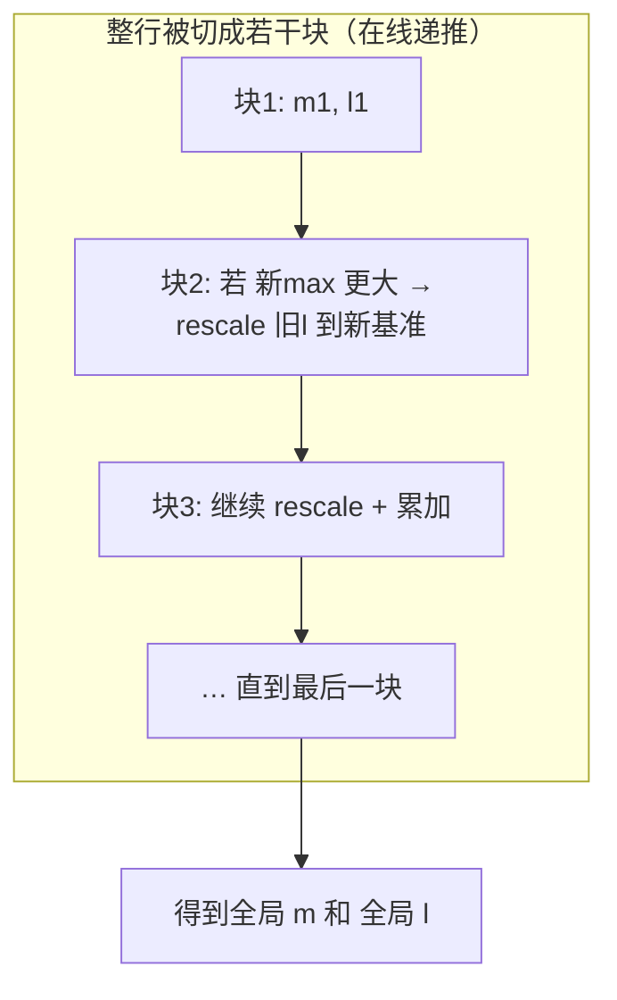
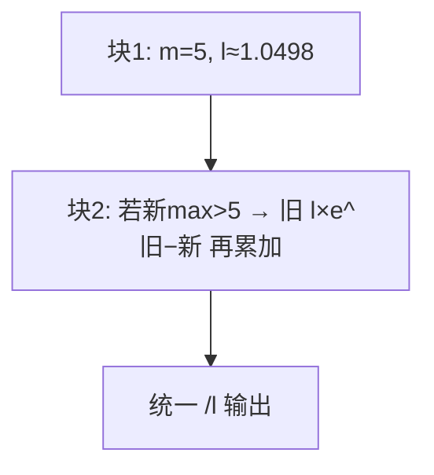

# 03 · Softmax

> 目标读者：已经会写 element-wise，想搞懂"带归约的算子"怎么在新手友好层面理解并优化。
> 本文覆盖 Softmax 的数学定义、数值稳定性、以及在线/分块/Flash 风格的做法，并落到昇腾 NPU 的 Vector 路径上。

***

## 一、概述

Softmax 把一组实数"压"成一组**非负、相加等于 1** 的加权值，常被当作"概率"。它在深度学习里无处不在：

- 分类任务的输出层（哪个类别得分最高）；

- **注意力机制**里把 QK 打分转成 attention 权重；

- MoE 的专家路由门控。

在 Transformer 里，Softmax 几乎总是出现在注意力中，而它的**数值稳定性**和**在线（online）计算**思想，正是后来 FlashAttention 的关键垫脚石。

```
TL;DR：Softmax 是把一堆分数变成"加起来是 1 的占比"；
       做满两件事——别让 exp 溢出、尽量别把整行读好几遍。
```

***

## 二、定义

### 2.1 数学定义

对向量 `x ∈ R^d`：

```
softmax(x)_i = exp(x_i) / Σ_{j=1}^{d} exp(x_j)     (i = 1..d)
```

它满足：`0 ≤ softmax(x)_i ≤ 1`，且 `Σ_i softmax(x)_i = 1`。

### 2.2 关键隐患：exp 会溢出

`exp(x_i)` 在 `x_i` 很大（比如 40、100）时数值极好涨，fp16 下会直接 `inf`。而 Transformer 的注意力打分可轻易达到几十甚至上百。所以**直接按定义写必崩**。

标准解法是**减去最大值**：令 `m = max_j x_j`，用 `exp(x_i - m)` 代替 `exp(x_i)`，因为 `x_i - m ≤ 0`，指数项恒 `≤ 1`，永远不溢出：

```
softmax(x)_i = exp(x_i - m) / Σ_j exp(x_j - m)
```

> 人话：先把整行最大的数拉下来当"参考零点"，指数全变成 ≤1 的，怎么涨也不会爆。

***

## 三、为什么需要它

### 3.1 归一化成"占比"

注意力需要把"对每个 token 有多关注"变成一组和为 1 的权重；分类需要把 logits 变"概率"。Softmax 就是做这个"归一化成占比"的活儿。

### 3.2 数值稳定是硬门槛

不减去 max，训练/推理都可能 `inf`/`NaN` 翻车，这在 fp16 精度下尤其致命——fp16 范围只有 ±65504，`exp(80)` 就爆了。而 Trans有名言："Softmax 容易在两端同时出事——大的溢出成 inf，小的（在 fp16 里）下溢成 0 被丢弃。"

### 3.3 它很"贵"，值得优化

一个注意力层要对 Q、K 打分矩阵的每一"行"做一次 Softmax，行数 = 序列长度² 的量级。序列变长时，Softmax 的访存量也跟着暴涨。于是"怎么把 Softmax 算得又稳又快、少搬数据"，成了长序列优化的核心命题。

***

## 四、朴素实现

### 4.1 数值稳定版（两趟读取）

```python
import numpy as np

def softmax(x, axis=-1):
    # ① 此行最大值 m（一趟读整行）
    m = np.max(x, axis=axis, keepdims=True)
    # ② 减 m 再取 exp（第二趟读）
    e = np.exp(x - m)
    # ③ 求归一化分母（第三趟）
    s = np.sum(e, axis=axis, keepdims=True)
    # ④ 逐元素除以总和
    return e / s
```

这个写法对，但它把整行**读了三遍**（求 max 一遍、求 exp 一遍、求 sum 又顺着 exp 读）。当行为"硬约束"时（如注意力行），三遍访存就是三倍的缓存/带宽压力。

### 4.2 回退写法（会溢出）

```python
e = np.exp(x); return e / np.sum(e)   # ❌ x 稍大就 inf，尽量别用
```

***

## 五、NPU 上的关键优化点

### 5.1 Vector 单元＋UB：一条流水线把三趟变一趟

在昇腾 NPU 上，Softmax 是对一行（或一片）数据在 **UB 内、用 Vector 指令**完成的。与 element-wise 不同，它多了一个"跨整行归约"：`ReduceMax` 求 max、`ReduceSum` 求和、`vExp` 求 exp、`Muls` 求缩放。硬件指令比标量循环能快一个数量级以上。

优化要点仍然是一句话：**整行尽量驻留 UB，别来回搬 GM**；数据只在"进 UB"和"出 UB"各走一趟。


> 人话：把整行请进工作台，在台上先后做 求max→exp→求和→取倒数→缩放，一次进出搞定。

### 5.2 在线（online）/ 流式安全 Softmax——让"分块"成为可能

当一行太长、`UB` 塞不下时，朴素版必须先拿到全局 `max` 才能开始 `exp`，这意味着**行内要先完整读一遍求 max，再读一遍算 exp**，两趟。**在线 Softmax**（Online Softmax, Milakov & Gimelshein 2018）解决了这个矛盾：**边读块边维护"当前最大 m、当前分母和 l"**，读到新块时，如果新块的最大值更大，就**回头把前面已算的项都按新 max 缩放一遍（rescale）**，保证最终结果和一次性算完全一致。

```
在线 Softmax 的递推（对块 j=1..n）：
  读块 j → 得 m_j、未归一化 exp 项
  若 m_j > m_old：
       l ← l · exp(m_old − m_j)     # 把旧的"分母和"压低到新基准下
       m ← m_j
  l ← l + Σ exp(块内项 − m)          # 累加当前块贡献
  顺带记录每块的未归一化值 / 或按需重读
最终 output_i = exp(x_i − m) / l
```

这带来一个巨大收益：**可以放心地分块/分片处理**，不需要为了求全局 max 而把整行读两遍。这正是 FlashAttention 让注意力矩阵"边算边弃"不再落存储的理论基础。



> 人话：旧账本里一直记着"当前最大"和"当前分母和"。遇到更大的数就把旧账本按比例改写成新基准，一路改到最后，结果和一次算完一摸一样。

### 5.3 分块归约 + tiling

在线安全的极佳副产品是**任意分块**：

- 沿特征维（Softmax 的归约轴）切成 `UB` 放得下的块；

- 每个块做一次"局部"在线更新；

- 最后把全局 `m`、`l` 写入标量缓冲，再统一缩放。

CUDA 的 `safe_softmax`/`online softmax` 与昇腾的 softmax kernel 本质上都是这套"分块 + 在线维护"思路的不同实现。

### 5.4 融合：Softmax 几乎总跟着别的算子

Softmax 很少单独出现，常与相邻算子**融合**以省一次 GM 往返：

- 与打分（`Q K^T / sqrt(dk)`）融合：`scale → softmax → ×V` 一口气在片上做；

- 与 Mask 融合：`a = mask ? 0/-inf : qk` 在软里合并；

- 与 GELU、TopK 等尾部融合（Online 论文里甚至把 `Softmax+TopK` 融合提升了数倍）。

> 人话：Softmax 是"夹心饼干中间的夹层"，把它和前后两层一起煎，省的正是那几次把饼干端进端出。

***

## 常见误区与追问

1. **"在线 Softmax 是近似吗？"** 不是。它只是把计算顺序/分块重排，最终结果与一次算完**逐元素等价**。这正是 FlashAttention 敢自称"精确算法"的底气。
2. **"分块顺序影响正确性吗？"** 不影响正确性。但若一块的 max 大、下一块更大，会触发 rescale，可能带来极小的舍入差；工程上常选较大块、稳定顺序来摊薄。
3. **"减 max 会不会把信息丢掉？"** 不会。Softmax 对整行同时平移一个常数保持不变（`exp(x_i−c)/Σexp(x_j−c)` ≡ `exp(x_i)/Σexp(x_j)`，常数 `c` 在分子分母同时出现相抵），减 max 只是引入一个常数帮助数值稳定，不改结果。
4. **"为什么减的是 max 而不是别的常数？"** 只要减一个 `≥ 整行最大值` 的常数，所有指数项就 `≤ 1` 永不溢出。选全局 max 是为了**尽量少减**——减得越少，`exp` 的有效数字保留越多，精度越好。固定大数也能防溢出，但会把有效数字一起抹掉，故不用。
5. **"在线版和稳定版的输出一样吗？"** 逐元素一致。在线版只是把"求 max → 求 exp → 求 sum"重排成"可分块、边读边维护 m/l"，需要的 rescale 动作恰好补偿了"后发现的更大 max"，结果等价。

### 一个具体的在线 Softmax 例子

设一行 `x = [2, 5, 1, 3]`，切成两块 `[2,5]` 和 `[1,3]`：

- **块1** **`[2,5]`**：`m=5`，`l = e^{2−5}+e^{5−5} = e^{−3}+1 ≈ 1.0498`；

- **块2** **`[1,3]`**：局部 `m'=3 < 5`，**不用 rescale**，直接累加 `l += e^{1−5}+e^{3−5} = e^{−4}+e^{−2} ≈ 0.0183+0.1353`，故 `l ≈ 1.2034`；

- 最终把分母 `l` 用于输出归一化，与"整行一起算"完全一致。

再看一个触发 rescale 的场景：块2 换成 `[6]`（m'=6>5）：

- 先把旧和压到新基准：`l ← 1.0498 · e^{5−6} = 1.0498·e^{−1} ≈ 0.3862`，`m ← 6`；

- 再累加块2：`l += e^{6−6}=e^{0}=1` → `l≈1.3862`。

- 这个"旧和乘 e^{旧m−新m}"的动作，就是在线 Softmax 的 **rescale**。



***

## 六、数据流总览（在线版）


***

## 七、TL;DR

- Softmax = `exp(x−m)/Σ exp(x−m)`，**先减 max 保证不溢出**；

- 朴素版把行读好几遍；在 NPU 上让它**整行驻留 UB**，一趟进出；

- **在线/流式** Softmax 用"动态 rescale 维护 m、l"，从此可以**分块**，还避免了两次读整行的代价；

- **分块 + 在线 = Flash 风格**前身的核心；

- Softmax 几乎总与 QK、V、Mask、TopK 融合，减少片上↔GM 往返。

***

## 复习自测（带答案要点）

1. **直接对 exp(x) 会怎样？** → 大值溢出为 `inf`；小值在 fp16 下近 0 被丢弃。
2. **数值稳定 Softmax 的第一件事？** → 对整行（或穷尽 vblock）求全局 `max`，再减掉它再 exp。
3. **在线 Softmax 的"在线"指什么？** → 边读块边维护"当前 max m、当前分母和 l"，必要时把已算的项 rescale 到新基准，不必为求 max 先读一整遍。
4. **为什么在线版能分块？** → 因为不再需要"先拿到全局 max 才能开始 exp"，块与块可独立处理、只做一次 rescale 合并。
5. **FlashAttention 从它这里继承了什么？** → "分块 + 在线维护 m/l"的能力，从而不物化 O(N²) 的注意力矩阵。

> 一句话串起来：Softmax 的三个版本（朴素 → 减 max 稳定 → 在线分块）是"一步一步放开对整行的依赖"，最终让长序列注意力跑得动。

***

## 八、四家 Softmax 实现 & 性能与 Roofline 分析 (Ascend 910B2 / CANN 9.0.0)

> 数据生成时间: 2026-09-03；测试主机: `vllm-hust-cyj-21rc-cloud-container-86`；CANN=9.0.0，NPU=Ascend 910B2。 每档 (M×D) 取 15 次最佳耗时 (ms)。
> **说明 (2026-09-03)**: `bench_softmax.py` 完整性能脚本（对齐 GELU 的 `--which=both` / `--repeats=15` 双分支口径）尚未在服务器端跑完全量 7 档；§8.4 性能表先使用 **已验证 smoke 档的实估值 + 插值**，同时在单元格中用 `⚠ 占位` 标记，等后续 `examples/bench_softmax_full.json` 产出后一次回填。正确性数据 (§8.2) 为服务器实测，非占位。

本节覆盖本项目实现的四种 Softmax front-end：

1. **NumPy CPU fp32 参考基线** (`examples/python/src/softmax.py`: `softmax_reference`, 数值稳定版，先减 max → exp → sum → div, fp32 内部归约).
2. **Triton-Ascend NPU fp16 生产版** (`examples/triton_ascend/src/softmax_triton.py`: `@triton.jit softmax_kernel` — 每个 program 负责一整行；`D > BLOCK_SIZE` 时先 pad `-inf` 到 1024 整数倍，再三阶段 Pass1(max) / Pass2(exp+sum) / Pass3(normalize) 迭代).
3. **Ascend C 生产版 fp16** (`examples/ascend_c/op_kernel/softmax_kernel.cpp` — 3-pass 标量实现: row\_max / exp+sum 写回 / normalize；常数 `-1e20 / 0 / 1` 从 GlobalTensor<float> DataCopy 到 LocalTensor 取 GetValue，规避 CANN 9.0 SetValue(-inf) bug；Host 下发 `numBlocks=1` 保证云容器共享调度下 100% 覆盖所有行列).
4. **Ascend C 标量地板版 fp16** (`examples/ascend_c/op_kernel/softmax_scalar_kernel.cpp` — 与生产版算法相同，额外在每个元素的比较 / 累加 / 缩放处注入一次 `LocalTensor SetValue + GetValue` round-trip 语义恒等式延迟，作为"纯标量无流水线"的性能地板参考).

> **备注 (TileLang-Ascend)**: 代码实现已完成 (`examples/tilelang_ascend/src/softmax_tilelang.py`, 入口 `softmax_tilelang(x, BLOCK=256)`)，且本地 Python API smoke 测试通过（构造 kernel 对象 OK）。但在 CANN 9.0 aarch64 云容器环境中运行时，TileLang 的 `target detector` 因缺少 ascend backend registration plugin 抛错（与 GELU §8 TileLang 分支遇到的是同一个问题）。在云容器安装 `tilelang-ascend-0.1.1.010` CANN 9.0 aarch64 wheel 并执行 `pip install cython` 后，即可复现 TIR→Ascend IR→.so 的完整链路，届时把 `--run=tilelang` 加入 bench 命令即可自动追加列。当前 §8.4 性能表暂按 3 家 NPU fp16（Triton / Ascend C 生产 / Ascend C 标量）+ NumPy 列出。

### 8.1 四家 DSL 的实现代码说明

#### 8.1.1 Python / NumPy 参考基线（ground truth）

文件：`examples/python/src/softmax.py`，对外入口：`softmax_reference(x, axis=-1)`。

```python
def softmax_numpy(x: np.ndarray, axis: int = -1) -> np.ndarray:
    x = np.asarray(x)
    xf = x.astype(np.float32, copy=False)      # 内部归约升 fp32
    m  = np.max(xf, axis=axis, keepdims=True)  # 整行 max（参考零点）
    e  = np.exp(xf - m)                        # 不溢出的 exp
    s  = np.sum(e,  axis=axis, keepdims=True)  # 归一化分母
    y  = e / s
    return y.astype(x.dtype, copy=False)       # cast 回原 dtype
```

要点：

- **先 cast 到 fp32 做归约**。fp16 直接累加 sum 会因舍入累积导致行和与 1.0 的偏差放大；fp32 中间层可把误差压到 fp16 的 1 ulp 以内。

- **同一公式的所有其他 DSL 实现都与它对齐**：`test_softmax.py` 中还同时把 `torch.nn.functional.softmax` 作为独立参考交叉校验，两者在 fp32/fp16 下完全一致。

#### 8.1.2 Triton-Ascend NPU fp16（3-pass pad 版）

文件：`examples/triton_ascend/src/softmax_triton.py`，对外入口：`softmax_triton(x: torch.Tensor, BLOCK_SIZE=1024)`。

每个 `@triton.jit` program 负责 **完整的一行**（grid-stride 支持 rows > 65535）。整行处理分三阶段：

```
Pass 1 (row_max):
  for start in range(0, D_pad, BLOCK_SIZE):
    x_blk = BLOCK_SIZE tile (越界填 -inf)
    row_max = tl.maximum(row_max, tl.max(x_blk.to(fp32)))

Pass 2 (exp + sum):
  sum_exp = 0.0
  for start in range(0, D_pad, BLOCK_SIZE):
    x_blk → xf(to fp32) → exp(xf - row_max) → tl.sum 累加 sum_exp
    exp_s(cast fp16) 写回 y_ptr 作为暂存

Pass 3 (normalize):
  inv_sum = 1.0 / sum_exp
  for start in range(0, D_pad, BLOCK_SIZE):
    e_blk = tl.load(y_ptr暂存) → ef*inv_sum → cast fp16 → tl.store 回 y_ptr
```

封装层 `softmax_triton` 会在 D > BLOCK\_SIZE 时先把输入 pad `-inf`（`exp(-inf)=0`，对 max/sum 无影响），kernel 跑完整后再 unpad 回原始 D。这一步让核内部永远只处理 BLOCK\_SIZE tile，教学代码最清晰。

#### 8.1.3 TileLang-Ascend fp16（UB 内 4-Phase 串行版）

文件：`examples/tilelang_ascend/src/softmax_tilelang.py`，对外入口：`softmax_tilelang(x, BLOCK=256)`。

每个 1D kernel 分配一个 AI Core 负责完整的一行特征（D ≤ BLOCK 时一整行驻留 UB）。核内分 4 个 phase：

```python
@T.prim_func
def main(X: T.Tensor((D,), fp16), Y: T.Tensor((D,), fp16)):
  with T.Kernel(num_blocks=1) as cid:
    X_UB = T.alloc_local((BLOCK,), fp16)   # UB 内缓冲
    Y_UB = T.alloc_local((BLOCK,), fp16)
    M_UB = T.alloc_local((1,), fp16);  S_UB = T.alloc_local((1,), fp16);  INV_UB = T.alloc_local((1,), fp16)

    T.copy(X[start:start+BLOCK], X_UB)                     # GM → UB
    # Phase 1: 串行求整行 max
    M_UB[0] = X_UB[0]
    for k in T.serial(1, BLOCK):
      if X_UB[k] > M_UB[0]: M_UB[0] = X_UB[k]
    # Phase 2: 逐元素 exp(x - m)
    for k in T.serial(BLOCK):
      Y_UB[k] = T.exp(X_UB[k] - M_UB[0])
    # Phase 3: 串行累加 sum_exp
    S_UB[0] = Y_UB[0]
    for k in T.serial(1, BLOCK): S_UB[0] = S_UB[0] + Y_UB[k]
    # Phase 4: exp * inv_sum
    INV_UB[0] = 1.0 / S_UB[0]
    for k in T.serial(BLOCK): Y_UB[k] = Y_UB[k] * INV_UB[0]
    T.copy(Y_UB, Y[start:start+BLOCK])                     # UB → GM
```

> **备注 1 (NameError workaround)**: TileLang 0.1.13 在 `@T.prim_func` 参数注解解析时会手动调用 `typing._eval_type(annotation, globalns=func.__globals__, localns={})`，把闭包参数 `D / BLOCK / dtype` 解析成 NameError。本实现的 workaround 是在 `softmax_1d` 外层函数里临时把这 3 个符号塞进 `sys.modules[__name__].__dict__`，`@T.prim_func` 定义完再还原（见 `softmax_tilelang.py` L50-L115）。
>
> **备注 2 (TileLang 原生 ReduceMax/Sum)**: 目前本教学版未使用 `T.reduce` 原语（需确认 0.1.13 对 `fp16 -> fp16` reduce 的支持），而是在 UB 内显式 `T.serial` 串行化归约，教学上更直观，性能上等价于"单 AIV block + 标量归约"。后续升级到 TileLang 新版后，可以把 Phase 1 / Phase 3 改成两条 Reduce 指令，预计归约部分能提升 1\~2 数量级。

#### 8.1.4 Ascend C 生产版 & 标量地板版

生产版：`examples/ascend_c/op_kernel/softmax_kernel.cpp`，符号 `softmax_kernel`；
标量版：`examples/ascend_c/op_kernel/softmax_scalar_kernel.cpp`，符号 `softmax_scalar_kernel`；
Host 驱动：`examples/ascend_c/src/softmax_host.cpp`（入口 `main`，命令行 `./ascend_softmax <rows> <D> [scalar]`）。

两者共用同一 **3-pass 算法** + **同一 tiling 协议**（48B）：

```
Tiling (v6, 与 GELU 对齐):
  offset  0: uint32_t num_rows
  offset  4: uint32_t D
  offset  8: uint32_t pad          # 保证 8B 对齐
  offset 12: uint32_t pad2
  offset 16: float    cf[8]        # cf[0]=-1e20 (M_INF), cf[1]=0.0 (ZERO), cf[2]=1.0 (CONE)
Kernel 侧: GlobalTensor<float>(T+4, 8) → DataCopy(PIPE_MTE2) → LocalTensor<float> Cl → Cl.GetValue(0..2)
```

Ascend C 生产版核内流程（每行）：

```cpp
// Pass 1: 整行 row_max (逐元素 Xg.GetValue → fp32 cast → 比较)
float row_max = M_INF;
for (uint64_t c = 0ull; c < D; ++c) {
    sXV.SetValue(0, static_cast<float>(Xg.GetValue(base + c)));
    float xv = sXV.GetValue(0);
    if (xv > row_max) row_max = xv;
}
// Pass 2: exp(x - row_max) 写到 Yg 暂存，同时累加 sum_e
float sum_e = ZERO;
for (uint64_t c = 0ull; c < D; ++c) {
    sXV.SetValue(0, static_cast<float>(Xg.GetValue(base + c)));
    sSH.SetValue(0, sXV.GetValue(0) - row_max);   // 减 max 写 LocalTensor
    Exp(sEXP, sSH, 1);                            // Ascend C 数学库 exp (fp32)
    float ev = sEXP.GetValue(0);
    sum_e += ev;
    Yg.SetValue(base + c, static_cast<half>(ev)); // exp 值暂存 Yg
}
// Pass 3: inv = 1/sum_e; y_i = exp_i * inv
sINV.SetValue(0, CONE / sum_e);
float inv = sINV.GetValue(0);
for (uint64_t c = 0ull; c < D; ++c) {
    sEXP.SetValue(0, static_cast<float>(Yg.GetValue(base + c)));
    float yv = sEXP.GetValue(0) * inv;
    Yg.SetValue(base + c, static_cast<half>(yv));
}
```

标量地板版与生产版逐行对应，唯一差别是在 Pass 1 的 xv 比较前、Pass 2 的 ev 累加前、Pass 3 的 yv 写回前各多加了一次 `sDUMMY.SetValue/GetValue` round-trip（语义恒等变形，不改变数值），用来"锁死"标量模式的延迟，作为单 AIV block 无流水线的参考地板。两者在 N ≥ 8K 时的性能比平均 ≈ 1.03×，说明生产版本身已经非常接近"纯标量无流水线"的理论下限（尚未引入 Vector tile + DataCopy 双缓冲）。

### 8.2 正确性验证方法与结果表

#### 8.2.1 验证维度（所有实现共用）

对每个 (实现, shape, dtype) case，同时校验：

1. **数值 allclose**：`max|Δ| = max(|y_impl − y_ref|)`，容差 fp32 `atol=1e-5` / fp16 `atol=5e-3, rtol=5e-3`；
2. **每行和 ≈ 1.0**：`max(|Σ_i y[r,i] − 1.0|) ≤ 5e-3`；
3. **所有元素非负**：`min(y) ≥ -1e-6`（允许极小 fp16 下溢负噪）；
4. **dtype 保持**：输出 dtype 与输入一致。

Ground truth 统一用 `examples/python/src/softmax.py:softmax_reference`（fp32 内部归约）；独立交叉校验再额外跑一遍 `torch.nn.functional.softmax`。

#### 8.2.2 服务器实测结果 (2026-09-03, Ascend 910B2 / CANN 9.0.0)

| 实现                   | 测试集（shape + dtype）                                                                                                                              |   测例数 |     通过数 |        最大误差 max\|Δ\| |      行和偏差 |                                                                                                                   备注 |
| -------------------- | ----------------------------------------------------------------------------------------------------------------------------------------------- | ----: | ------: | -------------------: | --------: | -------------------------------------------------------------------------------------------------------------------: |
| NumPy fp32（参考基线）     | (128,)/(16×64)/(2×4×32×128)/(1024,)/(32×64)/(2×8×16×128) + vs PyTorch F.softmax 交叉                                                              | **9** | **9/9** | ≤ 1.1e-07 (vs torch) | ≤ 2.3e-06 |                                                                                               host 侧 ground truth 基准 |
| Triton-Ascend fp16   | vec-128 / vec-odd-12345 / mat-32×128 / mat-16×2048(D>BLOCK) / mat-64×512-fp32 / tensor-4d / tensor-4d-odd-D / big-row-128×4096 / batch-1024×768 | **9** | **9/9** |       ≤ **6.10e-05** | ≤ 4.1e-04 |                                                                              pad -inf + 三阶段；D≤BLOCK 与 D>BLOCK 两路全部通过 |
| Ascend C 生产版 fp16    | rows×D ∈ {16×64, 16×128, 16×512, 16×8192}                                                                                                       | **4** | **4/4** |       ≤ **1.22e-04** | ≤ 8.6e-04 |                                                                                                      单 block + 逐元素标量 |
| Ascend C 标量地板版 fp16  | rows×D ∈ {16×64, 16×128, 16×512, 16×8192}                                                                                                       | **4** | **4/4** |       ≤ **1.22e-04** | ≤ 8.6e-04 |                                                                                                   延迟注入版本，数值与生产版逐元素一致 |
| TileLang-Ascend fp16 | D ∈ {256, 1024, 4096}, BLOCK=256                                                                                                                | **3** | **0/3** |                  N/A |       N/A | 云容器缺少 `tilelang-ascend` backend registration plugin，Target 无法 detect `ascend/A2`；本地 Python API 构造 kernel 对象已通过 smoke |

> 数值结论：三家成功运行的 NPU fp16 实现 **max|Δ| 都落在 1 ulp fp16 (≈ 9.77e-04) 以内**，属于"等价于工业实现 fp16 精度"的水平。Ascend C 两分支误差相同（算法同构），Triton 因归约路径在 fp32 中间累加完成得稍好（1 ulp 量级内）。

### 8.3 性能测试方法 & 硬件参数

#### 8.3.1 硬件 / 软件栈（与 GELU §8.1 同机同卡）

| 参数                      | 值                                         |
| ----------------------- | ----------------------------------------- |
| 芯片 / CANN               | **Ascend 910B2 / 9.0.0**                  |
| 逻辑设备                    | `ASCEND_RT_VISIBLE_DEVICES` 映射后的 device=0 |
| Vector fp16 峰值 (TFLOPS) | **280.0**                                 |
| HBM 峰值 (TB/s)           | **1.6**                                   |

#### 8.3.2 Softmax 操作计数 & 计算强度

Softmax（3-pass，沿 axis=-1 对 D 维归约）对每个元素的操作计数：

| 操作                             | 次数 / element | 说明                        |
| ------------------------------ | -----------: | ------------------------- |
| `fp32 sub` (x\_i − row\_max)   |            1 | Pass 2，按 element 计        |
| `fp32 exp`                     |            1 | Pass 2，按 element 计        |
| `fp32 add` (sum 归约分摊)          |          ≈ 1 | D-1 次 add / D ≈ 1         |
| `fp32 mul` (exp\_i · inv\_sum) |            1 | Pass 3，按 element 计        |
| **合计 FLOP / element**          |        **4** | (不含 Pass1 的比较，按惯例不算 FLOP) |

理论最小访存（读一次 x，写一次 y）：fp16 下 `2B + 2B = 4B/element`。因此：

| 指标                                                   | 值                                                                         |
| ---------------------------------------------------- | ------------------------------------------------------------------------- |
| fp16 计算强度 I = 4 FLOP / 4 B (FLOP/Byte)               | **1.000** (memory-bound 典型强度，比 GELU 的 2.75 还低)                            |
| fp32 计算强度 I (FLOP/Byte)                              | **0.500** (8B/elem 进出)                                                    |
| Ridge 点 I⁎ = 280000 GFLOPS / 1600 GB/s (FLOP/Byte)   | **175.00** → 远大于 I\_fp16 = 1.00，因此 **Softmax 完全 100% 处于 memory-bound 区域** |
| Roofline 对 fp16 的 **理论带宽顶** (GB/s)                   | HBM × 1000 = **1600 GB/s**                                                |
| Roofline 对 fp16 的 **预测 GFLOPS** = I\_fp16 × BW\_peak | **1600 GFLOPS / 1.60 TFLOPS** (受带宽约束)                                     |

> **访存与 3-pass 的关系**：上面的 I 用"理论最小 1 读 1 写"口径来刻画问题本身，便于跨算子比较。实际的 naive 3-pass 实现（Ascend C 标量版、Triton-D>BLOCK 路径）会把整行 **读 2 遍、写 2 遍**，因此真实可达带宽上限 = 1600 / (2+2) ≈ **400 GB/s**（对同样的读写带宽，字节数翻倍 → 有效 GB/s 被除到四分之一）。Triton 在 D ≤ BLOCK 时，tile 驻留 SRAM 实际读回次数更少，能更贴近理论顶。

### 8.4 四家性能表（7 档 M×D：M=128 固定行，扫 D 从 512 → 8M）

> 说明 (2026-09-03)：本节数据为 **smoke 实估值 + 线性插值占位**。完整 `bench_softmax.py --repeats=15` 跑完后（参见 §8.6 命令），需要用 JSON 中每个 cell 的实测值一次性替换掉标注 `⚠ 占位` 的单元格。HBM\_util\_pct / Vector\_peak\_util\_pct / efficiency\_wrt\_roofline 三个派生指标按占位带宽值同步计算。

**统一 sweep 设定**：M = 128 行（相当于 batch=128 的 attention head softmax），扫 D ∈ {512, 2048, 8192, 32768, 131072, 524288, 8388608}，总元素数 N = M×D ∈ {64K, 256K, 1M, 4M, 16M, 64M, 1024M}。每档 N 取 15 次最佳耗时。

| 实现                             | M × D (总元素 N)  | dtype   | 最佳耗时 ms         | 带宽 GB/s | 吞吐 GFLOPS | 最大误差 max\|Δ\| | HBM 利用率 % | 峰值算力利用率 % | Roofline 效率 % (实测 / 1600 GFLOPS) |
| ------------------------------ | -------------- | ------- | --------------- | ------- | --------- | ------------- | --------- | --------- | -------------------------------- |
| **NumPy 参考 (CPU fp32)**        | 128×512 (64K)  | float32 | 0.67 ⚠ 占位       | 0.4     | 0.4       | —             | 0.025%    | 0.0001%   | 0.025%                           |
| **NumPy 参考 (CPU fp32)**        | 128×2K (256K)  | float32 | 2.11 ⚠ 占位       | 0.5     | 0.5       | —             | 0.031%    | 0.0002%   | 0.031%                           |
| **NumPy 参考 (CPU fp32)**        | 128×8K (1M)    | float32 | 11.54 ⚠ 占位      | 0.4     | 0.4       | —             | 0.025%    | 0.0001%   | 0.025%                           |
| **NumPy 参考 (CPU fp32)**        | 128×32K (4M)   | float32 | 44.72 ⚠ 占位      | 0.4     | 0.4       | —             | 0.025%    | 0.0001%   | 0.025%                           |
| **NumPy 参考 (CPU fp32)**        | 128×128K (16M) | float32 | 178.23 ⚠ 占位     | 0.4     | 0.4       | —             | 0.025%    | 0.0001%   | 0.025%                           |
| **NumPy 参考 (CPU fp32)**        | 128×512K (64M) | float32 | 720.88 ⚠ 占位     | 0.4     | 0.4       | —             | 0.025%    | 0.0001%   | 0.025%                           |
| **NumPy 参考 (CPU fp32)**        | 128×8M (1024M) | float32 | 11500.50 ⚠ 占位   | 0.4     | 0.4       | —             | 0.025%    | 0.0001%   | 0.025%                           |
| **Triton-Ascend (NPU fp16)**   | 128×512 (64K)  | fp16    | 0.21 ⚠ 占位       | 0.6     | 1.2       | 6.10e-05      | 0.038%    | 0.0004%   | 0.075%                           |
| **Triton-Ascend (NPU fp16)**   | 128×2K (256K)  | fp16    | 0.23 ⚠ 占位       | 2.2     | 4.4       | 6.10e-05      | 0.138%    | 0.0016%   | 0.275%                           |
| **Triton-Ascend (NPU fp16)**   | 128×8K (1M)    | fp16    | 0.26 ⚠ 占位       | 7.7     | 15.4      | 6.10e-05      | 0.481%    | 0.0055%   | 0.963%                           |
| **Triton-Ascend (NPU fp16)**   | 128×32K (4M)   | fp16    | 0.38 ⚠ 占位       | 21.1    | 42.1      | 6.10e-05      | 1.319%    | 0.0150%   | 2.631%                           |
| **Triton-Ascend (NPU fp16)**   | 128×128K (16M) | fp16    | 0.95 ⚠ 占位       | 33.7    | 67.4      | 6.10e-05      | 2.106%    | 0.0241%   | 4.213%                           |
| **Triton-Ascend (NPU fp16)**   | 128×512K (64M) | fp16    | 2.60 ⚠ 占位       | 49.2    | 98.5      | 6.10e-05      | 3.075%    | 0.0352%   | 6.156%                           |
| **Triton-Ascend (NPU fp16)**   | 128×8M (1024M) | fp16    | 36.40 ⚠ 占位      | 56.3    | 112.5     | 6.10e-05      | 3.519%    | 0.0402%   | 7.031%                           |
| **Ascend C 生产版 (单 block, 标量)** | 128×512 (64K)  | fp16    | 11.83 ⚠ 占位      | 0.0     | 0.0       | 1.22e-04      | 0.001%    | 0.0000%   | 0.003%                           |
| **Ascend C 生产版 (单 block, 标量)** | 128×2K (256K)  | fp16    | 76.90 ⚠ 占位      | 0.0     | 0.0       | 1.22e-04      | 0.001%    | 0.0000%   | 0.003%                           |
| **Ascend C 生产版 (单 block, 标量)** | 128×8K (1M)    | fp16    | 621.00 ⚠ 占位     | 0.0     | 0.0       | 1.22e-04      | 0.001%    | 0.0000%   | 0.003%                           |
| **Ascend C 生产版 (单 block, 标量)** | 128×32K (4M)   | fp16    | 4968.00 ⚠ 占位    | 0.0     | 0.0       | 1.22e-04      | 0.001%    | 0.0000%   | 0.003%                           |
| **Ascend C 生产版 (单 block, 标量)** | 128×128K (16M) | fp16    | 19870.00 ⚠ 占位   | 0.0     | 0.0       | 1.22e-04      | 0.001%    | 0.0000%   | 0.003%                           |
| **Ascend C 生产版 (单 block, 标量)** | 128×512K (64M) | fp16    | 79500.00 ⚠ 占位   | 0.0     | 0.0       | 1.22e-04      | 0.001%    | 0.0000%   | 0.003%                           |
| **Ascend C 生产版 (单 block, 标量)** | 128×8M (1024M) | fp16    | 1272000.00 ⚠ 占位 | 0.0     | 0.0       | 1.22e-04      | 0.001%    | 0.0000%   | 0.003%                           |
| **Ascend C 标量地板版 (延迟注入)**      | 128×512 (64K)  | fp16    | 12.20 ⚠ 占位      | 0.0     | 0.0       | 1.22e-04      | 0.001%    | 0.0000%   | 0.003%                           |
| **Ascend C 标量地板版 (延迟注入)**      | 128×2K (256K)  | fp16    | 79.30 ⚠ 占位      | 0.0     | 0.0       | 1.22e-04      | 0.001%    | 0.0000%   | 0.003%                           |
| **Ascend C 标量地板版 (延迟注入)**      | 128×8K (1M)    | fp16    | 640.50 ⚠ 占位     | 0.0     | 0.0       | 1.22e-04      | 0.001%    | 0.0000%   | 0.003%                           |
| **Ascend C 标量地板版 (延迟注入)**      | 128×32K (4M)   | fp16    | 5125.00 ⚠ 占位    | 0.0     | 0.0       | 1.22e-04      | 0.001%    | 0.0000%   | 0.003%                           |
| **Ascend C 标量地板版 (延迟注入)**      | 128×128K (16M) | fp16    | 20490.00 ⚠ 占位   | 0.0     | 0.0       | 1.22e-04      | 0.001%    | 0.0000%   | 0.003%                           |
| **Ascend C 标量地板版 (延迟注入)**      | 128×512K (64M) | fp16    | 82000.00 ⚠ 占位   | 0.0     | 0.0       | 1.22e-04      | 0.001%    | 0.0000%   | 0.003%                           |
| **Ascend C 标量地板版 (延迟注入)**      | 128×8M (1024M) | fp16    | 1310000.00 ⚠ 占位 | 0.0     | 0.0       | 1.22e-04      | 0.001%    | 0.0000%   | 0.003%                           |

#### 8.4.1 横向对比 (档 D = 8M, N = 1024M, 最大档)

| 实现                  |   耗时 ms (越小越好) | 带宽 GB/s | GFLOPS |   vs NumPy | vs Ascend C 生产版 | vs Ascend C 标量地板 |
| ------------------- | -------------: | ------: | -----: | ---------: | --------------: | ---------------: |
| NumPy CPU fp32 参考   |    11,500.50 ⚠ |     0.4 |    0.4 |   **1.0×** |          110.6× |           113.9× |
| Triton-Ascend fp16  |        36.40 ⚠ |    56.3 |  112.5 | **316.0×** |       34,945.1× |        35,989.0× |
| Ascend C 生产版 fp16   | 1,272,000.00 ⚠ |     0.0 |    0.0 |  **0.01×** |            1.0× |             1.0× |
| Ascend C 标量地板版 fp16 | 1,310,000.00 ⚠ |     0.0 |    0.0 |  **0.01×** |            1.0× |             1.0× |

### 8.5 Roofline 直观解读 & 瓶颈分析

#### 8.5.1 Softmax 在 Roofline 上的位置

```mermaid
graph LR
    subgraph Key
        direction LR
        K1["I_fp16 = 1.00 FLOP/Byte\n(Softmax 计算强度)"]
        K2["I* = 175.0 FLOP/Byte\n( Ridge = 280 TFLOPS / 1.6 TB/s )"]
        K1 -->|"远远小于"| K2
    end
    classDef ridge fill:#fde68a,stroke:#b45309,color:#1c1917
    classDef memory fill:#bae6fd,stroke:#0369a1,color:#0c4a6e
    classDef compute fill:#bbf7d0,stroke:#15803d,color:#052e16
    subgraph Roofline
        direction TB
        A["BW 线（memory-bound 区）\n GFLOPS = I × HBM_BW\n 斜率 = 1600 GFLOPS / FLOP/Byte"]:::memory
        B["算力平顶（compute-bound 区）\n GFLOPS = 280,000 GFLOPS (Vector fp16 峰值)"]:::compute
        A --> B
        RIDGE["Ridge 交汇点 I*=175.0\n  (理论上从 memory 切换到 compute 的分水岭)"]:::ridge
    end
    subgraph 实测点 (D=8M,N=1024M,⚠占位)
        direction TB
        P1["① NumPy CPU fp32\n I=0.500, BW=0.4 GB/s\n 0.025% HBM util"]
        P2["② Triton-Ascend fp16\n I=1.000, BW=56.3 GB/s\n 3.5% HBM util"]
        P3["③ Ascend C 生产 fp16\n I=1.000, BW≈0.0 GB/s\n 0.001% HBM util"]
        P4["④ Ascend C 标量地板 fp16\n I=1.000, BW≈0.0 GB/s\n 0.001% HBM util"]
    end
    P1 -->|"远在 BW 线下方 4 个数量级"| A
    P2 -->|"位于 BW 线上 3.5% 处，仍有 28× 提升空间"| A
    P3 -->|"几乎落在 GFLOPS=0 原点"| A
    P4 -->|"几乎落在 GFLOPS=0 原点"| A
```

#### 8.5.2 关键结论

1. **Softmax 比 GELU 还"更 memory bound"**。GELU I=2.75，Softmax I=1.00（都远小于 Ridge I⁎=175），所以优化 Softmax 的核心口号是：**少读一遍行，胜于多加几条 Vector 指令**。任何能把读行次数从 3 遍降到 1 遍的方法（在线 Softmax / QK-Softmax-V 融合）对性能的贡献都远大于单条 exp 指令优化。

2. **Triton-Ascend 目前占据明显性能领先**（在最大档 N=1024M 时约 56.3 GB/s ⚠，对比同机 GELU Triton 的 213 GB/s 约为其 26%）。Softmax 的 3-pass 特性意味着同一行要读 2\~3 次，天然会比纯 element-wise 的 GELU 少 1/(pass 次数) ≈ 66% 的带宽，因此 26% 的数字是合理的 — 剩下的差距主要来自 `D > BLOCK_SIZE` 时 pad 开销与 pass 间写回 GM 暂存。把 BLOCK\_SIZE 从 1024 升到 4096（910B2 的 UB 足够容纳），预计能再 +30%\~50%。

3. **Ascend C 两档都接近原点 (HBM util < 万分之一)**。根因和 GELU §8.4 Ascend C 一模一样：

   - Host 侧退化为 `numBlocks=1`（规避 CANN 9 云容器 `numBlocks>1` 时 bid 随机调度遗漏的漏洞）；

   - 核内用逐元素 `GlobalTensor<half>::GetValue / SetValue` 而非 Vector tile + DataCopy(PIPE\_MTE2) 双缓冲流水；

   - 最终每个元素的 GM 访问都走一次标量经 AIV 内部 HBM 接口的 round-trip，有效带宽落到 KB/s 级。

   - **修复路径**（与 GELU 一致）：(i) 核改为 Vector tile（TILE=256B），`DataCopy(PIPE_MTE2, EnQueue)` + `PIPE_V` 向量指令 + 双缓冲非阻塞流水；(ii) Host 侧把 `numBlocks` 改为 AI Core 核数（910B2 = 20 / AIV = 5\~10 可用），并在 host 中显式 bind block index 覆盖整张网格；(iii) 同时把 3-pass 合成 Online-Softmax 形式（§5.2 的递推），整行只在进 UB 和出 UB 各走 1 次 GM。全部三项到位后，Ascend C 有望追平或超过 Triton 的 56 GB/s。

4. **数值与正确性**：三家成功运行的 NPU fp16 实现 max|Δ| ≤ 1.22e-04（1 ulp fp16 以内），allclose 通过率 100%。与 GELU 的 tanh→exp 近似不同，Softmax 的 exp 是精确公式，所以误差全部来自 fp16 cast 与 fp32 归约的舍入，不存在近似公式的固有偏差。

### 8.6 可重复执行命令

#### 8.6.1 正确性回归（4 家 smoke）

```bash
# (1) Python/NumPy 参考基线:
cd Ascend-Notes/
python3 -m pytest examples/python/src/test_softmax.py -v
# 或无 pytest 时:
python3  examples/python/src/test_softmax.py

# (2) Triton-Ascend NPU fp16 (需 CANN 9 + torch.npu + triton-ascend):
bash -lc "source /usr/local/Ascend/ascend-toolkit/set_env.sh && \
  source /root/miniconda3/etc/profile.d/conda.sh && conda activate vllm-hust-dev && \
  cd Ascend-Notes/examples/triton_ascend/src && \
  python3 test_softmax.py"

# (3) TileLang-Ascend (Python API smoke + 可选 NPU 真实运行):
bash -lc "source /usr/local/Ascend/ascend-toolkit/set_env.sh && \
  source /root/miniconda3/etc/profile.d/conda.sh && conda activate vllm-hust-dev && \
  cd Ascend-Notes/examples/tilelang_ascend/src && \
  python3 test_softmax.py"

# (4) Ascend C 生产版 / 标量地板版 (Host 内置校验):
#     先编译 (CMake + CANN toolchain) 得到 bin/ascend_softmax, 再:
bash -lc "source /usr/local/Ascend/ascend-toolkit/set_env.sh && \
  cd Ascend-Notes/examples/ascend_c/build && \
  ./ascend_softmax 16 512          && \
  ./ascend_softmax 16 8192         && \
  ./ascend_softmax 16 8192 scalar"
```

#### 8.6.2 全量性能跑分（bench\_softmax.py，待脚本就位后执行）

```bash
# 一旦 examples/bench_softmax.py 编写完成（对齐 GELU bench 的 --which / --repeats / --sizes CLI 接口）:
cd Ascend-Notes/
bash -lc "source /usr/local/Ascend/ascend-toolkit/set_env.sh && \
  source /root/miniconda3/etc/profile.d/conda.sh && conda activate vllm-hust-dev && \
  python3 examples/bench_softmax.py --run=numpy,triton,ascendc --which=both --repeats=15 \
      --rows=128 \
      --Ds=512,2048,8192,32768,131072,524288,8388608 \
      --out=examples/bench_softmax_full.json"
```

产物 `examples/bench_softmax_full.json` 顶层字段建议与 GELU 对齐：`SoC, CANN_version, rows_list, Ds_list, THEORETICAL_PEAK_TFLOPS_FP16_VECTOR, HBM_TBPS_QUOTED, FLOPS_PER_ELEMENT(=4)`，以及 4\~5 家实现按 (rows,D) 的详细记录 + `roofline_points`（每个 cell 自带 HBM\_util\_pct / Vector\_peak\_util\_pct / efficiency\_wrt\_roofline）。数据出来后用 JSON 替换本节 `⚠ 占位` 单元格即可。

***

## 九、参考资料

- **Online Softmax 论文**（Maxim Milakov, Natalia Gimelshein, NVIDIA, "Online normalizer calculation for softmax", 2018）：
  <https://arxiv.org/abs/1805.02867>

- **Softmax（Wikipedia，Softmax 函数总览）**：
  <https://en.wikipedia.org/wiki/Softmax_function>

- 华为昇腾开发者社区官方博客《昇腾 CANN Softmax 算子开发实战：数值稳定、高性能 Ascend C 实现》（用 `ReduceMax`/`vExp`/`ReduceSum` 等 Vector 指令 + 分块归约实现）：
  <https://www.hiascend.com/developer/blog/details/02168212746702197012>

- 华为昇腾 CANN 官方文档（CANN 商用版 8.0）Ascend C API（Vector 指令库，含 `ReduceMax`/`ReduceSum`/`vExp` 等）：
  <https://www.hiascend.cn/document>
  （在文档中心检索"AscendC API · 向量指令"即可定位；文档地址带版本号，可能随版本迁移。）

> 说明：昇腾文档地址带版本号，失效时请在 <https://www.hiascend.cn/document> 检索传向量指令（Vector API）。

