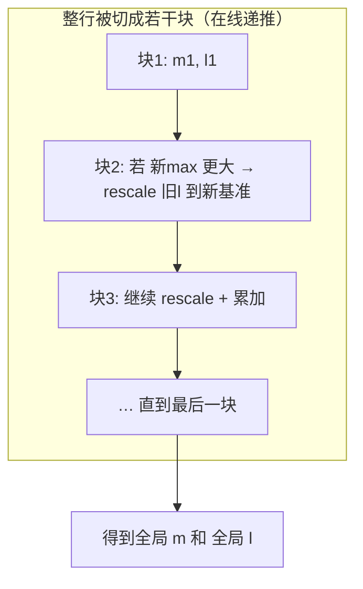
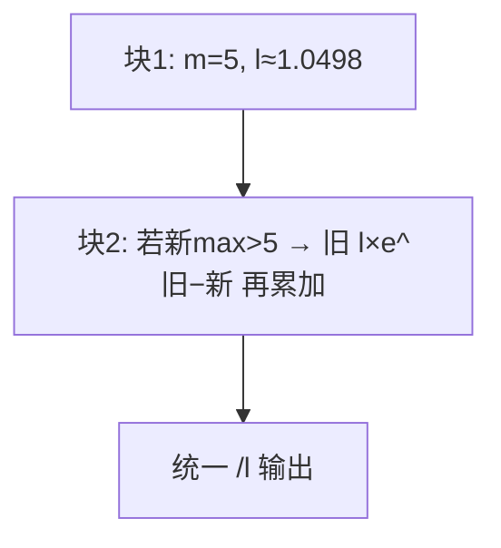

# 03 · Softmax

> 目标读者：已经会写 element-wise，想搞懂"带归约的算子"怎么在新手友好层面理解并优化。
> 本文覆盖 Softmax 的数学定义、数值稳定性、以及在线/分块/Flash 风格的做法，并落到昇腾 NPU 的 Vector 路径上。

---

## 一、概述

Softmax 把一组实数"压"成一组**非负、相加等于 1** 的加权值，常被当作"概率"。它在深度学习里无处不在：

- 分类任务的输出层（哪个类别得分最高）；
- **注意力机制**里把 QK 打分转成 attention 权重；
- MoE 的专家路由门控。

在 Transformer 里，Softmax 几乎总是出现在注意力中，而它的**数值稳定性**和**在线（online）计算**思想，正是后来 FlashAttention 的关键垫脚石。

```
人话总结：Softmax 是把一堆分数变成"加起来是 1 的占比"；
       做满两件事——别让 exp 溢出、尽量别把整行读好几遍。
```

---

## 二、定义

### 2.1 数学定义

对向量 `x ∈ R^d`：

```
softmax(x)_i = exp(x_i) / Σ_{j=1}^{d} exp(x_j)     (i = 1..d)
```

它满足：`0 ≤ softmax(x)_i ≤ 1`，且 `Σ_i softmax(x)_i = 1`。

### 2.2 关键隐患：exp 会溢出

`exp(x_i)` 在 `x_i` 很大（比如 40、100）时数值极好涨，fp16 下会直接 `inf`。而 Transformer 的注意力打分可轻易达到几十甚至上百。所以**直接按定义写必崩**。

标准解法是**减去最大值**：令 `m = max_j x_j`，用 `exp(x_i - m)` 代替 `exp(x_i)`，因为 `x_i - m ≤ 0`，指数项恒 `≤ 1`，永远不溢出：

```
softmax(x)_i = exp(x_i - m) / Σ_j exp(x_j - m)
```

> 人话：先把整行最大的数拉下来当"参考零点"，指数全变成 ≤1 的，怎么涨也不会爆。

---

## 三、为什么需要它

### 3.1 归一化成"占比"

注意力需要把"对每个 token 有多关注"变成一组和为 1 的权重；分类需要把 logits 变"概率"。Softmax 就是做这个"归一化成占比"的活儿。

### 3.2 数值稳定是硬门槛

不减去 max，训练/推理都可能 `inf`/`NaN` 翻车，这在 fp16 精度下尤其致命——fp16 范围只有 ±65504，`exp(80)` 就爆了。而 Trans有名言："Softmax 容易在两端同时出事——大的溢出成 inf，小的（在 fp16 里）下溢成 0 被丢弃。"

### 3.3 它很"贵"，值得优化

一个注意力层要对 Q、K 打分矩阵的每一"行"做一次 Softmax，行数 = 序列长度² 的量级。序列变长时，Softmax 的访存量也跟着暴涨。于是"怎么把 Softmax 算得又稳又快、少搬数据"，成了长序列优化的核心命题。

---

## 四、朴素实现

### 4.1 数值稳定版（两趟读取）

```python
import numpy as np

def softmax(x, axis=-1):
    # ① 此行最大值 m（一趟读整行）
    m = np.max(x, axis=axis, keepdims=True)
    # ② 减 m 再取 exp（第二趟读）
    e = np.exp(x - m)
    # ③ 求归一化分母（第三趟）
    s = np.sum(e, axis=axis, keepdims=True)
    # ④ 逐元素除以总和
    return e / s
```

这个写法对，但它把整行**读了三遍**（求 max 一遍、求 exp 一遍、求 sum 又顺着 exp 读）。当行为"硬约束"时（如注意力行），三遍访存就是三倍的缓存/带宽压力。

### 4.2 回退写法（会溢出）

```python
e = np.exp(x); return e / np.sum(e)   # ❌ x 稍大就 inf，尽量别用
```

---

## 五、NPU 上的关键优化点

### 5.1 Vector 单元＋UB：一条流水线把三趟变一趟

在昇腾 NPU 上，Softmax 是对一行（或一片）数据在 **UB 内、用 Vector 指令**完成的。与 element-wise 不同，它多了一个"跨整行归约"：`ReduceMax` 求 max、`ReduceSum` 求和、`vExp` 求 exp、`Muls` 求缩放。硬件指令比标量循环能快一个数量级以上。

优化要点仍然是一句话：**整行尽量驻留 UB，别来回搬 GM**；数据只在"进 UB"和"出 UB"各走一趟。


> 人话：把整行请进工作台，在台上先后做 求max→exp→求和→取倒数→缩放，一次进出搞定。

### 5.2 在线（online）/ 流式安全 Softmax——让"分块"成为可能

当一行太长、`UB` 塞不下时，朴素版必须先拿到全局 `max` 才能开始 `exp`，这意味着**行内要先完整读一遍求 max，再读一遍算 exp**，两趟。**在线 Softmax**（Online Softmax, Milakov & Gimelshein 2018）解决了这个矛盾：**边读块边维护"当前最大 m、当前分母和 l"**，读到新块时，如果新块的最大值更大，就**回头把前面已算的项都按新 max 缩放一遍（rescale）**，保证最终结果和一次性算完全一致。

```
在线 Softmax 的递推（对块 j=1..n）：
  读块 j → 得 m_j、未归一化 exp 项
  若 m_j > m_old：
       l ← l · exp(m_old − m_j)     # 把旧的"分母和"压低到新基准下
       m ← m_j
  l ← l + Σ exp(块内项 − m)          # 累加当前块贡献
  顺带记录每块的未归一化值 / 或按需重读
最终 output_i = exp(x_i − m) / l
```

这带来一个巨大收益：**可以放心地分块/分片处理**，不需要为了求全局 max 而把整行读两遍。这正是 FlashAttention 让注意力矩阵"边算边弃"不再落存储的理论基础。



> 人话：旧账本里一直记着"当前最大"和"当前分母和"。遇到更大的数就把旧账本按比例改写成新基准，一路改到最后，结果和一次算完一摸一样。

### 5.3 分块归约 + tiling

在线安全的极佳副产品是**任意分块**：

- 沿特征维（Softmax 的归约轴）切成 `UB` 放得下的块；
- 每个块做一次"局部"在线更新；
- 最后把全局 `m`、`l` 写入标量缓冲，再统一缩放。

CUDA 的 `safe_softmax`/`online softmax` 与昇腾的 softmax kernel 本质上都是这套"分块 + 在线维护"思路的不同实现。

### 5.4 融合：Softmax 几乎总跟着别的算子

Softmax 很少单独出现，常与相邻算子**融合**以省一次 GM 往返：

- 与打分（`Q K^T / sqrt(dk)`）融合：`scale → softmax → ×V` 一口气在片上做；
- 与 Mask 融合：`a = mask ? 0/-inf : qk` 在软里合并；
- 与 GELU、TopK 等尾部融合（Online 论文里甚至把 `Softmax+TopK` 融合提升了数倍）。

> 人话：Softmax 是"夹心饼干中间的夹层"，把它和前后两层一起煎，省的正是那几次把饼干端进端出。

---

## 常见误区与追问

1. **"在线 Softmax 是近似吗？"** 不是。它只是把计算顺序/分块重排，最终结果与一次算完**逐元素等价**。这正是 FlashAttention 敢自称"精确算法"的底气。
2. **"分块顺序影响正确性吗？"** 不影响正确性。但若一块的 max 大、下一块更大，会触发 rescale，可能带来极小的舍入差；工程上常选较大块、稳定顺序来摊薄。
3. **"减 max 会不会把信息丢掉？"** 不会。Softmax 对整行同时平移一个常数保持不变（`exp(x_i−c)/Σexp(x_j−c)` ≡ `exp(x_i)/Σexp(x_j)`，常数 `c` 在分子分母同时出现相抵），减 max 只是引入一个常数帮助数值稳定，不改结果。
4. **"为什么减的是 max 而不是别的常数？"** 只要减一个 `≥ 整行最大值` 的常数，所有指数项就 `≤ 1` 永不溢出。选全局 max 是为了**尽量少减**——减得越少，`exp` 的有效数字保留越多，精度越好。固定大数也能防溢出，但会把有效数字一起抹掉，故不用。
5. **"在线版和稳定版的输出一样吗？"** 逐元素一致。在线版只是把"求 max → 求 exp → 求 sum"重排成"可分块、边读边维护 m/l"，需要的 rescale 动作恰好补偿了"后发现的更大 max"，结果等价。

### 一个具体的在线 Softmax 例子

设一行 `x = [2, 5, 1, 3]`，切成两块 `[2,5]` 和 `[1,3]`：

- **块1 `[2,5]`**：`m=5`，`l = e^{2−5}+e^{5−5} = e^{−3}+1 ≈ 1.0498`；
- **块2 `[1,3]`**：局部 `m'=3 < 5`，**不用 rescale**，直接累加 `l += e^{1−5}+e^{3−5} = e^{−4}+e^{−2} ≈ 0.0183+0.1353`，故 `l ≈ 1.2034`；
- 最终把分母 `l` 用于输出归一化，与"整行一起算"完全一致。

再看一个触发 rescale 的场景：块2 换成 `[6]`（m'=6>5）：
- 先把旧和压到新基准：`l ← 1.0498 · e^{5−6} = 1.0498·e^{−1} ≈ 0.3862`，`m ← 6`；
- 再累加块2：`l += e^{6−6}=e^{0}=1` → `l≈1.3862`。
- 这个"旧和乘 e^{旧m−新m}"的动作，就是在线 Softmax 的 **rescale**。



---

## 六、数据流总览（在线版）


---

## 七、人话总结

- Softmax = `exp(x−m)/Σ exp(x−m)`，**先减 max 保证不溢出**；
- 朴素版把行读好几遍；在 NPU 上让它**整行驻留 UB**，一趟进出；
- **在线/流式** Softmax 用"动态 rescale 维护 m、l"，从此可以**分块**，还避免了两次读整行的代价；
- **分块 + 在线 = Flash 风格**前身的核心；
- Softmax 几乎总与 QK、V、Mask、TopK 融合，减少片上↔GM 往返。

---

## 复习自测（带答案要点）

1. **直接对 exp(x) 会怎样？** → 大值溢出为 `inf`；小值在 fp16 下近 0 被丢弃。
2. **数值稳定 Softmax 的第一件事？** → 对整行（或穷尽 vblock）求全局 `max`，再减掉它再 exp。
3. **在线 Softmax 的"在线"指什么？** → 边读块边维护"当前 max m、当前分母和 l"，必要时把已算的项 rescale 到新基准，不必为求 max 先读一整遍。
4. **为什么在线版能分块？** → 因为不再需要"先拿到全局 max 才能开始 exp"，块与块可独立处理、只做一次 rescale 合并。
5. **FlashAttention 从它这里继承了什么？** → "分块 + 在线维护 m/l"的能力，从而不物化 O(N²) 的注意力矩阵。

> 一句话串起来：Softmax 的三个版本（朴素 → 减 max 稳定 → 在线分块）是"一步一步放开对整行的依赖"，最终让长序列注意力跑得动。

---

## 八、参考资料

- **Online Softmax 论文**（Maxim Milakov, Natalia Gimelshein, NVIDIA, "Online normalizer calculation for softmax", 2018）：
  https://arxiv.org/abs/1805.02867
- **Softmax（Wikipedia，Softmax 函数总览）**：
  https://en.wikipedia.org/wiki/Softmax_function
- 华为昇腾开发者社区官方博客《昇腾 CANN Softmax 算子开发实战：数值稳定、高性能 Ascend C 实现》（用 `ReduceMax`/`vExp`/`ReduceSum` 等 Vector 指令 + 分块归约实现）：
  https://www.hiascend.com/developer/blog/details/02168212746702197012
- 华为昇腾 CANN 官方文档（CANN 商用版 8.0）Ascend C API（Vector 指令库，含 `ReduceMax`/`ReduceSum`/`vExp` 等）：
  https://www.hiascend.cn/document
  （在文档中心检索"AscendC API · 向量指令"即可定位；文档地址带版本号，可能随版本迁移。）

> 说明：昇腾文档地址带版本号，失效时请在 https://www.hiascend.cn/document 检索传向量指令（Vector API）。