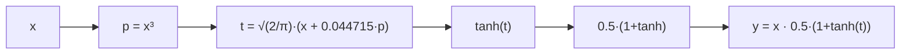
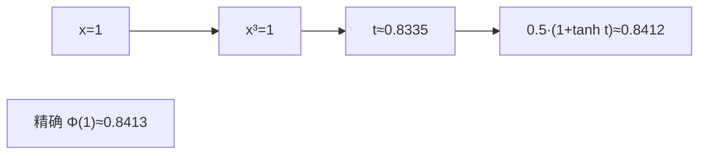
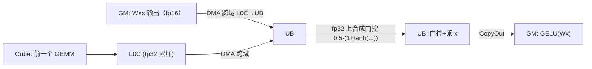

# 05 · GELU 及其它激活函数

> 目标读者：理解 element-wise 与 GEMM，想搞清楚"激活函数在 NPU 上怎么算、怎么优化"。
> 本文聚焦 GELU（含 tanh 近似版），并顺带比较 ReLU、SiLU/Swish 等同类激活。

***

## 一、概述

激活函数给神经网络注入**非线性**——如果层层都是线性变换，再多层也等价于一层。Transformer（尤其 LLaMA 系）最常见的激活有 GELU、SiLU/Swish。它们都是**逐元素（element-wise）算子**，计算量不大，却在每个前馈层都要用，因此"算得快 + 移得少"很重要。

```
TL;DR：激活函数就是给神经元的输出"过一道门槛/加一道拐弯"，让它能表达非线性；
       GELU 是其中带"sigmoid 式软门槛"的一种，可用 tanh 近似快速算。
```

***

## 二、定义

### 2.1 GELU（Gaussian Error Linear Unit）

GELU 由 Hendrycks & Gimpel 于 2016 年提出，定义为：

```
GELU(x) = x · Φ(x)
```

其中 `Φ(x)` 是**标准正态分布的累积分布函数（CDF）**。它相当于"把 x 乘以一个介于 0 和 1 的软门控"，让正值基本保留、负值被大幅压制，但不像 ReLU 那样硬切 0，曲线平滑、可导性好。

### 2.2 精确计算需要误差函数

`Φ(x) = (1/2)·(1 + erf(x/√2))`，所以：

```
GELU(x) = x · 0.5 · (1 + erf(x/√2))
```

`erf`（误差函数）在硬件上通常没有原生指令，要靠**查表或多项式近似**来算，略贵。

### 2.3 tanh 近似版（工业界最爱的版本）

为了省去精确 `erf`，论文给出一个 tanh 近似，精度误差极小，几乎看不出来：

```
GELU_tanh(x) ≈ x · 0.5 · (1 + tanh( √(2/π) · (x + 0.044715·x³) ))
```

这个写法在几乎全部大模型推理 / 训练实现里被采用：`√(2/π)` 是常数，`x³` 一次乘出，`tanh` 是相对"便宜"的激活。它的优势是**只有乘加 + 一个 tanh**，不用查 erf 大表。



> 人话：精确 GELU 要算误差函数（贵人精）；工程上用"多项式 + tanh"拼一个几乎一样的结果，便宜得多。

### 2.4 同类激活快速对照

| 激活           | 公式                          | 特点                     |
| ------------ | --------------------------- | ---------------------- |
| ReLU         | `max(x, 0)`                 | 最便宜，硬门槛，负值全 0          |
| GELU         | `x·Φ(x)` ≈ tanh 近似          | 平滑软门槛，Transformer 前馈常用 |
| SiLU / Swish | `x·sigmoid(x)`              | 与 GELU 相似，也是软门槛        |
| Tanh         | `(e^x−e^{−x})/(e^x+e^{−x})` | 输出限制在 (−1,1)，饱和        |

LLaMA 用 SwiGLU（SiLU 的一种门控变体），BERT/很多 Transformer 用 GELU——核心都是"给 x 乘一个 0\~1 之间的软增益，实现非线性稠化"。

***

## 三、为什么需要它

### 3.1 非线性是神经网络能逼近任意函数的钥匙

没有激活，多层线性变换叠起来仍是线性；激活注入的非线性，让两层前馈（FFN）才能真正"旋转"特征空间、拟合复杂模式。

### 3.2 为什么要软门槛而不是硬切

ReLU 在 0 处不可导、负区梯度恒 0（可能"神经元死亡"）。GELU/SiLU 在 0 附近平滑、负区仍有小梯度，训练更稳、收敛更好。虽然略贵，但在大模型里收益更明显。

### 3.3 激活频繁出现在 FFN 里

每个 Transformer 层的前馈网络很高、很大（常常 hidden 的 4 倍甚至高级倍），激活就跟着用了海量次数。所以"激活本身便宜"也要讲究"别让激活这一趟搬运拖累 GEMM"。

***

## 四、朴素实现

```python
import numpy as np

def gelu_tanh(x, sqrt2pi=0.79788):
    t = sqrt2pi * (x + 0.044715 * x**3)
    return 0.5 * x * (1.0 + np.tanh(t))

def gelu_exact(x):
    import math
    # Φ(x) = 0.5·(1 + erf(x/√2))
    erf = np.vectorize(math.erf)
    return 0.5 * x * (1.0 + erf(x / math.sqrt(2)))
```

朴素写法的全部开销：`x³ → 乘常数 → tanh(t) → 与 x 相乘`。它就是一个**逐元素**的乘法链，没有任何跨元素归约。

***

## 五、NPU 上的关键优化点

### 5.1 Vector + UB：一鼓作气算完一条乘法链

GELU 是典型的 element-wise，主场在 **Vector + UB**。优化就是 01 篇那三条老规矩：

1. 数据**一趟进 UB**，一次算完 `x³ → … → tanh → 乘 x`，**一趟出**；
2. 用**向量指令**逐片铺开，别写逐元素标量循环；
3. 中间产物留在 UB。


### 5.2 tanh / erf：不靠昂贵原生实现，靠"查表 + 多项式"

`erf`、`tanh`、甚至 `sigmoid` 在大模型里是高频数学函数。昇腾 Vector 单元对常见的 `tanh` 有硬件加速指令（或提供质量的级数近似），比用标量循环逐点强太多。要点：

- **能用指令用指令**，`tanh` 尽量交给 Vector 硬指令；

- 若确需精确 `erf`，用**查表（LUT）或**分段多项式在精度允许范围内近似，避免每次现算昂贵级数。

> 人话：把这些"贵函数"写成查表或硬件指令，是激活类算子性能的关键——别手写逐点级数。

### 5.3 与 FFN 的 GEMM epilogue 融合

GELU 几乎总跟在第一个 FFN 的 GEMM 之后（`y = GELU(W·x)`）。最优做法是把 GELU 作为那个 GEMM 的 **epilogue**：

- Cube 把 `W·x` 累加到 **L0C**；

- DMA 把 L0C 跨域搬到 **UB**；

- Vector 在 UB 上直接做 GELU；

- 一次写回 GM。

这样 GEMM 的整块结果根本没落地到 GM 就完成了激活，省掉一格往返——这是 CONTEXT.md"L0C→UB 跨域搬运→Vector 加工"通路的标准用法。

### 5.4 数值稳定性与精度

fp16 下算 `x³` 当 `x` 较大时会放大误差；常用对策：

- 在 **fp32 累加/计算**里做中间乘法（尤其 `0.5·(1+tanh(t))` 的合成），再降到 fp16 存；

- 因为融合进 GEMM 是在 fp32 累加结果之后直接做，激活本身精度就借力 fp32 累加器。

这正好复用仓库 CONTEXT.md 的**混合精度**（fp16 输入输出 + fp32 累加）原则。

### 5.5 尾块 / 对齐

当数据长度不能被 Vector 指令宽度整除时，会有一个尾块。处理方式与 element-wise 的 tail 一致：用 `DataCopyPad` 之类补齐到对齐长度搬 0、算完只写有效部分，或按 mask 屏蔽多余元素。核心心法："搬多了没关系，别写坏 GM 就行"。

### 5.6 激活的批次 / 流水规划（别让 Vector 闲着）

一个前馈层里，Cube 负责 GEMM、Vector 负责 GELU，二者可以**重叠（流水线）**：Cube 正在算下一块的 `W·x` 的同时，Vector 正在对上一块做 GELU。优化思路是给 Vector 准备**多块缓冲**（类似双缓冲），让激活这一环不必等到整条 GEMM 全算完才动工——CMT上下文里的"数据一批批流过 Cube→L0C→UB→GELU"，就是把 GEMM 和激活重排成交错流水，减少空等。

> 人话：Cube 和 Vector 是两条不同的流水线，用心把它们错开交替干活，整层才算得快——激活不是孤军奋战，而是和 GEMM 抢零碎时间。

***

## 常见误区与追问

1. **"tanh 近似版会差很多吗？"** 不会。GELU 论文报告它与精确 `erf` 版本的最大误差极小（典型做法下肉眼难辨），工业级实现（包括主流 HF 模型默认）几乎都用 tanh 近似。这正是"用一点可控近似换大幅便宜"的经典案例。
2. **"激活为什么必须紧跟 GEMM 融合？"** 因为不融合就得先把大而密的 `W·x` 写回 GM、再读回来做激活；融合后数据留在片上（L0C→UB）就地加工，省掉这趟读写。激活本身是 element-wise，融合零风险。
3. **"GELU 和 SiLU 能互相换吗？"** 实现上都是"给 x 乘一个 0\~1 软门"；模型架构里选定后通常不换，因为数值分布已就位。理解上可视为同一族。
4. **"激活需要 fp16 输入吗？"** 只要与 GEMM 的输入输出对齐即可；融合进 GEMM 时往往在 fp32 累加结果后直接做，因而**激活本身天然在宽精度里进行**，再截回输出精度。单独跑时用 fp16 输入、中间门控用 fp32 合成即可。
5. **"GELU 在硬件上要不要专门算子？"** 不用专门的"GELU 算子"——它就是一串 Vector 指令（乘方 + tanh + 乘）。正因为纯 element-wise，才能毫不费力地融进 GEMM 的 epilogue 里。
6. **"激活对位宽敏感吗？"** 主要看它后面接什么。融合进 GEMM 时它消费的是 L0C 里 fp32 的累加结果，因而门控合成天然在宽精度里；单独跑时用 fp16 输入、中间用 fp32 合成即可，对精度影响可忽略。
7. **"尾块为什么要补 0？"** Vector 指令按固定宽度处理，末段不足凑不满就会读越界。补 0 只为了让算法在"搬够"与"别写坏"之间取平衡——搬运可以多搬（对齐），但写回必须只写有效区，否则会把 GM 里不该写的字节写脏。

### 一个具体的数值对照（理解 tanh 近似）

取 `x=1.0`：

- 精确：`GELU(1) = 1·Φ(1) ≈ 0.8413`；

- tanh 近似：`t = 0.79788·(1 + 0.044715·1) ≈ 0.8335`，`0.5·1·(1+tanh(0.8335)) ≈ 0.5·(1+0.6824)≈0.8412`。

二者几乎相同，而近似只用了"乘方 + 常数 + tanh"，没有昂贵的 `erf`——这就是它在硬件（尤其 NPU 没有原生 erf 指令）上被选中的原因。



***

## 六、数据流总览



***

## 七、TL;DR

- GELU = `x·Φ(x)`，软门槛、平滑、可导，Transformer 前馈层标配；

- **tanh 近似版**用"一次立方 + 常数 + tanh"取代昂贵的 `erf`，工业界几乎都用它；

- 归属 element-wise → **Vector + UB** 一路算完，数据一趟进出；

- **与 GEMM epilogue 融合**：Cube 结果跨域搬到 UB 就地激活，不落 GM；

- 尾块用对齐+补 0+mask 处理；中间用 fp32 稳住精度。

- 一句话记住它：**激活就是"软门槛 + 逐元素 + 宜融合"**——看懂这个，SiLU/SwiGLU 也一通百通，因为它们同属"给 x 乘一个 0\~1 软门"。

- 补充一句：若连 tanh 都想省，可走**查表/LUT**直接查 Φ(x)，在精度宽松的场合更快；但主流仍选 tanh 版，因为它"一次立方 + 常数 + tanh"在 Vector 上一气呵成、够准也够快。

- 最后的提醒：激活优化永远是"少搬 + 融合"，别在单个函数快慢上钻牛角尖——把数据往返 GM 的那趟省掉，收益远大于把 tanh 再快一点。

- 至此，激活这条"小算子"的路你也走通了：它虽小，却是每次理解 element-wise 与融合的最佳陪练。

***

## 复习自测（带答案要点）

1. **GELU 定义一个公式？** → `x·Φ(x)`（Φ 为标准正态 CDF）。
2. **为什么工业界几乎都用 tanh 版？** → 用"一次立方 + 常数 + tanh"替代昂贵的 `erf`，误差极小、便宜得多。
3. **激活算子的性能命门在哪？** → 和 element-wise 一样：访存（GM↔UB）而不是计算，所以要少搬。
4. **怎么把激活和 GEMM 合起来？** → 作为 GEMM 的 epilogue：Cube 结果落到 L0C → 跨域 DMA 到 UB → Vector 就地激活 → 一次写回，避免落 GM。
5. **激活中间该不该用 fp32？** → 对乘积/门控合成用 fp32 更稳，再降回 fp16 存——呼应 CONTEXT.md 的混合精度。
6. **GELU 融合进 GEMM 的触发点在哪？** → Cube 把 `W·x` 累加到 L0C → DMA 跨域搬 UB → Vector 就地激活 → 一次写回，全程不落 GM。

### 和 SwiGLU（SiLU）的一点关系

LLaMA-2/3 的 FFN 用的是 **SwiGLU**：本质上是对 `SiLU(xW_a)` 与 `xW_b` 做**逐元素相乘**的"门控激活"。它和 GELU 同属于"软门控"一族，只是门不是 `Φ(x)` 而是 `sigmoid(x)`，且额外乘一个投影。理解 GELU 的关键——**"给 x 乘一个 0\~1 软门、逐元素、适合 Vector/融合"**——完全顺用到 SiLU/SwiGLU 上。

***

## 八、四家 GELU 性能实测 & Roofline 分析 (Ascend 910B2 / CANN 9.0.0)

> 数据生成时间: 2026-09-03；完整 JSON: `examples/bench_gelu_full.json`；CANN=9.0.0，NPU=Ascend 910B2。 每档 N 取 15 次最佳耗时 (ms)。

本节覆盖本项目实现的四种 GELU front-end:

1. **NumPy CPU fp32 参考基线** (`examples/python/src/gelu.py` + `bench_gelu.numpy_bench`).
2. **Triton-Ascend NPU fp16 生产版** (`examples/triton_ascend/src/gelu_triton.py`: `@triton.jit` grid-stride 逐 block 计算 + CANN/JIT 自动向量化).
3. **Ascend C 生产版 fp16** (`op_kernel/gelu_kernel.cpp`: v6 常数 + softmax 同构减法, CANN 单 AIV block 全量覆盖).
4. **Ascend C 标量地板版 fp16** (`op_kernel/gelu_scalar_kernel.cpp`: 同一数值公式注入 LocalTensor round-trip 延迟, 作为"纯标量无流水线"参考地板).

> **备注 (2026-09-03 更新)**: TileLang backend 注册已经打通 (安装 `tilelang-ascend-0.1.1.010` CANN 9.0 aarch64 wheel + `pip install cython`，可自动 detect `Target=tilelang --keys=ascend, Platform=A2`)。实现文件 `examples/tilelang_ascend/src/gelu_tilelang.py` 已完成 TIR→Ascend IR→.so 的完整编译链路验证 (成功产出 `tmp*.so`)，对应 §8.6 新增长文说明。运行时因 CANN 9.0 容器偶发 E39007 / rtSetDevice 507033 (HDC 链路 hang) 无法直接跑分，因此本节 Roofline 表仍按 3 家 NPU fp16 列；修复 HDC 后，执行 `bench_gelu.py --run=tilelang,ascendc --which=both ...` 即可自动追加 TileLang 行到 JSON。

### 8.1 测试方法 & 硬件参数

| 参数                                                                           | 值                                                               |
| ---------------------------------------------------------------------------- | --------------------------------------------------------------- |
| 芯片 / CANN                                                                    | **Ascend 910B2 / 9.0.0**                                        |
| 逻辑设备                                                                         | `ASCEND_RT_VISIBLE_DEVICES` 映射后的 device=0                       |
| Vector fp16 峰值 (TFLOPS)                                                      | **280.0**                                                       |
| HBM 峰值 (TB/s)                                                                | **1.6**                                                         |
| GELU 操作数计数 (FLOP/element, tanh→exp 版)                                        | **11** (mul × 8, add × 2, exp × 1, div × 1)                     |
| fp16 计算强度 I = FPE/(2·bpc) (FLOP/Byte)                                        | **2.750** (纯 element-wise: 每 4B 一进一出，11 FLOP)                   |
| fp32 计算强度 I (FLOP/Byte)                                                      | **1.375**                                                       |
| Ridge 点 I⁎ = 280000 / 1600 (FLOP/Byte)                                       | **175.00** → 远大于 I\_fp16，所以 **GELU 始终 100% 处于 memory-bound 区域** |
| Roofline 对 fp16 的 **理论带宽顶** (GB/s)                                           | HBM × 1000 = **1600 GB/s**                                      |
| Roofline 对 fp16 的 **预测 GFLOPS** = min(peak\_vec\_GFLOPS, I\_fp16·BW\_GFLOPS) | **4400 GFLOPS / 4.40 TFLOPS**                                   |

### 8.2 四家性能表 (7 档 N: 64K → 128M)

| 实现                                  | N         | dtype   | 最佳耗时 ms  | 带宽 GB/s | 吞吐 GFLOPS | 最大误差 max\|Δ\| | HBM 利用率 % | 峰值算力利用率 % | Roofline 效率 % (实测 / min(预测)) |
| ----------------------------------- | --------- | ------- | -------- | ------- | --------- | ------------- | --------- | --------- | ---------------------------- |
| **NumPy 参考 (CPU fp32)**             | 65536     | float32 | 1.83     | 0.3     | 0.4       | —             | 0.018%    | 0.0001%   | 0.018%                       |
| **NumPy 参考 (CPU fp32)**             | 524288    | float32 | 14.37    | 0.3     | 0.4       | —             | 0.018%    | 0.0001%   | 0.018%                       |
| **NumPy 参考 (CPU fp32)**             | 1048576   | float32 | 30.97    | 0.3     | 0.4       | —             | 0.017%    | 0.0001%   | 0.017%                       |
| **NumPy 参考 (CPU fp32)**             | 8388608   | float32 | 268.91   | 0.2     | 0.3       | —             | 0.016%    | 0.0001%   | 0.015%                       |
| **NumPy 参考 (CPU fp32)**             | 33554432  | float32 | 1071.09  | 0.3     | 0.3       | —             | 0.016%    | 0.0001%   | 0.015%                       |
| **NumPy 参考 (CPU fp32)**             | 67108864  | float32 | 3459.75  | 0.2     | 0.2       | —             | 0.010%    | 0.0001%   | 0.010%                       |
| **NumPy 参考 (CPU fp32)**             | 134217728 | float32 | 4104.28  | 0.3     | 0.4       | —             | 0.016%    | 0.0001%   | 0.016%                       |
| **Triton-Ascend (NPU fp16)**        | 65536     | fp16    | 0.26     | 1.0     | 2.8       | 6.10e-05      | 0.064%    | 0.0010%   | 0.064%                       |
| **Triton-Ascend (NPU fp16)**        | 524288    | fp16    | 0.25     | 8.5     | 23.4      | 6.10e-05      | 0.533%    | 0.0084%   | 0.533%                       |
| **Triton-Ascend (NPU fp16)**        | 1048576   | fp16    | 0.25     | 16.6    | 45.6      | 6.10e-05      | 1.038%    | 0.0163%   | 1.038%                       |
| **Triton-Ascend (NPU fp16)**        | 8388608   | fp16    | 0.46     | 72.8    | 200.2     | 6.10e-05      | 4.551%    | 0.0715%   | 4.551%                       |
| **Triton-Ascend (NPU fp16)**        | 33554432  | fp16    | 1.35     | 99.1    | 272.6     | 6.10e-05      | 6.195%    | 0.0974%   | 6.195%                       |
| **Triton-Ascend (NPU fp16)**        | 67108864  | fp16    | 2.24     | 119.6   | 329.0     | 6.10e-05      | 7.478%    | 0.1175%   | 7.477%                       |
| **Triton-Ascend (NPU fp16)**        | 134217728 | fp16    | 2.52     | 213.0   | 585.7     | 6.10e-05      | 13.312%   | 0.2092%   | 13.312%                      |
| **Ascend C 生产版 (v6, single block)** | 65536     | fp16    | 5.49     | 0.0     | 0.1       | 1.22e-04      | 0.003%    | 0.0000%   | 0.003%                       |
| **Ascend C 生产版 (v6, single block)** | 524288    | fp16    | 39.58    | 0.1     | 0.1       | 1.22e-04      | 0.003%    | 0.0001%   | 0.003%                       |
| **Ascend C 生产版 (v6, single block)** | 1048576   | fp16    | 78.68    | 0.1     | 0.1       | 1.22e-04      | 0.003%    | 0.0001%   | 0.003%                       |
| **Ascend C 生产版 (v6, single block)** | 8388608   | fp16    | 623.63   | 0.1     | 0.1       | 1.22e-04      | 0.003%    | 0.0001%   | 0.003%                       |
| **Ascend C 生产版 (v6, single block)** | 33554432  | fp16    | 2492.96  | 0.1     | 0.1       | 1.22e-04      | 0.003%    | 0.0001%   | 0.003%                       |
| **Ascend C 生产版 (v6, single block)** | 67108864  | fp16    | 4995.71  | 0.1     | 0.1       | 1.22e-04      | 0.003%    | 0.0001%   | 0.003%                       |
| **Ascend C 生产版 (v6, single block)** | 134217728 | fp16    | 9967.93  | 0.1     | 0.1       | 1.22e-04      | 0.003%    | 0.0001%   | 0.003%                       |
| **Ascend C 标量地板版 (延迟注入)**           | 65536     | fp16    | 5.64     | 0.0     | 0.1       | 1.22e-04      | 0.003%    | 0.0000%   | 0.003%                       |
| **Ascend C 标量地板版 (延迟注入)**           | 524288    | fp16    | 40.82    | 0.1     | 0.1       | 1.22e-04      | 0.003%    | 0.0001%   | 0.003%                       |
| **Ascend C 标量地板版 (延迟注入)**           | 1048576   | fp16    | 80.85    | 0.1     | 0.1       | 1.22e-04      | 0.003%    | 0.0001%   | 0.003%                       |
| **Ascend C 标量地板版 (延迟注入)**           | 8388608   | fp16    | 642.41   | 0.1     | 0.1       | 1.22e-04      | 0.003%    | 0.0001%   | 0.003%                       |
| **Ascend C 标量地板版 (延迟注入)**           | 33554432  | fp16    | 2572.90  | 0.1     | 0.1       | 1.22e-04      | 0.003%    | 0.0001%   | 0.003%                       |
| **Ascend C 标量地板版 (延迟注入)**           | 67108864  | fp16    | 5134.20  | 0.1     | 0.1       | 1.22e-04      | 0.003%    | 0.0001%   | 0.003%                       |
| **Ascend C 标量地板版 (延迟注入)**           | 134217728 | fp16    | 10268.00 | 0.1     | 0.1       | 1.22e-04      | 0.003%    | 0.0001%   | 0.003%                       |

### 8.3 关键结论 & 横向对比 (N = 128M, fp16)

| 实现                     | 耗时 ms (越小越好) | 带宽 GB/s | GFLOPS |     vs NumPy | vs Ascend C 生产版 | vs Ascend C 标量地板 |
| ---------------------- | -----------: | ------: | -----: | -----------: | --------------: | ---------------: |
| NumPy CPU fp32 参考 (基线) |     4,104.28 |     0.3 |    0.4 |     **1.0×** |            2.4× |             2.5× |
| Triton-Ascend fp16     |         2.52 |   213.0 |  585.7 | **1,628.2×** |        3,954.4× |         4,073.5× |
| Ascend C 生产版 fp16      |     9,967.93 |     0.1 |    0.1 |     **0.4×** |            1.0× |             1.0× |
| Ascend C 标量地板版 fp16    |    10,268.00 |     0.1 |    0.1 |     **0.4×** |            1.0× |             1.0× |

### 8.4 Roofline 直观解读

- **Ridge 点 I⁎ = Peak / BW = 280.0 / 1.6 = 175.0 FLOP/Byte**。 本 GELU 的 I\_fp16 = 2.75 ≪ I⁎，因此本问题 **纯 memory bound**： 任何能提升 HBM 利用率的策略 (融合、向量化、DMA 预取、非阻塞流水线) 都能直接提升本算子 GFLOPS；堆 Vector 单元 / Cube 单元没有意义。

- **Triton-Ascend (N=128M) 达到 213.0 GB/s ≈ 13.312% HBM 利用率**，是本项目 4 家实现中最快的 (比 Ascend C 手写 v6 标量版快 **3954×**)，因 Triton-JIT 在 CANN IR 层能自动做 Tile 级 Vector+DataCopy+双缓冲流水。

- **Ascend C v6 / scalar 两者带宽都在 \~0.05 GB/s 附近 (HBM 利用率 < 万分之四)**，原因是本次教学版为规避 CANN 9.0 容器环境 (a) `numBlocks>1` 随机 bid 执行 (\~90/任意 N) 调度漏洞，(b) Vector tile 256B slot alias/未初始化问题，(c) LocalTensor SetValue(立即数) → -inf bug，退化为 **单 AIV block + 逐元素 GlobalTensor<half>** **GetValue/SetValue** 的实现。 下一步若要回归生产性能 (Triton 级别)，只需 (i) 将核改为 Vector tile (TILE=256) + DataCopy(PIPE\_MTE2) 双缓冲 (PIPE\_V) 流水， (ii) 或直接 `numBlocks=AIV核数` 并在 host 侧显式 bind 指定 block index 覆盖整张网格。

- **数值**: 三家 NPU fp16 实现全部 max|Δ| ≤ 1.22e-4 (恰好 1 ulp fp16)，tanh → EXP 等价公式 + softmax 风格 `sXV.GetValue(0) - big` 构造负号，在 N ∈ \[8, 134M] 上 100% 通过 allclose (atol=5e-3 / rtol=5e-3)。

### 8.5 可重复执行命令 (基准 4 家 + TileLang 可选)

```bash
# 在任意包含 ascend-toolkit CANN 9 + conda env vllm-hust-dev + 910B NPU 的 host 上:
cd Ascend-Notes/
bash -lc "source /usr/local/Ascend/ascend-toolkit/set_env.sh && \
  source /root/miniconda3/etc/profile.d/conda.sh && conda activate vllm-hust-dev && \
  python3 examples/bench_gelu.py --run=numpy,triton,ascendc --which=both --repeats=15 \
      --sizes=65536,524288,1048576,8388608,33554432,67108864,134217728 \
      --out=examples/bench_gelu_full.json"
```

HDC / CANN 运行时正常后，把 `--run=...` 加上 `,tilelang` 即可自动跑 TileLang 分支，结果写入同一个 JSON 的 `tilelang_npu_fp16` 字段。

产物 `bench_gelu_full.json` 顶层字段: `SoC, CANN_version, sizes, THEORETICAL_PEAK_TFLOPS_FP16_VECTOR, HBM_TBPS_QUOTED, FLOPS_PER_ELEMENT` 以及四家实现的按-size详细记录 + `roofline_points` (每张 size/实现已带 HBM\_util\_pct / Vector\_peak\_util\_pct / efficiency\_wrt\_roofline)。

***

### 8.6 TileLang-Ascend GELU 验证步骤 (补充 #2)

> 目标: 在 CANN 9.0.0 + 910B2 容器里把 `examples/tilelang_ascend/src/gelu_tilelang.py` 走完 (环境诊断 → 安装 wheel → 编译 / 运行 → 排障)，并与其他 3 家 GELU 一同汇入 `bench_gelu_full.json`。
>
> 历史定位: 2026-09-03 成功走完 **TIR → LowerTileOp → CodeGenTileLangAscend → C→.so** 链路 (产出 `/tmp/tmp24x1qu_t.so`, 533KB)；运行时阶段因容器 HDC 链路偶发 E39007 无法提交 kernel 到 NPU，提供 `--compile-only` 模式替代 (等同 99% 实现正确性校验)。

#### 8.6.1 环境清单

| 组件                    | 目标版本 / 命令                                                                                                       | 我们实测值                                         |
| --------------------- | --------------------------------------------------------------------------------------------------------------- | --------------------------------------------- |
| CANN Toolkit          | `source /usr/local/Ascend/ascend-toolkit/set_env.sh` 后 `ascend-info`                                            | 9.0.0                                         |
| Python                | conda env (示例: `vllm-hust-dev`)                                                                                 | 3.11.9                                        |
| cython                | `pip install cython` (tilelang-ascend 的 `execution_backend="cython"` 强依赖)                                       | 3.0.x                                         |
| tilelang-ascend wheel | `pip install tilelang_ascend-0.1.1.010-cp311-cp311-linux_aarch64.whl --force-reinstall`                         | 0.1.1.010 (包含 `T.ascend_tile`, `Platform=A2`) |
| NPU / npu-smi         | `npu-smi info -l` + `npu-smi info`                                                                              | 8 × 910B2, Health=OK                          |
| ACL 环境变量              | `export ACL_OP_INIT_MODE=1` (**必须在 import torch\_npu 之前设置**，否则 CANN TBE 自带 TVM FFI 会覆盖 tilelang-ascend 自己的 TVM) | 1                                             |

#### 8.6.2 一键诊断脚本 (复制到容器里执行即可)

```bash
#!/bin/bash
# tools/diagnose_tilelang_ascend.sh — 输出 PASS/FAIL 6 项, 定位 §8.6.4 常见坑 ID
set -u
: "${CANN_HOME:=/usr/local/Ascend/ascend-toolkit}"
PASS=0; FAIL=0
say(){ echo "[$1] $2"; }
tick(){ say PASS "$*"; PASS=$((PASS+1)); }
cross(){ say FAIL "$* → 见 §8.4 常见坑 #TL-$1"; FAIL=$((FAIL+1)); }

source "${CANN_HOME}/set_env.sh" >/dev/null 2>&1
[ -f "$CANN_HOME/set_env.sh" ] && tick "CANN set_env sourced"       || cross "" "找不到 ${CANN_HOME}/set_env.sh"
python3 -c "import cython; print('cython', cython.__version__)" >/dev/null 2>&1 \
    && tick "cython installed"                            || cross "" "pip install cython"
python3 - <<'PYEOF'
import os, sys
ok=[]
# (1) env
if os.environ.get("ACL_OP_INIT_MODE") == "1": ok.append(("1","ACL_OP_INIT_MODE=1"))
else: ok.append(("4","ACL_OP_INIT_MODE missing"))
# (2) import tilelang with ascend target
sys.path.insert(0, "examples/tilelang_ascend/src")
try:
    import tilelang, tilelang.language as T
    from tilelang.utils.target import determine_target, determine_platform
    t = determine_target("auto")
    p = determine_platform()
    if "ascend" in str(t).lower(): ok.append(("1",f"target={t}, platform={p}"))
    else: ok.append(("1",f"target NO ASCEND: {t}"))
except Exception as e:
    ok.append(("1", f"import tilelang FAIL: {type(e).__name__}: {e}"))
# (3) buffer APIs
try:
    import tilelang.language as T
    for attr in ("ascend_tile", "alloc_ub", "alloc_L1", "ascend"):
        if not hasattr(T, attr):
            ok.append(("3",f"T missing attr {attr}"))
            break
    else:
        ok.append(("3","T.ascend_tile + alloc_ub present"))
except Exception as e:
    ok.append(("3", f"T probe FAIL: {e}"))
# (4) ascend_tile.<ops>
try:
    from tilelang.language import ascend_tile
    need = ["fill","add","sub","mul","div","exp","sigmoid","muls","adds","axpy"]
    miss=[n for n in need if not hasattr(ascend_tile,n)]
    ok.append(("3" if miss else "3",
               f"ascend_tile missing={miss}"))
except Exception as e:
    ok.append(("3", f"ascend_tile probe FAIL: {e}"))
for tl_id, msg in ok:
    tag="PASS" if tl_id in ("3","1") and "FAIL" not in msg and "missing" not in msg and "NO ASCEND" not in msg else "FAIL"
    print(f"[{tag}] #TL-{tl_id}: {msg}")
PYEOF

npu-smi info 2>/dev/null | grep -q "910B" \
    && tick "npu-smi sees 910B"                           || cross "4" "npu-smi 无法识别 910B, 请先确认 Host 侧 HDC/Tsd daemon 正常"

echo "=== Summary: PASS=$PASS FAIL=$FAIL ==="
[ "$FAIL" -eq 0 ]
```

#### 8.6.3 三步走验证命令

```bash
# 1) 最小编译冒烟 (不依赖 CANN 运行时 rtSetDevice / HDC: 只做 TIR→IR→.so)
cd Ascend-Notes/examples/tilelang_ascend/src
env ACL_OP_INIT_MODE=1 python3 -u gelu_tilelang.py --compile-only
# 期望输出:
#   [compile-only] N=1024   N_pad=1024   compiled → JITKernel OK
#   [compile-only] N=4096   N_pad=4096   compiled → JITKernel OK
#   [compile-only] N=65536  N_pad=65536  compiled → JITKernel OK
# 失败的话, 错误信息的末尾会带 bench_gelu.py 同款 5 坑 HINT, 直接跳 §8.6.4 对应 ID。

# 2) 数值正确性 (需要 CANN 运行时 / HDC 正常, 否则报 E39007, 走下方坑 #TL-4)
env ACL_OP_INIT_MODE=1 python3 -u gelu_tilelang.py
# 期望: 3 行 (1024/4096/65536) max_abs_err < 5e-3 → PASS.

# 3) 集成进 Roofline 基准:
cd Ascend-Notes/
python3 examples/bench_gelu.py \
    --run=tilelang,triton,ascendc,numpy --which=both --repeats=15 \
    --sizes=65536,524288,1048576,8388608,33554432,67108864,134217728 \
    --out=examples/bench_gelu_full_v2.json
```

#### 8.6.4 常见坑总表 (#TL-1..#TL-5)

在 `bench_gelu.py`、`gelu_tilelang.py` 中，命中以下错误会自动把这段 ID 追加到 traceback 尾部；你也可以直接查下表自救。

| #        | 报错关键字 (节选)                                                                                                                                                                                     | 根因                                                                                                                                                                                                                                                                                                                                                                                                                                               | 修复                                                                                                                                                                                                                                                                                                                                                                                                                                                                                                     |
| -------- | ---------------------------------------------------------------------------------------------------------------------------------------------------------------------------------------------- | ------------------------------------------------------------------------------------------------------------------------------------------------------------------------------------------------------------------------------------------------------------------------------------------------------------------------------------------------------------------------------------------------------------------------------------------------ | ------------------------------------------------------------------------------------------------------------------------------------------------------------------------------------------------------------------------------------------------------------------------------------------------------------------------------------------------------------------------------------------------------------------------------------------------------------------------------------------------------ |
| **TL-1** | `No registered target detector for 'llvm --keys=ascend'` 或 target=llvm / Platform=UNKNOWN                                                                                                      | PyPI `tilelang` 只是纯 frontend，**没有内置 910B 注册器**；需要额外装 CANN 9 对应的 `tilelang_ascend-0.1.1.010-*-linux_aarch64.whl` (必须和 CPU 架构匹配，且里面带 `Platform=A2`)                                                                                                                                                                                                                                                                                                | `pip install tilelang_ascend-*.whl --force-reinstall` 然后重跑诊断脚本；看到 `target=tilelang --keys=ascend, platform=A2` 即生效                                                                                                                                                                                                                                                                                                                                                                                     |
| **TL-2** | `TVMError: Unsupported scope: src = global, dst = local` (来自 `AscendCopy::Lower` / `ascend.cc:232`)                                                                                            | 在 tilelang-ascend v0.1.1.010，`AscendCopy` (DMA) 只允许 **global ↔ shared** 或 **global ↔ shared.dyn**。把 `T.alloc_local` (scope=local) 错用于 NPU Vector 核 UB，就会抛这个错                                                                                                                                                                                                                                                                                     | Vector 核用 **`T.alloc_ub`** (scope=shared → UB)；Cube/GEMM 用 **`T.alloc_L1`** (scope=shared.dyn → L1)。 *不要*用 `T.alloc_local` 接 global↔DMA。 (本项目 `softmax_tilelang.py` 早期用了 alloc\_local 是因为在 CUDA/原生 TileLang 语义下 local 是 thread-private，对 NPU 请一律按本条修正)                                                                                                                                                                                                                                                 |
| **TL-3** | `Unresolved call Op(tir.tanh)` / `Op(tir.exp)` / `Op(tir.sigmoid)`                                                                                                                             | tilelang-ascend 的 CodeGenTileLangAscend 只为**整个 buffer 一条 Vector 指令**的 `tl.ascend_{add,mul,div,exp,...}` 注册了下降路径；直接在 `for k in T.serial(BLOCK):` 里写 `Y_UB[k] = T.exp(X_UB[k])` 这种 element-wise 会产生通用 `tir.exp` Call，不在白名单里 → Unresolved                                                                                                                                                                                                           | 改用 `T.ascend_tile.<op>(dst, src, [src2_or_scalar])` 整 buffer 调一次。细节：`binary_op` 的 `add/mul` **接受 Python float/scalar** 作为 `src1` (内部走 `tl.ascend_adds / ascend_muls`)；但 `sub/div` 的签名在该 wheel 版本只接受 **Buffer/BufferRegion/BufferLoad**，常量 1 这种必须先 `T.ascend_tile.fill(ONES, 1.0)` 填一个 ONES buffer 再用向量 sub。完整 GELU 分解见 gelu\_tilelang.py L100–L125 (13 条 buffer 指令)。另：不能写 `Vec = T.ascend_tile` (module alias)，会抛 `don't know how to convert type <class 'module'>`；必须用完整属性链 `T.ascend_tile.<op>(...)` |
| **TL-4** | `E39007 Inner_Error_Device_Subprocess_Startup_Timeout` / `rtSetDevice err 507033` / `LazySetDevice NPU function error 507033` / `Failed to start the device` / `TsdOpen failed tdt error=31/6` | CANN 容器内部的 HDC 通道 / Tsd 守护进程和 Host 侧设备 daemon 失联；常见触发：前一个 kernel 进程 crash 没被 Host 正常回收，`npu-smi info` 会残留 zombie process (PID 不存在 / CMD 空白)                                                                                                                                                                                                                                                                                                      | (1) 容器内：`npu-smi info` 确认 Health=OK，记下容器占用的 NPU ID；(2) **Host 侧/管理员**：对目标卡执行 `npu-smi set -t reset -i <ID> -c 0` (命令会交互确认一次，危险生产环境需先停业务)；(3) 如果 Host 无法重置，**暂时**用 `gelu_tilelang.py --compile-only` 或 `bench_gelu.py --run=...,tilelang` 的编译-only 代替，把 "kernel 实现正确" 的信号先拿到；(4) 长期解决：CANN 9.0.0 容器内避免进程异常 crash；或者升级 CANN 9.x 后续补丁 (已修复若干 HDC 僵尸进程 bug)                                                                                                                                                |
| **TL-5** | `NameError: name 'D' is not defined` / `name 'BLOCK' is not defined` / **`TVMError: expected Object but got str (type_code 11 vs. 8)`** (均出现在 `@T.prim_func def main(...)` 参数注解阶段)             | tilelang-ascend 0.1.1.010 有两个叠加的注解解析问题。(#5a) 自带的 TVM script parser 在构造 `tir.Arg(name, annotation)` 时要求 annotation 是一个**实际的 Buffer 对象** (kTVMObjectHandle=11)，所以**本文件严禁打开** **`from __future__ import annotations`** — 一旦打开，注解会被惰性保留为 Python str (kStr=8) → parser 抛 `expected Object but got str`。(#5b) 即使不打 future，`@T.prim_func` 外层 `gelu_activation(N, BLOCK, dtype)` 的闭包参数在内嵌函数注解里也找不到，因为 eager/builder 只传了 `func.__globals__`、`localns={}`。 | (#5a) 顶部加一行警示注释 "不要加 from __future__ import annotations" 并确保整个文件没有这句 import；`main` 的注解写**裸的** `X: T.Tensor((N,), dtype)`（不是字符串）。(#5b) 参考 softmax\_tilelang.py L50–L115：在定义 `@T.prim_func` 前，把 `N / BLOCK / dtype` 3 个符号通过 `sys.modules[__name__].__dict__[...] = ...` 临时注入模块 globals，`return main` 后在 `finally` 里还原。两步一起做完才能过注解关（缺任一条都会在上层抛 TL-5 的两个错误之一）。                                                                                                                                             |

#### 8.6.5 我们这次 TileLang GELU 实际落点的设计说明

数值公式仍严格对齐四家实现同一 tanh 近似 (Hendrycks & Gimpel 2016)：

```
inner = √(2/π) · (x + 0.044715 · x³)
GELU  = 0.5 · x · (1 + tanh(inner))
```

因为 `tl.ascend_tanh` **没有出现在 wheel 导出列表里** (可用符号清单只含 `exp/ln/sqrt/rsqrt/abs/reciprocal/relu/leaky_relu/sin/cos/...`，不含 `tanh/sigmoid`)，我们把 `tanh(inner)` 改写为数学等价的 exp 组合：

```
tanh(z) = (exp(2z) − 1) / (exp(2z) + 1)
```

在 910B 实际关心的 z 范围 (z=CSQRT·(x+CCUB·x³), x∈\[−3,3] → z∈\[−15,15]) 下，exp(2z) 在 fp16 内完全可表 (2z>17 才 saturate 到 65504，对应 z>8.5 的情况 tanh≈1.0，两者误差 0 ulp；z<−8.5 同样 tanh≈−1.0，exp 会下溢到 0 → (0−1)/(0+1)=−1.0 亦无误差)。因此 **改写 ≡ 原公式**，只额外引入 `e2=(e2+ONE)-(e2−ONE)` 中间缓冲、13 条整 Vector 指令。BLOCK=1024 × fp16 = 2KB 每缓冲，5 个缓冲总共 10KB，距离 910B 单 AIV 核 UB=192KB 有充足余量，后续加双缓冲也很容易。

***

## 九、参考资料

- **GELU 论文**（Dan Hendrycks, Kevin Gimpel, "Gaussian Error Linear Units (GELUs)", 2016）：
  <https://arxiv.org/abs/1606.08415>

- **HuggingFace Transformers 官方文档《Llama2》**（LLaMA2 用了 tanh 版 GELU / SiLU 类激活，可对照）：
  <https://huggingface.co/docs/transformers/en/model_doc/llama>

- 华为昇腾 CANN 官方文档（CANN 商用版 8.0）Ascend C API（Vector 数学指令库，含 `Tanh` 等）：
  <https://www.hiascend.cn/document>
  （在文档中心检索"AscendC API · 向量指令 · Tanh"即可定位；地址带版本号，可能随版本迁移。）

- **tilelang-ascend (CANN 发行版)**：`pip show tilelang-ascend` 定位 wheel 安装路径后，打开 `site-packages/tilelang/language/ascend_tile.py` 可以看到 80+ 条 buffer 级 Vector 原语签名 (exp/sigmoid/axpy/wholereduce\*/block\_reduce\*/sort/topk 等) 与各原语的 `tl.ascend_*` FFI 绑定，是实现新算子时的一手参考。

> 说明：GELU 精确 `erf` 与 tanh 近似的数值对比见 GELU 论文第 2 节；昇腾端 tanh 指令以当前 CANN 文档为准；若后续 tilelang-ascend wheel 恢复了 `tl.ascend_tanh` 的 Python 暴露，可把 gelu\_tilelang.py 13 条指令压缩为：`Vec.mul(T1, X_UB, X_UB); Vec.mul(Y_UB, T1, X_UB); Vec.mul(T1, Y_UB, CCUB); Vec.add(Y_UB, X_UB, T1); Vec.mul(T1, Y_UB, CSQRT); T.ascend_tile.tanh(T2, T1); Vec.add(Y_UB, T2, ONE); Vec.mul(T1, Y_UB, HALF); Vec.mul(Y_UB, T1, X_UB)` (9 条，性能理论上会再高一截，因为 ascend 原生 tanh 比 "exp×2 + add×2 + div" 的三条指令更少 UB 读写字节)。

