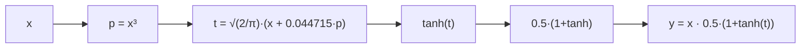
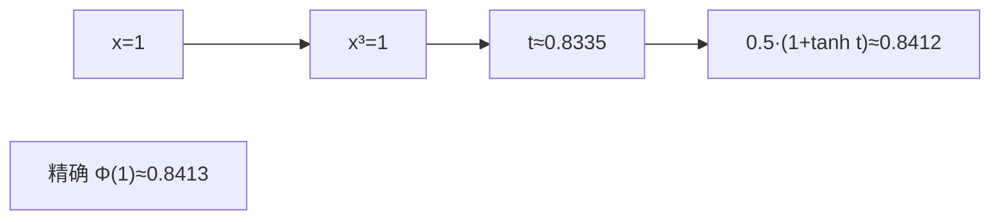
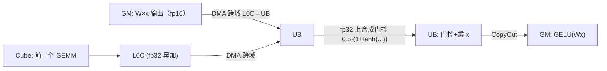

# 05 · GELU 及其它激活函数

> 目标读者：理解 element-wise 与 GEMM，想搞清楚"激活函数在 NPU 上怎么算、怎么优化"。
> 本文聚焦 GELU（含 tanh 近似版），并顺带比较 ReLU、SiLU/Swish 等同类激活。

---

## 一、概述

激活函数给神经网络注入**非线性**——如果层层都是线性变换，再多层也等价于一层。Transformer（尤其 LLaMA 系）最常见的激活有 GELU、SiLU/Swish。它们都是**逐元素（element-wise）算子**，计算量不大，却在每个前馈层都要用，因此"算得快 + 移得少"很重要。

```
人话总结：激活函数就是给神经元的输出"过一道门槛/加一道拐弯"，让它能表达非线性；
       GELU 是其中带"sigmoid 式软门槛"的一种，可用 tanh 近似快速算。
```

---

## 二、定义

### 2.1 GELU（Gaussian Error Linear Unit）

GELU 由 Hendrycks & Gimpel 于 2016 年提出，定义为：

```
GELU(x) = x · Φ(x)
```

其中 `Φ(x)` 是**标准正态分布的累积分布函数（CDF）**。它相当于"把 x 乘以一个介于 0 和 1 的软门控"，让正值基本保留、负值被大幅压制，但不像 ReLU 那样硬切 0，曲线平滑、可导性好。

### 2.2 精确计算需要误差函数

`Φ(x) = (1/2)·(1 + erf(x/√2))`，所以：

```
GELU(x) = x · 0.5 · (1 + erf(x/√2))
```

`erf`（误差函数）在硬件上通常没有原生指令，要靠**查表或多项式近似**来算，略贵。

### 2.3 tanh 近似版（工业界最爱的版本）

为了省去精确 `erf`，论文给出一个 tanh 近似，精度误差极小，几乎看不出来：

```
GELU_tanh(x) ≈ x · 0.5 · (1 + tanh( √(2/π) · (x + 0.044715·x³) ))
```

这个写法在几乎全部大模型推理 / 训练实现里被采用：`√(2/π)` 是常数，`x³` 一次乘出，`tanh` 是相对"便宜"的激活。它的优势是**只有乘加 + 一个 tanh**，不用查 erf 大表。



> 人话：精确 GELU 要算误差函数（贵人精）；工程上用"多项式 + tanh"拼一个几乎一样的结果，便宜得多。

### 2.4 同类激活快速对照

| 激活 | 公式 | 特点 |
|---|---|---|
| ReLU | `max(x, 0)` | 最便宜，硬门槛，负值全 0 |
| GELU | `x·Φ(x)` ≈ tanh 近似 | 平滑软门槛，Transformer 前馈常用 |
| SiLU / Swish | `x·sigmoid(x)` | 与 GELU 相似，也是软门槛 |
| Tanh | `(e^x−e^{−x})/(e^x+e^{−x})` | 输出限制在 (−1,1)，饱和 |

LLaMA 用 SwiGLU（SiLU 的一种门控变体），BERT/很多 Transformer 用 GELU——核心都是"给 x 乘一个 0~1 之间的软增益，实现非线性稠化"。

---

## 三、为什么需要它

### 3.1 非线性是神经网络能逼近任意函数的钥匙

没有激活，多层线性变换叠起来仍是线性；激活注入的非线性，让两层前馈（FFN）才能真正"旋转"特征空间、拟合复杂模式。

### 3.2 为什么要软门槛而不是硬切

ReLU 在 0 处不可导、负区梯度恒 0（可能"神经元死亡"）。GELU/SiLU 在 0 附近平滑、负区仍有小梯度，训练更稳、收敛更好。虽然略贵，但在大模型里收益更明显。

### 3.3 激活频繁出现在 FFN 里

每个 Transformer 层的前馈网络很高、很大（常常 hidden 的 4 倍甚至高级倍），激活就跟着用了海量次数。所以"激活本身便宜"也要讲究"别让激活这一趟搬运拖累 GEMM"。

---

## 四、朴素实现

```python
import numpy as np

def gelu_tanh(x, sqrt2pi=0.79788):
    t = sqrt2pi * (x + 0.044715 * x**3)
    return 0.5 * x * (1.0 + np.tanh(t))

def gelu_exact(x):
    import math
    # Φ(x) = 0.5·(1 + erf(x/√2))
    erf = np.vectorize(math.erf)
    return 0.5 * x * (1.0 + erf(x / math.sqrt(2)))
```

朴素写法的全部开销：`x³ → 乘常数 → tanh(t) → 与 x 相乘`。它就是一个**逐元素**的乘法链，没有任何跨元素归约。

---

## 五、NPU 上的关键优化点

### 5.1 Vector + UB：一鼓作气算完一条乘法链

GELU 是典型的 element-wise，主场在 **Vector + UB**。优化就是 01 篇那三条老规矩：

1. 数据**一趟进 UB**，一次算完 `x³ → … → tanh → 乘 x`，**一趟出**；
2. 用**向量指令**逐片铺开，别写逐元素标量循环；
3. 中间产物留在 UB。


### 5.2 tanh / erf：不靠昂贵原生实现，靠"查表 + 多项式"

`erf`、`tanh`、甚至 `sigmoid` 在大模型里是高频数学函数。昇腾 Vector 单元对常见的 `tanh` 有硬件加速指令（或提供质量的级数近似），比用标量循环逐点强太多。要点：

- **能用指令用指令**，`tanh` 尽量交给 Vector 硬指令；
- 若确需精确 `erf`，用**查表（LUT）**或**分段多项式**在精度允许范围内近似，避免每次现算昂贵级数。

> 人话：把这些"贵函数"写成查表或硬件指令，是激活类算子性能的关键——别手写逐点级数。

### 5.3 与 FFN 的 GEMM epilogue 融合

GELU 几乎总跟在第一个 FFN 的 GEMM 之后（`y = GELU(W·x)`）。最优做法是把 GELU 作为那个 GEMM 的 **epilogue**：

- Cube 把 `W·x` 累加到 **L0C**；
- DMA 把 L0C 跨域搬到 **UB**；
- Vector 在 UB 上直接做 GELU；
- 一次写回 GM。

这样 GEMM 的整块结果根本没落地到 GM 就完成了激活，省掉一格往返——这是 CONTEXT.md"L0C→UB 跨域搬运→Vector 加工"通路的标准用法。

### 5.4 数值稳定性与精度

fp16 下算 `x³` 当 `x` 较大时会放大误差；常用对策：

- 在 **fp32 累加/计算**里做中间乘法（尤其 `0.5·(1+tanh(t))` 的合成），再降到 fp16 存；
- 因为融合进 GEMM 是在 fp32 累加结果之后直接做，激活本身精度就借力 fp32 累加器。

这正好复用仓库 CONTEXT.md 的**混合精度**（fp16 输入输出 + fp32 累加）原则。

### 5.5 尾块 / 对齐

当数据长度不能被 Vector 指令宽度整除时，会有一个尾块。处理方式与 element-wise 的 tail 一致：用 `DataCopyPad` 之类补齐到对齐长度搬 0、算完只写有效部分，或按 mask 屏蔽多余元素。核心心法："搬多了没关系，别写坏 GM 就行"。

### 5.6 激活的批次 / 流水规划（别让 Vector 闲着）

一个前馈层里，Cube 负责 GEMM、Vector 负责 GELU，二者可以**重叠（流水线）**：Cube 正在算下一块的 `W·x` 的同时，Vector 正在对上一块做 GELU。优化思路是给 Vector 准备**多块缓冲**（类似双缓冲），让激活这一环不必等到整条 GEMM 全算完才动工——CMT上下文里的"数据一批批流过 Cube→L0C→UB→GELU"，就是把 GEMM 和激活重排成交错流水，减少空等。

> 人话：Cube 和 Vector 是两条不同的流水线，用心把它们错开交替干活，整层才算得快——激活不是孤军奋战，而是和 GEMM 抢零碎时间。

---

## 常见误区与追问

1. **"tanh 近似版会差很多吗？"** 不会。GELU 论文报告它与精确 `erf` 版本的最大误差极小（典型做法下肉眼难辨），工业级实现（包括主流 HF 模型默认）几乎都用 tanh 近似。这正是"用一点可控近似换大幅便宜"的经典案例。
2. **"激活为什么必须紧跟 GEMM 融合？"** 因为不融合就得先把大而密的 `W·x` 写回 GM、再读回来做激活；融合后数据留在片上（L0C→UB）就地加工，省掉这趟读写。激活本身是 element-wise，融合零风险。
3. **"GELU 和 SiLU 能互相换吗？"** 实现上都是"给 x 乘一个 0~1 软门"；模型架构里选定后通常不换，因为数值分布已就位。理解上可视为同一族。
4. **"激活需要 fp16 输入吗？"** 只要与 GEMM 的输入输出对齐即可；融合进 GEMM 时往往在 fp32 累加结果后直接做，因而**激活本身天然在宽精度里进行**，再截回输出精度。单独跑时用 fp16 输入、中间门控用 fp32 合成即可。
5. **"GELU 在硬件上要不要专门算子？"** 不用专门的"GELU 算子"——它就是一串 Vector 指令（乘方 + tanh + 乘）。正因为纯 element-wise，才能毫不费力地融进 GEMM 的 epilogue 里。
6. **"激活对位宽敏感吗？"** 主要看它后面接什么。融合进 GEMM 时它消费的是 L0C 里 fp32 的累加结果，因而门控合成天然在宽精度里；单独跑时用 fp16 输入、中间用 fp32 合成即可，对精度影响可忽略。
7. **"尾块为什么要补 0？"** Vector 指令按固定宽度处理，末段不足凑不满就会读越界。补 0 只为了让算法在"搬够"与"别写坏"之间取平衡——搬运可以多搬（对齐），但写回必须只写有效区，否则会把 GM 里不该写的字节写脏。

### 一个具体的数值对照（理解 tanh 近似）

取 `x=1.0`：
- 精确：`GELU(1) = 1·Φ(1) ≈ 0.8413`；
- tanh 近似：`t = 0.79788·(1 + 0.044715·1) ≈ 0.8335`，`0.5·1·(1+tanh(0.8335)) ≈ 0.5·(1+0.6824)≈0.8412`。

二者几乎相同，而近似只用了"乘方 + 常数 + tanh"，没有昂贵的 `erf`——这就是它在硬件（尤其 NPU 没有原生 erf 指令）上被选中的原因。



---

## 六、数据流总览



---

## 七、人话总结

- GELU = `x·Φ(x)`，软门槛、平滑、可导，Transformer 前馈层标配；
- **tanh 近似版**用"一次立方 + 常数 + tanh"取代昂贵的 `erf`，工业界几乎都用它；
- 归属 element-wise → **Vector + UB** 一路算完，数据一趟进出；
- **与 GEMM epilogue 融合**：Cube 结果跨域搬到 UB 就地激活，不落 GM；
- 尾块用对齐+补 0+mask 处理；中间用 fp32 稳住精度。
- 一句话记住它：**激活就是"软门槛 + 逐元素 + 宜融合"**——看懂这个，SiLU/SwiGLU 也一通百通，因为它们同属"给 x 乘一个 0~1 软门"。
- 补充一句：若连 tanh 都想省，可走**查表/LUT**直接查 Φ(x)，在精度宽松的场合更快；但主流仍选 tanh 版，因为它"一次立方 + 常数 + tanh"在 Vector 上一气呵成、够准也够快。
- 最后的提醒：激活优化永远是"少搬 + 融合"，别在单个函数快慢上钻牛角尖——把数据往返 GM 的那趟省掉，收益远大于把 tanh 再快一点。
- 至此，激活这条"小算子"的路你也走通了：它虽小，却是每次理解 element-wise 与融合的最佳陪练。

---

## 复习自测（带答案要点）

1. **GELU 定义一个公式？** → `x·Φ(x)`（Φ 为标准正态 CDF）。
2. **为什么工业界几乎都用 tanh 版？** → 用"一次立方 + 常数 + tanh"替代昂贵的 `erf`，误差极小、便宜得多。
3. **激活算子的性能命门在哪？** → 和 element-wise 一样：访存（GM↔UB）而不是计算，所以要少搬。
4. **怎么把激活和 GEMM 合起来？** → 作为 GEMM 的 epilogue：Cube 结果落到 L0C → 跨域 DMA 到 UB → Vector 就地激活 → 一次写回，避免落 GM。
5. **激活中间该不该用 fp32？** → 对乘积/门控合成用 fp32 更稳，再降回 fp16 存——呼应 CONTEXT.md 的混合精度。
6. **GELU 融合进 GEMM 的触发点在哪？** → Cube 把 `W·x` 累加到 L0C → DMA 跨域搬 UB → Vector 就地激活 → 一次写回，全程不落 GM。

### 和 SwiGLU（SiLU）的一点关系

LLaMA-2/3 的 FFN 用的是 **SwiGLU**：本质上是对 `SiLU(xW_a)` 与 `xW_b` 做**逐元素相乘**的"门控激活"。它和 GELU 同属于"软门控"一族，只是门不是 `Φ(x)` 而是 `sigmoid(x)`，且额外乘一个投影。理解 GELU 的关键——**"给 x 乘一个 0~1 软门、逐元素、适合 Vector/融合"**——完全顺用到 SiLU/SwiGLU 上。

---

## 八、参考资料

- **GELU 论文**（Dan Hendrycks, Kevin Gimpel, "Gaussian Error Linear Units (GELUs)", 2016）：
  https://arxiv.org/abs/1606.08415
- **HuggingFace Transformers 官方文档《Llama2》**（LLaMA2 用了 tanh 版 GELU / SiLU 类激活，可对照）：
  https://huggingface.co/docs/transformers/en/model_doc/llama
- 华为昇腾 CANN 官方文档（CANN 商用版 8.0）Ascend C API（Vector 数学指令库，含 `Tanh` 等）：
  https://www.hiascend.cn/document
  （在文档中心检索"AscendC API · 向量指令 · Tanh"即可定位；地址带版本号，可能随版本迁移。）

> 说明：GELU 精确 `erf` 与 tanh 近似的数值对比见 GELU 论文第 2 节；昇腾端 tanh 指令以当前 CANN 文档为准。