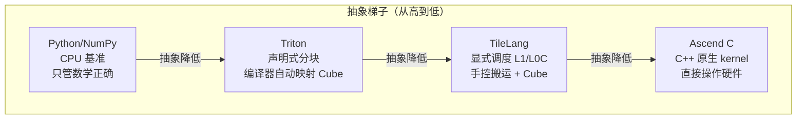

# 00 · 四种 DSL 核心手册总览

`>` 目标读者：想用昇腾 NPU 写 kernel，但不知道选哪种 DSL 的人。
`>` 本文是四篇 DSL 手册的入口，回答一个问题：**四种 DSL 到底有什么区别，我该从哪个开始？**

***

## TL;DR

- 本仓库用 **四种 DSL** 写同一个 `C = A @ B`（128³ fp16），互相验证正确性、对比性能。

- 四种 DSL 构成一条**抽象梯子**：从"只管数学正确"到"手控每一级搬运"。

- **Python/NumPy**：CPU 基准，不管 NPU，只管正确性（最薄）。

- **Triton（triton-ascend）**：Python 声明式分块，编译器自动映射 Cube（中等）。

- **TileLang（tilelang-ascend）**：Python 显式调度 L1/L0C，手控搬运与 Cube（中等偏上）。

- **Ascend C**：C++ 原生 kernel，直接操作硬件资源，性能上限最高、门槛最高（最厚）。

- 实测：Python 朴素 4.27 s → Triton 0.79 ms → TileLang 0.38 ms（Ascend 910B2）。

***

## Background：为什么要四种 DSL？

昇腾 NPU 的算力来自 AI Core 里的 Cube（矩阵乘）、Vector（逐元素）等硬件单元。
但"怎么让代码跑在这些单元上"——也就是 **DSL（Domain-Specific Language，领域特定语言）**——
有多条路径，各有取舍：

```
抽象越高 → 写得越简单 → 控制力越弱 → 性能上限越依赖编译器
抽象越低 → 写得越复杂 → 控制力越强 → 性能上限越高
```

华为官方提供了 **Ascend C**（C++ 原生 kernel DSL），这是最底层、控制力最强的路径。
社区和学术界则提供了 **Triton**（OpenAI，triton-ascend 后端）和 **TileLang**（北大开源，
tilelang-ascend 后端），它们用 Python 写 kernel，通过编译器自动或半自动地映射到硬件。

本仓库把这四种路径放在一起，用同一个 GEMM 跑通、验证、对比，让你一次看清全貌。

***

## Why：理解抽象梯子的价值

### 一张图看清四种 DSL 的定位



`>` **人话**：Python 是"只管对不对"，Triton 是"说清楚块大小，编译器帮你搬"，TileLang 是
`>` "我来指定搬进哪级缓存、Cube 怎么算"，Ascend C 是"每一搬每一步都我亲手写"。

### 四种 DSL 横向对比

| 维度          | Python/NumPy | Triton (triton-ascend)     | TileLang (tilelang-ascend) | Ascend C                           |
| ----------- | ------------ | -------------------------- | -------------------------- | ---------------------------------- |
| **语言**      | Python       | Python (`@triton.jit`)     | Python (`@tilelang.jit`)   | C++                                |
| **抽象层级**    | 最高（无 NPU）    | 中（块级）                      | 中低（调度级）                    | 最低（字节级）                            |
| **工具链**     | numpy + uv   | triton-ascend + torch\_npu | tilelang + tilelang-ascend | CANN ascendc.cmake + bisheng + ACL |
| **内存控制**    | 无            | 编译器决定缓冲                    | 显式 L1/L0C 分配               | 完全手动（GlobalTensor/LocalTensor）     |
| **Cube 调用** | 无            | `tl.dot` → 自动映射            | `T.gemm_v0` → 显式调用         | 手动 MatMul API                      |
| **搬运控制**    | 无            | 隐式（`tl.load/store`）        | 显式（`T.copy` + `T.barrier`） | 手动 `DataCopy`                      |
| **学习曲线**    | 最低           | 中等                         | 中等偏高                       | 最高                                 |
| **性能上限**    | 不适用          | 高（依赖编译器调度）                 | 很高（显式调度）                   | 最高                                 |
| **本仓库定位**   | 正确性基准        | 半自动优化                      | 显式优化                       | 底层全控                               |

### 实测结果（Ascend 910B2 + CANN 9.0.0，128³ fp16）

| DSL                        | NPU run | max\_abs\_error   | 耗时             | 状态   |
| -------------------------- | ------- | ----------------- | -------------- | ---- |
| Python（CPU 基准）             | —       | 0.0（vs np.matmul） | 4.27 s（朴素三重循环） | PASS |
| Triton (triton-ascend)     | ✅       | 0.0               | 0.79 ms        | PASS |
| TileLang (tilelang-ascend) | ✅       | 9.77e-04          | 0.38 ms        | PASS |
| Ascend C                   | ✅       | 0.0               | —              | PASS |

`>` **人话**：同是"一个矩阵乘"，会分块、会喂 Cube 的写法，比傻算快上万倍。性能差距不来自数学，
`>` 来自"数据怎么搬、算力怎么喂"。

***

## 正文：四种 DSL 各自的核心心智模型

### 1. Python/NumPy —— 正确性基准

```
┌─────────────────────────────────────┐
│  Python 基准 = "答案是对的"          │
│  三重循环逐元素累加, fp16→fp32→fp16  │
│  不碰 NPU, 只给其他 DSL 对齐用       │
└─────────────────────────────────────┘
```

它不涉及任何 NPU 概念，只是用 NumPy 在 CPU 上跑一个"最笨但绝对正确"的 GEMM。
所有 NPU kernel 的输出都要和它做 `allclose(atol=1e-2, rtol=1e-2)` 比对。

→ 详见 [01 · Python/NumPy 正确性基准](/dsl/01-python-baseline)

### 2. Triton (triton-ascend) —— 声明式分块 + 自动 Cube

```
┌─────────────────────────────────────┐
│  Triton = "说清楚块大小, 编译器搬"   │
│  @triton.jit + tl.dot → Cube        │
│  你只管 BLOCK_M/N/K, 搬运编译器定    │
└─────────────────────────────────────┘
```

Triton 的核心抽象是**块（block）**：你声明 `BLOCK_M×BLOCK_N` 的输出块，用 `tl.dot` 做块矩阵乘，
编译器自动把 `tl.dot` 映射到 Cube 的 16×16 MAC 阵列，自动决定数据怎么搬进片上缓冲。

→ 详见 [02 · Triton on Ascend 核心手册](/dsl/02-triton-ascend)

### 3. TileLang (tilelang-ascend) —— 显式调度到 L1/L0C

```
┌─────────────────────────────────────┐
│  TileLang = "我指定搬进哪级缓存"     │
│  T.alloc_L1 + T.alloc_L0C           │
│  T.copy(GM→L1) + T.gemm_v0(L1→L0C)  │
│  T.barrier_all() 确保搬完再算        │
└─────────────────────────────────────┘
```

TileLang 比 Triton 更贴近硬件：你可以**显式声明**数据搬到 L1 还是 L0C，用 `T.barrier_all()` 控制
搬运与计算的同步，用 `T.gemm_v0` 显式调用 Cube。它把"编译器自动做的事"变成了"你来写"。

→ 详见 [03 · TileLang on Ascend 核心手册](/dsl/03-tilelang-ascend)

### 4. Ascend C —— C++ 原生 kernel，直接操作硬件

```
┌─────────────────────────────────────┐
│  Ascend C = "每一搬每算都我写"      │
│  GlobalTensor / LocalTensor         │
│  DataCopy (DMA) / MatMul (Cube)     │
│  bisheng 编译 → ascendc.cmake 打包   │
│  aclrtlaunch → NPU 执行              │
└─────────────────────────────────────┘
```

Ascend C 是华为 CANN 的原生 kernel DSL，用 C++ 写，经 bisheng 编译器编成 AI Core 机器码。
它直接暴露 `GlobalTensor`（GM 视图）、`LocalTensor`（UB/L1 视图）、`DataCopy`（DMA 搬运）、
`MatMul`（Cube 调用），是你能拿到最多控制权、也最接近硬件的路径。

→ 详见 [04 · Ascend C 核心手册](/dsl/04-ascend-c)

***

## 图表：四种 DSL 的编译通路对比

```mermaid
flowchart TB
    subgraph PY_PATH["Python 路径"]
        PY_SRC["gemm.py\n三重循环"] --> PY_CPU["CPU 执行\nNumPy BLAS"]
    end
    subgraph TR_PATH["Triton 路径"]
        TR_SRC["gemm_triton.py\n@triton.jit"] --> TR_IR["Triton IR"]
        TR_IR --> TR_ASCEND["triton-ascend 后端\n→ Ascend NPU IR"]
        TR_ASCEND --> TR_BIN["CANN 可执行 kernel\n→ Cube/Vector"]
    end
    subgraph TL_PATH["TileLang 路径"]
        TL_SRC["gemm_tilelang.py\n@tilelang.jit"] --> TL_IR["TileLang IR"]
        TL_IR --> TL_ASCEND["tilelang-ascend 后端\n→ Ascend C / AscendNPU IR"]
        TL_ASCEND --> TL_BIN["CANN 可执行 kernel\n→ Cube/Vector"]
    end
    subgraph AC_PATH["Ascend C 路径"]
        AC_SRC["gemm_kernel.cpp\nC++ kernel"] --> AC_BISHENG["bisheng 编译器\n→ device .o"]
        AC_BISHENG --> AC_CMAKE["ascendc.cmake 打包\n→ libgemm.a"]
        AC_CMAKE --> AC_BIN["ACL 运行时加载\n→ AI Core 执行"]
    end
```



`>` **人话**：四条路殊途同归——最终都跑在 AI Core 的 Cube/Vector 上，区别只是"你亲手控到哪一级"。

***

## FAQ

**Q1：我是新手，该从哪个 DSL 开始？**

先看 [Python 基准](/dsl/01-python-baseline)理解"正确性校验怎么来的"，再看
[Triton](/dsl/02-triton-ascend)——它是最容易上手的 NPU kernel DSL。等你理解了 tiling 和 Cube，
再看 [TileLang](/dsl/03-tilelang-ascend)和 [Ascend C](/dsl/04-ascend-c)深入底层。

**Q2：TileLang 0.38ms 比 Triton 0.79ms 快，说明 TileLang 更好？**

在这组 128³ 对照里它略快，但不能直接推广。差异更多来自**显式调度**效率：TileLang 明说了
L1/K\_L1、双缓冲与搬运动作，比 Triton 由编译器自动决策更适合这个规模。换个形状/规模，结论
可能不同——所以仓库的 README 提醒"先测再说"。

**Q3：Ascend C 性能上限最高，为什么还要学 Triton/TileLang？**

Ascend C 控制力最强，但开发成本也最高——每个搬运、同步、多核切分都要手写。Triton/TileLang
用 Python 写 kernel，开发效率高数倍，在多数场景下性能也足够好。工程上先用高抽象 DSL 快速
验证正确性和性能，再按需下沉到底层。

**Q4：四种 DSL 的精度策略一样吗？**

完全一样：**fp16 输入/输出 + fp32 累加器**（混合精度）。这是 Cube 单元原生精度，也是避免
K 维累加精度损失的标准做法。Python 基准同样在乘加前升 fp32，保证对齐口径一致。

***

## TL;DR 末尾汇总

1. 四种 DSL = 一条**抽象梯子**：Python（正确性）→ Triton（块级自动）→ TileLang（显式调度）→ Ascend C（全手动）。
2. 抽象越高，写得越简单但控制力越弱；抽象越低，控制力越强但开发成本越高。
3. 实测：Python 4.27 s → Triton 0.79 ms → TileLang 0.38 ms，差距来自"会不会分块、喂不喂 Cube"。
4. 四条路殊途同归，最终都跑在 AI Core 的 Cube/Vector 上。
5. 新手路径：Python → Triton → TileLang → Ascend C。

***

## 参考资料

**本仓库（可本地核验）：**

- [README.md](https://github.com/SuccinctPaul/Ascend-Notes)（四 DSL 实测结果表、统一约定、运行环境）

- [术语表](/reference/context)（硬件架构、数据流、tiling、混合精度、Cube 16×16 MAC 术语表）

- `examples/python/`、`examples/triton_ascend/`、`examples/tilelang_ascend/`、`examples/ascend_c/`

**官方 / 项目来源：**

- Triton 官方：<https://triton-lang.org/>

- triton-ascend（昇腾后端）：<https://github.com/triton-lang/triton-ascend>

- TileLang 官方：<https://github.com/tile-ai/tilelang>

- 华为昇腾 Ascend C 官方：<https://www.hiascend.com/cann/ascend-c>

- 华为昇腾 CANN 文档中心：<https://www.hiascend.cn/document>

