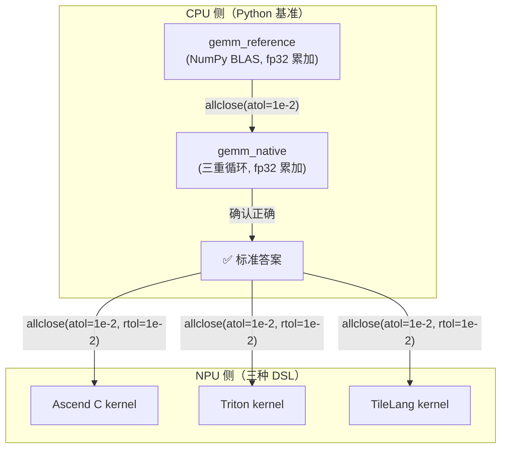

# 01 · Python/NumPy 正确性基准

> 目标读者：所有想在昇腾 NPU 上写 kernel 的人。
> 本文回答一个问题：**其他三种 DSL 的输出，凭什么说"对了"？**——答案就在这里。

---

## TL;DR

- Python/NumPy 基准是整个仓库的 **ground truth（正确性基准）**，跑在 CPU 上，不碰 NPU。
- 它用最朴素的三重循环算 `C = A @ B`，fp16 输入 + fp32 累加，和 NPU kernel 同精度策略。
- NPU kernel 的正确性都以 CPU 参考为锚比对（GEMM 三家 DSL 均为 `allclose(atol=1e-2, rtol=1e-2)`；个别算子如 TileLang GELU 用 `max_err < 5e-3`，以各自 test 脚本为准）。
- 它还提供 GELU、Softmax 的参考实现，同样是其他 DSL 对齐的基准。
- 工具链极简：`cd examples/python && uv sync && uv run python src/gemm.py`，任意机器可跑。

---

## Background：为什么需要 CPU 基准？

NPU kernel 的开发有一个根本困难：**硬件上跑出来的结果，你怎么知道是对的？**

你不能"看一眼就说对"——fp16 精度下，不同实现路径的数值会有微小差异。你需要一个
**绝对可信的参照物**，一个"不碰任何 NPU 优化、只管数学正确"的基准实现。

这就是 Python/NumPy 基准的角色：它跑在 CPU 上，用 NumPy 的 BLAS 后端做参考，
用朴素三重循环做教学对照。两者互相验证后，作为"已确认正确的答案"，
再去校验 NPU kernel 的输出。

```
┌──────────────────────────────────────────────────┐
│  Python 基准的定位                                 │
│                                                    │
│  gemm_reference (NumPy BLAS)  ←──┐ 对齐            │
│  gemm_native   (三重循环)      ←──┘                │
│         │ allclose(atol=1e-2)                      │
│         ▼                                          │
│  ✅ 确认正确 → 去校验 NPU kernel 输出               │
│         │ allclose(atol=1e-2, rtol=1e-2)           │
│         ▼                                          │
│  ascend_c / triton / tilelang 的输出               │
└──────────────────────────────────────────────────┘
```

> **人话**：Python 基准是"标准答案"。NPU kernel 考完试，拿这个答案对一遍才知道及不及格。
> 这套"先基准后下沉"的打法在 [四种 DSL 总览](/dsl/00-dsl-overview)里有全局图；
> GELU / Softmax 的参考实现在 [GELU 篇](/ops/05-gelu)与 [Softmax 篇](/ops/03-softmax)有逐行讲解。

---

## Why：理解"正确性基准"的价值

### 1. 它是信任的锚点

没有基准，你就无法区分"kernel 写错了"和"fp16 精度正常波动"。有了基准，
`allclose(atol=1e-2, rtol=1e-2)` 一比，PASS 就是数学等价，FAIL 就是有 bug。

### 2. 它锁定了精度策略

基准的实现方式决定了"什么算正确"：本仓库的基准统一用 **fp16 输入 + fp32 累加**，
和 NPU Cube 单元的混合精度策略一致。这意味着所有 DSL 的精度口径是统一的。

### 3. 它是最简单的教学起点

三重循环 GEMM 不涉及任何硬件概念——没有 tiling、没有 Cube、没有 DMA。
它是理解"其他 DSL 在做什么优化"的对照线。

---

## 正文

### 1. 工具链

```
┌─────────────────────────────────┐
│  Python 基准工具链               │
│                                   │
│  uv (包管理) → numpy + termcolor │
│  Python >= 3.12                   │
│  任意 CPU 机器可跑，无需 NPU       │
└─────────────────────────────────┘
```

```bash
# 安装依赖（首次运行，会创建 .venv）
cd examples/python && uv sync

# 运行 GEMM 基准
uv run python src/gemm.py

# 运行 GELU 自测
uv run python src/gelu.py

# 运行 Softmax 自测
uv run python src/softmax.py
```

> **人话**：一条 `uv sync` 装好 numpy，一条 `uv run` 跑起来，不挑机器。

### 2. GEMM 基准实现

#### 2.1 朴素三重循环（教学版）

```python
def gemm_native(A: np.ndarray, B: np.ndarray) -> np.ndarray:
    M, K = A.shape
    K2, N = B.shape
    C = np.zeros((M, N), dtype=A.dtype)

    acc_dtype = np.float32  # fp32 累加器
    for i in range(M):
        for j in range(N):
            s = acc_dtype(0.0)
            for k in range(K):
                s += acc_dtype(A[i, k]) * acc_dtype(B[k, j])
            C[i, j] = s  # 回写到目标 dtype（可能 fp16，有截断）
    return C
```

关键点：**即便输入是 fp16，也把每个元素升到 fp32 再乘加**——这正是 NPU 上
"fp16 输入 + fp32 累加器"的标准做法（混合精度），否则 fp16 逐次乘法会在 K 较大时
累积出显著误差。

> **人话**：输入存窄的（fp16 省空间），账本花宽的（fp32 保精度）——这就是混合精度。

#### 2.2 参考基准（NumPy BLAS）

```python
def gemm_reference(A: np.ndarray, B: np.ndarray) -> np.ndarray:
    in_dtype = A.dtype
    # 升到 float32 计算，保证累加精度，再截回输入精度
    C_ref = (A.astype(np.float32) @ B.astype(np.float32)).astype(in_dtype)
    return C_ref
```

`gemm_reference` 直接调用 NumPy 的 `@`（底层是 BLAS，高度优化），但同样先升 fp32 再乘加，
保证与 NPU kernel 的精度口径一致。

#### 2.3 校验函数

```python
def verify(C, C_ref, atol=1e-2, rtol=1e-2) -> bool:
    max_abs_err = float(np.max(np.abs(C.astype(np.float32) - C_ref.astype(np.float32))))
    ok = bool(np.allclose(C, C_ref, atol=atol, rtol=rtol))
    return ok
```

容差 `atol=1e-2, rtol=1e-2` 是 fp16 的经验值（fp16 尾数约 3 位十进制有效数字）。
所有 NPU DSL 的校验都用同一组容差。

### 3. GELU 基准实现

工业界统一使用 tanh 近似版：

```
GELU(x) ≈ x · 0.5 · (1 + tanh( √(2/π) · (x + 0.044715 · x³) ))
```

```python
_SQRT_2_OVER_PI = 0.7978845608028654  # sqrt(2 / pi)
_CUBIC_COEF = 0.044715

def gelu_numpy(x: np.ndarray) -> np.ndarray:
    x = np.asarray(x)
    inner = _SQRT_2_OVER_PI * (x + _CUBIC_COEF * np.power(x, 3))
    return (0.5 * x * (1.0 + np.tanh(inner))).astype(x.dtype, copy=False)

gelu_reference = gelu_numpy  # 对外 ground truth
```

> **人话**：GELU 是逐元素算子，不走 Cube，走 Vector。Python 基准只管公式对不对。

### 4. Softmax 基准实现

Softmax 带有沿 axis 的 reduction，不是纯逐元素：

```
softmax(x)_i = exp(x_i - m) / Σ_j exp(x_j - m)    其中 m = max_j x_j
```

```python
def softmax_numpy(x: np.ndarray, axis: int = -1) -> np.ndarray:
    x = np.asarray(x)
    xf = x.astype(np.float32, copy=False)  # fp32 内部归约
    m = np.max(xf, axis=axis, keepdims=True)
    e = np.exp(xf - m)
    s = np.sum(e, axis=axis, keepdims=True)
    y = e / s
    return y.astype(x.dtype, copy=False)

def softmax_reference(x, axis=-1):
    return softmax_numpy(x, axis=axis)
```

关键点：**先减 max 再 exp**（数值稳定），内部归约用 fp32。NPU 上的 Softmax kernel
也遵循同样的三阶段（max → exp → sum/div），只是跑在 Vector 单元 + UB 上。

> **人话**：不减 max 直接 exp，fp16 下 x>80 就爆 inf。减了 max 才安全——这是所有 DSL 的共识。

### 5. 文件总览

| 文件 | 作用 |
|---|---|
| `src/gemm.py` | GEMM 基准：朴素三重循环 + NumPy 参考 + verify 校验 |
| `src/gelu.py` | GELU 基准：tanh 近似公式，标量版 + NumPy 版 |
| `src/softmax.py` | Softmax 基准：数值稳定版（减 max）+ naive 版（教学） |
| `src/tools.py` | 工具函数：彩色耗时打印 |
| `src/test_gelu.py` | GELU 自测：与 PyTorch `nn.GELU` 对齐 |
| `src/test_softmax.py` | Softmax 自测：与 PyTorch `F.softmax` 对齐 |
| `pyproject.toml` | 包配置：Python >=3.12，依赖 numpy + termcolor |

### 6. 与 NPU kernel 的对齐关系



> **人话**：Python 基准先在 CPU 上自验（朴素版 vs BLAS），确认正确后再去校验 NPU kernel。

---

## 图表：朴素三重循环 vs NPU 优化的性能差距

```
           朴素三重循环 (Python, CPU)         4.27 s
                                         ─────────────────────────
           Triton (分块 + Cube, NPU)        0.79 ms
           TileLang (显式调度 + Cube, NPU)   0.38 ms
                                         ─
           
           差距：~5000x ~ ~11000x
           
           ↑ 性能差距不来自数学，来自：
             • tiling（分块搬进片上）
             • Cube 16×16 MAC（硬件矩阵乘）
             • 数据复用（少回 GM）
             • 流水线（搬运与计算重叠）
```

> **人话**：同是"一个矩阵乘"，会分块、会喂 Cube 的写法，比傻算快上万倍。

---

## FAQ

**Q1：为什么不用 PyTorch 的 `torch.matmul` 作为基准？**

NumPy 的 `@` 跑在 CPU 上，不受 NPU 驱动/CANN 版本影响，是最稳定的参照物。PyTorch 的
`torch.matmul` 在 NPU 上走的是 CANN/ATB 提供的 matmul 实现（CUBLAS 是 NVIDIA 的库名，
与昇腾无关），它本身就是"被校验的对象"之一，不适合做基准。

**Q2：atol=1e-2 是不是太松了？**

fp16 的尾数只有约 11 位（约 3 位十进制有效数字），128 维 K 累加后的误差在 1e-3 量级
是正常的。`atol=1e-2` 给了 10 倍余量，既能滤掉精度噪声，又能抓到真正的 bug。
仓库实测：Triton `max_abs_error=0.0`，TileLang `max_abs_error=9.77e-04`，都在容差内。

**Q3：朴素三重循环为什么也要 fp32 累加？**

为了和 NPU kernel 的精度策略一致。如果朴素版用 fp16 累加，它自身就会因为精度损失
偏离 BLAS 参考值，那就没法当基准了。fp32 累加保证朴素版和 BLAS 版对齐，然后两者
一起去校验 NPU kernel。

**Q4：GELU/Softmax 的基准也和 NPU kernel 对齐吗？**

是的。`gelu_reference` 和 `softmax_reference` 是其他三种 DSL 的 GELU/Softmax kernel
的对齐基准，校验口径同样是 `allclose(atol=1e-2, rtol=1e-2)`。

---

## TL;DR 末尾汇总

1. Python/NumPy 基准是全仓库的 **ground truth**，跑在 CPU 上，不碰 NPU。
2. 精度策略统一：**fp16 输入 + fp32 累加**（混合精度），与 NPU Cube 单元一致。
3. 校验口径：`allclose(atol=1e-2, rtol=1e-2)`，所有 DSL 共用。
4. 朴素三重循环 4.27 s vs Triton 0.79 ms vs TileLang 0.38 ms——差距来自硬件优化，不来自数学。
5. 工具链极简：`uv sync && uv run python src/gemm.py`，任意 CPU 机器可跑。

---

## 参考资料

**本仓库（可本地核验）：**
- `examples/python/src/gemm.py`（GEMM 基准：朴素三重循环 + NumPy 参考 + verify）
- `examples/python/src/gelu.py`（GELU 基准：tanh 近似公式）
- `examples/python/src/softmax.py`（Softmax 基准：数值稳定版）
- `examples/python/src/tools.py`（彩色耗时打印工具）
- `examples/python/README.md`（运行说明与对齐关系）

**外部参考：**
- NumPy 官方文档：https://numpy.org/doc/
- GELU 论文：Hendrycks & Gimpke, *Gaussian Error Linear Units (GELUs)*, 2016
- uv 包管理器：https://github.com/astral-sh/uv
