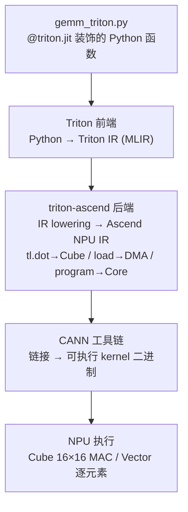
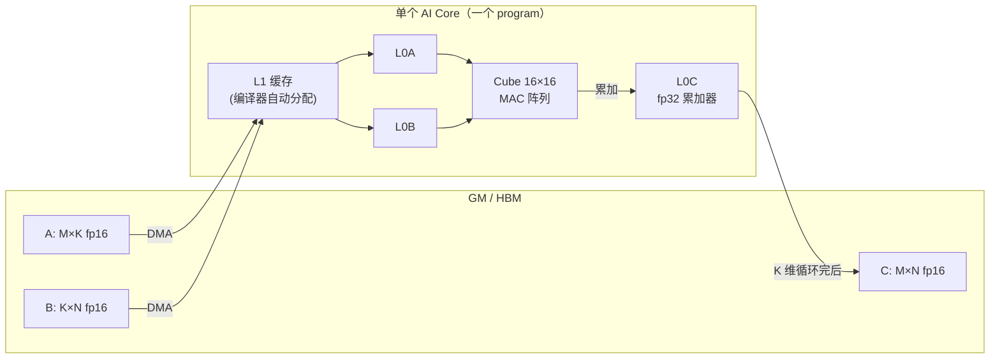

# 02 · Triton on Ascend (triton-ascend) 核心手册

> 目标读者：会用 PyTorch 但没写过 NPU kernel 的人。本文回答一个问题：**怎么用 Triton 在
> Ascend NPU 上写一个能跑、能对、还不慢的 kernel？** 读完后你能独立写出 GEMM / GELU / Softmax
> 三个 kernel，并知道每个写法背后的硬件映射。本文是 [00 · 四种 DSL 总览](/dsl/00-dsl-overview) 的第 2 篇。

---

## TL;DR

- **triton-ascend = OpenAI Triton 的昇腾 NPU 后端**：同一份 `@triton.jit` Python kernel，CUDA 后端跑 NVIDIA、ascend 后端跑昇腾——"一次编写多处运行"。
- **核心抽象是块（block）**：你声明 `BLOCK_M×BLOCK_N` 输出块，`tl.dot` 自动映射 Cube 16×16 MAC、`tl.load/store` 隐式 DMA、L1/L0A/L0B/L0C 缓冲编译器自动决定——你不用管搬运。
- **三个 kernel 两条路**：GEMM 走 Cube（`tl.dot` 自动分流），GELU/Softmax 走 Vector（`tl.math.*` + reduction）。BLOCK 必须 16 的倍数，1D grid ≤ 65535，fp32 累加器防 K 维精度损失。
- **实测 128³ fp16 GEMM = 0.79 ms**（vs 朴素 Python 4.27 s、TileLang 0.38 ms）。门槛低、半自动优化，是"性价比最高的优化起点"。
- **版本必须严格匹配**：CANN 9.0.0 + torch 2.8.0 + torch_npu 2.8.0rc1 + triton-ascend 3.2.0。首次调用慢是编译开销（缓存在 `~/.triton/cache`）。

---

## Background：Triton 是什么、triton-ascend 后端、与 GPU Triton 的关系

[Triton](https://github.com/triton-lang/triton) 是 OpenAI 开源的 GPU kernel DSL：用 `@triton.jit`
装饰 Python 函数，函数体写 `tl.load / tl.dot / tl.store` 操作**块级张量**，编译器把块级 IR
lower 到目标硬件。**triton-ascend**（[gitcode.com/Ascend/triton-ascend](https://gitcode.com/Ascend/triton-ascend)）
是它在华为昇腾 NPU 上的后端，把 Triton IR 编译成 Ascend NPU IR，再经 CANN 工具链生成可执行 kernel，
跑在 AI Core 的 Cube/Vector 单元上。

| 维度 | GPU Triton | triton-ascend（本篇） | Ascend C |
|---|---|---|---|
| **语言** | Python (`@triton.jit`) | Python (`@triton.jit`) | C++ |
| **后端** | NVIDIA CUDA | Ascend Cube/Vector | Ascend 原生 |
| **抽象层级** | 高（块级） | 高（块级） | 低（元素级） |
| **Cube 映射** | N/A | `tl.dot` → Cube 16×16 | 需手动调 MatMul API |
| **缓冲控制** | 编译器决定 | 编译器决定 | 完全手动 |

> **人话**：同一份 Triton kernel 代码，GPU 上走 CUDA 后端、NPU 上走 ascend 后端。代价是你
> 交出了搬运控制权，能否吃满带宽**强依赖编译器调度**。`torch_npu` 给 PyTorch 注册 `'npu'`
> device，提供 NPU 张量管理，不参与 kernel 编译。

---

## Why：为什么用 Triton 写昇腾 kernel

1. **Python 写 kernel，没有 C++ 编译链**：Ascend C 要写 C++、管 `GlobalTensor/LocalTensor`；
   Triton kernel 就是普通 Python 函数，调试成本接近写 NumPy。
2. **块级抽象天然对齐 Cube 16×16 粒度**：`tl.dot(a, b)` 自动 lower 到 Cube 的 16×16×16 MAC
   阵列，不需要写 `Matmul` API。
3. **编译器自动决定缓冲，门槛低**：Triton 不暴露 L1/L0A/L0B/L0C 的名字，`tl.load/store`
   隐式搬运，具体放哪级缓冲编译器定。这是它比 TileLang/Ascend C 易学的根本原因。
4. **与 PyTorch / torch_npu 无缝衔接**：kernel 接受 `torch.Tensor` 指针，输出也是 NPU 张量，
   可直接插入 `torch.nn.Module`，和 `torch.matmul` 互相校验。

```text
┌─────────────────────────────────────────┐
│  Triton 的"半自动"定位                   │
│   你管:  BLOCK 大小 · grid · 算子逻辑    │
│   编译器管: L1/L0 缓冲 · Cube 调用 · 搬运│
│   → 比 Ascend C 易学, 比 TileLang 自动   │
│   → 性能强依赖编译器调度能力             │
└─────────────────────────────────────────┘
```

> **人话**：Triton 是"你说清楚块大小，搬运编译器帮你定"。门槛低、能跑出 0.79 ms 的 GEMM，
> 比朴素 Python 快 5000 倍——多数场景下"性价比最高的优化起点"。

---

## 正文

### 1. 工具链全貌

#### 1.1 安装：CANN 前置 + torch_npu + triton-ascend

```bash
# 1) CANN 环境（前置必备，每次新 shell 都要 source）
source /usr/local/Ascend/ascend-toolkit/latest/set_env.sh

# 2) 创建 venv 并装 numpy + torch（pyproject.toml 锁定 torch==2.8.0, python>=3.11,<3.12）
cd triton_ascend && uv venv --python 3.11 && uv sync

# 3) 手动装 torch_npu + triton-ascend（不在标准 PyPI 上可直接解析）
uv pip install torch_npu        # 2.8.0rc1, 必须与 torch 严格一致
uv pip install triton-ascend    # 3.2.0; 失败则源码: git clone + pip install -e .

# 4) 验证
uv run python -c "import torch, torch_npu, triton; print(torch.npu.is_available())"  # → True
```

> **人话**：版本匹配很关键。本机实测组合是 **CANN 9.0.0 + torch 2.8.0 + torch_npu 2.8.0rc1
> + triton-ascend 3.2.0**。torch_npu 必须和 torch 严格一致，否则 import 报符号找不到。

#### 1.2 编译通路



> **人话**：你写的 Python 函数先变成"块级 IR"，再被 triton-ascend 后端翻译成"昇腾 IR"，
> 最后由 CANN 链接成二进制。三段编译，前两段在 host 上跑、产物缓存在 `~/.triton/cache`。

### 2. kernel 代码结构（以 `gemm_triton.py` 为例）

```python
@triton.jit
def gemm_kernel(a_ptr, b_ptr, c_ptr, M, N, K,
                stride_am, stride_ak, stride_bk, stride_bn,
                stride_cm, stride_cn,
                BLOCK_M: tl.constexpr, BLOCK_N: tl.constexpr, BLOCK_K: tl.constexpr):
    # 1. 程序块定位: 每个 program 算一个 BLOCK_M×BLOCK_N 输出块
    pid = tl.program_id(axis=0)
    pid_m = pid // tl.cdiv(N, BLOCK_N)
    pid_n = pid %  tl.cdiv(N, BLOCK_N)

    # 2. 构造分块指针 (b/c 类同, 省略)
    a_block_ptr = tl.make_block_ptr(
        base=a_ptr, shape=(M, K), strides=(stride_am, stride_ak),
        offsets=(pid_m * BLOCK_M, 0), block_shape=(BLOCK_M, BLOCK_K), order=(1, 0))

    # 3. K 维循环累加: fp16 输入 → fp32 累加 (混合精度)
    accumulator = tl.zeros((BLOCK_M, BLOCK_N), dtype=tl.float32)
    for k in range(0, tl.cdiv(K, BLOCK_K)):
        a = tl.load(a_block_ptr, boundary_check=(0, 1))   # fp16
        b = tl.load(b_block_ptr, boundary_check=(0, 1))   # fp16
        accumulator += tl.dot(a, b)                       # → Cube 16×16 MAC
        a_block_ptr = tl.advance(a_block_ptr, (0, BLOCK_K))
        b_block_ptr = tl.advance(b_block_ptr, (BLOCK_K, 0))

    # 4. 写回 (fp32 累加结果 → fp16 截断)
    tl.store(c_block_ptr, accumulator.to(tl.float16))
```

关键 API 逐个拆：

- **`@triton.jit`**：把 Python 函数标记为 kernel。首次调用触发编译，之后走 `~/.triton/cache`。`tl.constexpr` 参数烘焙进二进制，改 `BLOCK_M` 等于换新 kernel。
- **`tl.program_id(axis=0)`**：每个 program 对应一个 AI Core。`pid_m = pid // num_pid_n` 是行优先编号，和矩阵按行存储的内存布局对齐，对 Cube 取数更友好。
- **`tl.make_block_ptr(base, shape, strides, offsets, block_shape, order)`**：构造分块指针。`order=(1, 0)` 是行主序（最内维连续），**昇腾上最快的内存布局**。
- **`tl.load + boundary_check=(0, 1)`**：M/N/K 不能被 BLOCK 整除时，自动给越界位置补 0（GEMM 里 0 不影响累加），比手写 mask 简单。
- **`tl.dot(a, b)`**：块矩阵乘，triton-ascend **自动映射到 Cube 16×16×16 MAC 阵列**。你不需要写 `Matmul` API、不需要管 L0A/L0B 怎么灌——编译器全包。
- **`tl.advance(ptr, (dm, dk))`**：沿 K 维推进分块指针，指针本身不可变，advance 返回新指针。
- **`accumulator = tl.zeros(..., dtype=tl.float32)`**：fp16 输入（Cube 原生精度）+ fp32 累加器（防 K 维精度损失），这是混合精度标准做法。

### 3. 封装与调用

```python
def gemm(a, b, BLOCK_M=32, BLOCK_N=32, BLOCK_K=32):
    M, K = a.shape; K2, N = b.shape
    assert K == K2
    assert a.is_npu and b.is_npu, "输入张量必须在 npu 设备上"
    assert a.dtype == b.dtype, "A/B dtype 需一致"
    c = torch.empty((M, N), device=a.device, dtype=a.dtype)
    grid = (triton.cdiv(M, BLOCK_M) * triton.cdiv(N, BLOCK_N),)
    gemm_kernel[grid](a, b, c, M, N, K,
                      a.stride(0), a.stride(1),   # ← 传 stride 而非 shape
                      b.stride(0), b.stride(1),
                      c.stride(0), c.stride(1),
                      BLOCK_M=BLOCK_M, BLOCK_N=BLOCK_N, BLOCK_K=BLOCK_K)
    return c
```

要点：**grid** = `cdiv(M, BLOCK_M) * cdiv(N, BLOCK_N)` 是 1D grid（输出块总数）；**BLOCK 必须 16 的倍数**（Cube 粒度约束）；**传 stride** 而非 shape，支持非连续张量；**`is_npu`** 属性来自 `torch_npu`；**输出预分配** `torch.empty(..., device=a.device, ...)` 在 GM 上开 C。

### 4. tiling 与 Cube 映射



> **人话**：`BLOCK_M/N` 是输出块大小，`BLOCK_K` 是 K 维分块大小。一个 program 算一个
> `BLOCK_M×BLOCK_N` 块，沿 K 迭代 `cdiv(K, BLOCK_K)` 次，每次 `tl.dot` 调一次 Cube。
> L1/L0A/L0B/L0C 你都看不见——编译器自动安排，这是 Triton 和 TileLang 的分水岭。

### 5. GELU kernel（逐元素，Vector 路径）

`gelu_triton.py` 是**逐元素算子**，没有 reduction，走 **Vector 通路**而不是 Cube：

```python
@triton.jit
def gelu_kernel(x_ptr, y_ptr, N,
                SQRT2_OVER_PI: tl.constexpr, CUBIC_COEF: tl.constexpr,
                HALF: tl.constexpr, ONE: tl.constexpr, BLOCK_SIZE: tl.constexpr):
    pid  = tl.program_id(axis=0)
    npid = tl.num_programs(axis=0)   # 实际 grid 大小
    base = pid * BLOCK_SIZE
    step = npid * BLOCK_SIZE         # ← grid-stride 跳步
    offs = tl.arange(0, BLOCK_SIZE)

    while base < N:                  # ← grid-stride loop, 应对 N/BLOCK > 65535
        idx  = base + offs
        mask = idx < N
        x = tl.load(x_ptr + idx, mask=mask, other=0.0)   # fp16
        xf    = x.to(tl.float32)                         # 升 fp32 算
        inner = SQRT2_OVER_PI * (xf + CUBIC_COEF * xf * xf * xf)
        y     = xf * HALF * (ONE + tl.math.tanh(inner))  # Vector tanh
        tl.store(y_ptr + idx, y.to(tl.float16), mask=mask)
        base += step
```

- **grid-stride loop**：`step = npid * BLOCK_SIZE`，让每个 program 多次跳步覆盖整个 N。即使 `N / BLOCK_SIZE > 65535`（Ascend 1D grid 上限），kernel 也能跑完。
- **`tl.load/store + mask`**：逐元素 kernel 不用 `make_block_ptr`，直接 `ptr + idx` 算地址，`mask` 处理尾巴。
- **`tl.math.tanh`**：triton-ascend 自动映射到 Vector 单元的 tanh 近似指令。
- **fp16 → fp32 中间计算 → fp16 写回**：和 GEMM 同样的精度保护。
- **与 GEMM 的区别**：GELU **不走 Cube**——没有 `tl.dot`，全部是标量/向量运算，后端把 `tl.load/store` 映射到 GM↔UB 搬运、`tl.math.*` 映射到 Vector 指令。**你不需要声明走 Cube 还是 Vector——有没有 `tl.dot` 决定走哪条路**。

### 6. Softmax kernel（reduction，Vector 路径）

`softmax_triton.py` 是**按行 reduction**，每个 program 处理一行，走三阶段：

```python
@triton.jit
def softmax_kernel(x_ptr, y_ptr, M, D, stride_xm, stride_xd,
                   stride_ym, stride_yd, BLOCK_SIZE: tl.constexpr):
    pid  = tl.program_id(axis=0)
    npid = tl.num_programs(axis=0)
    offs_d = tl.arange(0, BLOCK_SIZE)

    for row in range(pid, M, npid):              # grid-stride 处理多行
        x_row = row * stride_xm; y_row = row * stride_ym

        # Pass 1: 求 row_max（跨子块 shift-register 合并）
        row_max = -float("inf")
        for start in range(0, D, BLOCK_SIZE):
            idx = start + offs_d; mask = idx < D
            x_blk = tl.load(x_ptr + x_row + idx * stride_xd, mask=mask, other=-float("inf"))
            row_max = tl.maximum(row_max, tl.max(x_blk.to(tl.float32), axis=0))

        # Pass 2: 算 exp(x - row_max), 写回 y 暂存, 累加 sum_exp
        sum_exp = 0.0
        for start in range(0, D, BLOCK_SIZE):
            idx = start + offs_d; mask = idx < D
            x_blk = tl.load(x_ptr + x_row + idx * stride_xd, mask=mask, other=-float("inf"))
            exp_s = tl.math.exp(x_blk.to(tl.float32) - row_max)
            sum_exp += tl.sum(exp_s, axis=0)
            tl.store(y_ptr + y_row + idx * stride_yd, exp_s.to(x_blk.dtype), mask=mask)

        # Pass 3: y = exp(x-m) / sum_exp（再扫一遍做归一化）
        inv_sum = 1.0 / sum_exp
        for start in range(0, D, BLOCK_SIZE):
            # 读暂存 → * inv_sum → 写回
```

- **每个 program 处理一整行**：`grid = (min(65535, M),)`，行间无依赖，天然可并行。
- **三阶段**：`row_max` → `exp(x - max)` + `sum_exp` → `exp / sum`。这是**数值稳定**的 softmax（先减最大值防 `exp` 溢出）。
- **`tl.max / tl.sum / tl.math.exp`**：reduction 和 exp 都映射到 Vector 单元。
- **`tl.maximum(row_max, cur_max)`**：跨子块合并 max 的"shift-register"模式。
- **grid-stride 处理多行**：`for row in range(pid, M, npid)` 应对 `M > 65535`。

> **人话**：Softmax 是"按行 reduce"，比 GELU 多了 reduction 维度。三阶段是先扫一遍求 max、
> 再扫一遍求 sum、最后再扫一遍做除法——**三遍扫描换数值稳定**，教学版最清晰，生产版可两遍合并（online softmax）。

### 7. 正确性验证与性能测试

#### 7.1 `test_gemm.py`：torch.matmul 作为 NPU 参考

```python
a = torch.randn((M, K), device="npu", dtype=torch.float16)
b = torch.randn((K, N), device="npu", dtype=torch.float16)

# 预热（首次调用触发 triton-ascend 编译，必须排除编译开销）
_ = gemm(a, b); torch.npu.synchronize()

# 正式计时（NPU 异步，必须 synchronize 后才准）
start = time.perf_counter()
c = gemm(a, b, BLOCK_M=32, BLOCK_N=32, BLOCK_K=32)
torch.npu.synchronize()
elapsed = time.perf_counter() - start

# 参考基准: torch.matmul (底层也走 NPU Cube) → fp16 容差校验
c_ref = torch.matmul(a, b)
ok = torch.allclose(c, c_ref, atol=1e-2, rtol=1e-2)
```

要点：**预热**排除编译开销；**`torch.npu.synchronize()`** 防异步计时错误；**参考基准是 `torch.matmul`**（底层也走 Cube）；**容差 `atol=1e-2, rtol=1e-2`** 是 fp16 + 不同累加顺序的标准口径。

#### 7.2 `bench_gelu_triton.py`：GPU 风格的预热 + 计时

```python
def bench_one(x_npu, y_npu, block_size, warmup, repeats):
    for _ in range(warmup):                       # warmup 排编译
        _ = gelu_triton(x_npu, block_size=block_size)
    torch.npu.synchronize()
    best_ms = float("inf")
    for _ in range(repeats):                      # 取最快的一轮避免系统抖动
        torch.npu.synchronize()
        t0 = time.perf_counter_ns()
        _ = gelu_triton(x_npu, block_size=block_size)
        torch.npu.synchronize()
        best_ms = min(best_ms, (time.perf_counter_ns() - t0) * 1e-6)
    return best_ms
```

输出 CSV：`N,bytes,ms_best,GBps,GFLOPS_elem,correctness_max_abs`，配合 `HBM_TBPS=1.6`（910B2 单 chip 标称带宽）做 Roofline 分析。GELU 是 element-wise，**几乎一定带宽受限**，重点看 GBps 是否接近 1.6 TB/s。

### 8. 优化方向

- **`@triton.autotune`**：自动搜索最优 BLOCK 配置。`key=['M','N','K']` 让形状变了就重新搜。
- **昇腾专属 config**：`num_cores`（指定 NPU 核数/芯组并行度）、`cube_mode`（Cube 模式配置），是 triton-ascend 在标准 Triton 之外暴露的字段。
- **`num_stages=N`**：多级流水线 / 双缓冲，用计算掩盖访存延迟——Triton 给你的少数"搬运旋钮"之一。
- **与 TileLang 的关键区别**：Triton 隐式缓冲（编译器自动 L1/L0A/L0B/L0C），TileLang 显式调度（`T.alloc_L1/L0C` + `T.copy` + `T.barrier` + `T.gemm_v0`）。本仓库实测同 128³ fp16 GEMM，Triton 0.79 ms、TileLang 0.38 ms——TileLang 快一倍，代价是你要显式管缓冲和同步。

---

## 图表

### 图 1 · kernel 心法图（GEMM vs GELU vs Softmax）

```text
                ┌─────────────────────────────────────┐
                │   Triton kernel 三件套              │
                │   1. program_id  → 我算哪块         │
                │   2. tl.load     → 数据进片上       │
                │   3. tl.store    → 结果回 GM        │
                └─────────────────────────────────────┘
                              ↓
        ┌─────────────────────┼─────────────────────┐
        ↓                     ↓                     ↓
    ┌────────┐            ┌────────┐            ┌────────┐
    │  GEMM  │            │  GELU  │            │ Softmax│
    │ tl.dot │→ Cube      │ 逐元素 │→ Vector    │ reduce │→ Vector
    │ fp32累加│            │ tanh   │            │ max/sum│
    └────────┘            └────────┘            └────────┘
```

> **人话**：所有 Triton kernel 都是这三件套的变体。有没有 `tl.dot` 决定走 Cube 还是 Vector，
> 有没有 `tl.max/tl.sum` 决定是不是 reduction。掌握这个分流，写任何算子都能起步。

### 图 2 · GEMM 数据流（与硬件对照）

```text
   GM (HBM)                      AI Core (一个 program)
   ─────────                     ──────────────────────
   ┌──────┐
   │ A    │ ── DMA ─→ ┌─ L1 ─┐ ─→ L0A ─┐
   │ M×K  │           │      │         ├─→ Cube 16×16 ─→ L0C (fp32)
   ├──────┤           │      │ ─→ L0B ─┘                    │
   │ B    │ ── DMA ─→ └──────┘                              │
   │ K×N  │                                                 ▼
   ├──────┤                                                 │
   │ C    │ ◀── DMA ───────────────────── fp32 → fp16 ───────┘
   │ M×N  │
   └──────┘
   ↑ 你只看到 tl.load / tl.dot / tl.store
   ↑ L1/L0A/L0B/L0C 编译器自动调度, 代码里看不见
```

> **人话**：和 [硬件架构图 B](/reference/context#图-b-数据流) 对照——Triton 把整个
> GM → L1 → L0A/B → Cube → L0C → GM 这条数据流**压缩成了 `tl.load / tl.dot / tl.store` 三个 op**。
> 简洁是简洁了，但你失去了对每一跳的精细控制。

### 图 3 · GEMM vs GELU 通路对比

```text
   GEMM (Cube 路径)              GELU (Vector 路径)
   ─────────────────             ──────────────────
   GM ─DMA→ L1 ─→ L0A/L0B        GM ─DMA→ UB
                  ↓                          ↓
                Cube 16×16                Vector MAC
                  ↓                          ↓
                L0C (fp32)                UB (fp32)
                  ↓                          ↓
   GM ←DMA─────────┘            GM ←DMA───────┘
```

> **人话**：有没有 `tl.dot` 决定走哪条路。GEMM 有 `tl.dot` 走 Cube，GELU 没有 `tl.dot` 走
> Vector，编译器自动分流。你不需要在代码里声明"我要用 Cube"或"我要用 Vector"。

### 图 4 · 抽象梯子定位

```text
抽象越高 ─┬─ Python/NumPy      只管数学正确（不碰 NPU）
         ├─ Triton             声明块大小, 编译器搬（本篇）
         ├─ TileLang           显式声明 L1/L0C, 手控搬运 + Cube
         └─ Ascend C           每一搬每算都手写
                                  抽象越低
```

> **人话**：Triton 是"我说块多大，编译器帮我搬"；TileLang 是"我指定搬进哪级缓存、Cube 怎么算"；
> Ascend C 是"每一搬每一步都我亲手写"。抽象越低控制力越强、门槛越高。

---

## FAQ

**Q1: `import torch_npu` 报符号找不到 / `is_npu` 属性不存在 / `is_available()` 返回 False？**
A: 三者根源相同——torch_npu 没正确就位。检查：①torch_npu 与 torch 版本**严格一致**（2.8.0rc1 ↔ 2.8.0）；②`import torch_npu` 必须在 `import torch` 之后（它注入 `is_npu` 属性并注册 `'npu'` device）；③CANN 是否 source（`echo $ASCEND_HOME_PATH` 非空）；④`npu-smi info` 看设备是否可见、`ASCEND_RT_VISIBLE_DEVICES` 是否限制了不可见设备。

**Q2: `tl.dot` 报错 "input shapes must be multiples of 16"？**
A: Cube 单元的物理粒度是 16×16×16 MAC 阵列，**BLOCK_M / BLOCK_N / BLOCK_K 必须都是 16 的倍数**。改成 16/32/64/128 即可。

**Q3: launch 报 "coreDim=65536 invalid"？**
A: Ascend runtime 限制 **1D grid ≤ 65535**。当 `cdiv(M, BLOCK_M) * cdiv(N, BLOCK_N) > 65535` 时，必须用 **grid-stride loop**（见 GELU/Softmax kernel）：`grid = (min(65535, ...),)`，kernel 内 `while base < N: ... base += step`。

**Q4: 首次运行特别慢，第二次就快了？**
A: 第一次 `@triton.jit` 调用触发完整编译（Python → Triton IR → Ascend IR → CANN 二进制），产物缓存在 `~/.triton/cache`。后续调用走缓存。**正式计时前必须 warmup**。

**Q5: 精度误差大，`allclose` 不过？**
A: 三件事查一遍：①累加器是不是 `tl.zeros(..., dtype=tl.float32)`（fp16 累加会丢精度）；②BLOCK 是不是 16 的倍数；③容差是不是 `atol=1e-2, rtol=1e-2`（fp16 标准容差）。

**Q6: triton-ascend 3.2.0 + CANN 9.0.0 报 `RT_LIMIT_TYPE_SIMT_WARP_STACK_SIZE`？**
A: CANN 9.0.0 把该 enum 重命名为 `RT_LIMIT_TYPE_SIMT_DVG_WARP_STACK_SIZE`，而 triton-ascend 3.2.0 仍用旧名。修复：编辑 venv 里 `triton/backends/ascend/npu_utils.cpp` 第 321 行，全替换为新名，清空 `~/.triton/cache` 重跑。

---

## TL;DR 末尾汇总

- **triton-ascend = OpenAI Triton 的昇腾后端**：同一份 `@triton.jit` Python 代码，CUDA 后端跑 NVIDIA、ascend 后端跑昇腾，是"一次编写多处运行"的卖点。
- **块级抽象是核心**：你声明 `BLOCK_M/N/K`，`tl.dot` 自动映射 Cube 16×16 MAC、`tl.load/store` 隐式搬运、L1/L0A/L0B/L0C 缓冲编译器自动决定——你**看不见也改不动**搬运。
- **三个 kernel 两条路**：GEMM 走 Cube（`tl.dot` 自动分流），GELU/Softmax 走 Vector（`tl.math.*` + reduction）。BLOCK 必须 16 的倍数，1D grid ≤ 65535，fp32 累加器防精度损失。
- **门槛低、性能"半自动"**：128³ fp16 GEMM 实测 0.79 ms（比朴素 Python 快 5000 倍），但比 TileLang 的 0.38 ms 慢一倍——想榨干带宽要降到 TileLang/Ascend C。
- **首次慢是编译开销**，版本必须严格匹配（CANN 9.0.0 + torch 2.8.0 + torch_npu 2.8.0rc1 + triton-ascend 3.2.0），`is_npu` 来自 `torch_npu`，预热 + synchronize 是计时的两条铁律。

---

## 参考资料

### 官方资源
- [Triton 主仓库（OpenAI）](https://github.com/triton-lang/triton)
- [triton-ascend 仓库（华为 Ascend）](https://gitcode.com/Ascend/triton-ascend)
- [Triton 语言官方文档](https://triton-lang.org/)
- [昇腾 CANN 官方文档](https://www.hiascend.com/document)

### 本仓库文件
- 示例代码：[`examples/triton_ascend/README.md`](https://github.com/paul/Ascend-Notes/tree/main/examples/triton_ascend)
- GEMM kernel：[`examples/triton_ascend/src/gemm_triton.py`](https://github.com/paul/Ascend-Notes/tree/main/examples/triton_ascend/src/gemm_triton.py)
- GELU kernel：[`examples/triton_ascend/src/gelu_triton.py`](https://github.com/paul/Ascend-Notes/tree/main/examples/triton_ascend/src/gelu_triton.py)
- Softmax kernel：[`examples/triton_ascend/src/softmax_triton.py`](https://github.com/paul/Ascend-Notes/tree/main/examples/triton_ascend/src/softmax_triton.py)
- GEMM 正确性测试：[`examples/triton_ascend/src/test_gemm.py`](https://github.com/paul/Ascend-Notes/tree/main/examples/triton_ascend/src/test_gemm.py)
- GELU 性能基准：[`examples/triton_ascend/src/bench_gelu_triton.py`](https://github.com/paul/Ascend-Notes/tree/main/examples/triton_ascend/src/bench_gelu_triton.py)
- 术语对齐：[术语表 / 硬件架构](/reference/context)
- 总览入口：[00 · 四种 DSL 核心手册总览](/dsl/00-dsl-overview)
