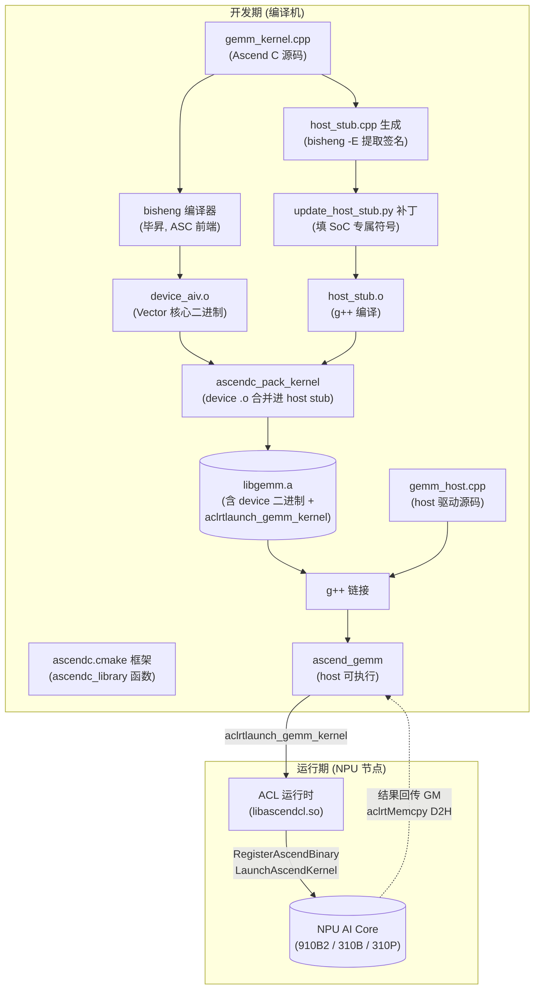
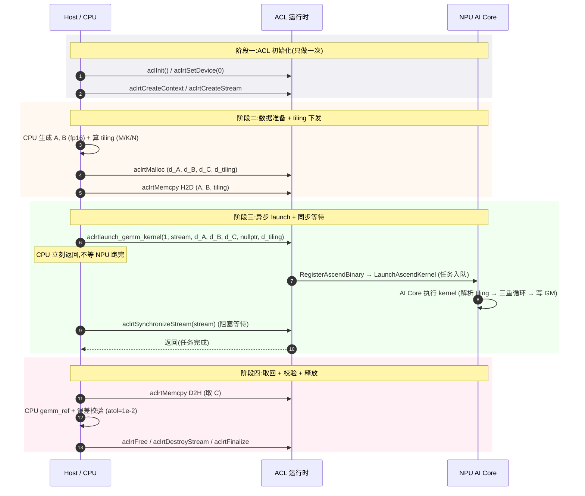
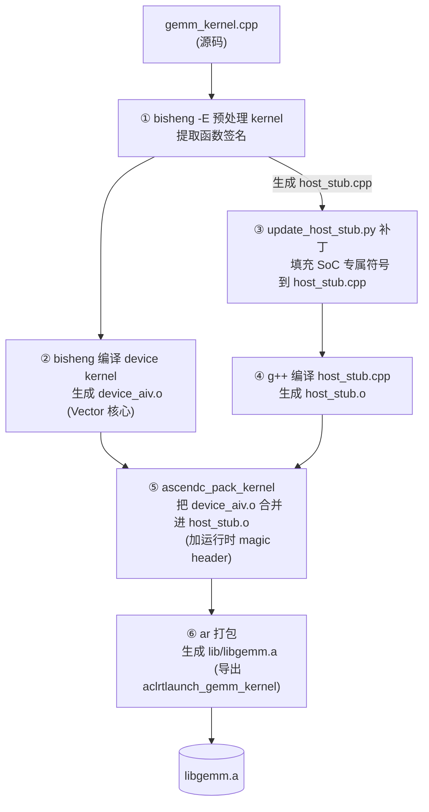
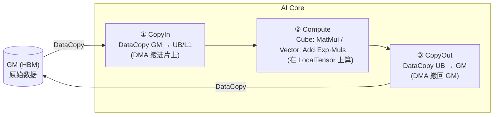
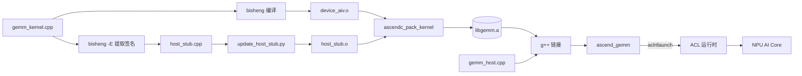
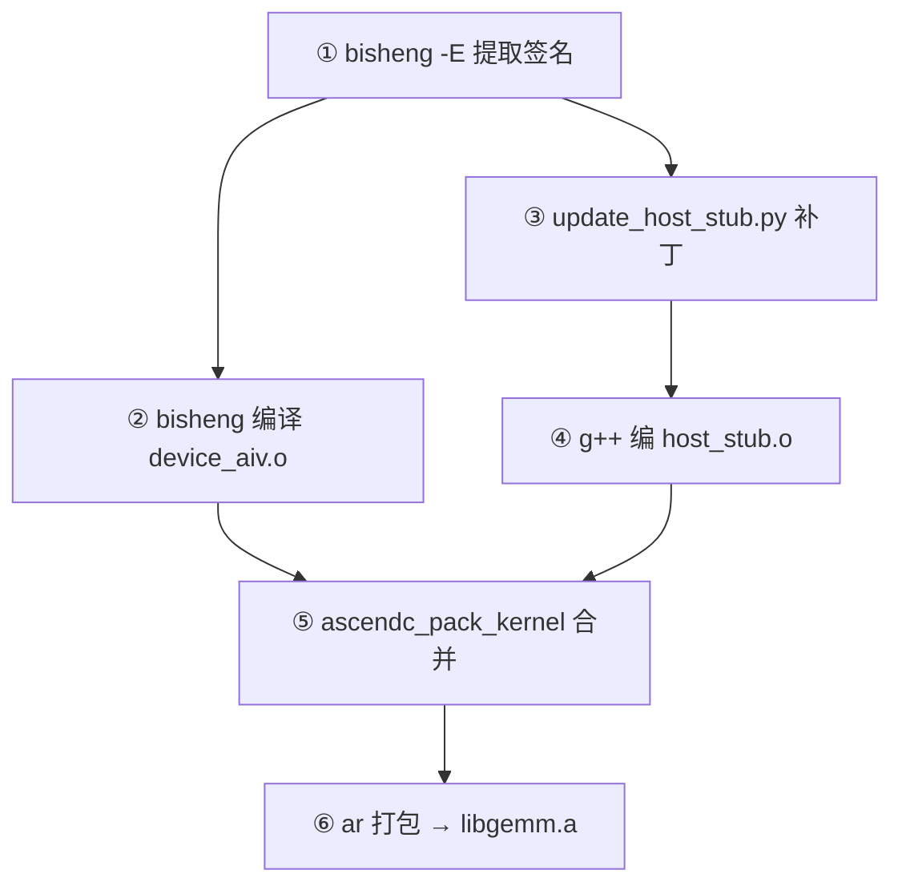
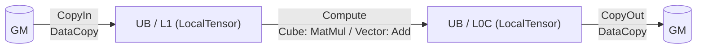

# 04 · Ascend C —— CANN 原生 C++ kernel DSL 核心手册

> 面向 0 到 1 新手的「多 DSL GEMM」第四篇,也是四篇里最厚的一篇。今天我们回答
> 一个问题:**写 NPU kernel 最贴近硬件的那条路,长什么样?**
> **答案: Ascend C + bisheng 编译器 + ascendc.cmake 框架 + ACL 运行时,一套打完。**

---

## TL;DR(开头)

**Ascend C 是华为 CANN 提供的底层 kernel 编程 DSL**:用 C++ 写算子源码,经
`bisheng`(毕昇)编译器编成 AI Core 可执行的机器码,再用 ACL 运行时在 host 侧
驱动它执行。它**直接暴露硬件资源**(GM / L1 / L0A·B·C / UB / Cube / Vector /
多核),性能上限最高,开发门槛也最高,是"想榨干 NPU 算力"时唯一的官方答案。

| 维度 | 说明 |
|---|---|
| **DSL 定位** | CANN 原生 C++ kernel DSL,取代早期 TBE 写法 |
| **源文件** | `*.cpp`(用 C++17 语法 + Ascend C 扩展属性) |
| **编译器** | `bisheng`(毕昇),路径 `$ASCEND_HOME_PATH/bin/bisheng` |
| **构建框架** | `ascendc.cmake`(`ascendc_library()` 函数自动编+打包) |
| **运行时** | ACL(AscendCL),头文件 `acl/acl.h`,库 `libascendcl.so` |
| **入口签名** | `extern "C" __global__ __aicore__ void kernel(GM_ADDR...)` |
| **host 启动** | `aclrtlaunch_<kernel>(numBlocks, stream, args...)`(框架生成) |
| **精度策略** | fp16 输入 + fp32 累加器(混合精度),`atol=1e-2` 校验 |
| **本仓库示例** | `examples/ascend_c/`(朴素 GEMM,NPU 实测 PASS) |

> **人话**: Ascend C 之于昇腾,等于 CUDA C++ 之于 NVIDIA。直接写裸 C++,把
> 数据搬进片上、喂给 Cube、跑完搬回 GM——每一跳搬运都是你代码里显式写的,
> 性能上限最高,但也最"操心"。

---

## 一、Background(背景)

### 1.1 Ascend C 在 CANN 生态中的位置

CANN(Compute Architecture for Neural Networks)是昇腾的全套软件栈,从下到上
大致是这样的层级:

```
        ┌───────────────────────────────┐
        │  应用层 (PyTorch / MindSpore) │   ← 用户用框架
        ├───────────────────────────────┤
        │  ACL 运行时 (AscendCL)        │   ← host 侧调度: aclrtMalloc / launch
        ├───────────────────────────────┤
        │  Ascend C kernel DSL          │   ← 本篇主角
        │  (bisheng 编译器 → 二进制)    │
        ├───────────────────────────────┤
        │  AI Core 硬件 (Cube/Vec/DMA)  │   ← 真正算的物理层
        └───────────────────────────────┘
```

历史上,昇腾的 kernel 编程模型经历过几代演化:

- **TBE(Tensor Boost Engine)**:早期基于 Python + Schedule 的写法,门槛高、
  调试难,且与硬件耦合不够直接。
- **Ascend C**:CANN 较新版本提供的**统一 C++ kernel 编程模型**,直接用 C++
  语法 + 几个扩展属性(`__global__` / `__aicore__` / `__gm__`)写算子,经 bisheng
  编译成 device 二进制。**取代 TBE,是当前的官方推荐写法。**

> **人话**: Ascend C 就是"用 C++ 直接写 NPU kernel"的官方答案。早期 TBE 写
> 法已经被它取代,新写的算子都用 Ascend C。

### 1.2 与 CUDA C++ 的类比关系

如果你写过 CUDA,Ascend C 的心智模型几乎可以"一一对照"地搬过来:

| 概念 | CUDA C++ | Ascend C |
|---|---|---|
| kernel 入口 | `__global__ void kernel(...)` | `extern "C" __global__ __aicore__ void kernel(...)` |
| 全局内存指针 | `float* d_A`(device 指针) | `GM_ADDR a` / `__gm__ T*` |
| device 张量视图 | (裸指针 + 索引算) | `GlobalTensor<T>`(基址 + 长度) |
| 片上共享内存 | `__shared__ T smem[...]` | `LocalTensor<T>` + `TQue<TPosition::VECIN/VECOUT/VECCALC>`(UB 对应的 TPosition) |
| 矩阵乘硬件单元 | Tensor Core + `wmma::mma_sync` | Cube 单元 + `MatMul()` 接口 |
| 向量运算单元 | CUDA Core(逐元素) | Vector 单元 + `Add` / `Exp` / `Muls` |
| 多核并行 | `blockIdx.x` / `blockIdx.y` | `GetBlockNum()` / `GetBlockIdx()` |
| 启动 stub | `kernel<<<grid,block>>>(...)` (nvcc 生成) | `aclrtlaunch_kernel(numBlocks, stream, ...)` (框架生成) |
| 编译器 | `nvcc` | `bisheng` |
| 运行时 | `cudart`(cudaMalloc/cudaMemcpy) | ACL(aclrtMalloc/aclrtMemcpy) |
| host 驱动 | `cudaSetDevice / cudaStreamSynchronize` | `aclrtSetDevice / aclrtSynchronizeStream` |

> **人话**: 几乎可以拿你写 CUDA 的肌肉记忆来写 Ascend C——`__global__` 一加,
> `<<<grid,block>>>` 换成 `aclrtlaunch_<kernel>(numBlocks, stream, ...)`,剩下的
> 是"昇腾硬件特有"的活:片上缓冲层级更深、Cube vs Vector 的域边界更严。

### 1.3 bisheng 编译器、ACL 运行时、ascendc.cmake 框架三者关系

这三个名字反复出现在 Ascend C 文档里,新手最容易搞混。它们的分工是这样的:

- **bisheng(毕昇)编译器**:ASC 编译器前端,把 C++ kernel 源码(带 `__aicore__`
  等扩展属性)编成 AI Core 可执行的 device `.o`。路径
  `$ASCEND_HOME_PATH/bin/bisheng`(source `set_env.sh` 后在 PATH 中)。
  类比 CUDA 的 `nvcc`。
- **ACL(Ascend Computing Language / AscendCL)运行时**:host 侧的运行时库,
  提供 `aclInit` / `aclrtSetDevice` / `aclrtMalloc` / `aclrtMemcpy` /
  `aclrtSynchronizeStream` 等接口。头文件 `acl/acl.h`,库 `libascendcl.so`。
  类比 CUDA 的 `cudart`。
- **ascendc.cmake 框架**:CANN 官方的 Ascend-C 构建系统,路径
  `$ASCEND_HOME_PATH/aarch64-linux/tikcpp/ascendc_kernel_cmake/ascendc.cmake`。
  提供 `ascendc_library()` CMake 函数,**自动完成"bisheng 编译 → host stub
  生成 → 打包"全流程**,生成一个同时含 device 二进制和 host launch stub 的
  静态库 `lib<name>.a`。

三者的协作关系长这样:

```
   gemm_kernel.cpp
        │
        │ ① bisheng 编译 (device 侧)
        ▼
   device_aiv.o  ──────────────────┐
        │                          │
        │ ② ascendc.cmake 框架:    │
        │    - bisheng -E 提取签名  │
        │    - 生成 host_stub.cpp   │
        │    - update_host_stub.py │
        │    - g++ 编 host_stub.o  │
        │    - ascendc_pack_kernel │
        │      (把 device .o 合并  │
        │       进 host_stub.o)    │
        │    - ar 打包              │
        ▼                          ▼
   libgemm.a (含 device 二进制 + aclrtlaunch_gemm_kernel)
        │
        │ ③ g++ 链接 host
        ▼
   ascend_gemm (host 可执行)
        │
        │ ④ ACL 运行时
        ▼
   NPU AI Core 执行
```

> **人话**: bisheng 干"编 device kernel"的活,ACL 干"host 调度运行"的活,
> ascendc.cmake 是把两者缝合在一起的"打包框架"——少一个都不行。

---

## 二、Why(为什么需要 Ascend C)

### 2.1 为什么需要 Ascend C

四种 DSL(python / ascend_c / triton_ascend / tilelang_ascend)各自有不同的
抽象层级。为什么还需要 Ascend C 这个"最底层"的写法?三个核心原因:

1. **性能上限最高**:Ascend C 直接暴露硬件资源(GM / L1 / L0A·B·C / UB / Cube /
   Vector / 多核),kernel 开发者可以**精确控制每一跳搬运、每一次 Cube 调用、
   每一块 UB 复用**。这种"裸金属"控制力是上层 DSL 永远给不了的。
2. **直接暴露硬件资源**:Triton / TileLang 这类 DSL 把"片上缓冲管理、搬运
   时序"交给编译器自动决策。绝大多数场景编译器做得很好,但**遇到编译器决策
   不优的边界场景**(奇怪的分块形状、跨引擎流水、特殊精度的累加路径),
   只有 Ascend C 能强行写对。
3. **自定义算子的"最终兜底"**:框架自带的 PyTorch / MindSpore 算子库覆盖
   不到的场景(自定义激活、稀疏结构、特殊归一化),上层 DSL 表达不出来的
   算子,最后都落到 Ascend C 手写。

### 2.2 什么场景适合用 Ascend C

| 场景 | 适合用 Ascend C? | 理由 |
|---|---|---|
| 极致优化的生产 GEMM / Conv | ✅ 强烈推荐 | 性能上限最高,每一跳搬运都可控 |
| 自定义激活 / 稀疏算子 | ✅ 推荐 | 上层 DSL 表达不到,Ascend C 兜底 |
| 调试 / 学习硬件模型 | ✅ 推荐 | 直接暴露硬件,是理解 NPU 的最佳教材 |
| 快速原型验证 idea | ❌ 不推荐 | 写起来繁琐,用 python / triton 更快 |
| 框架自带算子的常规使用 | ❌ 不推荐 | 直接调 API 即可,不必自写 kernel |
| 数值稳定性要求极高的研究算子 | ⚠️ 看情况 | 性能上限高,但开发门槛也高 |

### 2.3 抽象梯子:四种 DSL 的层级对比

本项目的四种 DSL 在"抽象层级"上构成一条梯子,从下到上抽象越高、控制力越弱:

```
                  ▲
                  │   抽象越高 / 控制力越弱 / 开发越快
                  │
   ┌──────────────┼───────────────────────────────────────────┐
   │              │                                           │
   │  python      │  最上层: Python + tiling + Kernel API    │  ← 起点:学算法
   │              │     (框架自带,零硬件知识)                  │
   │              ├───────────────────────────────────────────┤
   │              │                                           │
   │  triton_     │  块级: 块语法 + 编译器自动决定缓冲          │  ← 性能好,门槛中
   │  ascend      │     (Triton DSL,自动分块/调度)            │
   │              ├───────────────────────────────────────────┤
   │              │                                           │
   │  tilelang_   │  调度级: 显式指定 L1/L0C + 搬运 + 流水     │  ← 性能高,门槛中高
   │  ascend      │     (TileLang DSL,调度可写)                │
   │              ├───────────────────────────────────────────┤
   │              │                                           │
   │  ascend_c    │  字节级: 逐元素 GM 读写 + 显式搬运 + Cube  │  ← 性能上限最高,门槛最高
   │  (本篇)      │     (C++ kernel DSL,裸金属)                │
   │              │                                           │
   └──────────────┴───────────────────────────────────────────┘
                  │
                  ▼   抽象越低 / 控制力越强 / 开发越繁琐
```

> **人话**: 想最快写出一个能跑的算子 → 用 python/triton;想榨干硬件最后一滴
> 算力,或者上层 DSL 表达不出来 → 上 ascend_c。**Ascend C 是兜底层,不是首选层。**

> **本仓库的"教学策略"**:同一个 GEMM 算法,我们用四种 DSL 各实现一遍,让你
> 直观看到"同一个问题、四种抽象层级、四种代码量、四种性能上限"的差异。
> 本篇的 `examples/ascend_c/` 是朴素版本(只用 GM + Scalar 循环),性能极差但
> 正确——是理解"为什么要优化"的起点,后续优化方向都在注释里标注。

---

## 三、正文(核心)

### 3.1 工具链全景

下面这张图把 Ascend C 从源码到运行的完整流程一次性画清楚:



要点提炼:

- **开发期一次**:bisheng 编 device kernel → ascendc.cmake 框架生成 host stub +
  打包 → g++ 链接 host → 得到 `ascend_gemm` 可执行文件。
- **运行期每次**:host 调 `aclrtlaunch_gemm_kernel()` 把任务**异步投递**到 NPU
  队列 → 同步等待 → D2H 拷回结果。
- **关键**:host 端调用的 `aclrtlaunch_gemm_kernel` 函数**不是手写的**,而是
  ascendc.cmake 框架在编译期从 kernel 入口签名自动生成的 launch stub。

### 3.2 第一个 kernel:GEMM(逐段讲解)

下面以 `examples/ascend_c/op_kernel/gemm_kernel.cpp` 为例,逐段拆解。这个
kernel 是**朴素教学版**:直接逐元素从 GM 读写,**不分块、不调用 Cube、不用
片上 UB/L1**——正确但极慢,是理解"为什么要优化"的起点。

#### 3.2.1 入口签名(`extern "C" __global__ __aicore__`)

```cpp
extern "C" __global__ __aicore__
void gemm_kernel(GM_ADDR a, GM_ADDR b, GM_ADDR c,
                 GM_ADDR workspace, GM_ADDR tiling)
```

逐个属性拆开看:

- **`extern "C"`**:C 链接,保证函数名不被 C++ name mangling 改掉,这样
  ascendc.cmake 框架在生成 host launch stub 时能按名字解析到符号。
- **`__global__`**:类比 CUDA 的 `__global__`——表示这个函数运行在 device 上,
  可被 host 调用启动。
- **`__aicore__`**:昇腾专属属性,表示这个 kernel 跑在 **AI Core** 上(而非
  AI CPU)。所有计算密集型 kernel 都加这个属性。
- **`GM_ADDR`**:`Global Memory Address` 类型,即全局内存(HBM)指针的别名。
  kernel 的 5 个参数全是 GM 指针——`a/b/c` 是输入输出矩阵,`workspace` 是
  运行时工作区(本朴素版不用),`tiling` 是 host 下发的标量参数(装 M/K/N)。

> **人话**: `extern "C" __global__ __aicore__` 是"我是个跑在 AI Core 上的
> kernel 入口"的官方签名;5 个参数全是 GM 指针,前 3 个是数据,后 2 个是
> workspace 和 tiling——这是 CANN 约定的统一形式,所有 Ascend C kernel
> 都长这样。

#### 3.2.2 tiling 参数解析(`__gm__` 修饰符的必要性)

```cpp
__gm__ uint32_t* t = reinterpret_cast<__gm__ uint32_t*>(tiling);
uint32_t M = t[0];
uint32_t K = t[1];
uint32_t N = t[2];
```

`tiling` 入参类型是 `__gm__ uint8_t*`,host 端把 M/K/N 三个 `uint32` 写进
这段 device 可见 GM。kernel 这里把它 cast 成 `__gm__ uint32_t*` 再读取。

**为什么必须保留 `__gm__` 修饰符?**——这是新手最常踩的坑:

- 昇腾的地址空间是**显式分域**的:GM 是一个地址空间,核内私有存储是另一个
  地址空间,两者不能自由 cast。
- 如果写成 `uint32_t* t = reinterpret_cast<uint32_t*>(tiling);`(去掉
  `__gm__`),bisheng 会直接拒绝:`reinterpret_cast from '__gm__ uint8_t *'
  to 'uint32_t *' is not allowed`。
- 正确写法是 cast 到**同样是 `__gm__` 修饰**的指针类型,即
  `__gm__ uint32_t*`,这样地址空间一致,合法。

> **人话**: GM 指针必须戴着 `__gm__` 帽子才能用;想把 `uint8_t*` 当 `uint32_t*`
> 读,cast 时也要保留 `__gm__`,否则 bisheng 直接拒编。这是昇腾地址空间
> 显式分域的强制要求。

#### 3.2.3 GlobalTensor 视图(SetGlobalBuffer)

```cpp
GlobalTensor<half> A_global;
GlobalTensor<half> B_global;
GlobalTensor<half> C_global;

A_global.SetGlobalBuffer((__gm__ half*)a, M * K);
B_global.SetGlobalBuffer((__gm__ half*)b, K * N);
C_global.SetGlobalBuffer((__gm__ half*)c, M * N);
```

`GlobalTensor<T>` 是 GM(HBM)上的逻辑视图:**只记录基址 + 长度,不搬数据**。
`SetGlobalBuffer` 把一个裸的 `__gm__ T*` 指针 + 元素个数包装成可索引的张量。
之后可以用 `A_global.GetValue(idx)` / `A_global.SetValue(idx, val)` 像数组一样
访问。

注意:

- `GlobalTensor` **不分配内存**,它只是个"带长度的指针包装"。
- `GetValue` / `SetValue` 是**逐元素**从 GM 读写——每次访问都过 HBM 带宽,
  没有任何复用。这是朴素版慢的根本原因。
- 真正高性能的写法是用 `LocalTensor<T>`(片上 UB 视图)+ `DataCopy` 一次性
  搬一大块进片上,反复复用——本朴素版没用,所以慢。

#### 3.2.4 朴素三重循环(fp32 累加器)

```cpp
for (uint32_t m = 0; m < M; ++m) {
    for (uint32_t n = 0; n < N; ++n) {
        float acc = 0.0f;  // fp32 累加器, 避免 fp16 累加溢出
        for (uint32_t k = 0; k < K; ++k) {
            acc += float(A_global.GetValue(m * K + k))
                 * float(B_global.GetValue(k * N + n));
        }
        C_global.SetValue(m * N + n, half(acc));
    }
}
```

逐行解读:

- `float acc = 0.0f`:**用 fp32 累加器**——这是混合精度的核心。fp16 输入
  乘完提升到 fp32 累加,避免 K 较大时累加误差。详见 3.6 节。
- `float(A_global.GetValue(...)) * float(B_global.GetValue(...))`:
  fp16 提升到 fp32 再乘(C++ 里 fp16 乘法本身会提升,这里显式写更清晰)。
- `C_global.SetValue(m * N + n, half(acc))`:fp32 累加结果**截断到 fp16**
  写回 GM(输出精度还是 fp16)。

**注释里标注的优化方向**(后续版本):

- **Tiling**:把 A/B 的子块从 GM 搬到片上 UB / L1,复用 K 维数据,减少
  GM 访问次数。
- **调用 Cube 单元**:用 `LocalTensor<T>` + `MatMul` 接口做 16×16 矩阵乘,
  替代标量乘加,充分利用 Cube 算力。
- **多核并行**:用 `GetBlockNum()` / `GetBlockIdx()` 把 M 维切给多个 AI Core。
- **双缓冲 / 流水线**:数据搬运与计算重叠,掩盖访存延迟。

> **人话**: 这版朴素 GEMM 用 fp16 输入 + fp32 累加是正确的精度策略,但用
> Scalar 单元逐元素乘加是性能灾难——每读一个 A 元素、一个 B 元素都过一遍
> HBM 带宽。性能优化要做的事就一句话:**把数据搬进片上,反复复用,别老回 GM 取**。

### 3.3 host 驱动程序(逐段讲解)

`examples/ascend_c/src/gemm_host.cpp` 是 host 侧驱动。它干 7 件事,正好
对应一个完整的 kernel 生命周期。

#### 3.3.1 ACL 运行时初始化

```cpp
CHECK_ACL(aclInit(nullptr), "aclInit");
CHECK_ACL(aclrtSetDevice(0), "aclrtSetDevice");
aclrtContext ctx;
CHECK_ACL(aclrtCreateContext(&ctx, 0), "aclrtCreateContext");
aclrtStream stream;
CHECK_ACL(aclrtCreateStream(&stream), "aclrtCreateStream");
```

四个调用,一个不能少:

| 调用 | 作用 | 类比 CUDA |
|---|---|---|
| `aclInit(nullptr)` | 初始化 ACL 全局运行时(只能调一次) | `cudaInit` 隐式 |
| `aclrtSetDevice(0)` | 选 0 号 NPU 设备 | `cudaSetDevice(0)` |
| `aclrtCreateContext(&ctx, 0)` | 创建 device 上下文(资源隔离) | `cuCtxCreate` |
| `aclrtCreateStream(&stream)` | 创建异步任务队列 | `cudaStreamCreate` |

`CHECK_ACL` 是个简易错误检查宏:ACL 接口返回非 0 即报错并退出——所有 ACL
调用都该套这个壳,否则失败时排错极难。

#### 3.3.2 矩阵规模与 host 数据

```cpp
const int M = 128, K = 128, N = 128;
std::vector<half_t> h_A(M * K), h_B(K * N), h_C(M * N);

srand(0);
auto randf = []() { return rand() / float(RAND_MAX) * 2.0f - 1.0f; };
for (auto &x : h_A) x = half_t(randf());
for (auto &x : h_B) x = half_t(randf());
```

- `half_t = __fp16`:aarch64 GCC 原生支持 `__fp16` 类型,与 kernel 端 `half`
  一一对应(x86_64 没有原生 fp16,所以 host 代码必须在 aarch64 上编)。
- 矩阵规模 128×128×128:小到能跑通校验,大到能体现"K 维累加"的精度差异。
- `srand(0)` 固定种子:保证可复现,A/B/C 数据每次都一样,便于排查。
- `randf()` 生成 `[-1, 1]` 区间随机数:在 fp16 表示范围内,不会溢出。

#### 3.3.3 device 内存分配 + H2D 拷贝

```cpp
void *d_A = nullptr, *d_B = nullptr, *d_C = nullptr;
CHECK_ACL(aclrtMalloc(&d_A, M * K * sizeof(half_t), ACL_MEM_MALLOC_NORMAL_ONLY),
          "aclrtMalloc A");
// ... 同理分配 d_B / d_C ...

CHECK_ACL(aclrtMemcpy(d_A, M * K * sizeof(half_t), h_A.data(),
                      M * K * sizeof(half_t), ACL_MEMCPY_HOST_TO_DEVICE),
          "H2D A");
// ... 同理拷 B ...
```

- `aclrtMalloc`:在 device GM 分配内存,类比 `cudaMalloc`。第三个参数
  `ACL_MEM_MALLOC_NORMAL_ONLY` 表示只走普通 HBM 分配(不要 huge page)。
- `aclrtMemcpy`:内存拷贝,方向由最后一个参数决定:
  - `ACL_MEMCPY_HOST_TO_DEVICE`(H2D):host → device
  - `ACL_MEMCPY_DEVICE_TO_HOST`(D2H):device → host
  - 类比 `cudaMemcpy` 的 `cudaMemcpyHostToDevice` / `cudaMemcpyDeviceToHost`。
- 注意 `d_A` 是 `void*`——ACL 用 `void*` 抽象 device 指针,不用具体类型。

#### 3.3.4 tiling 下发

```cpp
uint32_t tiling[3] = {uint32_t(M), uint32_t(K), uint32_t(N)};
void *d_tiling = nullptr;
CHECK_ACL(aclrtMalloc(&d_tiling, sizeof(tiling), ACL_MEM_MALLOC_NORMAL_ONLY),
          "aclrtMalloc tiling");
CHECK_ACL(aclrtMemcpy(d_tiling, sizeof(tiling), tiling, sizeof(tiling),
                      ACL_MEMCPY_HOST_TO_DEVICE), "H2D tiling");
```

- tiling 是 host 在 CPU 上算好的"分块参数集合"(本朴素版只有 M/K/N 三个
  uint32,真实生产 kernel 还会有分块尺寸、核数、循环次数等)。
- **关键**:tiling 写到 device 可见 GM,kernel 启动后通过第 5 个参数读取。
- 这是 host / device 分工的体现:**host 算 tiling,device 用 tiling**。
  这样做的好处是 tiling 决策与 kernel 实现解耦,改 tiling 不必重编 kernel。

> **人话**: tiling 是 host 提前算好的"运行参数清单",写进 GM,kernel 启动后
> 读取。host 算 / device 用,这是昇腾 host-device 分工的核心模式。

#### 3.3.5 kernel 启动

```cpp
uint32_t ret = aclrtlaunch_gemm_kernel(
    /*numBlocks=*/1, stream,
    d_A, d_B, d_C,
    /*workspace=*/nullptr, d_tiling);
if (ret != 0) {
    std::cerr << "[FAIL] aclrtlaunch_gemm_kernel ret=" << ret << std::endl;
    std::exit(1);
}
CHECK_ACL(aclrtSynchronizeStream(stream), "aclrtSynchronizeStream");
```

`aclrtlaunch_gemm_kernel` 是**框架生成的 host launch stub**——签名由 kernel
入口自动推导:

| 参数 | 含义 |
|---|---|
| `numBlocks=1` | AI Core 并行核数(本朴素版只用 1 核) |
| `stream` | ACL 异步任务队列 |
| `d_A, d_B, d_C` | device GM 指针(对应 kernel 的 `a/b/c`) |
| `workspace=nullptr` | 运行时工作区(本朴素版不用) |
| `d_tiling` | tiling buffer(对应 kernel 的 `tiling`) |

stub 内部自动完成(对 host 透明):

- `RegisterAscendBinary`:把 device 二进制注册到 NPU runtime
- `AllocAscendMemDevice`:分配 overflow 状态内存
- `LaunchAscendKernel`:下发 kernel 到 AI Core

类比 CUDA 的 `kernel<<<grid, block>>>(...)`——也是由 `nvcc` 自动生成的
launch stub,开发者只调函数名。

**关键**:`aclrtlaunch_*` 是**异步提交**——CPU 把任务投递到 NPU 队列后立刻
返回,**不等 NPU 跑完**。所以下一步必须显式 `aclrtSynchronizeStream` 同步等待,
否则 D2H 时可能拿到 NPU 还没写回的旧数据。

#### 3.3.6 D2H 取回 + CPU 参考校验

```cpp
CHECK_ACL(aclrtMemcpy(h_C.data(), M * N * sizeof(half_t), d_C,
                      M * N * sizeof(half_t), ACL_MEMCPY_DEVICE_TO_HOST),
          "D2H C");

std::vector<half_t> h_Cref(M * N);
gemm_cpu_ref(h_A.data(), h_B.data(), h_Cref.data(), M, K, N);

float max_err = 0.0f;
for (int i = 0; i < M * N; ++i) {
    float diff = std::fabs(float(h_C[i]) - float(h_Cref[i]));
    if (diff > max_err) max_err = diff;
}
bool pass = (max_err < 1e-2f);
```

- `aclrtMemcpy` D2H 把 device 的 C 取回 host。
- `gemm_cpu_ref` 是 CPU 参考实现:**与 kernel 同精度策略**(fp16 输入 + fp32
  累加 + fp16 输出),保证两边算法同源,误差应极小。
- 容差 `atol=1e-2`:fp16 的合理容差。本朴素版 max_abs_error 实测为 0。

#### 3.3.7 资源释放

```cpp
CHECK_ACL(aclrtFree(d_A), "aclrtFree A");
// ... d_B / d_C / d_tiling ...
CHECK_ACL(aclrtDestroyStream(stream), "aclrtDestroyStream");
CHECK_ACL(aclrtDestroyContext(ctx), "aclrtDestroyContext");
CHECK_ACL(aclrtResetDevice(0), "aclrtResetDevice");
CHECK_ACL(aclFinalize(), "aclFinalize");
```

**释放顺序与创建相反**:先释放 device 内存 → 销毁 stream / context →
reset device → finalize 全局运行时。这是 ACL 的强制约定,顺序错会泄漏或报错。

#### 3.3.8 host/device 时序图

下面这张 sequence 图把 host 与 device 的协作时序画清楚:



### 3.4 构建系统:ascendc.cmake 框架的 6 步流程

`ascendc.cmake` 框架是 Ascend C 工程化的核心——它把"bisheng 编 device
kernel"和"g++ 编 host 驱动"这两件本不相干的事缝合成一个静态库。

#### 3.4.1 为什么需要框架

直接用 bisheng 编出的 raw `.o` 缺运行时 magic header,host 直接调用
`aclrtBinaryLoadFromFile` 加载会报 `107000 ACL_ERROR_RT_PARAM_INVALID`。
官方 `ascendc.cmake` 框架自动完成整套打包流程(核心是 `ascendc_pack_kernel` 打包工具;
旧版本工具链里也见过 `merge_device_obj.py` 这类名字,作用相同——把 device 二进制合并进
host launch stub),生成可被 ACL 运行时加载的合法二进制。

#### 3.4.2 6 步流程(Mermaid)



6 步详解:

| 步骤 | 工具 / 脚本 | 输入 → 输出 | 说明 |
|---|---|---|---|
| ① 预理 | `bisheng -E` | `gemm_kernel.cpp` → 函数签名 | 提取 kernel 入口签名,生成 `host_stub.cpp` 框架 |
| ② 编 device | `bisheng` | `gemm_kernel.cpp` → `device_aiv.o` | 编出 Vector 核心二进制 |
| ③ 补 stub | `update_host_stub.py` | `host_stub.cpp` → `host_stub.cpp` | 填充 SoC 专属符号(910B2 / 310B / 310P 不同) |
| ④ 编 stub | `g++` | `host_stub.cpp` → `host_stub.o` | 编译 host launch stub |
| ⑤ 打包 | `ascendc_pack_kernel` | `device_aiv.o + host_stub.o` → 合并 | 加运行时 magic header,让 ACL 能加载 |
| ⑥ 归档 | `ar` | `host_stub.o` → `libgemm.a` | 静态库,导出 `aclrtlaunch_gemm_kernel` |

#### 3.4.3 SoC → BUILD_MODE → aicore-arch 映射

CANN `host_config.cmake` 里的 SoC 映射规则:

| SoC | BUILD_MODE | aicore-arch |
|---|---|---|
| `ascend910b*`(910B 家族) | `c220` | `dav-c220-cube` |
| `ascend310b*` | `m300` | (相应) |
| `ascend310p*` | `m200` | (相应) |

> **人话**: 910B2 是旗舰训练卡(`c220`/`dav-c220-cube`),310B / 310P 是
> 推理卡。旧的 `--cce-soc-version` / `--cce-soc-core-type` 命令行参数
> 在 CANN 9.0.0 已废弃,现在走 `host_config.cmake` 的 SoC 列表映射。

#### 3.4.4 CMakeLists.txt 的核心写法

```cmake
set(ASCEND_HOME $ENV{ASCEND_HOME_PATH})
include(${ASCEND_HOME}/aarch64-linux/tikcpp/ascendc_kernel_cmake/ascendc.cmake)

ascendc_library(gemm STATIC ${CMAKE_CURRENT_SOURCE_DIR}/op_kernel/gemm_kernel.cpp)

add_executable(ascend_gemm src/gemm_host.cpp)
target_compile_options(ascend_gemm PRIVATE -fno-fast-math)
target_link_libraries(ascend_gemm PRIVATE gemm ascendcl runtime)
```

这段 CMake 做五件事:

1. 引入 `ascendc.cmake` 框架。
2. `ascendc_library(gemm STATIC ...)`:声明一个 kernel 库,框架自动跑
   上面那 6 步流程,产物是 `libgemm.a`。
3. `add_executable(ascend_gemm ...)`:声明 host 可执行,g++ 编。
4. `target_link_libraries(... PRIVATE gemm ascendcl runtime)`:链接
   kernel 库 + ACL 运行时库。
5. `-fno-fast-math`:**必须加**!fp16 → fp32 提升与累加的精度依赖编译器
   不开 fast-math,否则可能引入数值不稳定。

#### 3.4.5 从零构建 + 运行(可整段复制)

> 一键环境检查 + 试编译:`bash scripts/dsl/install_ascend_c.sh`(无需 NPU 设备,`verify` 仅验证)。

```bash
cd examples/ascend_c
cmake -S . -B build -DCMAKE_BUILD_TYPE=Release
cmake --build build -j
cd build && ./ascend_gemm        # GEMM: NPU 执行 + 与 CPU 参考比对, 预期打印 PASS
```

同目录下还有另外三组 target,一条 `cmake --build build -j` 全部编出:

```bash
./ascend_gelu                    # GELU (op_kernel/gelu_kernel.cpp)
./ascend_softmax                 # Softmax (op_kernel/softmax_kernel.cpp)
./ascend_gelu_scalar             # GELU 标量地板版 (性能对照)
```

> **仓库里的生产级 kernel**:op_kernel/ 下除了朴素 GEMM,还有成体系的 GELU 迭代版
> (gelu_v3~v6_kernel.cpp,含 tanh→exp 改写与标量地板对照)和 softmax 生产版——
> 它们的实测性能数据见 [GELU 篇 §8.8](/ops/05-gelu)。Ascend C "性能上限最高"不是论断,
> 把这些 kernel 编译跑起来、对照数据,就是这个论断的实证路径。

### 3.5 Ascend C 核心编程模型

#### 3.5.1 GlobalTensor vs LocalTensor(访问权域)

这两个张量视图是 Ascend C 的"内存抽象"。下面这张 ASCII 心法图把它们的访问
权域画清楚:

```
        ┌─ AI Core ─────────────────────────────────────────────┐
        │                                                       │
        │   ┌───────────────┐  ┌─────────────────────────────┐  │
        │   │  Cube 域      │  │  Vector 域                  │  │
        │   │               │  │                             │  │
        │   │  LocalTensor  │  │  LocalTensor                 │  │
        │   │  (L0A/L0B/    │  │  (UB)  ← Vector/Scalar 碰这   │  │
        │   │   L0C 视图)   │  │                             │  │
        │   │  ↑ Cube 碰这  │  │  ┌──────────────────────┐   │  │
        │   └───────┬───────┘  │  │  DataCopy (DMA)      │   │  │
        │           │          │  │  从 GM 搬进 UB       │   │  │
        │           │          │  └──────────┬───────────┘   │  │
        │           │          └─────────────┼───────────────┘  │
        │           │                        │                  │
        │           ▼                        ▼                  │
        │   ┌──────────────────────────────────────────┐        │
        │   │  L1 统一缓存 (核内共享, Cube/Vector 共用) │        │
        │   └──────────────────┬───────────────────────┘        │
        │                      │                                │
        └──────────────────────┼────────────────────────────────┘
                               │
                               │  DMA (跨存储层)
                               │
        ┌──────────────────────▼────────────────────────────────┐
        │                                                       │
        │   GM (HBM) ← GlobalTensor 视图 (基址 + 长度, 不搬数据) │
        │                                                       │
        │   A / B / C 原始数据都躺在 GM,host 通过 aclrtMalloc   │
        │   分配,aclrtMemcpy 拷入;kernel 通过 GlobalTensor 读  │
        │                                                       │
        └───────────────────────────────────────────────────────┘
```

对比表:

| 张量视图 | 所在存储 | 谁能访问 | 用法 |
|---|---|---|---|
| `GlobalTensor<T>` | GM(HBM) | 任何引擎(但慢) | `SetGlobalBuffer(__gm__ T*, len)` + `GetValue/SetValue` |
| `LocalTensor<T>` (UB) | UB | **Vector / Scalar** | `TQue<...>::AllocTensor()` + Vector 指令 |
| `LocalTensor<T>` (L0A/B/C) | L0A/B/C | **Cube** | `TQue<...>::AllocTensor()` + `MatMul` 接口 |

> **人话**: `GlobalTensor` 是"远程仓库视图",谁都能访问但慢;`LocalTensor`
> 是"工位货架视图",**只有对应引擎能碰**——Cube 碰 L0A/B/C,Vector 碰 UB。
> 想跨域加工,必须用 `DataCopy` 显式搬。

#### 3.5.2 DataCopy(DMA 搬运的三步走模板)

高性能 Ascend C kernel 几乎都遵循"三步走"模板:**CopyIn → Compute → CopyOut**。



要点:

- **CopyIn**:`DataCopy(local_tensor, global_tensor)` 把 GM 数据搬进片上 UB
  或 L1。**一次搬一大块,反复复用**,避免逐元素从 GM 读。
- **Compute**:在 `LocalTensor` 上调 Vector / Cube 指令算。
- **CopyOut**:`DataCopy(global_tensor, local_tensor)` 把结果搬回 GM。
- **三步之间可以流水线**:CopyIn 第 N+1 块的同时,Compute 第 N 块、
  CopyOut 第 N-1 块——这就是"双缓冲 / 流水线"的优化思路。

> **人话**: 不要逐元素从 GM 读写(朴素版那种写法性能极差),要"一大块一大块
> 地搬进片上、算完一大块再搬回 GM"。**CopyIn → Compute → CopyOut** 是 Ascend C
> 性能优化的万能模板。

#### 3.5.3 Cube 指令(MatMul)vs Vector 指令(Add/Exp/Muls)

Ascend C 的"算力指令"分两套,对应两个硬件引擎:

| 指令类别 | 引擎 | 输入 | 输出 | 典型接口 |
|---|---|---|---|---|
| **Cube 指令** | Cube 单元 | `LocalTensor<T>`(L0A + L0B) | `LocalTensor<T>`(L0C) | `MatMul(L0C, L0A, L0B, ...)` |
| **Vector 指令** | Vector 单元 | `LocalTensor<T>`(UB) | `LocalTensor<T>`(UB) | `Add` / `Exp` / `Muls` / `Adds` |

- **Cube 指令(MatMul)**:一次算一个 16×16×16 的矩阵乘,256 个输出元素
  累加到 L0C。fp16 输入 + fp32 累加(硬件固有语义,无需手写)。
- **Vector 指令(Add / Exp / Muls)**:在 UB 上做逐元素运算,一次处理一批
  元素。例如 `Muls(dst, src, 0.5f)` 把 src 的每个元素乘 0.5 写到 dst。
- **跨域加工**:Cube 算完在 L0C 的结果,要先 `DataCopy` 搬到 UB,
  Vector 才能加工(比如接个 ReLU / GeLU)。**这是访问权域的强制要求**。

#### 3.5.4 多核并行(GetBlockNum / GetBlockIdx)

一个 NPU 有几十个 AI Core,可以并行跑同一个 kernel。Ascend C 用两个内建
函数暴露多核信息:

```cpp
extern "C" __global__ __aicore__
void gemm_kernel(GM_ADDR a, GM_ADDR b, GM_ADDR c,
                 GM_ADDR workspace, GM_ADDR tiling) {
    uint32_t block_num = GetBlockNum();    // 总核数
    uint32_t block_idx = GetBlockIdx();    // 当前核编号 (0..block_num-1)

    // 多核切分示例:把 M 维按行切给各核
    uint32_t M_per_block = (M + block_num - 1) / block_num;
    uint32_t m_start = block_idx * M_per_block;
    uint32_t m_end = min(m_start + M_per_block, M);

    for (uint32_t m = m_start; m < m_end; ++m) {
        // ... 各核算自己负责的行 ...
    }
}
```

- `GetBlockNum()`:总核数,host 在 `aclrtlaunch_*(numBlocks, ...)` 时下发。
- `GetBlockIdx()`:当前核编号,从 0 开始。
- **GEMM 天然无核间依赖**(每个 C[i,j] 只依赖 A 一行 + B 一列),所以可以
  简单按行切给多核,各算各的——无需跨核通信。

> **本朴素版**:`aclrtlaunch_gemm_kernel(1, stream, ...)` 的 `numBlocks=1`,
> 即只用了 1 个核。这是性能极差的另一个原因——后续优化方向之一就是改成多核并行。

#### 3.5.5 tiling 的 host/device 分工

tiling 不是只在 device 算,而是 **host 算大半、device 用现成**:

| 阶段 | 谁算 | 算什么 |
|---|---|---|
| host(运行前) | CPU | 矩阵规模 M/K/N、按 UB 容量算分块尺寸、按核数算切分方案、循环次数 |
| device(kernel 启动后) | AI Core Scalar 单元 | 读 tiling、按 block_idx 切自己的份额、循环跑 |

为什么这样分?

- **host 算**:CPU 擅长复杂控制流,且 host 能直接访问用户输入(M/K/N),
  调试方便。
- **device 用**:NPU 不擅长分支判断,把"算 tiling"放在 device 上既浪费 AI Core
  算力又容易写错。

本朴素版的 tiling 极简,只装 M/K/N 三个 uint32;真实生产 kernel 的 tiling
结构体可能包含分块尺寸、核数、循环次数、流水线深度等十几个字段。

### 3.6 精度策略:fp16 输入 + fp32 累加器(混合精度)

本项目的精度策略是**fp16 输入 + fp32 累加器**(业界称"混合精度"的标准做法)。

#### 3.6.1 为什么用 fp16 输入

- **Cube 单元原生精度**:昇腾 Cube 的 MAC 阵列原生支持 fp16,吞吐最高。
- **省带宽 / 省显存**:fp16 比 fp32 省一半带宽、一半显存,大矩阵时收益显著。

#### 3.6.2 为什么累加器用 fp32

这是**精度问题,不是溢出问题**:

- **不是溢出**:fp16 范围达 ±65504,K=128 时累加值通常远低于此,不会溢出。
- **是精度损失**:fp16 尾数仅约 11 位(约 3 位十进制有效数字),累加 K 个
  乘积时**小项会被舍掉**,累积误差大。
- **fp32 累加器**:尾数约 23 位(约 7 位十进制),保留这些进位,K 在合理范围
  内累加误差极小。
- **Cube 硬件固有**:Cube 单元硬件层面就是 fp16 输入 + fp32 累加(L0C 是
  fp32 缓冲),所以混合精度是"硬件原生路径",不是软件特殊处理。

#### 3.6.3 校验容差

```cpp
bool pass = (max_err < 1e-2f);
```

- `atol=1e-2`:fp16 合理容差。
- 本朴素版 max_abs_error 实测为 0(因为 kernel 与 CPU 参考用**同精度策略**:
  fp16 输入 + fp32 累加 + fp16 输出),算法同源,误差应极小。
- 真实生产 kernel 在大 K 下会有 1e-3 ~ 1e-2 量级误差,属正常。

> **人话**: fp16 输入是为了榨 Cube 算力,fp32 累加器是为了保护 K 维累加精度。
> 这是 Cube 硬件的**原生路径**,不是软件特殊处理,所以"既快又准"。

### 3.7 代码风格:`.clang-format` / `.clang-tidy` 关键规则

本仓库的 `examples/ascend_c/` 配了 `.clang-format` 和 `.clang-tidy`,关键规则:

#### 3.7.1 `.clang-format` 关键项

| 规则 | 设置 | 含义 |
|---|---|---|
| `ColumnLimit: 80` | 行宽 80 | 与 Google C++ Style 一致 |
| `IndentWidth: 2` | 缩进 2 空格 | 不用 tab |
| `UseTab: Never` | 永不用 tab | 防止 tab/空格混用 |
| `BreakBeforeBraces: Custom` | 大括号自定义 | 函数 / class / namespace 都换行开括号 |
| `PointerAlignment: Left` | 指针 `*` 靠左 | `int* p` 而非 `int *p` |
| `SortIncludes: CaseSensitive` | include 排序 | 标准库 → 自家头 → 系统头 |
| `AllowShortFunctionsOnASingleLine: Inline` | 短函数单行 | 只允许 inline 类短函数单行 |
| `SpacesInParens: Never` | 括号内不加空格 | `f(a, b)` 而非 `f( a, b )` |
| `AlignTrailingComments: Kind: Never` | 不对齐尾注释 | 防止改一行触发整文件 diff |
| `InsertNewlineAtEOF: true` | 文件末尾加空行 | POSIX 习惯 |
| `SeparateDefinitionBlocks: Always` | 函数间空行 | 提升可读性 |
| `IncludeBlocks: Regroup` | include 分组重排 | 按规则重排所有 include |

#### 3.7.2 `.clang-tidy` 关键项

| 规则 | 含义 |
|---|---|
| 启用 `*`(全检查) | 默认全开,选择性关闭 |
| `-google-readability-todo` | 不强制 TODO 写 issue 号 |
| `-modernize-use-nodiscard` | 不强制加 `[[nodiscard]]` |
| `-misc-non-private-member-variables-in-classes` | 不限制 class 成员可见性 |
| `bugprone-argument-comment.StrictMode: true` | 函数实参注释严格模式 |
| `bugprone-argument-comment.CommentBoolLiterals: true` | bool 字面量必须写注释 |
| `bugprone-misplaced-widening-cast.CheckImplicitCasts: true` | 检查隐式 widening cast |
| `bugprone-sizeof-expression.WarnOnSizeOfIntegerExpression: true` | 检查 `sizeof(int)` 之类 |
| `cppcoreguidelines-narrowing-conversions.PedanticMode: true` | 收窄转换严格模式 |
| `readability-else-after-return.WarnOnUnfixable: true` | return 后不写 else |
| `readability-identifier-naming.*Case: lower_case` | 几乎所有标识符用 snake_case |
| `readability-identifier-naming.MacroDefinitionCase: UPPER_CASE` | 宏用 UPPER_CASE |
| `readability-identifier-naming.PrivateMemberPrefix: m_` | 私有成员前缀 `m_` |
| `readability-identifier-naming.TemplateParameterCase: CamelCase` | 模板参数 CamelCase |

> **人话**: 项目用 80 列 + 2 空格 + `int* p` 的 Google 风格;命名上几乎全
> `lower_case`,只有模板参数 CamelCase、宏 UPPER_CASE、私有成员加 `m_` 前缀。
> 写代码前先 source 这个 format/ tidy 配置,省掉 review 时的格式来回。

---

## 四、图表汇总

> 正文里的图分散在各小节,这里再集中列一遍,便于复习。

### 4.1 工具链全景图(同 3.1)



### 4.2 构建 6 步流程图(同 3.4.2)



### 4.3 host/device 时序图(同 3.3.8)

(详见 3.3.8 节的 Mermaid sequenceDiagram)

### 4.4 数据流三步走图(同 3.5.2)



### 4.5 ASCII 心法图 1:访问权域(同 3.5.1)

```
        ┌─ AI Core ─────────────────────────────────────────────┐
        │                                                       │
        │   ┌───────────────┐  ┌─────────────────────────────┐  │
        │   │  Cube 域      │  │  Vector 域                  │  │
        │   │  LocalTensor  │  │  LocalTensor (UB)           │  │
        │   │  (L0A/B/C)    │  │  ← Vector/Scalar 碰这       │  │
        │   │  ↑ Cube 碰这  │  │                             │  │
        │   └───────┬───────┘  └─────────────┬───────────────┘  │
        │           ▼                        ▼                  │
        │   ┌──────────────────────────────────────────┐        │
        │   │  L1 统一缓存 (核内共享, Cube/Vector 共用) │        │
        │   └──────────────────┬───────────────────────┘        │
        └──────────────────────┼────────────────────────────────┘
                               │  DMA
        ┌──────────────────────▼────────────────────────────────┐
        │   GM (HBM) ← GlobalTensor 视图 (基址 + 长度)           │
        └───────────────────────────────────────────────────────┘
```

### 4.6 ASCII 心法图 2:抽象梯子(同 2.3)

```
   ▲
   │   抽象越高 / 控制力越弱 / 开发越快
   │
   │  python         ← 起点:学算法
   │  triton_ascend  ← 性能好,门槛中
   │  tilelang_ascend ← 性能高,门槛中高
   │  ascend_c       ← 性能上限最高,门槛最高 (本篇)
   │
   ▼   抽象越低 / 控制力越强 / 开发越繁琐
```

---

## 五、FAQ(常见问题)

下面是新手最容易踩的坑,来自 `examples/ascend_c/README.md` 实测:

### Q1: `ASCEND_HOME_PATH 未设置`

**报错信息**:
```
CMake Error at CMakeLists.txt:11 (message):
  ASCEND_HOME_PATH 未设置, 请先 source CANN 的 set_env.sh:
    source /usr/local/Ascend/ascend-toolkit/latest/set_env.sh
```

**原因**:没 source CANN 的 `set_env.sh`,或在新开的 shell 里没重新 source。
`ASCEND_HOME_PATH` 是 `set_env.sh` 设置的环境变量,CMakeLists.txt 第一段就检查它。

**解决**:
```bash
source /usr/local/Ascend/ascend-toolkit/latest/set_env.sh
```
每个新开的 shell 都要 source 一次。可以写进 `~/.bashrc` / `~/.zshrc` 永久生效。

### Q2: `SOC_VERSION does not support`

**报错信息**:
```
SOC_VERSION does not support ...
```

**原因**:`-DSOC_VERSION` 传的值不在 CANN 支持列表里。910B 家族应该用
`Ascend910B2`(默认值)。

**解决**:
```bash
cmake -S . -B build -DSOC_VERSION=Ascend910B2     # 默认值, 910B 家族
# 其它芯片:
cmake -S . -B build -DSOC_VERSION=Ascend310B1     # 310B 推理卡
cmake -S . -B build -DSOC_VERSION=Ascend310P3     # 310P 推理卡
```

完整列表见 CANN 的 `host_config.cmake` 里 `ascend910b_list` / `ascend310b_list`
/ `ascend310p_list`。

### Q3: `merge_device_obj.py: error: argument --build-type`

**报错信息**:
```
merge_device_obj.py: error: argument --build-type: expected one argument
```

**原因**:`CMAKE_BUILD_TYPE` 未设置。`ascendc.cmake` 的 merge 步骤需要它
来定位中间产物目录。

**解决**:CMakeLists.txt 已设默认值 `Release`,但若手动 cmake 不传则需加:
```bash
cmake -S . -B build -DCMAKE_BUILD_TYPE=Release
```

### Q4: `fatal error: 'acl/acl.h' file not found`

**报错信息**:
```
fatal error: 'acl/acl.h' file not found
```

**原因**:CANN include 路径未配置,通常是没 source `set_env.sh`。

**解决**:
```bash
source /usr/local/Ascend/ascend-toolkit/latest/set_env.sh
```
`set_env.sh` 会把 CANN 的 include 路径加到 `CPATH` / `CPLUS_INCLUDE_PATH`,
g++ 才能找到 `acl/acl.h`。

### Q5: `reinterpret_cast from '__gm__ uint8_t *' to 'uint32_t *' is not allowed`

**报错信息**:
```
error: reinterpret_cast from '__gm__ uint8_t *' to 'uint32_t *' is not allowed
```

**原因**:GM 指针不能直接 cast 到私有指针类型。昇腾的地址空间是**显式分域**
的:`__gm__` 是全局内存地址空间,默认 `T*` 是私有地址空间,跨地址空间 cast
非法。

**解决**:cast 时必须保留 `__gm__` 修饰符:
```cpp
// 错: __gm__ uint8_t* → uint32_t*  (跨地址空间, 非法)
uint32_t* t = reinterpret_cast<uint32_t*>(tiling);

// 对: __gm__ uint8_t* → __gm__ uint32_t*  (同地址空间, 合法)
__gm__ uint32_t* t = reinterpret_cast<__gm__ uint32_t*>(tiling);
```

### Q6: 精度误差大

**现象**:`max_abs_error` 超过 `1e-2`,校验 FAIL。

**排查清单**:

1. **累加器类型**:确认 kernel 内累加器是 `float`(fp32)而非 `half`(fp16)。
   fp16 累加在 K 较大时精度损失严重。
2. **编译选项**:确认 g++ 编 host 时加了 `-fno-fast-math`,否则可能引入
   数值不稳定。
3. **CPU 参考**:CPU 参考实现应与 kernel 同精度策略(fp16 输入 + fp32 累加
   + fp16 输出),否则两边算法不同源,误差天然大。
4. **数据范围**:确认输入数据在 fp16 表示范围(±65504)内,本仓库用 `[-1, 1]`
   随机数,安全。
5. **朴素版慢属正常**:朴素版逐元素读 GM,性能极差,但精度应与 CPU 参考一致
   (max_abs_error 实测为 0)。若精度对不上,优先查 1-4 条。

---

## 六、TL;DR(末尾汇总)

把这篇手册压缩成 6 条要点:

1. **Ascend C = CANN 原生 C++ kernel DSL**:用 C++ 写算子,bisheng 编译,
   ACL 运行,直接暴露硬件资源,性能上限最高、开发门槛也最高。**取代早期 TBE。**
2. **三件套不可少**:`bisheng` 编 device kernel → `ascendc.cmake` 框架打包
   → `ACL` 运行时调度。少一个都跑不起来。类比为 CUDA 的 `nvcc` + `cudart` +
   一个虚拟的"打包框架"。
3. **kernel 入口签名固定**:`extern "C" __global__ __aicore__ void kernel(
   GM_ADDR a, GM_ADDR b, GM_ADDR c, GM_ADDR workspace, GM_ADDR tiling)`——
   5 个 GM 指针参数,所有 kernel 都长这样。
4. **`__gm__` 修饰符必须保留**:GM 指针 cast 时不能去掉 `__gm__`,否则
   bisheng 直接拒编(地址空间显式分域的强制要求)。
5. **host 端 7 步流程**:`aclInit` → `aclrtSetDevice` → `aclrtMalloc` +
   `aclrtMemcpy H2D` → 下发 tiling → `aclrtlaunch_*` 异步启动 →
   `aclrtSynchronizeStream` 同步 → `aclrtMemcpy D2H` 取回 + 校验 → 资源释放。
6. **混合精度是 Cube 原生路径**:fp16 输入( Cube 原生精度,吞吐最高)+
   fp32 累加器(保护 K 维累加精度)+ fp16 输出。校验容差 `atol=1e-2`。
   本朴素版 max_abs_error 实测为 0。

> **人话**: Ascend C 是"想榨干 NPU 算力时的官方兜底层"。先学会读朴素版 GEMM,
> 看懂 GM → GlobalTensor → 三重循环 → 写回 GM 这条最简路径;再学 tiling /
> Cube / UB / 多核并行的优化方向。本仓库的 `examples/ascend_c/` 是这条路
> 的起点。

---

## 七、Reference(参考链接)

### 昇腾官方文档

- **Ascend C 官方文档(asc.gitcode.com)**:
  [https://ascend.cann.com/detail/ascend-c/](https://ascend.cann.com/detail/ascend-c/)
- **CANN 文档(hiascend.com)**:
  [https://www.hiascend.com/document/detail/zh/canncommercial/](https://www.hiascend.com/document/detail/zh/canncommercial/)
- **Ascend C operator development guide**:
  [https://www.hiascend.com/document/detail/zh/canncommercial/80rc3alpha003/operator-dev/ascendcoperatordevguide/ascendc_0001.html](https://www.hiascend.com/document/detail/zh/canncommercial/80rc3alpha003/operator-dev/ascendcoperatordevguide/ascendc_0001.html)
- **bisheng 编译器文档**:
  [https://www.hiascend.com/document/detail/zh/canncommercial/80rc3alpha003/devtools/devtool/toolins/instins_0000.html](https://www.hiascend.com/document/detail/zh/canncommercial/80rc3alpha003/devtools/devtool/toolins/instins_0000.html)
- **ACL 开发指南（注意：此链接锚定 80rc3 版本；本仓库实测环境为 CANN 9.0.0，新版本文档请从 CANN 文档中心进入）**:
  [https://www.hiascend.com/document/detail/zh/canncommercial/80rc3alpha003/devref/aclpythondevg/aclpythondevg_0000.html](https://www.hiascend.com/document/detail/zh/canncommercial/80rc3alpha003/devref/aclpythondevg/aclpythondevg_0000.html)

### 本仓库文件引用

- 示例代码 README:[examples/ascend_c/README.md](https://github.com/SuccinctPaul/ascend-handbook/tree/main/examples/ascend_c/README.md)
- GEMM kernel 源码:[examples/ascend_c/op_kernel/gemm_kernel.cpp](https://github.com/SuccinctPaul/ascend-handbook/tree/main/examples/ascend_c/op_kernel/gemm_kernel.cpp)
- host 驱动源码:[examples/ascend_c/src/gemm_host.cpp](https://github.com/SuccinctPaul/ascend-handbook/tree/main/examples/ascend_c/src/gemm_host.cpp)
- 构建脚本:[examples/ascend_c/CMakeLists.txt](https://github.com/SuccinctPaul/ascend-handbook/tree/main/examples/ascend_c/CMakeLists.txt)
- 代码风格:[examples/ascend_c/.clang-format](https://github.com/SuccinctPaul/ascend-handbook/tree/main/examples/ascend_c/.clang-format)
- 静态检查:[examples/ascend_c/.clang-tidy](https://github.com/SuccinctPaul/ascend-handbook/tree/main/examples/ascend_c/.clang-tidy)
- 项目术语表:[术语表](/reference/context)
- 硬件背景:[01 · AI Core 硬件模型全貌](/hardware/01-ai-core-overview)
- host/device 生命周期:[03 · host/device 与 kernel 生命周期](/hardware/03-host-device-kernel-lifecycle)
