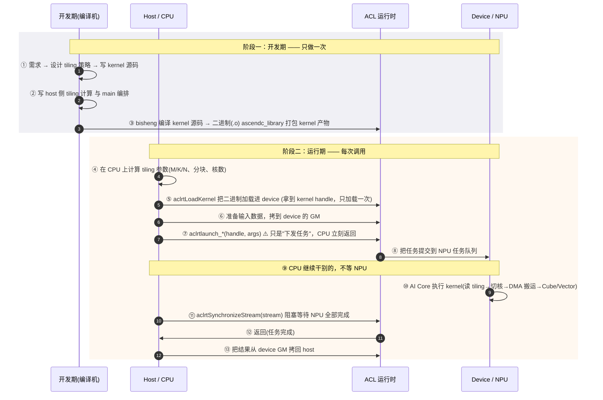

# 03 · host / device 两级分工与 kernel 完整生命周期

`>` 面向 0 到 1 新手的「NPU 体系化架构」第三篇。今天我们回答一个问题：
`>` **一个算子是怎么从“我想要”一步步走上 NPU 真正干活的？**

***

## 一、概述

昇腾算子运行是**两级体系**：**host（CPU）** 与 **device（NPU）** 分工不同，
中间隔着**异步任务队列**。

- **host 当“教练”**：不亲自算，只负责算 tiling 参数、拷数据、下发任务、同步等结果。

- **device 当“运动员”**：在 AI Core 上真正执行 kernel。

而一个 kernel（算子）从出生到上线，会走完一条完整链路：
`需求 → tiling → kernel → host → 编译 → load → launch → 同步 → 验证 → 调优 → 部署`。

本讲把这条链路拆成两段讲透：

- **一级分工**：host 和 device 各自到底干什么；

- **两步异步**：launch 为什么是“投递”而不是“调用”，同步为什么必不可少；

- **全生命周期**：从需求到部署，一步都不能少。

本仓库 `CONTEXT.md` 里「两级系统」的词条（host / device / tiling 参数 / 异步提交 /
同步 / kernel handle / ACL 运行时）为本讲术语权威依据，全文严格对齐。

***

## 二、定义（先钉住词）

### 2.1 词汇表

| 术语                    | 一句话人话                                                 |
| --------------------- | ----------------------------------------------------- |
| **host**              | 跑在 CPU 上的部分，负责 tiling、拷数据、下发任务、同步等待，类比“教练”            |
| **device**            | 跑在昇腾 AI Core 上的部分，真正执行 kernel，类比“运动员”                 |
| **tiling 参数**         | host 算好的“怎么分块/开几个核/各维尺寸”的标量集合                         |
| **异步提交**              | `aclrtlaunch_*` 的本质：把任务“投递”进队列就立刻返回，CPU 不等 NPU        |
| **同步**                | `aclrtSynchronizeStream` 等操作，阻塞 CPU 直到 NPU 任务全部完成     |
| **kernel handle**     | 二进制加载进 device 后得到的句柄，之后每次 launch 复用它                  |
| **ACL 运行时（AscendCL）** | host 与 device 之间的桥梁库，提供 load/launch/synchronize 等 API |

### 2.2 一张图记住两级 + 异步

```text
  教练 host (CPU)  ──launch(异步,立刻返回)──▶  任务队列 ──▶  运动员 device (NPU)
       ▲ 算 tiling / 拷数据                         │ 排队执行 kernel
       └────── sync（等全部完成）  ◀─────────────────┘
```

`>` **人话**：host 是“下单的人”，device 是“干活的厂”，launch 是“投递订单”
`>` 而不是“看着货做完”。

***

## 三、为什么需要两级 + 异步

### 3.1 决策和算力不该抢 CPU

tiling 这类“怎么切”的脑力活放在 CPU 上算；真正的算力活放在 NPU 上算。
两队各干各的，谁也别拖累谁。

### 3.2 异步是并行之源

CPU 下发完任务立刻返回，就能继续准备下一批数据/下一个算子，NPU 在下面埋头算。
两条流水线“踩着轮子走”，吞吐肉眼可见地翻倍。

### 3.3 同步是安全之必需

因为 launch 是异步的，CPU 想读结果必须先主动同步，否则可能拿到 NPU 还没写回的
旧数据——这类 bug 最难查。

`>` **人话**：异步让你不空等，同步让你不乱拿——一快一稳，缺一不可。

***

## 四、要点（核心内容）

### 4.1 两级分工职责对比

| 环节          | host（CPU，教练） | device（NPU，运动员） |
| ----------- | ------------ | --------------- |
| 算 tiling    | ✅ 在 CPU 上算   | 读现成的 tiling     |
| 拷贝数据到 GM    | ✅            | 从 GM 取数据        |
| 下发任务        | ✅（异步）        | 排队执行            |
| 真正执行 kernel | ❌            | ✅               |
| 同步等结果       | ✅            | 上报完成            |

`>` **人话**：教练排兵布阵、投递指令、等结果；运动员只管上场真刀真枪地跑。

### 4.2 完整的 kernel 生命周期（sequenceDiagram）



`>` **人话**：开发期“造一批货”只做一次；运行期“下单→投递→等完成→取货”每次都要走。

### 4.3 每一步在哪做、归谁（逐条对照）

| 阶段        | 谁负责    | 关键动作                             | 你要记住的           |
| --------- | ------ | -------------------------------- | --------------- |
| 需求        | 你      | 明确“算什么、精度、约束”                    | 出发点             |
| tiling 设计 | 你/host | 定 M/K/N、分块、核数                    | host 算、device 用 |
| kernel 实现 | 你      | 写 `__global__ __aicore__` 核函数    | 设备端代码           |
| host 编排   | 你      | 写 main、调用运行时 API                 | 主机端代码           |
| 编译        | 编译器    | bisheng 编译 + ascendc\_library 打包 | 只做一次            |
| load      | ACL    | 二进制加载进 device，拿 handle           | 只做一次            |
| launch    | ACL    | 异步下发任务                           | CPU 立刻返回        |
| 同步        | ACL    | 阻塞等全部完成                          | 读结果前必做          |
| 验证        | 你      | 与 CPU 参考基准比对                     | 对答案             |
| 调优        | 你      | 改 tiling/流水/搬运                   | 扣性能             |
| 部署        | 你      | 打包接入框架上线                         | 上生产线            |

### 4.4 host / device 与异步/同步的精髓

- **launch 是“投递任务单”，不是“调用”**：`aclrtlaunch_*` 一调，CPU 立刻返回，
  任务真的在队列里慢慢排队执行。代码看起来像“调用”，语义上是“投递”。

- **stream 是任务队列**：任务按代码顺序在指定 stream 上排队执行，保证执行顺序。

- **必须同步才能安全读结果**：`aclrtSynchronizeStream` 阻塞 CPU 直到 stream 里所有
  任务完成，之后拷回的数据才是可信的。

`>` **人话**：launch 是“下单”，synchronize 是“等货到”，memcpy D2H 是“取货”。

### 4.5 kernel handle：加载一次，复用到底

- **编译/加载通常只做一次**：`aclrtLoadKernel` 把二进制加载进 device，返回 handle。

- **之后每次 launch 都复用该 handle**，不再重新编译/加载，因此启动开销很低。

`>` **人话**：机器开机只需“上膛一次”（load），之后每发射一发都是“扣扳机”（launch）。

### 4.6 运行期常见的几种调用方式（简单对比）

昇腾上把一个算子跑起来，工程上常见两类形态：

| 方式                           | 说明                                               | 什么时候用                     |
| ---------------------------- | ------------------------------------------------ | ------------------------- |
| **Kernel 直调（Kernel Launch）** | 直接用 `ACLRT_LAUNCH_KERNEL` / `aclrtlaunch_*` 调核函数 | 快速验证、独立应用、自定义逻辑           |
| **框架调用（aclnn API）**          | 通过 aclnn 接口、算子注册 + tiling 函数由框架托管                | 集入 PyTorch/TensorFlow 等框架 |

两条路都会走到 **启动 → 同步 → 取结果** 这条主线，只是 host 侧“要操心的量”不同：
直调更自由但更手动，框架调用更省心但更受约束。

`>` **人话**：直调是“自己组装自己开”，框架调用是“造标准件卖给框架，让它开着跑”。

### 4.7 一个 host 侧调用骨架（伪代码示意）

下面把运行期“load → launch → sync → 取结果”的主线用伪代码串起来，帮你把抽象
落到可真机跑起来的形状（具体 API 名以 CANN 官方为准）：

```cpp
// 1. 初始化：打开 device、创建 stream（任务队列）
aclInit(nullptr);
aclrtSetDevice(0);
aclrtCreateStream(&stream);

// 2. 加载二进制，拿到 kernel handle（只做一次）
aclrtLoadKernel(binary, ...);             // 得到 bin handle
aclrtBinaryGetFunction(bin, "gemm_custom", &funcHandle); // 取函数句柄

// 3. 准备数据：host malloc → 拷到 device 的 GM
aclrtMalloc(&dA, ...); aclrtMemcpy(dA, hA, ..., H2D);
aclrtMalloc(&dB, ...); aclrtMalloc(&dC, ...);

// 4. 异步下发任务：CPU 立刻返回，不会在这里等
aclrtLaunchKernel(funcHandle, blockDim, args, argsSize, stream);

// 5. 同步：阻塞直到 stream 里的任务全部完成（读结果前必做）
aclrtSynchronizeStream(stream);

// 6. 把结果从 device GM 拷回 host
aclrtMemcpy(hC, dC, ..., D2H);

// 7. 收尾：释放资源、复位 device
aclrtDestroyStream(stream); aclrtResetDevice(0); aclFinalize();
```

对照生命周期表：2≈load、4≈launch、5≈同步、6≈取结果。**虚线是你最容易漏掉的第 5 步。**

`>` **人话**：会背这七步的“主心骨”，等于拿到了昇腾上任何算子调用的通用底座。

***

## 五、常见误区（新手必看）

### 5.1 “launch 等于调用，CPU 会在原地等它跑完”

**错。** `aclrtlaunch_*` 是异步接口：成功返回**只代表任务下发成功**，不代表执行完成。
CPU 立刻继续跑。想等结果，必须显式 `aclrtSynchronizeStream`。

### 5.2 “不问同步，直接拷结果就行”

**错。** 不同步就 D2H 拷数据，很可能拿到 NPU 还没算完的旧数据。同步这道“闸门”
不能省。

### 5.3 “每次调用都重新编译、重新加载 kernel”

**通常错。** 编译和加载（load）只做一次，拿到 kernel handle 后每次 launch 复用，
启动开销极低。

### 5.4 “tiling 参数是 device 自己算的”

**错。** tiling 是 **host 在 CPU 上算好**、写进 device 可见的内存，kernel 启动后读取。
host 算、device 用——这是两级分工的关键之一。

`>` **人话**：launch 不等待、同步不可省、加载只一次、tiling 归 host 算。

***

## 六、TL;DR

1. 两级分工：host 指挥（算 tiling/拷数据/下发/同步），device 干活（执行 kernel）。
2. 异步提交：launch 只是“投递任务单”，CPU 立刻返回、继续干别的。
3. 主动同步：读结果前必须 `aclrtSynchronizeStream`，否则可能拿到旧数据。
4. 完整链路：需求→tiling→kernel→host→编译→load→launch→同步→验证→调优→部署。
5. kernel handle 加载一次、复用到底，降低启动开销。
6. 工程上分“Kernel 直调”与“框架调用（aclnn）”两种落地形态。

***

## 七、参考资料（官方来源）

`>` 以下链接均已核实，可在昇腾官方域名下访问。

- 华为昇腾 · CANN 社区版 Ascend C 算子开发指南（Kernel 直调 / ACLRT\_LAUNCH\_KERNEL / stream）：
  https://www.hiascend.com/document/detail/zh/CANNCommunityEdition/81RC1alpha001/devguide/opdevg/ascendcopdevg/atlas_ascendc_10_0051.html

- 华为昇腾 · AscendCL API 参考 aclrtSynchronizeStream（阻塞等待 stream 任务完成）：
  https://www.hiascend.cn/document/detail/zh/canncommercial/80RC2/apiref/appdevgapi/aclcppdevg_03_0075.html

- 华为昇腾 · AscendCL API 参考 aclrtLaunchKernel（异步下发、必须同步）：
  https://www.hiascend.cn/document/detail/zh/CANNCommunityEdition/80RC3alpha001/apiref/appdevgapi/aclcppdevg_03_0145.html

- 华为昇腾 · Ascend C 编程模型概述（host/device 两级异构体系）：
  https://asc.gitcode.com/guide/编程指南/编程模型/编程模型概述.html

