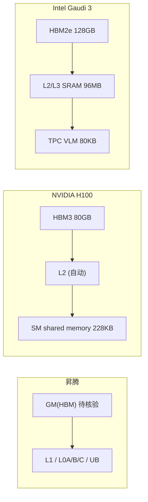

# 04 · 横向对比：昇腾 Ascend vs NVIDIA Hopper(H100) vs Intel Gaudi

`>` 面向 0 到 1 新手的「NPU 体系化架构」第四篇。今天我们回答一个问题：
`>` **不同的 AI 芯片，为了喂饱自己的“矩阵乘引擎”，各自设计了怎样的存储与搬运机制？**

---

## 一、概述

前两篇我们看清了昇腾的 AI Core 与存储层级。把它放到一个更大的坐标系里，
与两类主流 AI 芯片对比，能帮你真正看懂：**什么是架构设计的共性，什么又是各自
独特的“脾气”**。

本文聚焦四个维度横向对比昇腾 **Ascend**、NVIDIA **Hopper（H100）**、
Intel **Gaudi**：
1. **存储层级**：从 HBM 到片上，各有几级、怎么排。
2. **计算单元**：矩阵乘引擎 + 通用/向量引擎各长什么样。
3. **搬运机制**：数据在存储层间怎么被移动（谁搬、能否异步）。
4. **显式 vs 隐式内存管理**：片上缓冲是软件管还是硬件自动 cache。

`>` **关于数字的说明（红线）**：本表的型号数字，凡是**我靠官方来源核实过**的才写；
`>` 没核实的一律标「待核验」，绝不靠印象编造。昇腾各代芯片的 GM/L1/L0/UB 精确容量
`>` 官方公开值不统一，本表一律以「待核验」标注，不写猜测值。

---

## 二、定义（先钉住词）

| 术语 | 一句话人话 |
| --- | --- |
| **HBM** | 高带宽显存，都放在最外层当“大仓库”，三家都有 |
| **片上 SRAM / 片上缓冲** | 芯片里存的、紧贴计算引擎的高速存储，各家叫法不同 |
| **显式内存管理** | 数据搬进/搬出必须**亲手写代码**指挥 |
| **隐式内存管理 / 自动 cache** | 硬件**自动**缓存，你只管读写，硬件帮你藏着 |
| **矩阵乘引擎** | 专司矩阵乘的专用单元（昇腾 Cube / H100 Tensor Core / Gaudi MME） |
| **通用/向量引擎** | 做非矩阵乘“杂活”的引擎（Vector / CUDA 核 / TPC） |

`>` **人话**：HBM 大家都一样“大而慢”；区别在于“片上谁管、怎么搬”。

---

## 三、为什么需要对比

### 3.1 看懂共性

三家都为“喂饱矩阵乘引擎”建了**多级存储 + 异步搬运**，思路殊途同归。你学会一家，
就能快速迁移到另一家的思维方式。

### 3.2 看懂差异

有的片上缓存靠硬件自动（H100 的 L2、Gaudi 的 L2/L3），有的靠软件显式（昇腾的
L1/L0/UB、Gaudi 的 VLM），这直接决定了编程时“你要操多少心”。这是**新手最容易
混淆、也是性价比最高的知识增量**。

### 3.3 迁移能力

你手里已有 CUDA / 昇腾经验时，知道差异在哪，切换平台的学习成本会骤降。

`>` **人话**：对比不是为了分高下，而是为了“换个芯片，你能快速对齐思维模型”。

---

## 四、要点（核心内容）

### 4.1 一张表看懂横向对比

| 维度 | 昇腾 Ascend（以 AI Core 为例） | NVIDIA Hopper / H100 | Intel Gaudi 3 |
| --- | --- | --- | --- |
| **外层大仓库** | GM = HBM（容量/带宽：待核验，各型号不同） | 80 GB HBM3，`>3` TB/s（官方） | 128 GB HBM2e，3.7 TB/s（官方） |
| **片上分级** | L1 + L0A/L0B/L0C + UB + 片上共享存储（容量待核验） | L2 + SM 内 shared memory（每 SM 最大 228 KB，官方）+ register file | 片上 SRAM 96 MB（官方），可作 L3 统一缓存或 4×24 MB L2 |
| **矩阵乘引擎** | Cube 单元（16×16 粒度，fp32 累加） | 第四代 Tensor Core（FP8 Transformer Engine，官方） | MME（8 个，256×256 结构，fp32 累加，官方） |
| **向量/通用引擎** | Vector 单元（逐元素）+ Scalar 单元（控制） | SM（可编程 CUDA 核）+ warp | TPC（64 个，VLIW SIMD） |
| **搬运机制** | DMA 引擎，显式搬运，跨域必须经 DMA | TMA（Tensor Memory Accelerator）+ LDGSTS，支持异步批量搬运 | TPC 的 load/store 槽位 + DMA + RDMA NIC；硬件 cache |
| **显式 vs 隐式** | **强显式**：L1/L0/UB 全靠软件管 | **混合**：L2 自动 cache、shared memory 软件分配、TMA 异步搬运 | **混合**：L2/L3 硬件 cache（可用 cache directives 控制）+ TPC 内 VLM（80 KB，官方）显式 |

`>` 说明：昇腾 GM/L1/L0/UB 容量各型号未在本文引用的官方文档中给出统一公开值，标「待核验」。

### 4.2 存储层级：共性都是“多级”，差异在“谁管”

- **昇腾**：**显式管理**为主，货架（L1/L0/UB）都要 kernel 亲手搬，跨域必须经 DMA。
- **NVIDIA**：L2 是**硬件自动 cache**；SM 内 shared memory 是**软件分配**；H100 新增
  **TMA**——用“一条大指令”异步搬整块多维数据，不必再逐线程搬。
- **Gaudi**：片上 96 MB SRAM 可按 L3/L2 用，是硬件 cache，但可用 **cache directives**
  （No-$、L2$、L3$、L2$+L3$）手动指点；TPC 里还有一块显式的 **VLM（80 KB）** 供
  程序直接用。

`>` **人话**：昇腾“货架要自己搬”，NVIDIA“部分自动部分手动”，Gaudi“自动为主也能手动点名”。

### 4.3 计算单元：矩阵乘引擎 + 通用引擎

| 芯片 | 矩阵乘引擎 | 向量/通用引擎 |
| --- | --- | --- |
| 昇腾 | Cube（16×16 粒度，fp32 累加） | Vector + Scalar |
| H100 | Tensor Core（FP8/FP16/TF32，Transformer Engine，官方） | CUDA SM + warp |
| Gaudi 3 | MME ×8，256×256 MAC，64K MAC/cycle，fp32 累加（官方） | TPC ×64，VLIW SIMD |

**共同点**：矩阵乘永远走**专用引擎**，非矩阵的“杂活”走通用/向量引擎——这是当前
AI 芯片的统一设计范式。

`>` **人话**：各家“重型机床”（矩阵乘）+“杂活车间”（向量）的配置思路完全一致。

### 4.4 搬运机制：谁搬、能不能异步

- **昇腾**：唯一搬运工 **DMA**，所有层间/跨域移动都走它，显式发起。
- **H100**：**TMA** 专门搬大块和多维张量（全局↔shared、SM 间），一条指令异步搬运，
  搬运时线程还能继续算别的，天然适合“warp specialization”。
- **Gaudi**：TPC 的 load/store 指令自带地址计算（AGU）+ DMA；RoCE NIC 负责跨卡搬运。

**共同点**：都支持**异步 double buffer / 流水**，让“搬下一个”与“算当前个”重叠，
把搬运延迟藏进计算里。

`>` **人话**：昇腾靠 DMA 搬、H100 靠 TMA 搬、Gaudi 靠 load/store+DMA 搬，都要“搬得
`>` 越隐蔽越好”。

### 4.5 显式 vs 隐式：决定你要操多少心

| 芯片 | 片上缓冲管理 | 你的工作量 |
| --- | --- | --- |
| 昇腾 | 强显式 | 高：每步搬运都得亲手写 |
| NVIDIA | 混合 | 中：shared memory 要管，L2 免费 |
| Gaudi | 偏向自动（cache）+ 显式 VLM | 中低：常用缓存可自动，真要性能上 VLM |

`>` **人话**：昇腾是“亲力亲为”，NVIDIA/Gaudi 是“能自动就自动，但要性能还是得手动”。

### 4.6 一句话横向心智模型

- **昇腾** = 强显式 + 唯一 DMA，控制力最强，操心最多。
- **H100** = 自动 L2 + 显式 shared/TMA，找到了“省心与性能”的中间点。
- **Gaudi** = 大 SRAM 自动缓存 + 显式 VLM，靠“够大的片上缓存”走低显式路线。

### 4.7 怎么把对比用到实战（一张自测清单）

读完本讲，你可以用下面这组问题自检——能答上来就算过关：

| 问题 | 昇腾 | H100 | Gaudi |
| --- | --- | --- | --- |
| 最外层大仓库叫什么、多大？ | GM=HBM（容量待核验） | HBM3 80GB，`>3TB`/s | HBM2e 128GB，3.7TB/s |
| 片上有没有“硬件自动”的缓存？ | 基本没有（显式为主） | 有（L2 自动） | 有（L2/L3 自动，可指令控制） |
| 矩阵乘走哪个引擎？ | Cube | Tensor Core | MME |
| 有专门的大块异步搬运手段吗？ | DMA（显式） | TMA（异步） | load/store+DMA（显式+硬件 cache） |
| 哪种最“显式、最操心”？ | ✅ 最显式 | 中间 | 最省心 |

`>` **人话**：能答出这张表，就说明你已经从“只懂昇腾”升级到“懂横向坐标系”了。

### 4.8 给你的学习路径建议

- 想快速上手昇腾 GEMM：先吃透 01/02 的**访问权域 + 唯一 DMA**，这是昇腾的“命门”。
- 想迁移到 CUDA：重点抓 H100 的 **L2 自动 + TMA 异步**，其余概念几乎一一对应。
- 想看好“低显式效率”的第三种路线：重点看 Gaudi 的 **96MB 大片上 SRAM + 缓存指令**。

`>` **人话**：路线不用都走，挑一条你正在用的芯片，把本讲当“地图”查着用。

---

## 五、常见误区（新手必看）

### 5.1 “所有 AI 芯片的 L1/片上内存都一样是 cache”

**错。** 昇腾的 L1/L0/UB 是显式管理的缓冲，不是自动 cache；H100 的 L2 才是自动 cache，
Gaudi 的 L2/L3 是自动 cache 但有显式指令。**同样叫“片上内存”，管理方式天差地别。**

### 5.2 “矩阵乘都是在一个通用的‘乘法核’上算的”

**错。** 三家都有**专用矩阵乘引擎**（Cube / Tensor Core / MME），它不是普通的
向量核。这正是 GEMM 能跑得飞快的原因。

### 5.3 “H100 的搬运也要像昇腾那样每一步亲手写”

**错。** H100 的 L2 是自动缓存，TMA 还能异步搬整块数据；昇腾则需要显式 DMA
每一步。**“要操心的量”不一样。**

### 5.4 “Gaudi 96MB SRAM 只能当缓存”

**不准确。** 官方文档说它是“统一可访问的末级缓存（L3）或切分成 4×24MB 的 L2”，
是硬件 cache，但可通过 cache directives 控制；TPC 里另有显式的 VLM 供程序直接用。

`>` **人话**：懂差异才不踩坑——别拿昇腾的“显式规矩”去套 H100/Gaudi，也别反着套。

---

## 六、TL;DR

1. 三家都把 HBM 当“大仓库”，差异集中在“片上谁管、怎么搬”。
2. 计算架构高度同构：矩阵乘专用引擎 + 通用/向量引擎。
3. 都追求“异步搬运、隐藏搬延迟”，但昇腾靠 DMA、H100 靠 TMA、Gaudi 靠 load/store+DMA。
4. 管理方式上昇腾最“显式最操心”，NVIDIA 与 Gaudi 走“能自动就自动”的混合路线。
5. 未核实的数字一律标「待核验」，绝不编造。

---

## 七、参考资料（官方来源）

`>` 以下链接均已核实，可在各芯片厂商官方域名下访问。

**华为昇腾（官方）：**
- Ascend C 编程模型概述（AI Core 硬件基础）：https://asc.gitcode.com/guide/编程指南/编程模型/编程模型概述.html
- C++ Tensor 编程概述（内存层级）：https://asc.gitcode.com/guide/编程指南/编程模型/AI-Core-SIMD编程/基于Tensor的CPP编程/CPPTensor编程概述.html

**NVIDIA（官方）：**
- NVIDIA Hopper Architecture In-Depth（H100 HBM3 80GB/>3TB/s、Tensor Core、TMA）：
  https://developer.nvidia.com/blog/nvidia-hopper-architecture-in-depth/
- NVIDIA Hopper Tuning Guide（shared memory 228KB、TMA、SM 结构）：
  https://docs.nvidia.com/cuda/pdf/Hopper_Tuning_Guide.pdf
- NVIDIA H100 GPU 官方产品页：https://www.nvidia.com/en-us/data-center/h100/

**Intel / Habana（官方）：**
- Intel Gaudi Architecture（Gaudi 3：128GB/3.7TB/s、8 MME、64 TPC、96MB SRAM）：
  https://docs.habana.ai/en/latest/Gaudi_Overview/Gaudi_Architecture.html
- Intel Gaudi 3 AI Accelerator 技术白皮书（256×256 MME、L2/L3、cache directives、VLM）：
  https://cdrdv2-public.intel.com/817486/gaudi-3-ai-accelerator-white-paper.pdf
- Intel Gaudi 3 Hot Chips 2024（内存子系统、MME 256×256、TPC VLM/寄存器）：
  https://hc2024.hotchips.org/assets/program/conference/day1/60_HC2024.Intel.RomanKaplan.Gaudi3-0826.pdf