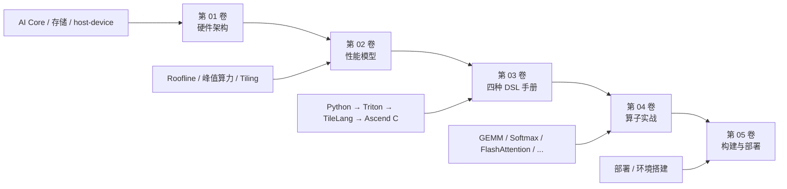
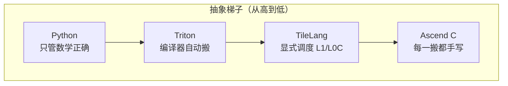

# Ascend NPU 知识库

**面向 0→1 新手的昇腾 Ascend NPU 核心开发手册**

从硬件架构到四种 DSL 开发，从 LLM 算子优化到 Profiling 实战——
一份文档，帮你从零成长为专业的 NPU kernel 开发者。

[从硬件架构开始](/hardware/01-ai-core-overview) · [四种 DSL 总览](/dsl/00-dsl-overview) · [术语表](/reference/context) · [GitHub](https://github.com/SuccinctPaul/Ascend-Notes)

---

## TL;DR

- **五卷一站式手册**：硬件架构 → 性能模型 → 四种 DSL 核心手册 → LLM 算子实战 → 构建部署与术语表。
- **四种 DSL 并列**：Python（基准）→ Triton（块级自动）→ TileLang（显式调度）→ Ascend C（全手动）。
- **实测对照**：Python 朴素 4.27 s → Triton 0.79 ms → TileLang 0.38 ms（128³ fp16, Ascend 910B2）。
- 篇目遵循清晰的固定骨架：DSL 卷为「TL;DR → Background → Why → 正文 → 图表 → FAQ → 汇总 → 参考资料」，硬件/算子卷为「概述 → 定义 → 为什么 → 要点 → 常见误区 → TL;DR → 参考资料」。
- 全中文，Mermaid 架构图 + ASCII 心法图并存，面向新手友好。

---

## 阅读路径



> **人话**：先懂硬件（算子跑在什么物理世界里），再懂性能模型（怎么算天花板），
> 然后学四种 DSL（怎么写 kernel），接着看算子实战（怎么优化），最后学 Profiling（怎么定位瓶颈）。

### 新手推荐路径

1. **第一步**：[AI Core 硬件模型全貌](/hardware/01-ai-core-overview)——理解 Cube/Vector/DMA 四引擎。
2. **第二步**：[四种 DSL 总览](/dsl/00-dsl-overview)——看清抽象梯子，选一个开始。
3. **第三步**：[Python 基准](/dsl/01-python-baseline) → [Triton](/dsl/02-triton-ascend)——最快上手的 NPU kernel 路径。
4. **第四步**：[GEMM 四种 DSL 实证](/ops/09-gemm)——看同一个 GEMM 四种写法的对比。
5. **第五步**：[Roofline 性能模型](/perf/01-roofline-perf-model)——学会量化性能瓶颈。

---

## 第 01 卷 · NPU 体系化架构

从「一个算子跑在什么样的物理世界里」讲起，并横向对比主流 AI 芯片。

| 篇目 | 内容 |
|---|---|
| [01 · AI Core 硬件模型全貌](/hardware/01-ai-core-overview) | Cube / Vector / Scalar / DMA 四引擎、AI Core 集群、多核并行 |
| [02 · 存储层级与访问权域](/hardware/02-storage-hierarchy) | GM(HBM)、L1、L0A/B/C、UB，DMA 唯一搬运，显式内存管理 |
| [03 · host/device 与 kernel 生命周期](/hardware/03-host-device-kernel-lifecycle) | 两级分工、异步提交/同步，算子从需求到部署的全流程 |
| [04 · 昇腾 vs Hopper vs Gaudi](/hardware/04-npu-architecture-comparison) | 存储、计算单元、搬运、显式/隐式内存管理的横向对比 |

---

## 第 02 卷 · 性能模型与 Profiling

讲清楚「如何分析一个 NPU 算子的性能瓶颈并优化」。

| 篇目 | 内容 |
|---|---|
| [00 · 如何计算 NPU 算力](/perf/00-npu-peak-flops-calculation) | 从 Cube 16×16×16 推导峰值 TFLOPS |
| [01 · 性能模型与 Roofline](/perf/01-roofline-perf-model) | 计算强度、山脊点、带宽/计算受限 |
| [02 · Tiling 与流水线重叠](/perf/02-tiling-pipeline-overlap) | 分块策略、双缓冲、MTE 队列重叠 |
| [03 · Profiling 工具与读法](/perf/03-profiling-tools) | msProf 工具链、算子级 profiling |
| [04 · 瓶颈识别与优化手段](/perf/04-bottleneck-and-optimization) | 从 profiling 数据到优化决策 |
| [05 · 四种 DSL 实测解读](/perf/05-dsl-benchmark-analysis) | 用仓库实测数据对比四种 DSL |
| [06 · 实战：GEMM 128³ Roofline 分析](/perf/06-roofline-case-study) | 用仓库实测数据走完整流程 |

---

## 第 03 卷 · 四种 DSL 核心手册

用四种 DSL 写同一个 `C = A @ B`，从"只管数学正确"到"手控每一级搬运"。

| 篇目 | DSL | 抽象层级 | 语言 | 核心能力 |
|---|---|---|---|---|
| [00 · 四种 DSL 总览](/dsl/00-dsl-overview) | — | — | — | 抽象梯子、横向对比、编译通路 |
| [01 · Python/NumPy 基准](/dsl/01-python-baseline) | NumPy | 最高（无 NPU） | Python | 正确性基准（ground truth） |
| [02 · Triton on Ascend](/dsl/02-triton-ascend) | Triton | 中（块级） | Python (`@triton.jit`) | 声明式分块 + 自动 Cube |
| [03 · TileLang on Ascend](/dsl/03-tilelang-ascend) | TileLang | 中低（调度级） | Python (`@tilelang.jit`) | 显式 L1/L0C 调度 + Cube |
| [04 · Ascend C](/dsl/04-ascend-c) | Ascend C | 最低（字节级） | C++ | 直接操作硬件，性能上限最高 |



> **人话**：抽象越高写得越简单但控制力越弱，抽象越低控制力越强但开发成本越高。

### 四种 DSL 速查表

| 维度 | Python | Triton | TileLang | Ascend C |
|---|---|---|---|---|
| **工具链** | numpy + uv | triton-ascend + torch_npu | tilelang + tilelang-ascend | CANN ascendc.cmake + bisheng |
| **内存控制** | 无 | 编译器决定 | 显式 L1/L0C | 完全手动 |
| **Cube 调用** | 无 | `tl.dot` 自动 | `T.gemm_v0` 显式 | 手动 MatMul API |
| **搬运控制** | 无 | 隐式 `tl.load` | 显式 `T.copy` + `T.barrier` | 手动 `DataCopy` |
| **实测耗时** | 4.27 s | 0.79 ms | 0.38 ms | — |
| **学习曲线** | 最低 | 中等 | 中高 | 最高 |

---

## 第 04 卷 · LLM 优化算子

每个算子讲清楚：**数学定义 → 为什么需要 → 朴素实现 → NPU 关键优化点**。

| 篇目 | 内容 |
|---|---|
| [01 · element-wise 与算子融合](/ops/01-elementwise-and-fusion) | 逐元素算子、Vector 单元、图算融合、epilogue 融合 |
| [02 · RMSNorm](/ops/02-rmsnorm) | 均值归一化、Vector reduction、精度处理 |
| [03 · Softmax](/ops/03-softmax) | 三阶段 reduction、数值稳定、UB 内完成 |
| [04 · RoPE 旋转位置编码](/ops/04-rope) | 旋转矩阵、复数乘法、Vector 实现 |
| [05 · GELU 与激活](/ops/05-gelu) | tanh 近似、逐元素、融合到 GEMM epilogue |
| [06 · GQA 与 KV Cache](/ops/06-gqa-kvcache) | 分组注意力、KV Cache 管理 |
| [07 · FlashAttention](/ops/07-flash-attention) | 分块注意力、IO 复杂度优化 |
| [08 · 量化与反量化](/ops/08-quantization) | INT8/fp8 量化、Cube 翻倍算力 |
| [09 · GEMM（四种 DSL 实证）](/ops/09-gemm) | 矩阵乘复用、tiling、Cube 16×16 MAC |

---

## 第 05 卷 · 构建与部署

| 篇目 | 内容 |
|---|---|
| [构建与部署说明](/deployment) | 文档站构建、GitHub Pages 部署、NPU 开发环境要点 |
| [术语表](/reference/context) | 全仓库术语权威定义 |

---

## 运行环境

远程服务器：`ssh vllm-hust-cyj-21rc-cloud-piou`，开发路径 `/root/Ascend-Notes`。
- 架构：aarch64 (Ubuntu)
- CANN：9.0.0
- NPU：Ascend910B 系列
- 所有 NPU kernel 在此服务器上构建与测试；`examples/python/` 基准可在任意机器跑。

```bash
# 每次 shell 都要先 source
source /usr/local/Ascend/ascend-toolkit/latest/set_env.sh
```

```bash
# 本地预览文档
uv sync && uv run mkdocs serve
```
