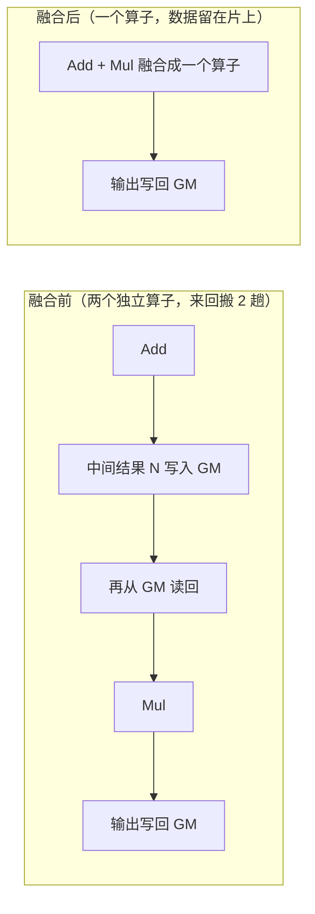
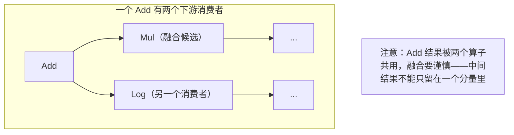

# 01 · Element-wise 算子与算子融合

> 目标读者：刚接触算子 / NPU 开发的 0 到 1 新手。
> 本文从一个最平凡的算子（逐元素的加法）讲起，引出整个昇腾生态里最重要的性能思想之一——**算子融合**。

---

## 一、概述

在一个大模型或神经网络里，最不起眼却数量最多的一类运算是 **element-wise（逐元素）算子**：加、乘、减、激活（ReLU 等）、取负、指数、归一化……它只要求**两个形状相同的张量，在对应位置上各算各的**，元素之间互不相干。

正因为"各算各的、互不相干"，element-wise 计算天然适合 **Vector 单元**（向量引擎）并行处理，也天然适合"跟别人搭伙"——把前后相邻的多个小算子**融合**成一个大算子。

```
TL;DR：element-wise 就是"两张数表按格子一对一地算"；
       算子融合就是"把一串连续的小操作合并成一次，少来回搬数据"。
```

---

## 二、定义

### 2.1 数学定义

给定两个形状相同的张量 `A` 和 `B`，逐元素二元运算可以写作：

```
C[i] = A[i] ⊙ B[i]   (⊙ ∈ {+ , - , × , ÷ , max , min , ...})
```

其中 `i` 遍历张量中的每一个位置。单参数版本（如激活函数）类似：

```
C[i] = f(A[i])   (例如 C[i] = ReLU(A[i]) = max(0, A[i]))
```

一个重要的性质是：**输出元素只依赖对应位置的输入元素**，与其它位置的数值无关。这让 element-wise 算子没有任何"跨元素归约"的压力，可以被任意切分、并行执行。

> 人话：加法的第 5 个输出只由第 5 个输入决定，跟第 1、第 10000 个输入毫无关系。

### 2.2 什么算子算"element-wise"

常见例子：

- 初等运算：`Add`、`Mul`、`Sub`、`Div`；
- 激活：`ReLU`、`GELU`、`SiLU`、`Tanh`；
- 累积归一化里的"乘系数、加偏置"：`Muls`、`Adds`；
- 逐元素的仿射：`y = x * gamma + beta`（比如 LayerNorm 的输出缩放阶段）。

注意：像 `Softmax`、`RMSNorm`、`Sum` 这种需要**跨一个轴做归约**（求最大、求和、求平均）的算子，**不是**纯 element-wise——它每个输出也要看整行的其它元素。它们往往由一组 element-wise 步骤在 **UB（统一缓冲）** 上串联完成。

---

## 三、为什么需要理解它

### 3.1 它是大模型里占比最高的"小算子"

一个 Transformer 层里，真正"重量级"的是矩阵乘（GEMM，走 Cube）。但围绕着 GEMM 的外围，有大量逐元素的加偏置、缩放、激活、归一化步骤。这些算子**单独拎出来算力要求不高，但访存密度极高**——它们绝大部分时间都花在把数据搬进搬出上，而不是算。

### 3.2 单个小算子的性能瓶颈是"搬运"而不是"计算"

在昇腾 NPU 上，数据流动的路径是：

```
GM（全局内存 / HBM）→ L1 → L0 / UB →（Vector 计算）→ 回 GM
```

element-wise 每个元素只做一次运算，算术强度极低。于是性能被 **GM 到片上的一次次搬运**卡死。CPU 时代的名言"数据搬得比算得慢得多"，在 NPU 上更是命门。

> 人话：小算子的时间大头不是"算"，而是"把数据从仓库（GM）搬上工作台（UB）再搬回去"。搬一次是一笔开销，多搬几次就亏大了。

### 3.3 融合 = 少搬几趟数据

如果一段计算是 `N = A + B; O = N * C`（先加后乘），朴素写法要"读 A、B 进 UB，算出 N 搬回 GM；再读 N、C 进 UB，算出 O 搬回 GM"。这中间 N **写了一趟又读了一趟**，纯属浪费。

**算子融合（operator fusion）** 的思路是：把这两个步骤在一个 kernel 里连起来，N 直接留在 UB 上，算完 O 再搬走。等于把两趟 GM 往返压缩成一趟。

---

## 四、朴素实现

### 4.1 CPU / Python 视角

朴素写法就是一个 for 循环（或向量化写法），例如在 Python/NumPy 里：

```python
N = A + B          # 加法
O = N * C          # 乘法，逐个元素
```

肉眼可读，但每写一条语句，就意味着"读一趟数据、写一趟数据"，即一次完整的 GM 往返。

### 4.2 昇腾 Ascend C 视角（三步走）

在 Ascend C 里写一个 element-wise kernel，沿用的是统一的"搬运+计算+搬运"模板（这正是 [术语表](/reference/context) 里说的 **数据流**）：

1. **CopyIn**：用 DMA（`DataCopy`）把一块数据从 GM 搬进 **UB**；
2. **Compute**：让 **Vector 单元**在 UB 上执行逐元素指令（如 `Add`、`Muls`）；
3. **CopyOut**：用 DMA 把结果从 UB 搬回 GM。

伪代码示意：

```cpp
// 假设数据总量不能一次塞进 UB，需要 tiling 分块
for (tile in tiles) {
    // 1) CopyIn: GM -> UB
    DataCopy(inUB, inGM[offset], tileLen);
    // 2) Compute: Vector 逐元素累加
    Add(outUB, inUB, bias, tileLen);
    // 3) CopyOut: UB -> GM
    DataCopy(outGM[offset], outUB, tileLen);
}
```

这段代码里"循环 + 分块"的动作，在 Ascend C 里叫 **tiling（分块）**——因为 **UB 放不下整张数据表**，必须切成一块块搬运。

> 人话：UB 是张"小板凳"大小的运算工作台，桌子不够大，就把整块布拿出来分几次铺上去剪。

---

## 五、NPU 上的关键优化点

### 5.1 tiling：切块 + 多核并行

element-wise 数据量往往远超 UB。优化第一步是**按能装进 UB 的尺寸切成 tile**，并把手里的几十个 **AI Core** 铺开，让每个核分一块、各算各的。切块大小要满足对齐约束（搬运单元对地址有 32 字节 / 16 个 fp16 的对齐要求）。

### 5.2 Vector 向量化：一次算一批，而不是一个

Vector 单元天然一次处理一批元素（一批就是硬件指令的字长）。千万别写逐元素的标量循环——要用 `Add`/`Muls`/`Exp` 这类**向量指令**，一次把一片 UB 数据全算掉。这是比标量循环快一到两个数量级的关键。

### 5.3 数据搬运：尽量只在 GM↔UB 间"各一趟"

优化的核心命题是 **减少 GM 往返次数**。理想情况是：输入各读一趟进 UB，算完结果各写一趟回 GM。任何中间结果都不要**写回 GM 再读回来**，而是留在 UB 里继续加工。

### 5.4 图算融合（图引擎自动做的事）

除了手写"内联式融合"，昇腾的编译栈（如 MindSpore 的多级编译）还提供**图算融合**自动化优化：在编译期自动识别计算图中**相邻且可融合**的节点，把它们合成一个更大的算子执行。



- **好处**：中间结果留在片上（UB / L0 里直接流转），**全局内存访问次数下降**，kernel 启动次数也减少；
- **风险**：图结构与单一算子解耦后，调试变难（这是沉没成本，性能换来的）。

> 人话：图算融合就像把"洗菜、切菜、炒菜"三道单独请灶台的工序，合并成一道流水线，菜不用端出端进三趟。

### 5.5 双缓冲（Double Buffer）：让"搬"和"算"重叠

一个简单的素朴 kernel 是"搬一整块 → 算一整块 → 搬回 → 再搬下一块"，这样 DMA 搬运**等待期**里，Vector 计算单元是空闲的。优化做法是**双缓冲**：在 UB 里给输入开出两份缓冲，让 DMA 搬第 `k+1` 块的同时，Vector 正在算第 `k` 块，两个引擎**像流水线一样同时忙**。这不改变算法，只是让"搬"和"算"重叠，把搬运延迟盖掉。

> 人话：切菜的时候，另一个人已经在把下一颗菜洗好送过来了——灶台不停火。

需要注意的是：因为"先搬进新块、再算块"有时间差，多核 / 多缓冲下的同步要靠**显式的同步（barrier / EnQue-DeQue）**来保证"数据到齐了才开算"，这正是 [术语表](/reference/context) 里说的"每一步搬运都是显式发起 + 同步"。

### 5.6 融合的"合法性"：依赖关系不能乱改

融合不是随便把相邻算子粗暴合并。要保证**功能等价**（融合前后的数学结果一致），编译器会检查算子间的依赖：比如 `Add` 和它下游唯一的 `Mul` 之间没有分叉、没有其它消费者、中间结果不再被别处复用，融合才是安全的。这就是后台图算融合 pass 内部真正做的工作。



---

### 5.7 融合的"合法性"（续）：谁是 Vector 该做的活

element-wise 融合里，哪些操作能合进一个 Vector kernel？经验法则：**凡是逐元素、无跨元素依赖的步骤都能合**（加、乘、激活、缩放、归一化的尾部），凡是**需要跨整行归约**的（先求 max 再求 exp）则要么拆成多个 Vector 步骤顺序做，要么留给归约指令。归约仍可在 UB 内完成，只是不要"落地到 GM"。

在 NPU 上，element-wise 融合几乎都在 **UB 内、Vector 引擎**完成：先想清楚这段数据的"完整流水线"（CopyIn → 一串 Vector 指令 → CopyOut），再把它落成一个 kernel 的一次执行，这就是效率的根本。

---

### 5.8 与 GEMM 的"epilogue 融合"

最典型的融合是把激活/归一化作为 GEMM 的 **尾部操作（epilogue）**：Cube 把矩阵乘结果累加到 **L0C** 后，先用 DMA 把 L0C 跨域搬到 **UB**，再接反 ReLU/缩放，最后一次性写回 GM。这样 GEMM 结果不落 GM，直接就地加工——这就是 [术语表](/reference/context) 图 B 里"⑦→⑧ 可选 Vector 加工通路"的来历。

---

## 常见误区与追问

1. **"融合一定更快吗？"** 不一定。当两段之间数据本来就很小（例如都是标量、极短向量）时，融合赚到的是省一次 kernel 启动和一次 GM 往返；但如果融合引入了额外同步等待、破坏了本来更好的流水线，反而可能更慢。工程上以**实测为准**——本仓库 README 里那种"先跑一遍、对比耗时"的做法，就是最诚实的判断方式。
2. **"Vector 一次能算多少？"** 取决于该硬件 Vector 指令的字长（一般一次一批 fp16，数量因型号而定，待核验具体数值请以 CANN 文档为准）。所以遇到长度不对齐的 **尾块**，用 `DataCopyPad` 补 0 对齐算完、只写有效部分，是最稳的做法。
3. **"tiling 块越小越好吗？"** 不。块太小 → 搬运次数多、启动/同步固定开销被摊薄成劣势；块太大 → 塞不进 UB。原则是"能塞进 UB 的前提下尽量取大，并满足 16/32 元素对齐"。
4. **动手自测（可选）**：先跑通本仓库的 GELU 基准（`cd examples && python3 bench_gelu.py --run=triton --which=both`，命令见 [GELU 篇 §8.9](/ops/05-gelu)），再尝试把"激活"融进上游算子的输出缓冲，对比基准 JSON 里融合与不融合的带宽差异——亲眼看"少一趟 GM 往返"换来多少收益。

---

## 六、数据流总览


关键点：**数据只在 GM 和 UB 之间各走一趟，中间结果不落地**，这既是 element-wise 算子本身的做法，也是算子融合想达成的目标。

---

## 七、TL;DR

- **element-wise**：按格子一对一算，互不相干 → 好切分、好并行；
- **瓶颈是搬运不是计算** → 一切优化围绕"少让数据进出 GM"；
- **Vector 单元 + UB** 是它的主场，tiling 解决"放不下"；
- **算子融合 / 图算融合** 就是把相邻小算子并成一个，中间结果留在片上，省掉 GM 往返；
- 最经典的落地场景：GEMM 的激活/归一化 epilogue 融合。

---

## 复习自测（带答案要点）

1. **element-wise 算子的输出元素会依赖其它位置的输入吗？** → 不会，各算各的，这是它能被任意切分/并行的根源。
2. **一个小算子的时间大头花在哪？** → 数据搬运（GM↔UB），不是计算。
3. **算子融合 / 图算融合到底省了什么？** → 省中间结果的 GM 往返 + kernel 启动次数，让数据留在片上复用。
4. **能一口气说出"数据流"的主线吗？** → `GM → L1 → L0A/B → Cube → L0C →（UB）→ 回 GM`，每跳都显式 DMA + 同步。
5. **NPU 的 L1 是硬件自动 cache 吗？** → 不是，它由 **kernel 代码显式管理**（[术语表](/reference/context) 反复强调的点）。
6. **什么时候"不融合反而更快"？** → 两段之间数据很小、融合引入的同步/流水破坏大于省下的往返时，以实测为准。

---

## 八、参考资料

（以下均为可核验的官方 / 论文来源，已逐一核验 URL 可访问。）

- MindSpore 官方文档《多级编译架构》（描述图算融合 / O1 自动算子融合）：
  https://www.mindspore.cn/docs/zh-CN/r2.6.0/design/multi_level_compilation.html
- 华为昇腾 CANN Kit 官方指南《Host 侧 Tiling 实现》（tiling 概念与实现）：
  https://developer.huawei.com/consumer/cn/doc/harmonyos-guides/cannkit-tiling-implementation-on-the-host
- 华为昇腾 CANN 官方文档（CANN 商用版 8.0）《TCubeTiling 结构体》（Matmul tiling 切分参数）：
  https://www.hiascend.cn/document/detail/zh/canncommercial/800/apiref/ascendcopapi/atlasascendc_api_07_0673.html
  （昇腾 CANN 文档中心总入口：https://www.hiascend.cn/document 。文档地址携带 CANN 版本号，可能随版本更替而迁移；失效时请在文档中心检索"Ascend C / 算子开发"对应章节。）

> 说明：昇腾官方文档页面地址带版本号，可能随 CANN 版本更替而迁移；若某条链接失效，请从 https://www.hiascend.cn/document 检索对应章节（Ascend C / 算子开发）。
---

## 上一篇 / 下一篇

- 下一篇：[02 · RMSNorm](/ops/02-rmsnorm)
