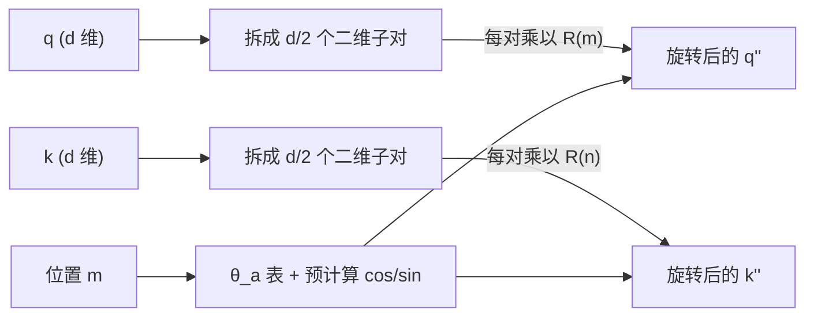
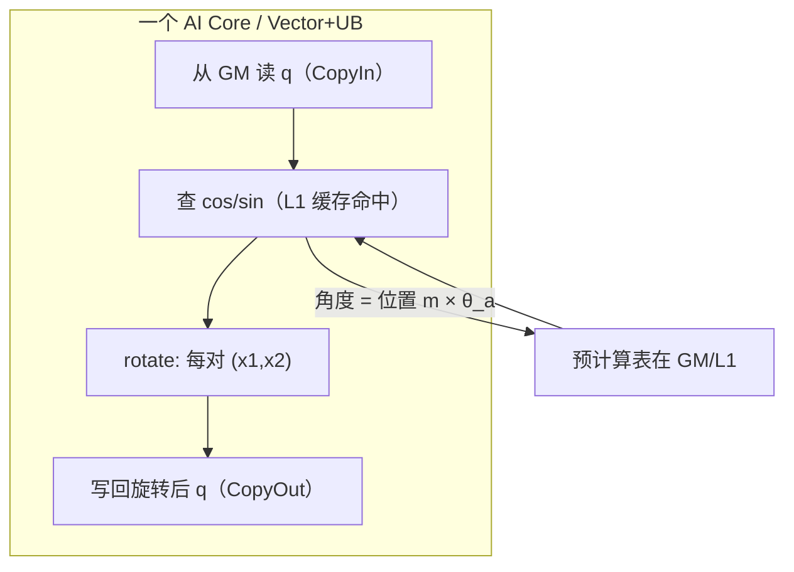

# 04 · RoPE（Rotary Position Embedding，旋转位置编码）

> 目标读者：已理解 Self-Attention 和 Softmax，想搞懂"Transformer 怎么知道词的位置"。
> 本文解释 RoPE 的数学直觉、为什么用它，以及它在 NPU 上怎么高效实现。

---

## 一、概述

Transformer 的注意力本身**对顺序一无所知**——把一句话的词语序打乱，它看成同样一句话。因此必须额外告诉模型"每个 token 在第几个位置"。RoPE（旋转位置编码，来自 RoFormer 论文）是目前大模型里最主流的方案之一：它把"位置信息"通过**旋转一小块向量**注入到 Q、K 里，让注意力能在数学上直接感知两 token 之间的**相对距离**。

```
TL;DR：RoPE 就是把每个词的 Q/K 小向量"原地转一个、与位置成正比的角"，
       让模型一看这向量角度变化，就知道它在第几位、离别的词有多远。
```

---

## 二、定义

### 2.1 关键思想：把每个 token 的向量"旋"起来

设查询向量 `q` 在第 `m` 个位置。RoPE 的做法是：将 `q` 拆成 `d/2` 对相邻的二维分量 `(q[a], q[a+1])`，每对用**角度 `m·θ_a`** 旋转：

```
将 q 看成二维子向量的并集：
  q'_a   = q_a · cos(m·θ_a) − q_{a+1} · sin(m·θ_a)
  q'_{a+1}= q_a · sin(m·θ_a) + q_{a+1} · cos(m·θ_a)

其中 θ_a = base^( −2a / d )，base 一般取 10000
```

写成紧凑的矩阵形式（对一个二维子对）：

```
R(m) = [ cos(m·θ)   −sin(m·θ) ]
       [ sin(m·θ)    cos(m·θ)  ]

q' = R(m) · q      （每个二维子对套用同一个 R(m)）
```

对 K 也做同样的旋转（位置 m 换成 K 的位置），于是 Q、K 都带着位置信息。整个算子的图如下：



> 人话：把向量的每一对小元素当一个表盘指针，按"位置 × 固定角速度"转一格。位置不同，角度就不同；位置差多少，角度就差多少。

### 2.2 为什么"旋转"能表达相对距离

旋转有个神奇性质：**两个都旋转后的向量做点积，等于"先求原向量与位置差角的旋转，再点积"**。也就是说：

```
<R(m)·q, R(n)·k> = <q, R(n−m)·k>      （n−m 是相对距离）
```

这样注意力分数只依赖 **q 与 k 的相对位置 `n−m`**，而不是各自的绝对位置。这让模型天生学会"第 5 个词和第 3 个词的关系，与第 100 和第 98 个词的关系同构"，即**相对位置编码**。而且角度随位置单调，天然带"距离越远相互依赖越弱"的衰减倾向。

---

## 三、为什么需要它

### 3.1 Attention 天生"不认位置"

Self-Attention 对 token 做的是集合运算：输出是各个 value 的加权和，权重只看它与 query 的相似度，**不看先后顺序**。不给位置信息，模型就分不清"我爱"和"爱我"。位置编码就是补上这一课的"位置坐标"。

### 3.2 相比其它位置编码的优势

- 它是**相对位置感知**的（上面那条性质），泛化到训练时没见过的更长序列更好；
- 它是**外推友好**的：可旋转到任意更大的位置，不需要为每种长度都训一遍；
- 它同时带着绝对位置（越靠后转得越多）和相对位置（差角），信息量大；
- 实现简单、不额外加参，与现有 Q/K 深度融合。

（这也解释了为什么 LLaMA、Qwen、GLM 等后来的大模型几乎都选了 RoPE。）

---

## 四、朴素实现

### 4.1 先算好 cos/sin 表格

把角度按位置和维度预计算成两张表（`d` = channel 维，`m` = 序列位置）：

```python
import numpy as np

def precompute_rope_theta(d, base=10000):
    inv_freq = 1.0 / (base ** (np.arange(0, d, 2) / d))   # θ_a
    return inv_freq

def apply_rope(x, positions, inv_freq):
    # x: (…, d)；把 d 拆成两半，交错做旋转
    d = x.shape[-1]
    # 每对维度用到的角度 = position * θ_a
    angles = positions[..., None] * inv_freq            # (…, d/2)
    cos = np.cos(angles); sin = np.sin(angles)
    # x1 = 偶数下标，x2 = 奇数下标，rotate 成对交换
    x1, x2 = x[..., 0::2], x[..., 1::2]
    rotate = np.concatenate(
        [x1 * cos[..., :d//2] - x2 * sin[..., :d//2],
         x1 * sin[..., :d//2] + x2 * cos[..., :d//2]],
        axis=-1)
    return rotate
```

要点：基本运算就是**每对元素各自的 `(x1*cos − x2*sin, x1*sin + x2*cos)`**——本质上是一次二维旋转 / 复数乘法（把 `x1 + i·x2` 乘以 `cos + i·sin`）。

### 4.2 另一种等价的写法：用复数

`(x1 + i x2) · (cosθ + i sinθ)` 刚好就是上面的旋转结果。这也是很多实现用复数库快速计算 RoPE 的原因。

```
人话：RoPE 就是"把 q 的每一对元素当一个复数，乘一个只由位置决定的单位复数的角度"。
```

---

## 五、NPU 上的关键优化点

### 5.1 它其实是"逐元素 + 查表"，活该跑得快

RoPE 没有跨元素归约，本质是**element-wise**：对每一对元素做乘加旋转。这类运算是 **Vector 单元 + UB** 的主场。优化思路与第 01、02 篇一脉相承：**数据一趟进 UB，算完一趟出**，全程不落 GM。

### 5.2 预计算 cos/sin，别在 kernel 里现算三角

在数以万计的 token × 维度的规模上去现调 `cos`/`sin` 太贵。工程上**提前把 `cos`、`sin` 表算好放进 GM**，kernel 里只做"查表 + 乘加"。查表还能用 cache（`L1`/片上）让高频角度命中，减少 GM 访存。

### 5.3 交错存取 vs 半维拆分

旋转需要把 `x[0::2]` 和 `x[1::2]` 配对。两种常见排布：

- **半维拆分布局**：`[x1〔d/2〕| x2〔d/2〕]`，前半是偶数索引、后半是奇数索引——**一次搬两片、各自成块**，对 Vector 的成片访存最友好；
- **交错布局**：`[(x1,x2),(x1,x2),…]`——数据天然相邻，但索引取法要在 kernel 里显式处理，和 Cube 的 NZ 排布也常常对不上。

实际项目（如 tilelang/triton）常选用内存上更规整的排布，kernel 里用 `reshape`/`view` 化整为零。

### 5.4 和 Q/K 投影结合：避免单独一趟

RoPE 旋转变换是"线性"的，可以**和 Q、K 的投影 GEMM 融合/紧邻**：把旋转参数并入投影层之前/之后，让数据在片上持续流转。更常见的是在注意力主循环里与 `Q K^T` 打分之间交换数据，减少中间结果的 GM 往返。因为 RoPE 纯逐元素，融合它几乎零风险。



### 5.5 与 GEMM 的配合：在很多实现里它被"搬进打分离线"

RoPE 自身在 Vector 上算；它出来的 Q、K 紧接着会被喂给 **CUGEMM（Cube）** 做 `Q K^T`。所以调优重点常变成"RoPE 的输出直接留在片上、立刻被 Cube 预取到 L0A/L0B"，而不是先写回 GM 再让 GEMM 重新读。这就是"数据流「GM→L1→L0A/B→Cube」"里 RoPE 结果作为 GEMM 输入的那一环。

### 5.6 位置增量与"Only Once"优化

解码是逐个 token 推进的。对**新生成的 token**，位置 `m` 每次只 +1，于是：

- 它对每个维度要旋转的角度增量是固定的（就多 `θ_a` 这一步），**矩阵乘法只发生在新增的那一行 Q/K 与全部历史之间**；
- 工程上常把"预计算一张 0..max 的 cos/sin 表"摊到整个序列长度上，kernel 里每次只**取 `m` 这一行查表 + 旋转**，不必每步重新算整张表；
- 更进一步，`RoPE` 的结果（带位置的 Q/K）在解码里与上一轮共享大部分内容，很多实现就着 KV Cache / 已旋转的历史做增量，避免重复旋转旧的 Q/K。

> 人话：解码时位置只往前走一格，RoPE 也就"多转一格"，把整张表提前算好、只查新增行的角，是最省的做法。

---

## 常见误区与追问

1. **"RoPE 是加在 Input Embedding 上吗？"** 通常不是。它是转在 **Q、K** 上（很多实现也会顺带转 V 或不转），而不是加在 token embedding 上；它和"可学习的 Position Embedding"是两条不同的路。
2. **"旋转是'乘一个大旋转矩阵'吗？"** 是"块对角"结构──每个二维子对独立转，等价于乘一个块对角旋转矩阵。这样存储/内存里的 cos、sin 表是按 `d/2` 维存的。
3. **"位置越靠后角度越大，会溢出吗？"** 角度是周期循环的（每 `2π` 一转），大位置只是转过更多圈；对模型来说信息仍在角度差里。增量位置太重时，实现上按模处理即可。
4. **"RoPE 只有 cos/sin 两种预计算表就够吗？"** 两种就够放满 `d/2` 维的角度。实际实现常再为内存对齐展开成 `(d/2×2)` 的交错排布，但信息仍是那两列 cos、sin。省不下三角计算，省的是"每步现算"的重复工作量。
5. **"向量旋转后的 Q、K 是这样做乘法吗？用不用额外算子？"** 旋转后就是普通向量。后续 `Q@Kᵀ` 是普通矩阵乘（Cube），RoPE 只负责"让这俩向量带上位置相位"，乘法本身不需要专门算子。
6. **"cos/sin 表会占多大显存？"** 只需 `max序列长度 × d/2` 个标量（还是 fp16，区区几行），远小于一层权重，且所有 token 共享同一批角度列——属于"一次算好、处处查表"的廉价结构，几乎不占预算。

### 一个具体的旋转示例

设 `d=4`，某 token 位置 `m=1`，预先算好（示意，θ 按 `base=10000` 定）：
- 第一对 `(q0,q1)` 用角度 `θ_0 = 1·1.0 = 1.0`、第二对 `(q2,q3)` 用 `θ_1 = 1·0.01 = 0.01`（示意），则
  ```
  q0' = q0·cos1 − q1·sin1
  q1' = q0·sin1 + q1·cos1
  q2' = q2·cos0.01 − q3·sin0.01
  q3' = q2·sin0.01 + q3·cos0.01
  ```
  位置 `m=2` 时只是把上面的角度换成 `2θ`，`m=3` 换成 `3θ`——**同一套公式，角度跟着位置走**就是 RoPE 的全部。

> 补一句：对 `θ_a = base^(−2a/d)`，越靠后的维度（a 越大）角度 θ 越小 → 对位置的"灵敏度"越低，这正是不让高频位置抖动污染低维通道的设计。

---

## 六、数据流总览


---

## 七、TL;DR

- RoPE 用"旋转 Q/K 的一对对元素"注入位置信息；
- 点积后只剩相对位置 `n−m` → 天然的**相对位置编码**，还能外推长序列；
- 数学上等于"复数乘以单位角度"，属**逐元素**运算；
- NPU 上：Vector + UB 的活，预计算 cos/sin 表查表，注意数据排布（半维拆分 VS 交错）；
- 关键在**与 Q、K 投影 / QKᵀ 之间的数据流转**，别让旋转结果落 GM 再读。

---

## 复习自测（带答案要点）

1. **RoPE 加在哪个张量上？** → Q、K（多数实现；不一定转 V）。
2. **旋转的对象是什么？** → 把 q/k 按 `d/2` 对每两个相邻下标构成的二维子向量，套用块对角旋转矩阵。
3. **为什么它能表达"相对位置"？** → 因为 `` `<R(m)q, R(n)k> = <q, R(n−m)k>` ``，点积只依赖相对距离 `n−m`。
4. **base（默认 10000）变大意味着什么？** → 角度 θ 更小、对长距离更"宽容"，衰减曲率更缓（具体曲线见论文；这里只记定性关系）。
5. **在 NPU 上当主角是谁？** → Vector + UB：查预计算的 cos/sin 表做逐元素旋转，别在 kernel 里现算三角函数。
6. **"它为什么对外推长序列友好？"** → 任意更大位置仍可"多转几圈"，不需要为每种长度专门训练一种 embedding。
7. **"旋转后的 Q/K 怎么进入注意力？"** → 输出就是普通 Q/K 向量，直接交给 Cube 做 `Q@Kᵀ`；RoPE 只负责加位置相位，不引入额外乘法算子。

> 一句话串起来：RoPE 用"旋转 Q/K 的二维小块"把位置编进相位，点积后天然只剩相对距离，又能在 NPU 上用查表+Vector 廉价实现，所以成了大模型默认位置编码。

---

## 八、本仓库实现与实测（4 DSL，Ascend 910B2 / CANN 9.0.0，2026-09-05）

### 8.1 四种 DSL 的实现说明

配对约定：仓库统一**交错配对**（RoFormer 原版，`pair_a = (x[2a], x[2a+1])`），与本文 §4.1 的参考实现一致；θ_a = base^(-2a/d)，base=10000；cos/sin 表一律 host 预计算（§5.2）。

| DSL | 文件 | 核心策略 |
|---|---|---|
| NumPy 基准 | `examples/python/src/rope.py` | `rope_reference`（查表版，fp32 中间量）+ θ/cos/sin 表预计算 + 复数视角说明 |
| Triton-Ascend | `examples/triton_ascend/src/rope_triton.py` | **kernel 内用半维拆分布局**（前半/后半各一次连续 load，§5.3 对 Vector 成片访存最友好），wrapper 用 torch view 做 interleaved ↔ half-split 转换；`tables=` 接口接收预构建的 (cos, sin) NPU 张量 |
| TileLang-Ascend | `examples/tilelang_ascend/src/rope_tilelang.py` | 2D kernel 一次 launch：`(cid, vid)` 双 Vector 核每核一个 token，`T.serial` 逐对旋转；fp16 标量算术被 aicore 禁止，故显式 `.astype("float32")` 做复数乘再 cast 回 |
| Ascend C | `examples/ascend_c/op_kernel/rope_kernel.cpp` + `src/rope_host.cpp` | host 预计算 cos/sin 表（fp16, T×D/2）下发；单 block 逐对标量 fp32 乘加；q/k 一次 kernel 同时旋转 |

踩坑记录：**triton-ascend 3.2.0 的 InterleaveOptimization pass 对 stride-2 访存（`2*idx`）会触发编译器断言崩溃**，这正是 kernel 内改用半维拆分布局的直接原因——也验证了 §5.3 说的"交错布局要在 kernel 里显式处理、与成片访存不对齐"。

### 8.2 正确性实测（2026-09-05，`vllm-hust-cyj-21rc-cloud-container-86`）

校验维度：① 与 NumPy 交错配对参考的 allclose；② **每对范数守恒**（旋转不改变 (x1,x2) 欧氏范数）。容差 `atol=1e-2, rtol=1e-2`。

| 实现 | 用例 | 通过 | 最大误差 | 范数漂移 |
|---|---|---|---|---|
| NumPy 基准 | 保范数/相对位置性质/dtype + vs torch 复数乘 | 全过 | ≤ 1e-5 (fp32) | ≤ 1e-5 |
| Triton-Ascend | 7 用例（fp16/fp32、HALF 非 BLOCK 倍数、4D、D=4096、T=2048 大位置） | **7/7** | ≤ **7.8e-3** | ≤ 5.1e-3 |
| TileLang-Ascend | 6 用例（D=64/128/512/2048、2D 8×128、保范数） | **6/6** | ≤ **3.9e-3** | ≤ 2.1e-3 |
| Ascend C | 16×128 / 256×128 / 1024×512 | **3/3** | **err=0**（全部） | ≤ 2.8e-3 |

### 8.3 性能实测

Triton-Ascend（fp16，BLOCK=256，**查表张量预构建复用**，20 轮取最快）：

| T×D | 耗时 (ms) | 有效带宽 (GB/s) |
|---|---|---|
| 1024×128 | 0.487 | 1.6 |
| 1024×2048 | 1.063 | 11.8 |
| 4096×2048 | 3.469 | 14.5 |
| 16384×128 | 1.981 | 6.4 |
| 16384×2048 | **11.752** | **17.1** |

**查表预构建的量化证据（§5.2 的活教材）**：同为 16384×2048，若每次调用都在 host 用 numpy 现算 cos/sin 表并 H2D，实测 **328.4 ms**；预构建后 **11.75 ms**——差 **28 倍**，全部花在 host 三角函数上。"预计算一张表、处处查表" 不是风格偏好，是数量级的差距。

教学实现对照（非最优口径）：

| 实现 | 规模 | 耗时 (ms) | 说明 |
|---|---|---|---|
| Ascend C 标量版（单 block 含同步粗测） | 16×128 | 0.73 | 逐对 GetValue/SetValue |
| Ascend C 标量版 | 1024×512 | 37.6 | 单核标量地板 |
| TileLang 教学版（per-row Python 循环） | 256×4096 | 10.7 | Python/launch 开销主导 |

### 8.4 解读

- RoPE 纯逐元素、无归约，理论算术强度 3 FLOP / 6 B（读 x + 读 cos/sin 表 + 写 y）= 0.5 FLOP/Byte，比 RMSNorm 还低，**100% memory-bound**。Triton 版 17 GB/s 距理论带宽很远，主要因为：① wrapper 的 interleaved ↔ half-split 转换多出 2-3 次 GM 往返（§5.3 两种布局不能兼得的实测代价）；② kernel 内每对两次分离的 store。若模型内部统一 half-split 布局（LLaMA 系就是），这些转换与额外流量全部消失——**布局约定要从模型层面统一，算子层面只能兜底**。
- Ascend C 标量版 / TileLang per-row 循环为教学地板，仅验证语义。

### 8.5 可重复执行命令

```bash
# 正确性
cd examples/python && uv run python src/test_rope.py
cd examples/triton_ascend && ASCEND_RT_VISIBLE_DEVICES=2 uv run python src/test_rope.py
cd examples/tilelang_ascend && ACL_OP_INIT_MODE=1 ASCEND_RT_VISIBLE_DEVICES=2 uv run python src/test_rope.py
cd examples/ascend_c && ./build/ascend_rope 16 128

# 性能
cd examples/triton_ascend && ASCEND_RT_VISIBLE_DEVICES=2 uv run python src/bench_rope_triton.py
cd examples/tilelang_ascend && ACL_OP_INIT_MODE=1 ASCEND_RT_VISIBLE_DEVICES=2 uv run python src/bench_tilelang_ops.py
```

---

## 九、参考资料

- **RoPE / RoFormer 论文**（Jianlin Su et al., "RoFormer: Enhanced Transformer with Rotary Position Embedding", 2021）：
  https://arxiv.org/abs/2104.09864
- **HuggingFace Transformers 官方文档《RoFormer》**（RoPE 的模型文档）：
  https://huggingface.co/docs/transformers/en/model_doc/roformer
- 华为昇腾 CANN 官方文档（CANN 商用版 8.0）Ascend C API（Vector 指令库，RoPE 用到的乘加/取数类指令）：
  https://www.hiascend.cn/document
  （在文档中心检索"AscendC API · 向量指令"即可定位；地址带版本号，可能随版本迁移。）

> 说明：以上昇腾链接为官方文档中心入口，具体指令/说明页请按当前 CANN 版本目录检索。
---

## 上一篇 / 下一篇

- 上一篇：[03 · Softmax](/ops/03-softmax)
- 下一篇：[05 · GELU 与激活](/ops/05-gelu)
