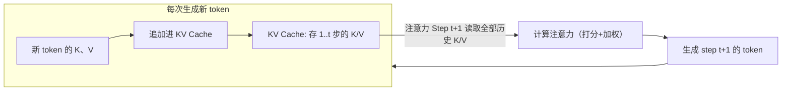
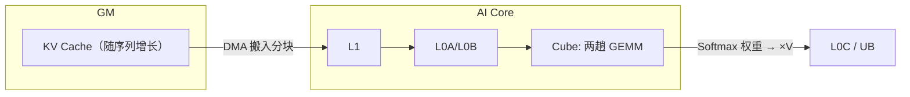
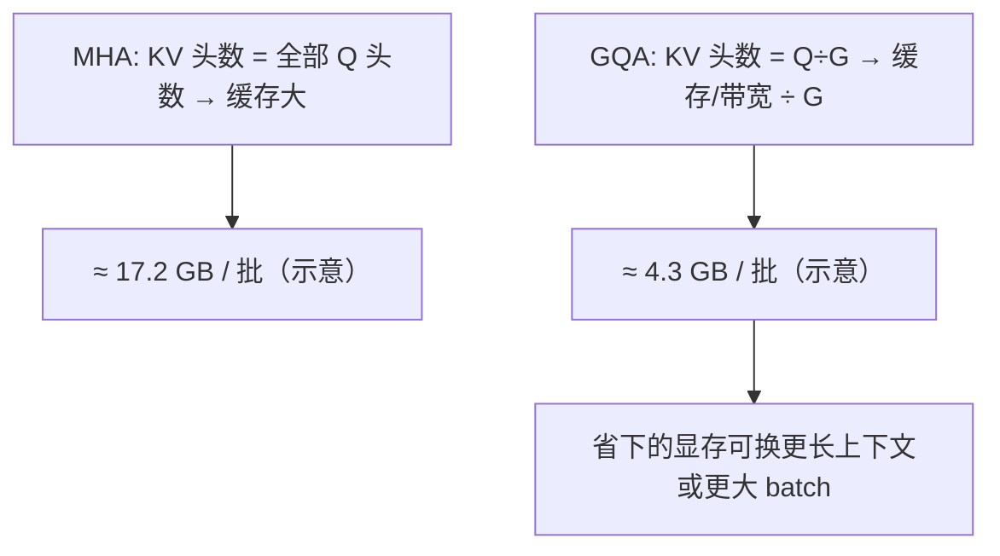
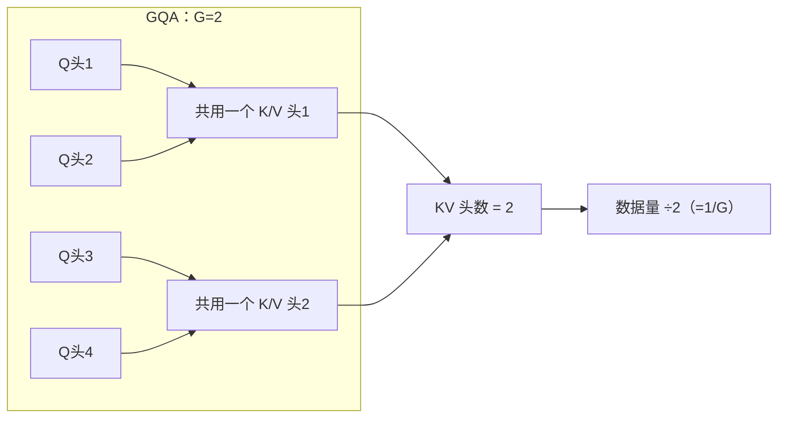
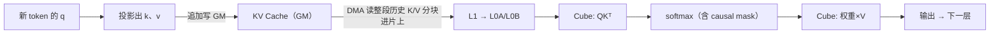

# 06 · GQA（Grouped Query Attention）与 KV Cache

> 目标读者：已经理解自注意力，想搞懂"推理时注意力为什么是显存和算力的重头"，以及 GQA/KV Cache 怎么救场。
> 本文讲 GQA 是什么、KV Cache 是什么、它们如何省显存，以及这对 NPU 推断的影响。

---

## 一、概述

在**推理阶段**（生成 token），注意力有两个突出问题：一是每次都要**重复计算/重复读**历史 token 的 K、V；二是要缓存它们，让显存被"敲了一不速之客"。**KV Cache** 就是把这些 K、V **缓存起来复用**；**GQA（分组多头注意力）**则通过"让多个 query 头共用一个 key/value 头"来**大幅削减要缓存和要读的 KV 数据量**。两者合起来，对推断的**延迟和显存**都有决定性影响。

```
TL;DR：KV Cache 是把算过的钥匙(Key)/值(Value)存起来别再重算；
       GQA 是让很多"问题头"共用少数的"钥匙/值组"，缓存和读取都省一大半。
```

---

## 二、定义

### 2.1 MHA、MQA、GQA 的关系

标准多头注意力（MHA）里，每个 query 头都有**自己专属的 K、V 头**：

```
MHA:  H 个 query 头  ×  H 个独立的 K/V 头
MQA:  H 个 query 头  ×  1 个共享 K/V 头         （Multi-Query Attention）
GQA:  H 个 query 头  ×  G 个共享 K/V 头（`1<G<H`）  （Grouped Query Attention）
```

GQA 是 MHA 和 MQA 的**中间态**：把 H 个 query 头分成 G 组，每组共享一个 K/V 头。当 `G=H` 时退化为 MHA，当 `G=1` 时退化为 MQA。

| 方案 | 独立 K/V 头数 | 省 KV 显存 | 精度 |
|---|---|---|---|
| MHA | H | 不省（基线） | 基准精度 |
| MQA | 1 | 最多 | 可能微降 |
| GQA | G（取 `1<G<H`） | 显著 | 接近 MHA |

> 人话：MHA 是每人一间办公室，MQA 是所有人挤一间，GQA 是"几个小组共用一间"——折腾合适就有兼顾。

### 2.2 KV Cache 是什么

推理解码是**逐个 token** 出字的。第 `t` 步生成的 token，它的 K、V 会被下一步用到；而前面 1..t−1 的 K、V 也被每步的注意力反复消费（当下 token 要"看"所有历史 token）。与其每步都从最原始的值重算一遍历史 K、V，不如把算好的 K、V **存进一个随序列增长的缓存**，每次只把**新章 token** 的 K、V 追加进去。这个缓存就是 **KV Cache**。



---

## 三、为什么需要：KV Cache 与 GQA 各自救什么

### 3.1 没有 KV Cache 会有两个灾难

1. **算力浪费**：每步都把所有历史 token 的 K、V 重算一遍——序列越长，重复计算越多（O(序列长度²) 的总量级）；
2. **读不赢**：即使重算，也要从 GM 反复读历史数据，带宽被拖死。

有 KV Cache 之后，每步只需：**算一个新 token 的 K、V → 追加缓存 → 从缓存读出全部 → 注意力**。历史计算归零，代价从"平方量级"降到"线性量级（每步 O(序列长度)）"。

### 3.2 KV Cache 又把显存"吃"了

有了缓存，就要**存**住全部历史 K、V。KV Cache 大小约：

```
KV 大小 ≈ 2 × batch × 层数 × KV头数 × 每头维度 × 序列长度 × 字节/元素
#          ↑ K 和 V 两份              ↑ GQA 削减的就是这一项
```

序列长、层数多、模型大时，KV Cache 很容易占掉一半以上的显存，成为能跑多长上下文的**硬上限**。

### 3.3 GQA 精准削减 KV 的"头数"

GQA 用"**更少的 K/V 头**"直接按比例砍掉要缓存和要读取的 KV 数据量。比如 H=32、G=4（每 4 个 Q 头共享 1 个 KV 头），KV 头数从 32 降到 8，KV Cache 和注意力的 KV 读取带宽就变成原来的 **1/4**。GQA 论文证明这种压缩下精度损失很小，因此成了 LLaMA-2/3 等主流模型的标配。

> 人话：KV Cache 解决"别重算、别老读 GM"的问题；GQA 解决"缓存太占显存、KV 读取太宽"的问题。一个是省算，一个是省存+省带宽。

---

## 四、朴素实现

### 4.1 伪代码视角（推理解码的一步）

```python
# 假设 cache_k, cache_v 已存在 GM 上，长度已到 t-1
def decode_step(query_t, cache_k, cache_v, pos):
    # 1) 算新 K、V 并追加
    k_t = project_k(query_t); v_t = project_v(query_t)
    cache_k[pos] = k_t;  cache_v[pos] = v_t
    # 2) 读全部历史（含新)
    K = cache_k[:pos+1]; V = cache_v[:pos+1]
    # 3) 注意力：softmax(Q@Kᵀ / √d) @ V
    scores = (query_t @ K.T) / math.sqrt(dk)
    scores = mask_upper(scores)     # causal，只看过去
    w = softmax(scores)
    out = w @ V
    return out
```

关键的**朴素瓶颈**：`K = cache_k[:pos+1]` 这一读，每次要把 pos+1 个位置全部从 GM 读进片上；`@ V` 的稠密矩阵乘随 pos 线性变大。

### 4.2 复杂度小结

| 阶段 | 每步代价 | 总代价（生成 L 个 token） |
|---|---|---|
| 无 KV Cache（重算历史 K/V） | O(L) 重算 + O(L²) 注意力 | O(L³)（量级示意） |
| 有 KV Cache（复用历史） | O(L) 只读 | O(L²)（注意力主导） |
| + GQA（减 KV 头数） | O(L/G乘数) 读写 | KV 带宽下降 G 倍 |

（数值为教材量级示意，具体以模型配置为准。）

---

## 五、NPU 上的关键优化点

### 5.1 KV Cache 就住在 GM，注意力把"整段历史"当矩阵读

KV Cache 存在 **GM**（HBM）里。注意力的 `Q K^T` 和 `(softmax) V` 本质是两趟 GEMM，读的就是这整段历史矩阵。于是优化的核心变成：**把 cache 数据高效搬进片上（L1→L0A/L0B）并让 Cube 复用**，而不是逐位置零敲碎打地读。



### 5.2 GQA 的访存收益，正是 NPU 上最难能可贵的资源

NPU 的注意力常被**带宽**（读写 KV）卡住，而不是算力。GQA 把 KV 头数砍成原来的 1/G，等于把"要从 GM 倒进 Cube 的数据量"直接除以 G。**每减少一次 GM→片上的搬运，就是一次实打实的加速**——这比盲目加算力划算得多。

### 5.3 显存配平：KV Cache 大头在 GM，要按头数规划

把 KV Cache 存在 GM 时，要按"batch × 层数 × KV头数 × 每头维度 × 序列上限"算好预留量（即上面的 KV 大小公式）。GQA 让这条公式里的"KV头数"缩小，同样的物理显存能支撑更长的上下文或更大的 batch。推理部署时常把 KV Cache 单独分配、做内存池复用，避免碎片。

### 5.4 与 Softmax / FlashAttention 的配合

注意力里的 `Q K^T`、`softmax`、`×V` 正好是 Flash 风格做法施展的地方（见下一篇）：**在线 softmax + 分块**让从 KV Cache 读出的一块历史就能立即参与计算，不必先把整段 softmax 摊在显存。GQA 减小读入量、Flash 减小中途驻留量，两把刀一起用，长上下文才跑得动。

### 5.5 解码时的"旧 KV 只读不写回"

对已缓存的历史 K、V，NPU kernel 只做**读**并把新 token 的 K、V **写追加**。这一"读多写少"的模式，正是让 `L1→L0A/B` 复用和 Cube 打满的关键——配置好预取、双缓冲，读历史 KV 的带宽就不会浪费。

### 5.6 长上下文与"分页"（KV 碎片问题的先导）

KV Cache 随序列增长、且长度往往不固定（batch 内各请求长短不一），直接在 GM 里连续开一块大内存容易**碎片化 / 浪费**。近年工程解法是**分页注意力（PagedAttention）**：按固定大小"页"来分配和管理 KV Cache，像操作系统分页一样按需挂接，从而支持更大的 batch 和更长的序列。它对 NPU 的意义在于：**把"搬运粒度"和"分配粒度"解耦**——按页预取、按页复用，访问模式更规整，也更容易与 Cube 的分块对齐。

> 人话：KV Cache 是"越写越大、长短不一"的账本，直接整块预留会浪费；分成一页页记账，既能精准分配、又方便整页搬上片复用。

---

## 常见误区与追问

1. **"GQA 是训练时省，还是推理时省？"** 两头都带来收益，但**推理更显著**：它主要把 KV Cache 的大小和推理时的 KV 读取带宽砍到 1/G。训练时照样并行度高，只是 KV 头少了、缓存更省。
2. **"KV Cache 会不会把注意力结果污染？"** 不会——缓存是"算过的 K/V"，语义上等于重算，只是换了存储；用缓存恰恰是为了避免每次重算历史。它不改变数学结果（只改速度与显存账面）。
3. **"序列一变长，KV Cache 会无限涨？"** 是的——它在 GM 里随序列长度近似线性增长，这就是为什么"推理超长上下文 = 预算 KV 显存"。这也是分页注意力（PagedAttention）按页管理缓存、避免碎片的原因。
4. **"GQA 的 Q 头变少了会影响表达能力吗？"** 会略降（相比 MHA）。GQA 论文的做法是把训好的 MHA 检查点的 KV 头做**均值池化**，再短暂 uptraining 恢复精度（不改每头维度）；论文在常见规模上报告与 MHA 几乎同等精度。它换来的是逻辑/带宽的大幅下降，属于"少省换快"的划算买卖。
5. **"KV Cache 为什么存的是 K、V 而不是 score？"** 因为下一 token 的注意力要用**新的 Q** 去跟所有历史的 K 重新打分，score 每次都在变，没法缓存；能复用、语义不变的是 K、V（以及它们后续的打分运算省下来的重算）。
6. **"GQA+KVCache 之后注意力还贵吗？"** 仍贵，但瓶颈已不再是"历史重算"而是"读取历史 KV 的带宽 + 与它做矩阵乘"——这正是后续 FlashAttention（下一篇）继续在"让读入的数据被充分复用、少搬"上发力的原因。

### 一个具体的 KV 显存估算（顺序级示意，数值待核验）

假设：层数 `L=32`，KV 头数 `H`，每头维 `d=128`，序列 `N=4096`，批量 `B=8`，fp16（2 字节）。按"2 × L × H × d × N × B × 2B"粗略估算：
- MHA（每头自有 K 与 V，共 `H=32` 头）：`2×32×32×128×4096×8×2 ≈ 1.72×10¹⁰ B` ≈ **17.2 GB / 批**（示意量级）；
- GQA（`G=4`，KV 头数变 `H_g=H/G=8`）：KV Cache 大约变成上述的 **1/4** ≈ 4.3 GB / 批。

（`H=32、G=4` 只是为说明比例所设的示意配置；不同模型的实际缓存量与 1/G 的关系一致。所有数值以实际模型配置与 `nvml`/NPU Profiler 为准。）



> 人话：KV Cache 的"体积"里乘了一个 `KV头数`，GQA 把这个乘数整体缩小 G 倍，立竿见影。

### 一个 GQA 头共享的手算（理解"÷G"从哪来）

设模型有 `H=4` 个 query 头、`G=2` 个分组：

- **MHA**：4 个 query 头各自配 4 个独立的 K/V 头 → KV 头数 = 4，KV Cache 与 KV 读取带宽都按 4 份记；
- **GQA（G=2）**：4 个 query 头分成 2 组，每组 2 个 query 头**共用一个 K/V 头** → KV 头数 = 2 = `H÷G`；
- 于是需要分配、缓存、搬运的 K/V 数据量降为 MHA 的 **1/2**（= 1/G）。

换成 `H=32、G=8`：KV 头数从 32 → 4，KV Cache 与带宽降到 **1/8**。这正是 3.3 节"KV 头数 ÷G"这句话的由来——数字链条就是"共用的 K/V 头变少 → 记账乘数变小 → 缓存与带宽同步缩水"。



---

## 六、数据流总览



---

## 七、TL;DR

- **KV Cache**：把算过的历史 K/V 存起来，别再重算、别老读 GM，注意力每步从 O(L²) 降到 O(L)；
- **GQA**：多个 query 头共用少数 K/V 头，KV 数据量（缓存 + 带宽）按 1/G 缩水，精度损失很小；
- NPU 上注意力的命门是 **KV 的取数带宽**：数据住 GM、被 Cube 当矩阵复用是主线；
- GQA 省的是"要搬进片上"的量，Flash 省的是"片上驻留"的量，配合才撑起长上下文。

---

## 八、参考资料

- **GQA 论文**（Joshua Ainslie et al., "GQA: Training Generalized Multi-Query Transformer Models from Multi-Head and Checkpointed Models", EMNLP 2023）：
  https://arxiv.org/abs/2305.13245
- **MQA（Multi-Query）论文**（Noam Shazeer, "Fast Transformer Decoding: One Write-Head is All You Need", 2019）：
  https://arxiv.org/abs/1911.02150
- **HuggingFace Transformers 官方文档《LLM 优化技巧》**（含 KV Cache、GQA、注意力优化等章节）：
  https://huggingface.co/docs/transformers/en/llm_optims
- **HuggingFace 官方文档《KV Cache 与分页注意力》**（可视化讲解 KV Cache、PagedAttention）：
  https://huggingface.co/docs/transformers/en/llm_optims/paged_attention#kv-cache
  （注：该子页为 llm_optims 的 KV 缓存小节，URL 以官方文档当前结构为准。）

> 说明：以上 HuggingFace 链接为官方文档常规地址；若主版本更新导致子页路径调整，请从 https://huggingface.co/docs/transformers/en/llm_optims 导航进入。
---

## 上一篇 / 下一篇

- 上一篇：[05 · GELU 与激活](/ops/05-gelu)
- 下一篇：[07 · FlashAttention](/ops/07-flash-attention)
