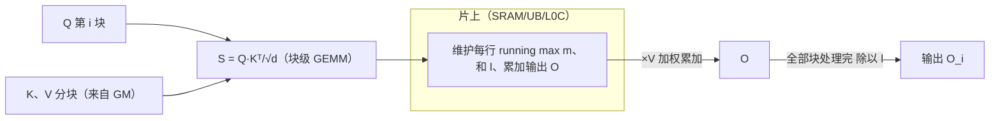
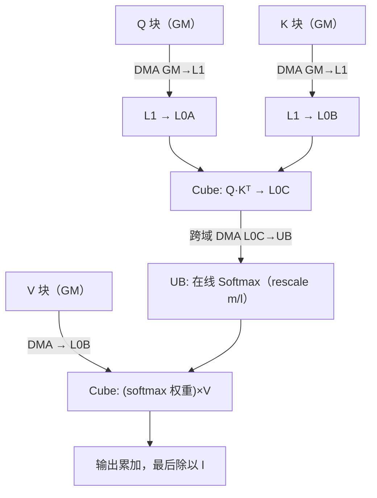
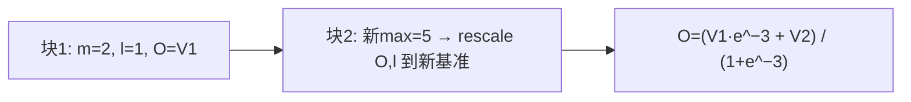
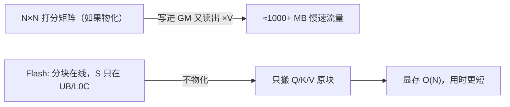
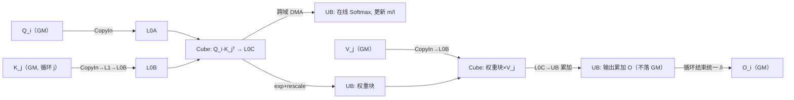

# 07 · FlashAttention（在线 Softmax + 分块 + IO 感知）

> 目标读者：已经懂 Softmax 和注意力，想搞懂"为什么现在大模型长上下文都要 FlashAttention"。
> 本文把它拆成三件可理解的事——在线 Softmax、分块（tiling）、IO 感知，并落地到昇腾 NPU。

---

## 一、概述

朴素 Self-Attention 会在显存里**物化**一个巨大的 `N×N` 注意力矩阵（N=序列长度），O(N²) 显存、O(N²) 时间，序列一长就爆。FlashAttention（Tri Dao et al., 2022）打破常规：**不把完整的注意力矩阵写进显存**，而是**一次只算一小块，边算边在片上完成归一化，然后立刻×V 加权**，需要的显存从 O(N²) 降到 O(N)，速度还更快。

它靠的正是三根支柱：

1. **在线（online）Softmax**——分块时也能得到和整体一致的归一化结果（见第 3 篇）；
2. **分块 / tiling**——把 Q、K、V 都切成块，一块一块地算；
3. **IO 感知（IO-aware）**——一个简单的原则：**少让数据进出慢速/大容量存储（HBM/GM），多在快速/小容量片上（SRAM/UB/L1）复用**。

```
TL;DR：FlashAttention = 在线Softmax + 分块 + 一个"少搬数据"的原则，
       把注意力从"全算出来存着"改成"边算边弃"，显存线性、速度更快且精度不变。
```

---

## 二、定义

### 2.1 标准注意力的分解

注意力输出：

```
O = softmax(Q·Kᵀ / √d) · V          （对每行做 softmax，结果再乘 V）
```

问题在于 `softmax(QKᵀ/√d)` 这个 `N×N` 的满矩阵会被**整体写进 HBM** 再被后面 `×V` 读出来——物化 O(N²) 的数据，带宽白烧。

### 2.2 Flash 的关键：把 O(N²) 矩阵熔进"分块循环"

对每个输出块 `O_i`，它依赖的是：

- `Q` 的一部分行（第 i 块）；
- **所有的 K、V**。

于是对 `O_i` 可以**沿 K 维（序列维）分块**，逐块推进并维护 running statistics：

```
对每一块 K_j、V_j（j = 1..J）：
  S_{ij} = Q_i · K_jᵀ / √d          # 块内打分（得一"片"）
  m, l, O 在线更新：                 # 见第 3 篇 Online Softmax
      若块内 max 变大 → rescale 历史 O、l
      l ← l + Σ exp(S_{ij} − m)
      O ← O/旧缩放）…… 边算边用 exp 加权 V_j 累加进 O
最后 O_i = O_i / l                # 统一除分母
```

**关键点**：`O_i` 从头到尾**只在片上（SRAM/UB）维护**，从不把 `S` 整块写成 `N×N` 的注意力矩阵。这省掉了 O(N²) 的一次写 + 一次读。



> 人话：普通写法"先把整张打分表摊出来，再慢慢归一化、再乘 V"；Flash 写成"来一块，算一块，顺手归一化、顺手乘 V，丢一块。"打分表始终不落地。

---

## 三、为什么需要它

### 3.1 朴素注意力的两个硬伤

- **显存 O(N²)**：`N×N` 矩阵物化，序列 16K 时就是 2.56 亿个元素，显存直接在注意力层爆；
- **带宽被 O(N²) 读写**：物化和重读这整张矩阵，把慢速存储带宽烧光。

### 3.2 FlashAttention 是"精确算法"，不是近似

很多人误以为它牺牲精度换速度——**并没有**。它通过在线 Softmax 得到与朴素结果**逐元素等价**（数值一致）的输出，只是计算顺序不同。它速度比基线快 2~4 倍、显存从 O(N²)→O(N)，精度不变。这让"长上下文"从不可能变成可能（论文里首次让 64K 序列在受限场景出成绩）。

---

## 四、朴素实现（回顾问题）

```python
import numpy as np
import math

def attention_naive(Q, K, V, causal=True):
    N, d = Q.shape[-2], Q.shape[-1]
    S = Q @ K.T / math.sqrt(d)            # (N,N) ← 完整物化
    if causal:                            # 上三角置 -inf
        S = np.triu(S, k=1)*-np.inf + np.tril(S)
    w = np.exp(S - S.max(axis=-1, keepdims=True))
    w = w / w.sum(axis=-1, keepdims=True) # softmax (N,N)
    return w @ V                          # 再乘 V，又读一遍 w
```

病根：`w` 这个 `N×N` 矩阵进出慢速存储两趟（写 + 读）。

---

## 五、NPU 上的关键优化点（分块 + 在线 Softmax + IO 感知）

### 5.1 把"物化矩阵"变成"分块循环"，映射到 Cube + Vector

在昇腾 NPU 上，Flash 风格注意力被拆成两条腿：

- **Cube**：`Q·Kᵀ`、`经过 softmax 的权重 × V` 是**矩阵乘**，走 Cube（凑 16 的倍数分块）；
- **Vector**：对打分块做在线 softmax（`ReduceMax`→`vExp`→`ReduceSum`→rescale），在 **UB** 上完成。

数据在 `GM → L1 → L0A/L0B → Cube → L0C → (DMA) 跨域到 UB → Vector → 回 GM` 之间分块流转——**每个块只在需要时搬上片，用完即弃**。



### 5.2 IO 感知：Flash 的核心哲学就是"复用片上数据"

Flash 名字里的 "IO-aware" 指的是**把数据从慢速存储（HBM/GM）搬到快速片上（SRAM/UB/L1/L0）的次数越少越好**。在 NPU 语境下这翻译成几个要点：

- 一个块被搬上片后，要**尽量反复复用**（L1 缓存、L0A/L0B 预取），而不是用完就丢、立刻回 GM 拿新的；
- **矩阵乘复用**：`Q` 一块会跟多个 `K` 块相乘，`V`/`K` 块也会被多个 `Q` 行用——靠 L1/L0A/L0B 让这些复用发生在片上，而不是每次从 GM 重新拉。

> 人话：把钱花在刀刃上的搬一次，剩下的“再算多块”都在片上内循环里完成，别反复去仓库取。

### 5.3 最终实现还要"除以 l"：多块全部算完才收尾

因为在线 softmax 的归一化分母 `l` 要等**所有 K/V 块都贡献完**才确定，所以最后的 `O = O_accum / l` 放在循环末尾、输出前做一次。这跟第 3 篇在线 Softmax 的收官动作完全一致——是同一套思想的两个版本。

### 5.4 因果掩码与"分段处理长度"

解码时只允许看过去，所以对 Q、K 的块要加**因果掩码**（给未来位置填 −∞/0），这正好配合分块：**跨越块边界的分块不需要**。同时，实际长序列常按"分成若干段分块"的方式，段内 Flash 分块、段间当普通 GEMM——平衡片上容量和复用率。

### 5.5 与 GQA/KV Cache 的叠加（承接第 6 篇）

- KV Cache 提供历史 K、V（在 GM）；
- Flash 风格把从 cache 读出的分块历史 K/V **直接复用 + 边算边弃**；
- 再叠加 GQA 的头数压缩，长上下文从"存不下"变成"能搬得动、算得动"。

三者是一套组合拳：**GQA 省 KV 量，KV Cache 省重算，Flash 省物化矩阵的读写。**

### 5.6 一个具体的"分块在线注意力"手算（正确性证明）

拿**一条 2 token 序列**、一个 query 行来演示在线累加（这里"块"简化成每个 token 一块，方便手算）。设某个 query 对两个 token 的打分 `S = [2, 5]`，value 分别为 `V1、V2`：

1. **处理第 1 块**：`m ← 2`，`l = e^{2−2} = 1`，`O = e^{0}·V1 = V1`；
2. **处理第 2 块**：新块 max `m'=5 > 2`，触发 rescale：
   - `O ← O·e^{m−m'} = V1·e^{2−5} = V1·e^{−3}`
   - `l ← l·e^{m−m'} = e^{−3}`
   - 更新 `m ← 5`，再累加：`l += e^{5−5}=1` → `l = 1 + e^{−3}`，`O += e^{0}·V2 = V2`
3. **收尾**：`O = (V1·e^{−3} + V2) / (1 + e^{−3})`。

对照"整条一起算"：`softmax(S)=[e^{2−5}, e^{5−5}]/[e^{−3}+1]`，输出 `= (V1·e^{−3} + V2)/(e^{−3}+1)`——**完全一致**。可见 rescale 只是事后把"先见到的小 max 下已算的部分"等比改写，数学不变、还能分块，这就是 Flash 敢说"精确"的原因。



---

## 常见误区与追问

1. **"FlashAttention 会损失精度吗？"** 不会。它是**精确算法**，与朴素 softmax 逐元素等价，只是计算顺序/分块不同。论文明确强调"exact"。
2. **"它是"优化后的 Softmax"还是"另一种 Attention"？"** 它不改变注意力的数学公式，只是把 `softmax(QKᵀ/√d)V` 的实现从"物化 N×N"改成"分块在线"，所以可无缝替换任意 Transformer 的注意力。
3. **"分块/在线是不是只能在 GPU 上用？"** 不是原理限定，而是"少搬数据"的普适原则。昇腾 NPU 的 Cube+Vector+UB 同样适用（见第 5 节的路由），只是把 SRAM 换成 L1/L0A/B、UB。
4. **"Flash 风格的快，快在哪？"** 快在**少碰慢速存储**：不再把 `N×N` 打分矩阵写进/读出 HBM，只在片上做"块级 GEMM + 在线 softmax + ×V"。它不减少算力需求，而是把受带宽拖累的实现换成受片上容量约束的实现。
5. **"分块越小越好吗？"** 不。块越大，数据复用率越高（`Q` 一块能打更多 `K` 块、`K/V` 块被更多 `Q` 用），但越挑片上容量。要和 L1/L0A/B、UB 的容量以及 Cube 的 16 粒度取一个平衡——这又回到 tiling 那句"装得下、填得满"。
6. **"Flash 已是精确算法，为什么还有 Flash-2/3？"** 因为要提升的是**吞吐与并行**。FlashAttention-2 优化了块调度和关键路径上的并行/工作分配（减少不必要的 rescale 次数、更好利用设备），但**数学仍是精确的**——改的是"怎么把设备喂得更满"，不是精度。
7. **"一个输出块 O_i 要扫完所有 K、V 块吗？"** 在因果注意力里只需扫到自身位置为止；而它全程随身带着 running 的 `m/l/O`，扫完全部相关块才统一 `÷l` 收尾。所以 O_i 是"最后除一次 l"，不是每块各除各的。

### 一个具体的显存账目（对比物化 vs Flash）

设 `N=16384`，`d=64`，fp16（2 字节），仅看"N×N 打分矩阵"这一处：
- **朴素物化**：`N×N×2 = 16384²×2 ≈ 537 MB` 的 `S` 矩阵写一次 GM、再被 `×V` 读出一次，往返 ~1 GB 的慢速存储流量；
- **Flash**：`S` 的每个分块只在片上（UB/L0C）存在，**从不物化**，只搬"Q/K/V 的原块"，中间不产生这份 O(N²) 临时数据。

这就是"显存从 O(N²)→O(N)、还更快"的直观来源。



> 注：上述 MB 数为示意性估算（`16384²×2`），用于说明"物化 vs 不物化"的量级差异，不是实测值。

---

## 六、数据流总览（一个输出块 O_i）



---

## 七、TL;DR

- FlashAttention = **在线 Softmax + 分块 + IO 感知（少搬数据）**，是**精确算法**（精度不降）；
- 核心动作：把 `N×N` 注意力矩阵**取消物化**——来一块算一块，边归一化边×V，用完丢弃；
- 在 NPU 上：**Cube 算打分/加权**、**Vector 在 UB 在线 softmax**，数据按块进出 `GM→L1→L0A/B→Cube→L0C→UB`，靠 L1/L0 复用取数；
- 显存 O(N)→ 长上下文变可能；速度还更快（比朴素基线 2~4×，见论文）；
- 与 GQA + KV Cache 组合：一个省 KV、一个省重算、一个省矩阵物化。
- 一个值得记着的点：它是"精确"的，只在计算顺序/分块上动文章，不在结果上打折——这正让它成为长上下文的标准实现。
- 若想把原理落到实处，回到 5.6 那份手算再走一遍 rescale 就懂——它把"旧 O/l 等比改写"，最终与整条一起算逐元素一致，这正是"精确"二字所在。
- 再补一个直觉：**Flash 因"少搬"而快，不是因"少算"而快**——它把慢速存储的读写流量压到最小，让片上复用承接绝大多数取数。

---

## 八、参考资料

- **FlashAttention 论文**（Tri Dao, Daniel Y. Fu et al., "FlashAttention: Fast and Memory-Efficient Exact Attention with IO-Awareness", NeurIPS 2022）：
  https://arxiv.org/abs/2205.14135
- **FlashAttention-2 论文**（Tri Dao, "FlashAttention-2: Faster Attention with Better Parallelism and Work Partitioning", 2023）：
  https://arxiv.org/abs/2307.08691
- **官方开源实现**（Dao-AILab / flash-attention 仓库）：
  https://github.com/Dao-AILab/flash-attention
- **在线 Softmax 论文**（Milakov & Gimelshein, "Online normalizer calculation for softmax", 2018）：
  https://arxiv.org/abs/1805.02867
- **HuggingFace 官方文档《FlashAttention 与更长序列》**（LLM 优化：FlashAttention-2 使用）：
  https://huggingface.co/docs/transformers/en/perf_infer_gpu_one
- 华为昇腾 CANN 官方文档（CANN 商用版版索引，检索 FlashAttention / 注意力相关算子与融合）：
  https://www.hiascend.cn/document

> 说明：HF `perf_infer_gpu_one` 为官方性能优化文档（README 中已多次被引用），Flash 相关内容在其 FlashAttention 章节；若子页路径调整，请从 https://huggingface.co/docs/transformers/en/perf_infer_gpu_one 导航。
---

## 延伸

- 这套原理的下一代（FA3 异步调度、MLA、稀疏注意力）见 [Attention 前沿](/sota/01-sota-attention)。

---

## 上一篇 / 下一篇

- 上一篇：[06 · GQA 与 KV Cache](/ops/06-gqa-kvcache)
- 下一篇：[08 · 量化与反量化](/ops/08-quantization)
