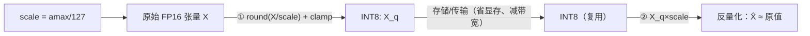
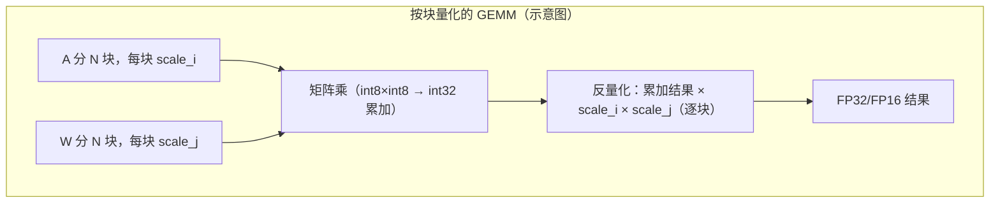
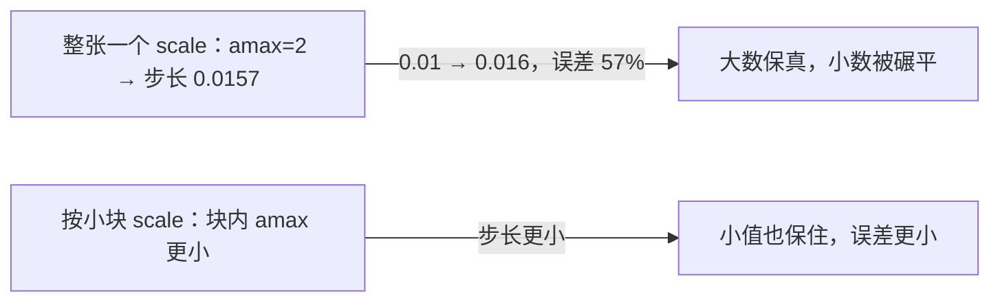

# 08 · 量化（FP8/INT8/W8A8）与反量化 Dequant

> 目标读者：懂 GEMM 和混合精度，想搞懂"为什么大模型要量化、量化怎么在 NPU 上做、反量化和混精是什么关系"。
> 本文讲 FP8/INT8/W8A8、量化与反量化流程，以及 fp16+fp32 混合精度累加的辨析。

---

## 一、概述

衡量模型推理成本的有两把尺子：**存它要占的显存**，和**算它要做的运算量**。量化把这把尺子整体缩小一个量级——把 FP16（2 字节）/FP32（4 字节）的数压成 FP8 / INT8（1 字节），让同样的显存能装下更大的模型、同样的算力能做更多运算，代价是用"一点点精度"去换。反量化（Dequant）则把算完的低精度结果"做回"较高精度，供后续运算继续。

```
TL;DR：量化 = 把数字"降分辨率"存起来、算起来更省；
       反量化 = 用之前记下的缩放比例把结果"还原"到正常精度。
```

---

## 二、定义

### 2.1 Tensor 级对称量化（INT8 为例）

先看最基本的 INT8 量化。把范围 `[−127,127]` 看作仓库格，把张量 X 的数值按**绝对值最大 `amax`** 映射进去：

```
scale = amax / 127                 # 每个张量（或逐行/逐通道）一个缩放；scale 是反量化时的"步长"
X_q = clamp( round( X / scale ), -127, 127 )     # 量化 Quant：除以步长、取整、裁剪
X̂   = X_q * scale                  # 反量化 Dequant（乘回步长，还原到原数值范围）
```

校验：`X = amax` 时 `X_q = round(amax / (amax/127)) = 127`，正好顶到 int8 上界；其余值按比例落在 `[-127,127]`。

于是：

```
X ≈ X̂ = X_q * scale
```

- **Quant 方向**：把高精度 X 乘上 `1/scale`，四舍五入+裁剪到 int8；
- **Dequant 方向**：把 int8 结果乘回 `scale`，得到接近原值的浮点。



> 人话：反量化就是"乘回当初缩放的倍数"。quant 时你把数"缩小+取整"存起来，dequant 时按同一把尺子放大回来。

### 2.2 W8A8：权重和激活都量化成 int8

常见的 "W8A8" 表示**权重（Weight）是 8bit、激活（Activation）也是 8bit**。这样矩阵乘 `activation @ weight` 的两个操作数都是 INT8，硬件可以用 INT8 的 MAC（如在 Cube 上加速），把乘法做满吞吐。数学关系：

```
(Q_a · ScaleA) × (Q_w · ScaleW) ≈ A × W
```

即先各自量化成 `Q_a`/`Q_w` 做 int8 矩乘，反量化时在结果上乘一次合并的 `ScaleA × ScaleW` 即可（逐 block 时按块组合，见 §5.3）。

### 2.3 FP8：浮点的 8bit 兄弟（E4M3 / E5M2）

FP8 是**浮点**格式（带指数），比 INT8 更适合保留动态范围。按 IEEE 754 思路的分配有两种：

| FP8 子格式 | 符号/指数/尾数 | 特性 |
|---|---|---|
| E4M3 | 1-4-3 | 精度优先，可到 ±448，无 ±inf（牺牲特殊值换范围） |
| E5M2 | 1-5-2 | 范围优先，可到 ±57344，支持 ±inf/NaN |

训练/推理常**混用**：前向（权重+激活）用 E4M3，反向（梯度，范围大）用 E5M2。量化的 scale 和 INT8 一样是"缩放因子配 FP8 峰值"。

---

## 三、为什么需要它

### 3.1 显存省一半、翻几倍

从 FP16 到 INT8/FP8，元素字节数从 2 → 1，模型权重和 KV Cache 体积减半：一个 70B 模型 FP16 要 ~140 GB，INT8 只要 ~70 GB，卡数直接减半。从 FP32 → INT8 能省 4×。

### 3.2 算力 3 倍速左右（取决于硬件）

INT8 / FP8 的矩阵乘吞吐往往是同卡 FP16 的三倍上下。对大模型以 GEMM 为主的推理，这就是实打实的加速（实际倍数取决于硬件的低精度吞吐比与算子实现质量）。

### 3.3 省带宽

推理常是带宽受限，量化把"要从 GM 拉进 Cube 的元素字节数"减半，等于带宽翻倍。

代价是把精度降低——所以现代流程都用"逐张量/逐行/逐块的 scale"、或者 LLM.int8 的**混合精度分解**、GPTQ 的**逐列误差补偿**来把精度的损失压到几乎不可见。

---

## 四、朴素实现（W8A8 的一次前向）

```python
import numpy as np

def quant_int8(x, amax):
    amax = max(abs(float(amax)), 1e-12)
    scale = amax / 127.0        # scale 是反量化步长：X ≈ q * scale
    q = np.round(x / scale).clip(-127, 127).astype(np.int8)
    return q, scale

def quant_matmul(act, W):
    # 朴素 W8A8：整张一起量化（scale 是标量）
    act_q, sa = quant_int8(act, np.abs(act).max())
    w_q,   sw = quant_int8(W,   np.abs(W).max())
    # 用 int8 做矩阵乘
    out_q = act_q.astype(np.int32) @ w_q.astype(np.int32)
    # 反量化：还原结果
    out = out_q * (sa * sw)          # 因为 X̂ = q*scale
    return out
```

要点：`sa*sw` 这个**逐元素乘积的合并**，让我们能在精度还原时用**一次乘法**把 scale 同步还原——这是 Dequant 最常见的工程技巧。

---

## 五、NPU 上的关键优化点

### 5.1 Cube 硬件的原生低精度快车道

在昇腾 NPU 上，量化的收益主要在 **Cube（矩阵乘）**：Cube 对 INT8/FP8 的 MAC 吞吐往往成倍于 FP16，且访存减半。具体实现时，把 W8A8 的两个操作数喂给 Cube，让 INT8 MAC 打满，累加器通常还是 **INT32 / FP32**（见下）。

> 人话：Cube 是"能多用低精度就多用低精度"的主战场——同尺寸芯片低精度运算器能塞更多、跑得更快。

### 5.2 累加器用宽精度：量化也要混精

量化矩阵乘，**累加器绝不能用 int8/fp8**——几百上千个 8bit 乘积累加，int8 早溢出了。标准做法：

- 输入/输出：INT8 / FP8；
- **累加器：INT32（对 int8）或 FP32（对应 fp16/fp32 混精）**；
- 最后反量化 `out = fp32累加 × scale` 再截回目标精度。

这和[术语表](/reference/context)里**混合精度**（fp16 输入输出 + fp32 累加器）是同一思想——**"算的时候用宽账本，存的时候用窄格式"**。

### 5.3 逐块 scale（block-wise scale）比"整张一个 scale"好

"整张一个 scale"对分布不均的权重大概率浪费精度：几个大数的 scale 会把一堆小数压到 0。做法是**按小分块（如每条 K 维度、或 16 元素小块）各自算 scale**，Quant/Dequant 时每个块用自己的 scale。这是 LLM.int8 退化到 W8A8、以及很多 W8A8 实现在精度与开销间取舍的关键。代价是 scale 数组变多、Dequant 多几次乘。



### 5.4 反量化的"战场"：Vector/UB 上做，别挤占 Cube

Dequant（`×scale`）是逐元素操作，交给 **Vector + UB**，与 Cube 并行。为了减带宽，理想是把 Dequant **熔进 GEMM 的 epilogue**：Cube 累加完的块（L0C→UB）直接在 UB 上乘 scale、必要时接激活，一次写回 GM。这样避免了"先把量化结果物化、再由单独算子反量化"的多一趟读写。

### 5.5 算子级融合：Quant 也能合进前一个算子的 epilogue

输入端反向量化也一样：把 `Quant（act→int8）`做成上一个算子（如 RMSNorm、GELU）的 epilogue，让激活在 UB 上直接转成 int8 再进 Cube；把 `Dequant` 做成下一个算子（如注意力、激活）的 epilogue。CANN 的 `RmsNormQuant`（归一化+量化融合）就是这类典型融合算子。

### 5.6 训练/推理对量化的不同心态

- **训练**：动态 Quant（每步算 amax+scale）+ 混合前向/反向（FP8 的 E4M3/E5M2），要保留梯度精度；
- **推理（PTQ）**：静态 Quant（事前离线算好 scale）+ 低精度全程，追求省显存与吞吐；GPTQ 等还按列做误差补偿。

### 5.7 一个"W8A8 前向"手算（理解 `out = out_q·(sa·sw)`）

下面的 scale 为便于手算特意取的**示意值**（真实是 `scale = 峰值/127` 之类），只用来演示数学关系，不代表任何实测配置。设 `act=[0.75, −2.25]`、`W=[2.0, 0.5]`，取 `sa=0.25、sw=0.5`（即 `q = x/scale`）：

- 量化：`act_q = [3, −9]`（`0.75/0.25`、`−2.25/0.25`），`W_q = [4, 1]`；
- int8×int8 → int32 累加：`out_q = 3·4 + (−9)·1 = 12 − 9 = 3`；
- 反量化：`out = out_q · (sa·sw) = 3 · (0.125) = 0.375`；
- 真值核对：`act@W = 0.75·2.0 + (−2.25)·0.5 = 1.5 − 1.125 = 0.375` ✅ 一致。

可见一件很妙的事：**反量化只需乘一个合并的 `sa·sw`，就能把整个点积还原**，不需要逐元素分别还原——这正是朴素实现里 `out_q·(sa*sw)` 的来源，也是"Dequant 在累加完做一次合并乘法"的工程依据。

---

## 常见误区与追问

1. **"量化是不是一定要损失精度到看不见？"** 现代流程（逐块 scale、LLM.int8 的混合精度分解、GPTQ 等补偿）在多数任务上把损失压到几乎不可感知，尤其推理。但**极端压缩（如 2~4bit）**仍可能掉精度——取舍在"多少 bit、怎么补偿"。
2. **"W8A8 的 8 是指权重位宽还是激活位宽？"** 两端都有：`W8A8` 表示**权重和激活都 8 bit**。`W4A16` 等则是"权重 4bit、激活 16bit"等，位宽分配不同。
3. **"Dequant（×scale）会不会又把精度带回来？"** 它只是把量化时的"缩小倍数"乘回来，**不会**恢复量化过程丢掉的尾数信息——但它让结果回到浮点数值范围，可供后续 fp16/fp32 运算继续。所以"能省则省，该还原就还原"。
4. **"量化位宽越低越好吗？"** 不。位宽越低，能表示的数越粗，尾数误差越大；8bit（INT8/FP8）是推理里"收益与精度"的甜点区，2~4bit 则更激进、通常需要更多补偿（如 GPTQ 逐列误差补偿）并伴随精度下滑。省的是显存，掏的是精度，是一条明确的对价曲线。
5. **"为什么累加器用 INT32/FP32，不是和输入一样的 8bit？"** K 维累加要加几百上千个 8bit 乘积，若还用 8bit 账本，值早就溢出了。这和 fp16 加 fp32 累加器是同一套"算宽存窄"思想——**中间累加必须宽，存输出再变窄**。
6. **"FP8 和 INT8 哪个更好？"** 没有绝对。FP8（E4M3/E5M2）带指数，**动态范围大**、对分布不均的激活更友好；INT8 更简单、也是老牌 W8A8 的默认。实际选型看硬件对哪种的 MAC 吞吐高与任务分布——很多流程先试 W8A8，再视精度需要换 FP8 或加逐块 scale。
7. **"量化的 scale 是谁算的？"** 训练时每步动态算（动态量化，算当前 amax）；推理常见用**静态量化**——离线用校准集跑一遍统计出每张量/每 block 的 scale，存进模型文件，推理时只查表用，不再现算。
8. **"Dequant 一定跟在一个 GEMM 后吗？"** 多数时候是（因为量化矩阵乘后要把 int32/fp32 的结果还原成浮点再做后续）。但在**全量化推理**里 Dequant 会越拖越薄、甚至被融合进下一个算子，让数据尽量以低精度流动、只在必要处升回。

### 一个具体的 scale 例子（理解 quant/dequant）

设某权重块 `[2.0, -1.5, 0.01]`，`amax=2.0`，按公式 `scale = amax/127 = 2.0/127 ≈ 0.0157`：

- 量化：`round(2.0/0.0157)=127`，`round(-1.5/0.0157)=-96`，`round(0.01/0.0157)=round(0.64)=1`；
- 反量化：`[127, -96, 1] × 0.0157 ≈ [2.0, -1.51, 0.016]`。

看第三个数：真值 `0.01` 被量化成 `0.016`，**相对误差 57%**——因为整张一个 scale 时，量化步长就是 `scale` 本身，任何小于 `scale/2 ≈ 0.008` 的值会直接 `round` 成 0，接近步长的值相对误差可达 50% 以上。大数保住了，小数被"碾平"。

这正是"**按块 scale**（block-wise）更好"的直观理由：把块分小，块内 `amax` 更贴近本块真实范围，步长 `scale` 更小，小值就能保住。代价只是 Dequant 时要给每块乘回各自的 scale（多几次乘）。



---

## 六、混精小结

把 `fp16输入/输出 + fp32累加器` 和量化放在一起看更清楚：

- **fp16 + fp32 累加器**：输入可能是 fp16 或更低的量化格式，但**求和必须在累加器（宽格式）里做**，避免 K 维累积把小数进位丢掉。K 越大越需要宽累加器；
- **这跟"低精度存储"不矛盾**：存的时候用窄格式（省），算的时候/K 维累加用宽格式（稳）。

### 6.1 用一句话给"混精"定性

混合精度（mixed precision）的本质是：**存储精度与计算精度分开定价**。

- 存储（权重 / KV Cache / 中间激活）追求**省显存、省带宽** → 用窄格式（fp16 / fp8 / int8）；
- 计算（K 维累加）追求**稳、不丢进位** → 用宽格式（fp32 / int32）；
- 二者之间用 scale（量化）或类型提升（fp16→fp32）衔接，最后一次写回再截窄。

量化里出现的"读 int8、算 int32、存 fp16"、Flash/GEMM 里出现的"读 fp16、算 fp32、存 fp16"，是同一种定价策略在不同场景的落地——这也是贯穿这 9 篇的核心心法。

```
人话：存储和计算各用各的精度——"住窄的房子，花宽的账本"。
```

---

## 七、TL;DR

- 量化 = `round(X/scale)` 压成 INT8/FP8，省显存、省带宽、提吞吐；反量化 = `×scale` 还原；
- FP8 有 E4M3（精度优先）与 E5M2（范围优先）；W8A8 指权重/激活都 8bit；
- 量化矩阵乘的**累加器要宽**（INT32/FP32）——混精/宽账本思想；
- **按块 scale** 比整张一个 scale 精度好；反量化（×scale）移到 Vector/UB 上与 GEMM epilogue 融合，少搬数据；
- 一切量化优化的落点都是那颗 Cube 的低精度吞吐 + 别丢进 GM 反复读写。
- 混精的定心丸：**存储精度与计算精度分开定价**——存窄省内存/带宽，算宽保精度；Quant/Dequant 就是这条策略的"翻译器"。
- 别忘了它最终服务的是硬件的朴素考量：**让 Cube 用更低位宽算得快、让 GM 少搬字节**——量化从头到尾就是"用一点精度换吞吐与容量"的一场交易。
- 若按熟悉度排序：W8A8 是入门、FP8 动态范围更优、**按块 scale** 是通用提精度武器——吃透这三样，主流量化流程基本都能对上号。
- 收尾一句：量化的主战场在**满是宽账本的 Cube 与省字节的 GM 之间**，理解了"存窄算宽 + 逐块 scale + epilogue 融合"，就握住了理解主流推理加速的钥匙。

---

## 八、参考资料

- **FP8 格式论文**（Micikevicius et al., "FP8 Formats for Deep Learning", NVIDIA/Arm/Intel 联合白皮书）：
  https://arxiv.org/abs/2209.05433
- **NVIDIA 官方开发者博客**《NVIDIA, Arm, and Intel 发布 FP8 规范》（E4M3/E5M2 说明）：
  https://developer.nvidia.com/blog/nvidia-arm-and-intel-publish-fp8-specification-for-standardization-as-an-interchange-format-for-ai/
- **NVIDIA Transformer Engine 官方文档《FP8 Current Scaling》**（FP8 E4M3/E5M2、amax 缩放、量化三步）：
  https://docs.nvidia.com/deeplearning/transformer-engine/user-guide/features/low_precision_training/fp8_current_scaling/fp8_current_scaling.html
- **LLM.int8 论文**（Tim Dettmers et al., "LLM.int8(): 8-bit Matrix Multiplication for Transformers at Scale", NeurIPS 2022）：
  https://arxiv.org/abs/2208.07339
- **GPTQ 论文**（Frantar et al., "GPTQ: Accurate Post-Training Quantization for Generative Pre-trained Transformers", ICLR 2023）：
  https://arxiv.org/abs/2210.17323
- 华为昇腾 CANN 官方仓库 `cann/ops-nn`（含 `RmsNormQuant`、`Quant`/`Dequant` 等量化相关算子；官方开源仓库，GitCode 镜像）：
  https://gitcode.com/cann/ops-nn

> 说明：昇腾 Cube 的 INT8 NZ 对齐参数（`C0_size=32`）可参见第 9 篇引用的 CANN `TCubeTiling` 官方文档。
---

## 上一篇 / 下一篇

- 上一篇：[07 · FlashAttention](/ops/07-flash-attention)
- 下一篇：[09 · GEMM（四种 DSL 实证）](/ops/09-gemm)
