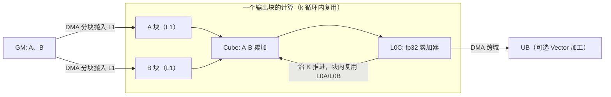
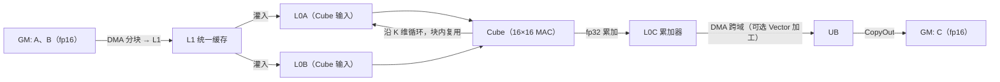

# 09 · GEMM（General Matrix Multiply）—— 本仓库的四种 DSL 实证

> 目标读者：已经走完前面 8 篇的创新之旅，想把这套知识落到"一个真实的 GEMM kernel"上。
> 本文用本仓库 Ascend-Notes 的真实实验数据（4 种 DSL）来讲 GEMM，聚焦矩阵乘复用、tiling、Cube 16×16 MAC。
> 前置：请先看仓库 [README](https://github.com/SuccinctPaul/Ascend-Notes/blob/main/README.md) 与[术语表](/reference/context)。

---

## 一、概述

GEMM（矩阵乘，`C = A·B`）是**大模型几乎全部算力的来源**：每个 Transformer 的投影、前馈、注意力打分都是 GEMM。它也因此是移植到昇腾 NPU 的第一课。本仓库用一个 `128×128`、fp16 的 GEMM，用 **4 种 DSL** 各写一遍，互相验证正确性、并对比性能，从而把"直线加速的 GP 上怎么把数据搬 + 算"一次讲透。

```
TL;DR：GEMM 是"算尽天下"，四种手段（Python/原型、Ascend C 最底层、Triton、TileLang）
       跑同一个矩阵乘，看它们如何分块、如何复用数据、如何用上 Cube 的 16×16 硬件。
```

---

## 二、定义

### 2.1 数学定义

```
C = A·B,   A∈R^{M×K}，B∈R^{K×N}，C∈R^{M×N}
C[i,j] = Σ_{k=0}^{K-1} A[i,k]·B[k,j]      （每条 C[i,j] 是 A 一行 × B 一列的点积）
```

本仓库约定（README）：`alpha=1, beta=0`，即 `C = A@B`，测试规模 `M=N=K=128`。

### 2.2 为什么 GEMM 是大模型的"算力引擎"

注意力、前馈的密集运算几乎都收起成 GEMM。而它的**算术强度高**（一个 256 的 MAC 只有 2 次负载的吞吐需求），非常适合专用硬件（Cube / Tensor Core）用固定的乘加阵列去喂满——这也是为什么清楚它的分块与数据复用，就能理解整张 NPU 的性能模型。

---

## 三、为什么需要理解它（在 NPU 上的价值）

一个 GEMM 的优化目标非常纯粹：**让 Cube 的 16×16 MAC 乘加阵列每时每刻都派上用场**，别让它在等数据。而要做到这一点，只有两件事：

1. **分块（tiling）**：巨大矩阵分成能装进片上缓冲（L0A/L0B/L0C/UB）的小块；
2. **数据复用（matrix multiply reuse）**：把搬上片的 A/B 小块尽量反复用，别频繁回 GM 取。

这两件事又都要靠**DMA 显式搬运 + 同步**把它串起来——这正是 [术语表](/reference/context) 全篇描述的数据流。

> 人话：Cube 是个吃"矩阵小块"的大胃王，分块保证喂得饱，复用保证不用老回仓库取菜。

---

## 四、四种 DSL 的"朴素实现"长什么样

以下代码都出自本仓库，仅做口味级别的缩写讲思路（完整代码见各目录）。

### 4.1 Python / NumPy —— 正确性基准（跑在 CPU）

`examples/python/src/gemm.py` 用三重循环逐元素累加，等价于"最笨的 GEMM"：

```python
acc = fp32(0.0)
for i in range(M):
    for j in range(N):
        s = acc
        for k in range(K):
            s += fp32(A[i,k]) * fp32(B[k,j])   # fp16→fp32 再乘加
        C[i,j] = s
```

它跑在 CPU 上、不做任何硬件优化，**就是其它 DSL 的对齐基准（ground truth）**。README 里它的朴素实现耗时 **4.27 秒**（128³，fp16）——这是"分块、复用、Cube 全不优化"的对照线。

### 4.2 Ascend C —— 最接近硬件的底层写法

`examples/ascend_c/` 用 `GlobalTensor + 标量乘加`，逐元素读 GM（最朴素，甚至没充分用 Vector）。它是用官方 `ascendc.cmake`（`ascendc_library STATIC`）框架编译、host 用 `aclrtlaunch_gemm_kernel()` 启动的。它教会我们：**NPU 上搬数、算数、同步全靠显式代码**。

### 4.3 Triton（triton-ascend）—— 声明式分块 + 自动 Cube

`examples/triton_ascend/src/gemm_triton.py`，一个 program 算一个 `BLOCK_M×BLOCK_N` 输出块：

```python
accumulator = tl.zeros((BLOCK_M, BLOCK_N), dtype=tl.float32)
for k in range(0, tl.cdiv(K, BLOCK_K)):
    a = tl.load(a_block_ptr, boundary_check=(0,1))   # [BLOCK_M, BLOCK_K]
    b = tl.load(b_block_ptr, boundary_check=(0,1))   # [BLOCK_K, BLOCK_N]
    accumulator += tl.dot(a, b)                     # tl.dot → Cube
tl.store(c_block_ptr, accumulator.to(tl.float16))
```

实例：`BLOCK_M=BLOCK_N=BLOCK_K=32`（16 的倍数），fp16 输入、fp32 accumulator。

### 4.4 TileLang（tilelang-ascend）—— 显式调度到 L1/L0C + Cube

`examples/tilelang_ascend/src/gemm_tilelang.py` 把内存层次和 Cube 调度**显式写进代码**，是四种里最接近"手控硬件"的抽象：

```python
A_L1 = T.alloc_L1((block_M, K_L1), dtype)      # L1 缓冲（A 子块）
B_L1 = T.alloc_L1((K_L1, block_N), dtype)      # L1 缓冲（B 子块）
C_L0 = T.alloc_L0C((block_M, block_N), accum_dtype)  # L0C 累加器（fp32）
with T.Scope("C"):                     # Cube 执行域
    for k in T.serial(loop_k):
        T.copy(A[bx*block_M, k*K_L1], A_L1)    # GM→L1 块搬运
        T.copy(B[k*K_L1, by*block_N], B_L1)
        T.barrier_all()                        # 搬运完再算（MTE2→MTE1）
        T.gemm_v0(A_L1, B_L1, C_L0, init=(k==0))  # Cube 累加
        T.barrier_all()
    T.copy(C_L0, C[bx*block_M, by*block_N])    # L0C→GM 写回
```

实例：`block_M=block_N=128，K_L1=64`。

> 四种 DSL 的**抽象梯子**（[术语表](/reference/context)）：Ascend C 管字节级 → Triton 管块级（编译器定缓冲）→ TileLang 管调度（显式指定 L1/L0C 与搬运）→ Python 只管数学正确。

---

## 五、实测结果（README 原表，Ascend 910B2 + CANN 9.0.0，128³ fp16）

| DSL | NPU run | max_abs_error | 耗时 | 状态 |
|---|---|---|---|---|
| python（CPU 基准） | — | 0.0（vs np.matmul） | 4.27 s（朴素三重循环） | PASS |
| triton_ascend | ✅ | 0.0 | 0.79 ms | PASS |
| tilelang_ascend | ✅ | 9.77e-04 | 0.38 ms | PASS |
| ascend_c | ✅ | 0.0 | — | PASS |

- 正确性校验口径（README）：所有 kernel 与 CPU 参考基准 `allclose(atol=1e-2, rtol=1e-2)` 后打印 PASS/FAIL。
- **最直观的对照**：Python 朴素三重循环 4.27 秒，Triton 分块 + Cube 只需 **0.79 毫秒**，TileLang 显式调度更进一步到 **0.38 毫秒**——“不优化 vs 用上硬件分块与 Cube”的差距是几个数量级。
- 四组 `max_abs_error` 都在 fp16 容差内（tilelang 的 9.77e-04 亦远小于 atol=1e-2）。

> 人话：同是"一个矩阵乘"，会分块、会喂 Cube 的写法，比傻算快上万倍。性能差距不来自数学，来自"数据怎么搬、算力怎么喂"。

---

## 六、NPU 上的关键优化点（用这四个实现当例子）

### 6.1 矩阵乘复用（Matrix multiply reuse）是灵魂

一个输出块 `C[bx,by]` 需要 A 的 `block_M` 行 × B 的 `block_N` 列，沿 K 维做 K 步累加。如果 K 很大，正确的做法是**把 A、B 的整块搬进 L1/L0A/L0B，用一个 k 循环段反复复用这同一块**，只沿 K 换新片——而不是每次乘法都回 GM 取两个新数。

TileLang 的 `K_L1` 就是这条 K 维复用粒度的开关：`K_L1=64` 表示一次把 K 维 64 深的小片搬进 L1，让 Cube 在这一小片内充分复用 L0A/L0B，不用每个 k 都回 GM。



### 6.2 tiling / 分块：Cube 16×16 的物理约束

Cube 的 MAC 阵列是 **16×16×16**：一次做 16×16 个 A×B，硬件一次 Output 16×16 并累加（见 [术语表](/reference/context) MAC 阵列描述）。这带来两条铁律：

- **块尺寸取 16 的倍数**：仓库里 Triton `BLOCK=32`、TileLang `block_M/N=128`、`K_L1=64` 全是 16 的倍数，就是为了对齐 Cube 粒度不打折；
- **L0A/L0B/L0C 是 Cube 专属缓冲**：数据要先进 L1，再由 L1 灌入 L0A/L0B 喂 Cube，结果累加到 L0C——Cube 只碰自己域内的缓冲。

> 人话：16×16 是 Cube 每次能"一口算"的颗粒，所有分块都往 16 的倍数上靠，Cube 才能一口吃饱。

### 6.3 混合精度（fp32 累加器）——这是正确性的关键

三个 NPU DSL 都不约而同地：**fp16 输入输出 + fp32 累加器**。为什么？因为 K 维累加会一路加几百上千个乘积，若全程 fp16 尾数（约 11 位）加下去，小数进位不断被舍掉（**精度损失**，不是 overflow）。fp32 累加器把这些进位保住，最后再截回 fp16 存储。Python 基准 `gemm.py` 也为此在乘加前先升 fp32。

> 人话：输入存窄的（fp16，省显存），账本花宽的（fp32，保精度）——这就是 [术语表](/reference/context) 里的"混合精度"。

### 6.4 数据流与同步：每个搬运都要有人发起

- TileLang 里 `T.copy`（GM→L1）、`T.barrier_all`（搬完再算）、`T.copy(C_L0, C)`（L0C→GM）——**每一步搬运和同步都是显式**；
- 多核并行（grid ≥ 2）时，每个 program 各算各的 C 分片、各用各的 L1/L0C，天然无核间依赖，这正是 [术语表](/reference/context) 说的"每个 C[i,j] 只依赖 A 一行 + B 一列，故可简单按 M/N 切分给多核"。

### 6.5 调用链与运行环境（README）

- 所有 NPU kernel 跑在远程 `vllm-hust-cyj-21rc-cloud-piou`（aarch64 Ubuntu，CANN 9.0.0，Ascend910B）；
- 每次 shell 先 `source /usr/local/Ascend/ascend-toolkit/latest/set_env.sh`；
- Ascend C 用 `ascendc.cmake` 自动完成 bisheng 编译 → host stub → 打包，host 端 `aclrtlaunch_gemm_kernel()` 异步启动（**异步提交**），要 `aclrtSynchronizeStream()` 才能安全读结果。

### 6.6 双缓冲 / 流水线：把"搬运"和"计算"重叠起来

搬运（DMA，GM→L1）和计算（Cube）是两件事，若**先搬完再算、算完再搬下一块**，Cube 就得干等数据到达。优化的经典手段是**双缓冲（pipelining）**：

- 给 L1 准备**两块缓冲**：Cube 正用第 1 块算的时候，DMA 同时把第 2 块从 GM 灌进第 2 块缓冲；
- 算完第 1 块立刻切到第 2 块（数据已在），DMA 再回头填第 1 块……如此往复，把**取数的延迟藏在计算后面**。
- Triton 里 `tl.dot` 的重叠由编译器自动调度；TileLang 里靠显式 buffer + `T.barrier_all()`（MTE2 灌完一组、MTE1 才算）配合两层缓冲来达成。仓库 README 也把"双缓冲"列为核心优化。

> 人话：别让 Cube 对着空气等菜。DMA 一边提前把菜端到桌上（双缓冲），Cube 一边吃正在吃的菜，两边不挨饿，吞吐自然上去。

### 6.7 多核切分：每个 program 一条独立的流水

因为每个输出块 `C[i,j]` 只依赖 A 的一行 + B 的一列，把 `M×N` 输出**按块切给多个 AI Core**，每个 Core 各跑各的"分块→搬运→Cube"流水，彼此无核间依赖。仓库里的 Triton 就是按 `grid = ceil(M/BLOCK_M)×ceil(N/BLOCK_N)` 把 program 摊到多个 Core 上，`pid_m/pid_n` 决定每个 program 负责哪个输出块。

---

## 七、数据流总览（一次 GEMM 的完整旅程）



---

## 常见误区与追问

1. **"Python 4.27s vs Cube 0.38ms，是编译器/语言差距还是硬件差距？"** 本质是**"用没用上硬件"**的差距：Python 三重循环既不分块也不上 Cube，等于"纯 CPU 标量硬算"；Triton/TileLang 把数据分块搬进片上、交给 Cube 的 16×16 MAC，才换来几个数量级的提升。语言只决定你能否方便地表达"分块+喂 Cube"，不决定算力。
2. **"tilelang 0.38ms 比 triton 0.79ms 快，是 TileLang 更好？"** 在这组 128³ 的对照里它略快，但不能直接推广。差异更多来自**显式调度**效率：TileLang 明说了 L1/K_L1、双缓冲与搬运动作，比 Triton 由编译器自动决策更适合这个规模。换个形状/规模，结论可能不同——所以仓库的 README 提醒"先测再说"。
3. **"块越大越快吗？"** 不。块要**对齐 Cube 16×16**（仓库选 32/64/128 都是 16 的倍数），且**能塞进 L0A/L0B/L0C**；再往上会因 UB 放不下、需要更多回 GM 而变慢。
4. **"为什么累加器必须是 fp32？"** 因为 K 维累加几百上千个 fp16 乘积，若用 fp16 累加，n只要三次舍入就丢失精度，最终误差显著。这是仓库把 `max_abs_error` 控制到 `1e-2` 内、且不跳出混合精度原则的关键。
5. **"双缓冲是不是越多越好？"** 不是。缓冲块越多、占用 L1 容量越大，能放下的分块就越小；一般 2~3 层缓冲就足以把搬运延迟盖住，再多只是占着片上资源换不来收益。它和 tiling 一样是一门"让 L1/L0 装得下、又填得满"的平衡术。

### 关键约定回顾（对照 README）

- **形状与校验收口**：`C=A@B`，`M=N=K=128`，`verify(atol=rtol=1e-2)` 全部 PASS；
- **精度策略**：fp16 输入/输出 + fp32 累加器（混合精度）；
- **分块取向**：都是 16 的倍数（Cube 粒度），tilelang 用 `block=128、K_L1=64`；
- **运行**：远程 Ascend910B（CANN 9.0.0），每次先 `source set_env.sh`。

---

## 八、TL;DR

- GEMM = `C=A·B`，是大模型的算力主体；
- 本仓库用 **Python / Ascend C / Triton / TileLang** 四种 DSL 跑同一个 128³ fp16 GEMM，用 `allclose(atol=rtol=1e-2)` 互相验证全部 PASS；
- **实测**：Python 朴素 4.27 s → Triton 0.79 ms → TileLang 0.38 ms，差距来自"会不会分块、喂不喂 Cube"；
- 三大支柱：**矩阵乘复用**（块进 L1/L0A/L0B 反复用）、**tiling**（对齐 Cube 16×16 的倍数）、**混合精度**（fp16 输入输出 + fp32 累加）；
- Cube 只碰 L0A/L0B/L0C；数据从 GM 逐级 DMA 搬入、用完搬回，全程**显式搬运 + 同步**。

---

## 九、参考资料（本仓库实证 + 官方）

**本仓库（可本地核验，非外部 URL）：**
- `README.md`（四 DSL 实测结果表、统一约定、运行环境）
- [术语表](/reference/context)（硬件架构、数据流、tiling、混合精度、Cube 16×16 MAC）
- `examples/python/src/gemm.py`（CPU 参考基准）
- `examples/triton_ascend/src/gemm_triton.py`、`examples/tilelang_ascend/src/gemm_tilelang.py`、`examples/ascend_c/`

**官方 / 论文（已验证 URL）：**
- 华为昇腾 CANN 官方文档（CANN 商用版 8.0）《TCubeTiling 结构体》（Matmul 分块的 M/N/K、`L0A/L0B/L0C` 容量约束、INT8/FP16 的 C0_size 对齐）：
  https://www.hiascend.cn/document/detail/zh/canncommercial/800/apiref/ascendcopapi/atlasascendc_api_07_0673.html
- 华为昇腾 CANN Kit 官方指南《Host 侧 Tiling 实现》（tiling 概念、host 算 device 用）：
  https://developer.huawei.com/consumer/cn/doc/harmonyos-guides/cannkit-tiling-implementation-on-the-host
- 华为昇腾 CANN 官方文档中心（Ascend C / 算子开发 / 向量与矩阵 API）：
  https://www.hiascend.cn/document

> 说明：Cube 16×16 MAC、L0A/L0B/L0C 等硬件结构细节以仓库 [术语表](/reference/context) 为准；昇腾文档地址带版本号，失效时请在 https://www.hiascend.cn/document 检索对应章节。
> 注：README 中 ascend_c 列耗时未给出（表格为"—"），本次未对该列做任何推算，故不虚报数字。
---

## 上一篇 / 下一篇

- 上一篇：[08 · 量化与反量化](/ops/08-quantization)
- 本卷收官。继续读：[性能模型与 Roofline](/perf/01-roofline-perf-model) 把这里的实测数字放上屋顶；或跳到 [构建与部署说明](/deployment)。
