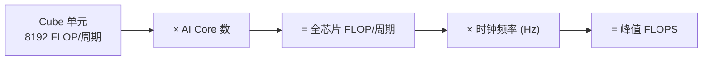

# 00 · 如何计算 Ascend NPU 的算力

> 面向 0 到 1 新手：从一颗 Cube 单元出发，一步步推出整颗芯片的峰值算力。
> 本文是 [01 · 性能模型与 Roofline](01-roofline-perf-model.md) 的前置知识——你得先知道"天花板有多高"，才能画屋顶图。

***

## 概述

"算力"这个词到处都在用，但它到底怎么算出来的？这篇文档从昇腾 AI Core 的 Cube 单元出发，拆解到整颗芯片的 TFLOPS，让你能自己推导，而不是死记硬背一个数字。

**人话**：算力 = 单个计算单元每秒能做多少次浮点运算 × 有多少个计算单元 × 跑多快（频率）。

***

## 为什么需要

* Roofline 模型需要"理论峰值"作为纵轴的天花板，你得先算出它。

* 看到"256 TFLOPS""320 TFLOPS"这些数字时，知道它们怎么来的、能不能信。

* 做性能优化时，知道"最多能到多少"才能判断"还差多远"。

**人话**：没有这把尺，你看到的 TFLOPS 数字就只是个没有来源的魔法数字。

***

## 定义（先钉住概念）

| 术语                  | 含义                                                                | 单位       |
| ------------------- | ----------------------------------------------------------------- | -------- |
| **FLOP**            | 一次浮点运算（floating-point operation）。通常 1 次乘法 = 1 FLOP，1 次加法 = 1 FLOP | 次        |
| **MAC**             | 一次乘加运算（multiply-accumulate: `a×b+c`）。1 MAC = 2 FLOP               | 次        |
| **FLOPS**           | 每秒浮点运算次数（Floating-point Operations Per Second）                    | 次/秒      |
| **TFLOPS**          | 每秒万亿次浮点运算（Tera = 10¹²）                                            | 10¹² 次/秒 |
| **峰值算力 (Peak)**     | 理论上每秒最多能做多少次浮点运算——硬件标称上限                                          | TFLOPS   |
| **实测算力 (Achieved)** | 实际程序跑出来的每秒浮点运算量，永远 ≤ 峰值                                           | TFLOPS   |

> ⚠️ 常见坑：有些资料把 1 MAC 算作 1 FLOP，有些算作 2 FLOP。昇腾和 NVIDIA 的官方标称值都按 **1 MAC = 2 FLOP** 计算。本文统一这个口径。

**人话**：FLOP 是"一步"，MAC 是"乘了再加"算两步。峰值是"纸上谈兵的上限"，实测才是"考场上的发挥"。

***

## 主体

### 1）从 Cube 单元开始：一个 16×16 的"计算积木"

沿用 [CONTEXT.md](../reference/context.md) 的硬件模型，昇腾 AI Core 有一个 **Cube 单元**，它是专门做矩阵乘法的硬件引擎。

Cube 的核心能力：**在一个时钟周期内，完成一次 16×16×16 的小矩阵乘法**。

```
A (16×16)  ×  B (16×16)  =  C (16×16)
```

展开来看，这相当于计算 C 矩阵的 16×16 = 256 个输出元素，每个元素需要 16 次乘加（MAC）。

所以一次 Cube 操作的运算量：

```
总 MAC 次数 = 16 × 16 × 16 = 4096 MAC
总 FLOP    = 4096 × 2      = 8192 FLOP
```

> 为什么是 16×16×16？输出 C 有 16×16 个元素，每个元素是 A 的一行（16 个）和 B 的一列（16 个）做点积，需要 16 次乘加。

**人话**：Cube 一拍能做 8192 次浮点运算——这就是"积木"的基本面。

### 2）推导公式：从 1 个 Cube 到整颗芯片

一颗 Ascend 芯片有多颗 AI Core，每颗 Core 里有 1 个 Cube 单元。所以：



**公式：**

```
峰值 FLOPS = 8192 × AI_Core 数量 × 时钟频率 (Hz)
```

如果换算成 TFLOPS（除以 10¹²）：

```
峰值 TFLOPS = (8192 × AI_Core 数量 × 时钟频率) ÷ 10¹²
```

**人话**：一个 Cube 一拍做 8192 次运算，有几个 Cube 就乘几，跑多快就再乘频率——三个数一乘就是峰值算力。

### 3）验证：用官方数据反推 Ascend 910

华为在 2019 年正式发布的 **Ascend 910** 处理器，官方标称 **256 TFLOPS (FP16)**，搭载 **32 个 Da Vinci AI Core**。

让我们用公式反推：

```
峰值 FLOPS = 8192 × 32 × f
256 × 10¹² = 8192 × 32 × f
f = 256 × 10¹² ÷ (8192 × 32)
f = 256 × 10¹² ÷ 262144
f ≈ 0.977 × 10⁹ Hz ≈ 1.0 GHz
```

反推出频率 ≈ 1.0 GHz，与公开资料中 Ascend 910 的 \~1.0 GHz 主频一致。

> ✅ 公式验证通过：32 核 × 8192 FLOP/周期 × \~1.0 GHz = \~256 TFLOPS，与华为官方标称吻合。

**人话**：拿一个你知道答案的芯片（910）验一遍，公式对得上，再拿去推算未知的芯片就有底气。

### 4）推算 Ascend 910B

> ⚠️ **重要提示**：华为从未公开发布 910B 的完整官方规格书。以下数字来自第三方分析机构（TechInsights 拆解、CSET 报告、SemiAnalysis 估算），**不是华为官方确认值**，请以此理解。

根据第三方分析机构的估计：

| 参数         | 估计值                        | 来源                        |
| ---------- | -------------------------- | ------------------------- |
| AI Core 数量 | 约 24–25 个（20–25 活跃，SKU 相关） | TechInsights 拆解 / CSET 报告 |
| 时钟频率       | 约 1.5–1.8 GHz（SKU 相关）      | CSET 报告                   |
| FP16 峰值算力  | 约 320–400 TFLOPS           | SemiAnalysis 估算约 376      |

用公式推算（取 24 核、1.5 GHz）：

```
峰值 = 8192 × 24 × 1.5 × 10⁹
     = 294.9 × 10¹²
     ≈ 295 TFLOPS
```

取 25 核、1.8 GHz：

```
峰值 = 8192 × 25 × 1.8 × 10⁹
     = 368.6 × 10¹²
     ≈ 369 TFLOPS
```

落在分析师估计的 320–400 TFLOPS 区间内。注意，实际可用核心数和频率取决于具体 SKU（910B1/B2/B3/B4），以上为**推算示意，待核验**。

### 5）FP16 vs INT8：算力翻倍

昇腾的 Cube 单元在 INT8 模式下，每个周期处理的数据量是 FP16 的两倍（INT8 占 1 字节 vs FP16 占 2 字节），所以：

```
INT8 峰值 ≈ 2 × FP16 峰值
```

| 精度        | Ascend 910（官方） | 910B（第三方估计，待核验）  |
| --------- | -------------- | ---------------- |
| FP16/BF16 | 256 TFLOPS     | \~320–400 TFLOPS |
| INT8      | 512 TOPS       | \~640 TOPS       |

> 注意单位：FP16 用 TFLOPS（每秒万亿次浮点运算），INT8 用 TOPS（每秒万亿次整数运算）。因为 INT8 是整数运算，不叫"浮点"。

**人话**：精度砍一半（16 位 → 8 位），同样大小的硬件塞的数据翻一倍，算力自然翻倍——代价是精度降低。

### 6）峰值 vs 实测：为什么永远跑不满

峰值算力是"理论天花板"，实际程序几乎不可能跑到 100%。原因：

1. **搬运时间**：数据从 GM(HBM) 搬到片上缓存需要时间，计算单元在等数据时是空闲的。
2. **流水线气泡**：多级流水（GM→L1→L0A/B→Cube→L0C→UB→GM）切换时有气泡。
3. **计算不连续**：除了 GEMM，还有 elementwise、softmax、norm 等 Vector 指令，它们不经过 Cube。
4. **多核不均衡**：核间切分不均匀时，部分核先算完等同步。

所以评测时常用 **实际达到的 FLOPS / 峰值 FLOPS = 计算利用率**（也叫 Cube 利用率）。好的 GEMM kernel 能到 70–90%，差的可能只有 10%。

**人话**：峰值是"厨师的最高手速"，实测是"一个中午能出多少盘菜"——中间的差距就是搬运、等待、切换的损耗。

### 7）一张表速查

| 芯片          | AI Core    | 估计频率          | FP16 峰值             | 数据来源                  |
| ----------- | ---------- | ------------- | ------------------- | --------------------- |
| Ascend 910  | 32         | \~1.0 GHz     | 256 TFLOPS          | 华为官方发布                |
| Ascend 910B | \~24–25    | \~1.5–1.8 GHz | \~320–400 TFLOPS    | 第三方估计（待核验）            |
| Ascend 910C | 双 die 910B | —             | \~780 TFLOPS (BF16) | 华为官方（2025 keynote 引述） |

> 910C 是两颗 910B 计算芯粒封装在一起，所以算力接近 910B 的两倍。

***

## TL;DR

| 概念           | 一句话                           |
| ------------ | ----------------------------- |
| 峰值算力         | Cube 一拍做 8192 次运算，乘以核数和频率就是峰值 |
| FP16 vs INT8 | 精度砍半算力翻倍，代价是数值范围变小            |
| 峰值 vs 实测     | 峰值是天花板，实测是脚下的地——利用率 = 实测 ÷ 峰值 |

***

## 参考资料

1. **华为 Ascend 910 官方发布（2019）**——256 TFLOPS FP16 / 32 Da Vinci Core 的原始官方数字来源：Huawei Connect 2019，见 [Huawei 新闻页](https://www.huawei.com/en/news/2019/9/huawei-ascend-910-ai-processor)（华为官方域名）
2. **Huawei Connect 2025 主题演讲**——Ascend 910C \~780 TFLOPS BF16、950 系列路线图：[Eric Xu Keynote](https://www.huawei.com/en/news/2025/9/hc-xu-keynote-speech)（华为官方域名）
3. **Da Vinci 架构介绍（HiSilicon, Hot Chips 2019）**——Cube 16×16 MAC 阵列、Da Vinci 核心架构的学术介绍来源
4. **昇腾 Ascend C 编程模型概述**——AI Core 硬件模型、Cube/Vector/Scalar 四引擎：[Ascend C 官方文档](https://asc.gitcode.com/guide/编程指南/编程模型/编程模型概述.html)（asc.gitcode.com 官方域名）
5. **Atlas 300T 9000 产品页**——Ascend 910 芯片级规格（280 TFLOPS FP16 Pro）：[Huawei e-platform 产品页](https://e.huawei.com/kr/products/cloud-computing-dc/atlas/atlas-300t-training-9000)（华为官方域名）
6. **Ascend 910B 第三方分析**——AI Core 数量、频率、算力估计（TechInsights 拆解、CSET 报告、SemiAnalysis）：[AI Wiki: Huawei Ascend 910B](https://www.aiwiki.ai/wiki/huawei_ascend_910b/raw)（第三方 wiki，非华为官方，数字均标"待核验"）

> ⚠️ **诚实声明**：华为从未公开发布 910B 的完整官方规格书。本文中 910B 的核心数、频率、算力均为第三方分析机构估计值，标注"待核验"。910 和 910C 的数字来自华为官方发布或公开演讲，可信度较高。公式推导方法基于 Da Vinci 架构公开信息（Hot Chips 2019）和本仓库 CONTEXT.md 的实证模型。

