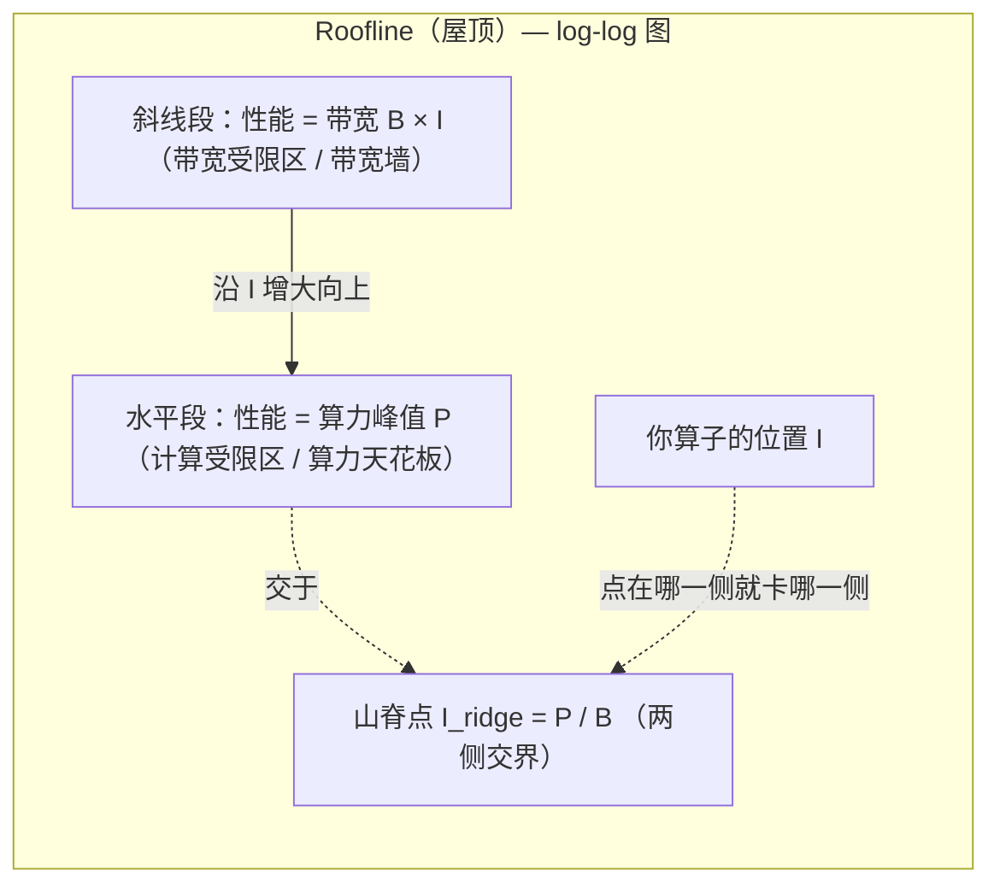

# 01 · 性能模型与 Roofline

> 面向 0→1 新手：怎么"算"一个算子该有多快，怎么一眼看出它是**算不快**还是**数据喂不饱**。
> 本文最核心就三个词：**计算强度 / 算术强度**、**理论峰值**、**带宽墙**。

***

## 概述

排性能瓶颈之前，先要有"一把尺"。Roofline（屋顶模型）就是贴在硬件身上的一把刻度尺：
横轴是"每个字节数据能换来多少次计算"（计算强度），纵轴是"能跑到的性能"。
把你要优化的算子在图上点一个点，**它落在屋顶的斜线上还是平顶下**，就决定了你的优化方向。

**人话**：Roofline 就是一张"天花板图"——屋顶有多高（算力天花板），屋顶往左下方斜下去的那条边有多陡（内存带宽天花板）。你的算子站的位置决定你该修计算还是该修数据搬运。

***

## 为什么需要

* CPU 时代大家直觉是"算得越快越好"；但 NPU 时代（以及 GPU）遇到的是**两个**资源同时卡你：**浮点算力**和**访存带宽**。

* 很多时候你把计算优化到头了，性能却纹丝不动——因为真正卡你的是内存带宽（数据搬不动）。

* 不做模型，优化就靠瞎猜；做了模型，你能**量化**"离天花板还有多远"、"瓶颈是哪一侧"。

**人话**：没有这一把尺，你只能一次次试错；有了它，你先算出"理论上最多能多快"，再决定值不值得花力气。

***

## 定义（先钉住概念）

沿用[术语表](/reference/context)的术语，这里再加 3 个性能术语：

| 术语                                                       | 含义                                  | 人话类比                      |
| -------------------------------------------------------- | ----------------------------------- | -------------------------------- |
| **计算强度 / 算术强度 (Arithmetic / Operational Intensity, AI)** | 平均每搬 1 字节数据，能做多少次浮点运算。单位：FLOP/Bytes | 相当于"每买一次菜能炒几个菜"——买菜贵（带宽），菜谱多（算力） |
| **理论峰值 (Peak, 算力天花板)**                                   | 硬件标称的每秒最大浮点运算量。单位：TFLOPS            | 厨师同一时刻最多能同时颠几个锅                  |
| **带宽 (Bandwidth, 内存带宽)**                                 | **GM / HBM** 每秒能搬运多少字节。单位：GB/s      | 食堂窗口每秒能递出几份菜                     |

其中**计算强度**口径要跟 Roofline 论文一致：指"**每字节 DRAM（GM/HBM）流量能换多少次 FLOP**"，而不是"寄存器到寄存器的算术强度"。这一点很关键，
因为它把"内存优化"也自然装进了模型（见后）。

> 记法统一：`I = FLOPs ÷ Bytes(从 GM 搬的量)`。

***

## 主体

### 1）三个量先算出来：FLOPs、Bytes、I

**FLOPs（需要多少次浮点运算）**——以本仓库的 `C = A @ B`（`A∈ℝ^M×K`, `B∈ℝ^K×N`）为例：

```
每次乘加 = 2 FLOP（1 次乘 + 1 次加）
总乘加次数 = M × N × K
总 FLOPs  = 2 × M × N × K
```

本仓库测的是 128³（M=N=K=128）：`2 × 128³ = 4,194,304 FLOP ≈ 4.2 MFLOP`。对一个 GEMM 来说这是**小得可怜**的量。

**Bytes（需要从 GM/HBM 搬多少字节）**——朴素实现下，A、B 各从 GM 读一趟，C 写回一趟（fp16 每元素 2 字节）：

```
读 A 一趟: M×K 个 fp16 = M×K×2 字节
读 B 一趟: K×N 个 fp16 = K×N×2 字节
写 C 一趟: M×N 个 fp16 = M×N×2 字节
朴素 Bytes ≈ 2×(MK+KN+MN) 字节
128³ 朴素 Bytes = 2×(128² + 128² + 128²) = 3×32,768 = 98,304 B ≈ 96 KB
```

> 口径说明：这是 Roofline 论文口径——只算 DRAM 的真实流量。"把每个矩阵都按读+写两趟算"会双倍计数（A/B 并不会被写，C 只写一回），本文全部统一用"读 A 一趟 + 读 B 一趟 + 写 C 一趟"。

**I = FLOPs ÷ Bytes**：

```
朴素 128³ 的 I = 4,194,304 ÷ 98,304 ≈ 42.7 FLOP/B
```

**人话**：这个 I ≈ 42.7，意思是"从 HBM 里每搬 1 字节，换来约 43 次浮点运算"。这个数偏小（910B 的山脊点在 200 上下，见 [06](06-roofline-case-study.md)）→ 大概率是**带宽受限**。（对比：K 越大、每个 tile 在片上复用越久，I 越高，就越接近计算受限。）

### 2）理论峰值 vs 带宽墙：屋顶长什么样

硬件给你两个"屋顶"：

* **算力天花板（平顶）**：`P (FLOP/s)`，理论峰值，横杠。

* **带宽墙（斜线）**：性能上限 = `B × I`（带宽 B 乘以算子的计算强度 I），是一条斜率为带宽 B 的斜线。

实际能达到的上限是**两者取小**：

```
Attainable(可达到的性能) ≤ min( P , B × I )
```

在 log-log 图上：斜线段 `B×I` 和水平段 `P` 的折线，就是 "Roofline（屋顶）"。两段相交的地方叫 **ridge point（山脊点）**，横坐标 `I_ridge = P / B`。



**判读定律**：

* 你的点落在**斜线**上（左侧，I 小）→ **memory-bound（带宽受限）**：怎么加算力都没用，去减搬运 / 提高复用。

* 你的点落在**平顶**下（右侧，I 大）→ **compute-bound（计算受限）**：去提 Cube / Vector 利用率。

* 你的点明显**低于屋顶**（两种情况都够不着）→ 属于"还有优化空间"，先修软件不修屋顶。

**人话**：屋顶越高越陡是你决定不了的（硬件给的）；你最多能做的是让自己算子的"位置"靠右一点（提高算得比搬得多），或者把点抬到离屋顶更近。

### 3）怎么自己手算"峰不峰值、带宽多少"

> 以下两个参考口径必须在**装有 CANN 的昇腾环境**里用工具验证，下面的值不要当作本机数值直接引用（不同芯片/型号/频率差异很大）。

* **算力峰值**：`AI Core 数 × 每 Core 每周期 MAC × 主频 × 2`。昇腾 910B 系列适合用它作为量级估计；**具体数值需查询目标芯片的官方规格书或跑 micro-benchmark，标"待核验"**。

* **带宽**：跑一个单纯"全读一遍大张量"的 kernel，`搬运字节数 ÷ 墙钟耗时` 即实测带宽；硬件标称带宽通常两者并存（读写混合有效带宽低于单向峰值），所以**用实测值而不是标称值**判断更稳。

**判 compute-bound 还是 memory-bound 的实操流程**（本仓库 GEMM 适用）：

```
① 算 I = FLOPs / Bytes（见上）
② 查或测出本机 P 和 B，算 I_ridge = P / B
③ 若 I < I_ridge → memory-bound；若 I > I_ridge → compute-bound
```

**人话**：I\_ridge 就是"拐点"。你的 I 比拐点小，就是带宽说了算；比拐点大，就是算力说了算。

### 4）把 Roofline 落到本仓库的 4 种 DSL

| DSL                         | 搬运/计算的可控度      | 典型表现               | 在 Roofline 上的位置 |
| --------------------------- | -------------- | ------------------ | --------------- |
| `examples/python/`          | 不可控（CPU，无 NPU） | 最慢，仅作正确性基准         | 不进入 NPU 屋顶体系    |
| `examples/triton_ascend/`   | 编译器决定分块        | 块级，利用率中等           | 点偏右下，离屋顶有优化缝    |
| `examples/tilelang_ascend/` | 显式 L1/L0C + 调度 | 显式 tiling，最贴近 Cube | 点最接近屋顶          |
| `examples/ascend_c/`        | 逐元素、最细         | 需手写全套流水            | 以字节级控制可逼近屋顶     |

> 这份对比会在 `05-dsl-benchmark-analysis.md` 里用仓库实测数字展开解读。

### 5）Roofline 的两种"天花板"之外：还有次级天花板

Roofline 论文还指出：即便在算力这一段，也可能因为"没有用 SIMD / 没有开多核 / 流水没铺满"而够不到平顶，这些叫**次级天花板**。
对应到昇腾：Cube 利用率低、流水线空泡大、多核只用了一小半——都会让你"够不到屋顶"。
这也是为什么后面 `02`、`04` 两篇专门讲 tiling/流水和瓶颈定位。

**人话**：Roofline 告诉你"该修哪一侧"；次级天花板告诉你"修到哪一层就够了"。两者一起用，才不白费功夫。

### 6）动手小练习：把本仓库 GEMM 手算一遍（跟着做就有感觉）

**目标**：算出 128³ 朴素 GEMM 的 `I`，并口头判断它是带宽还是计算受限。

```
第 1 步，算 FLOPs
  2 × 128 × 128 × 128 = 4,194,304  ≈ 4.2 MFLOP

第 2 步，算 Bytes（朴素：A、B、C 都进出 GM，fp16=2B）
  A: 128×128×2 = 32,768 B
  B: 128×128×2 = 32,768 B
  C: 128×128×2 = 32,768 B
  Bytes ≈ 3 × 32,768 = 98,304 B   （实际读写往来可能更多，这里先按"一趟"算）

第 3 步，算 I
  I = 4,194,304 ÷ 98,304 ≈ 42.7 FLOP/B   ← 这就是"每个字节换 ~43 次计算"

第 4 步，判断
  拿这个 I 和"本机拐点 I_ridge = P/B"比（P、B 见装机实测）。
  因为 128 太小、且 tiling 很浅，I 很容易落在拐点左侧 → 带宽受限（推进方向：加大 tile、加流水、提高复用）。
```

> 做完你会发现：**哪怕只是把 tile 从"整张一次"改成"分小块多级流水"，I 都会明显右移**（因为 A/B 在片上被复用的次数变多了）。
> 这就是 `02` 篇一切动作的起点：一切优化本质上都在把 I 往右推。

### 7）Roofline 的边界：它不告诉你的事

Roofline 是个"好模型，但你别当全部答案"：

* 它是**上限模型**：告诉你"最多能多快"，不告诉你"怎么实现才能到"。

* 它默认瓶颈是 FLOP 或内存带宽二选一，但实际还可能有**流水空泡、同步等待、多核不均衡、地址不对齐**这些次级瓶颈（`02`/`04` 处理）。

* 它针对的是"吞吐"视角；对"时延"（单个算子的墙钟时间、launch 开销）不敏感。

* 在昇腾上，**片上 L1/L0/UB 的软件显式管理**让"该算哪级的数据流"比 CPU 复杂，Roofline 通常配合 **msprof op 的 Roofline 瓶颈分析图**一起看更实用。

**人话**：Roofline 是"定位在哪侧的雷达"，不是"自动修车手册"；修车细节在 `02`/`04`，手术刀在 `03` 的 profiling。

### 8）新手 FAQ

* **Q：I 越大越难优化？** 不是。I 越大越接近计算受限，意味着"算力价值高"；一般我们反而是想通过 tiling 把小的 I 顶上去。

* **Q：带宽墙是不是注定的？** 硬件带宽是注定的，但\*\*"有效轮到每个核/每个 tile 的带宽"可以通过提高复用、减少往返搬来来改善\*\*——不动天花板，动"你占用它的效率"。

* **Q：为什么我对 910B 算出来的 I\_ridge 和文档不一样？** 峰值 P、带宽 B 随型号/频率/实测口径变化很大，**务必用目标芯片的实测值**（标"待核验"即提醒你别照搬）。

***

## TL;DR

1. **算一个算子**：`I = FLOPs ÷ Bytes`，先算出每个字节换几次计算。
2. **画屋顶**：`min(算力峰值 P, 带宽 B × I)` 那条折线。
3. **定位**：`I < I_ridge` → 带宽受限（去减搬运/加复用）；`I > I_ridge` → 计算受限（去提 Cube/Vector 利用率）；够不到屋顶 → 还有优化缝隙。
4. 本仓库的 GEMM（128³）I ≈ 42.7，偏小，属**带宽敏感**；把 tile 放大、加 multi-stage 流水、数据在片上多复用，就是要把 I 往右推。

> 记住一句话：**先分清是"算得慢"还是"喂不饱"，再动手优化。**

***

## 附：一张"关键词→人话"速查 + 两个反面容易踩的误区

| 关键词（本文/全套文档）             | 一句话人话                |
| ------------------------ | -------------------- |
| 计算强度 I = FLOPs/Bytes     | 每个字节的"数据"能换来几次"计算"   |
| 算力峰值 P                   | 硬件最多一秒算多少 FLOP       |
| 带宽 B                     | 硬件最多一秒搬多少字节          |
| 山脊点 I\_ridge = P/B       | "带宽受限"和"计算受限"的分界拐点   |
| memory-bound             | 卡在带宽（喂不饱），加算力没用      |
| compute-bound            | 卡在算力（算不动），加带宽没用      |
| 次级天花板（secondary ceiling） | 没开满核、没铺流水等会让你够不到真正屋顶 |

**误区一 · "带宽墙是硬件给的，我改不了"**：天花板数值改不了，但**每字节的实际被用效率**可以改（tiling/复用/流水）。你的优化空间在"离屋顶还有缝"的那段距离，不在"屋顶"本身。

**误区二 · "越快说明越聪明 / 越准"**：不对。Roofline 只回答"在哪一侧卡住、离屋顶多远"，**不回答"实现得好不好、精度稳不稳"**。精度判断交给精度工具（`03` 提到的 msprobe）和对拍（本仓库 `05`）。

***

## 参考资料

> 以下链接均为公开、可核验的来源（撰写时逐一打开核对过；若失效欢迎提 issue）。

* Roofline 经典论文：Williams S., Waterman A., Patterson D., *Roofline: An Insightful Visual Performance Model for Multicore Architectures*, Communications of the ACM 52(4), 2009.

  * eScholarship (UC Berkeley 官方存档，开放 PDF)：https://escholarship.org/uc/item/78h8v7mr

  * ACM Digital Library (DOI 10.1145/1498765.1498785)：https://dl.acm.org/doi/10.1145/1498765.1498785

* 华为昇腾 msProf 官方文档——其中"msProf 工具使用"中提到通过 MindStudio Insight 展示 **Roofline 瓶颈分析图**（可据此在昇腾工具链里看到实际的屋顶图）：

  * https://www.hiascend.cn/document/detail/zh/canncommercial/800/devaids/opdev/optool/atlasopdev_16_00851.html

* 华为昇腾官方开发文章《Ascend C 算子优化实用技巧 04——Tiling 优化》（用"GM/HBM 带宽 vs L2Cache 带宽"的对比说明带宽瓶颈，适合印证本页的带宽墙理解）：

  * https://www.hiascend.com/developer/techArticles/20240920-1

* NVIDIA Nsight Compute 官方——其分析报告自带基于 Roofline 的 SOL 分析规则，可作对照阅读：

  * https://developer.nvidia.com/nsight-compute

  * https://docs.nvidia.com/nsight-compute/ProfilingGuide/index.html

> 注：本页出现的算力/带宽具体数值未写死，因随芯片型号而异；实操请以目标芯片官方规格书或工具实测为准（相关项已标注"待核验"）。

