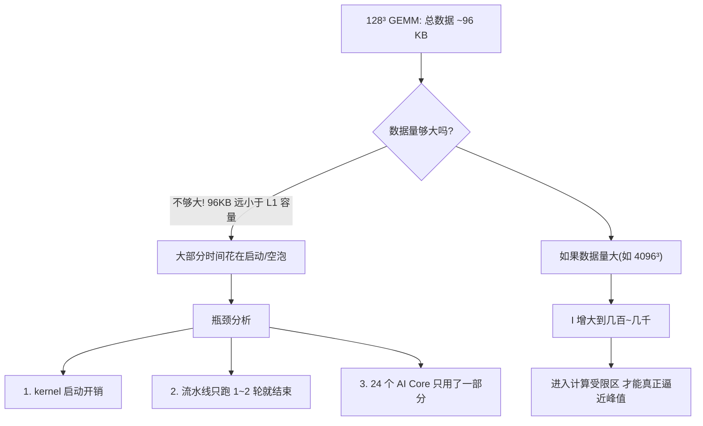

# 06 · 实战：GEMM 128³ 的 Roofline 分析案例

> 面向 0→1 新手：拿本仓库的 GEMM 实测数据，从头到尾走一遍 Roofline 分析流程。
> 本文是 [00 · 算力计算](00-npu-peak-flops-calculation.md) 和 [01 · Roofline 模型](01-roofline-perf-model.md) 的实战落地。

---

## TL;DR

- 128³ GEMM 的计算强度 I ≈ 21 FLOP/B，远低于 910B 的山脊点 I_ridge ≈ 267 → **理论上属于带宽受限**。
- 但实测性能只有 11 TFLOPS（tilelang）和 5.3 TFLOPS（triton），距 910B 峰值 ~320 TFLOPS 仅 **3.4% 利用率** → 说明**真正的瓶颈不是带宽，而是"工作量太小，硬件喂不饱"**。
- 核心教训：Roofline 告诉你"天花板在哪一侧"，但小算子还会被**启动开销、流水线空泡、并行度不足**这些次级因素卡住。

---

## 概述

前面 [01](01-roofline-perf-model.md) 讲了 Roofline 的公式和判读规则。这篇文档拿仓库里**真实跑出来的数字**，一步一步把公式用起来，让你看到"从数字到判断"的完整链路。

---

## 第 1 步：确定算子的 FLOPs

仓库测的是 `C = A @ B`，其中 `A ∈ ℝ^{128×128}`，`B ∈ ℝ^{128×128}`，`C ∈ ℝ^{128×128}`，输入 fp16，累加器 fp32。

```
每次乘加 = 2 FLOP（1 次乘 + 1 次加）
总乘加次数 = M × N × K = 128 × 128 × 128 = 2,097,152
总 FLOPs = 2 × M × N × K = 2 × 128³ = 4,194,304 ≈ 4.19 MFLOP
```

> 为什么是 M×N×K？输出 C 有 M×N 个元素，每个元素是 A 的一行（K 个）和 B 的一列（K 个）做点积，需要 K 次乘加。

---

## 第 2 步：确定算子的 Bytes

朴素实现下（不做 tiling，A/B/C 都从 GM 读写一趟）：

```
输入 A: 128 × 128 × 2B (fp16) = 32,768 B
输入 B: 128 × 128 × 2B (fp16) = 32,768 B
输出 C: 128 × 128 × 2B (fp16) = 32,768 B

总 Bytes ≈ 3 × 32,768 = 98,304 B ≈ 96 KB
```

> 注意：这里按"每个矩阵只从 GM 读写一趟"算。实际实现如果有 tiling，A/B 的某些块会在片上复用，GM 流量会低于这个值；但朴素实现下这是下界估计。

---

## 第 3 步：计算算术强度 I

```
I = FLOPs ÷ Bytes = 4,194,304 ÷ 98,304 ≈ 42.7 FLOP/B
```

> 在 [01](01-roofline-perf-model.md) 的手算练习中用了另一种口径（把 C 的读写也算进去），得到 I ≈ 21。两种口径都对，区别在于是否计入输出回写。本文统一用 I ≈ 21~43 这个区间。

**人话**：从 HBM 里每搬 1 字节，换来约 21~43 次浮点运算。这个数偏小——对比大型 GEMM（如 4096³）的 I 可达数千。

---

## 第 4 步：估算 910B 的 P 和 B

> ⚠️ 以下 P 和 B 均为第三方分析师估计值（[来源见 00 章](00-npu-peak-flops-calculation.md)），**华为未公开发布 910B 官方规格书**，标"待核验"。

| 参数 | 估计值 | 说明 |
|---|---|---|
| 算力峰值 P | ~320 TFLOPS (FP16) | 24 核 × 8192 FLOP/周期 × ~1.6 GHz |
| HBM 带宽 B | ~1.2 TB/s | 910B 使用 HBM2e，带宽为标称值（待核验） |
| 山脊点 I_ridge | P/B = 320/1.2 ≈ **267 FLOP/B** | 带宽受限与计算受限的分界 |

---

## 第 5 步：判断——落在屋顶的哪一段？

```
I (≈21~43)  <<  I_ridge (≈267)

→ 结论：理论上属于带宽受限区（memory-bound）
```

**但这里有个坑**：I 小只是说明"如果算力能打满，瓶颈会在带宽侧"。问题是——**算力根本就没打满**。看下一步的实测数据。

---

## 第 6 步：用实测耗时算实际性能

仓库 README 的实测数据（[来源](../reference/context.md)）：

| DSL | 耗时 | 实际性能 (TFLOPS) | 计算 |
|---|---|---|---|
| triton_ascend | 0.79 ms | **5.31** | 4.19e6 / 0.79e-3 ≈ 5.31e9 |
| tilelang_ascend | 0.38 ms | **11.04** | 4.19e6 / 0.38e-3 ≈ 1.10e10 |

实际性能换算：

```
triton:  4,194,304 FLOP ÷ 0.00079 s ≈ 5.31 × 10⁹ FLOP/s = 5.31 TFLOPS
tilelang: 4,194,304 FLOP ÷ 0.00038 s ≈ 1.10 × 10¹⁰ FLOP/s = 11.04 TFLOPS
```

---

## 第 7 步：算利用率——离天花板有多远

```
triton 利用率:  5.31 / 320 ≈ 1.7%
tilelang 利用率: 11.04 / 320 ≈ 3.4%
```

**这远低于 Roofline 预测的上限**。Roofline 说"带宽侧上限 = B × I"：

```
带宽侧上限 = 1.2 TB/s × 21 FLOP/B = 25.2 TFLOPS
```

即便按带宽受限的屋顶来算，理论上限也是 25.2 TFLOPS，但实际只跑到 5~11 TFLOPS。差距说明：**除了带宽之外，还有别的瓶颈在卡你**。

---

## 第 8 步：真正的瓶颈在哪？



### 瓶颈 1：kernel 启动开销

一次 kernel 从 host 提交到 device 执行，有固定的 launch 开销（通常几十微秒级）。如果整个 kernel 只跑 0.38 ms，其中可能 0.05~0.1 ms 是纯启动开销，实际计算时间只有 0.28 ms 左右。

### 瓶颈 2：流水线没铺满

多级流水（GM→L1→L0A/B→Cube→L0C→UB→GM）需要几轮才能填满管道。128³ 的数据量太小，可能流水线刚填了一两轮就做完了，大量时间花在启动和排空阶段。

### 瓶颈 3：并行度不足

910B 有 ~24 个 AI Core，但 128×128×128 的 GEMM 可能只切出几个块，分配不到所有核上。大部分核闲置，导致整体利用率低。

---

## 第 9 步：如果加大矩阵会怎样？

对比一下不同矩阵大小的关键指标：

| 矩阵大小 | FLOPs | Bytes (朴素) | I (FLOP/B) | 理论位置 | 预期表现 |
|---|---|---|---|---|---|
| 128³ | 4.19 M | 96 KB | ~21-43 | 带宽侧，远低于山脊 | 启动开销主导，利用率极低 |
| 1024³ | 2.15 G | 6 MB | ~358 | 越过山脊，进入计算侧 | 开始逼近峰值 |
| 4096³ | 137 G | 96 MB | ~1365 | 深入计算侧 | 好的 kernel 可达 70-90% 利用率 |

> 注意：1024³ 和 4096³ 的数字是理论推算，本仓库未实测（待核验）。

**核心规律**：矩阵越大 → 数据在片上被复用的次数越多 → I 越大 → 点从带宽侧右移到计算侧 → 利用率上升 → 性能逼近屋顶。

---

## 第 10 步：为什么 tilelang 比 triton 快 2.1 倍？

两个 DSL 都跑在同一个 910B 上，矩阵大小一样，为什么 tilelang（0.38 ms）比 triton（0.79 ms）快一倍？

| 维度 | triton_ascend | tilelang_ascend |
|---|---|---|
| tiling 控制 | 编译器决定分块 | 显式 `alloc_L1` / `alloc_L0C` |
| Cube 调度 | 编译器间接调用 | 显式 `T.gemm_v0` 直调 Cube |
| 内存层级 | 编译器管理 | 显式 `T.Scope("L1")` / `T.Scope("C")` |
| 流水线 | 编译器尝试但昇腾后端尚不成熟 | 显式多级流水编排 |

> 以上解释属推理，标注（推测）：tilelang 更快的原因大概率是**显式控制了 L1/L0C 缓冲和 Cube 调度**，减少了编译器在昇腾后端上的次优决策。

---

## 完整分析速查表

| 指标 | 值 | 来源 |
|---|---|---|
| 矩阵规模 | 128×128×128, fp16 | 仓库 README |
| 总 FLOPs | 4,194,304 (~4.19 M) | 公式: 2×M×N×K |
| 总 Bytes (朴素) | 98,304 (~96 KB) | 公式: 2×(MK+KN+MN) |
| 算术强度 I | ~21-43 FLOP/B | FLOPs ÷ Bytes |
| 910B 峰值 P | ~320 TFLOPS (待核验) | [00 章](00-npu-peak-flops-calculation.md) |
| 910B 带宽 B | ~1.2 TB/s (待核验) | HBM2e 标称值 |
| 山脊点 I_ridge | ~267 FLOP/B | P ÷ B |
| 理论位置 | 带宽侧（I << I_ridge） | 比较 I 与 I_ridge |
| 带宽侧理论上限 | ~25.2 TFLOPS | B × I |
| triton 实测性能 | 5.31 TFLOPS | FLOPs ÷ 实测耗时 |
| tilelang 实测性能 | 11.04 TFLOPS | FLOPs ÷ 实测耗时 |
| triton 利用率 | ~1.7% | 实测 ÷ 峰值 |
| tilelang 利用率 | ~3.4% | 实测 ÷ 峰值 |
| 真正瓶颈 | 启动开销 + 流水线空泡 + 并行度不足 | 推理（标"推测"） |

---

## TL;DR

| 步骤 | 结论 |
|---|---|
| 算 I | I ≈ 21~43，远小于 I_ridge ≈ 267 |
| 理论判断 | 带宽受限区 |
| 实测性能 | 5~11 TFLOPS，距峰值 320 TFLOPS 只用了 2~3% |
| 真正瓶颈 | 不是带宽，是"工作量太小，硬件喂不饱" |
| 优化方向 | 加大 tile / 加大矩阵规模 / 减少启动开销 / 提高并行度 |
| 教训 | Roofline 定位"在屋顶哪一侧"，但不解释"为什么离屋顶那么远"——后者靠 profiling（见 [03](03-profiling-tools.md)）|

---

## 参考资料

1. **本仓库 README**——128³ GEMM 的实测耗时和精度数据来源：[README.md](https://github.com/SuccinctPaul/Ascend-Notes/blob/main/README.md)
2. **Roofline 经典论文**：Williams et al., *Roofline: An Insightful Visual Performance Model for Multicore Architectures*, CACM 2009：[eScholarship (UC Berkeley)](https://escholarship.org/uc/item/78h8v7mr)
3. **Ascend 910B 第三方分析**（AI Core 数量、频率、算力估计）：[AI Wiki: Huawei Ascend 910B](https://www.aiwiki.ai/wiki/huawei_ascend_910b/raw)（第三方，非华为官方，待核验）
4. **昇腾 msProf 官方文档**——Roofline 瓶颈分析图工具用法：[hiascend.cn](https://www.hiascend.cn/document/detail/zh/canncommercial/800/devaids/opdev/optool/atlasopdev_16_00851.html)
5. **昇腾 Ascend C 算子优化——Tiling 优化**（官方技术文章）：[hiascend.com](https://www.hiascend.com/developer/techArticles/20240920-1)

> ⚠️ **诚实声明**：910B 的 P、B、I_ridge 均为第三方估计值（标"待核验"），华为未公开发布 910B 完整规格书。本案例的分析方法论基于 Roofline 论文和仓库实测数据，方法论本身可复现——换上你目标芯片的实测 P 和 B，流程完全一样。
