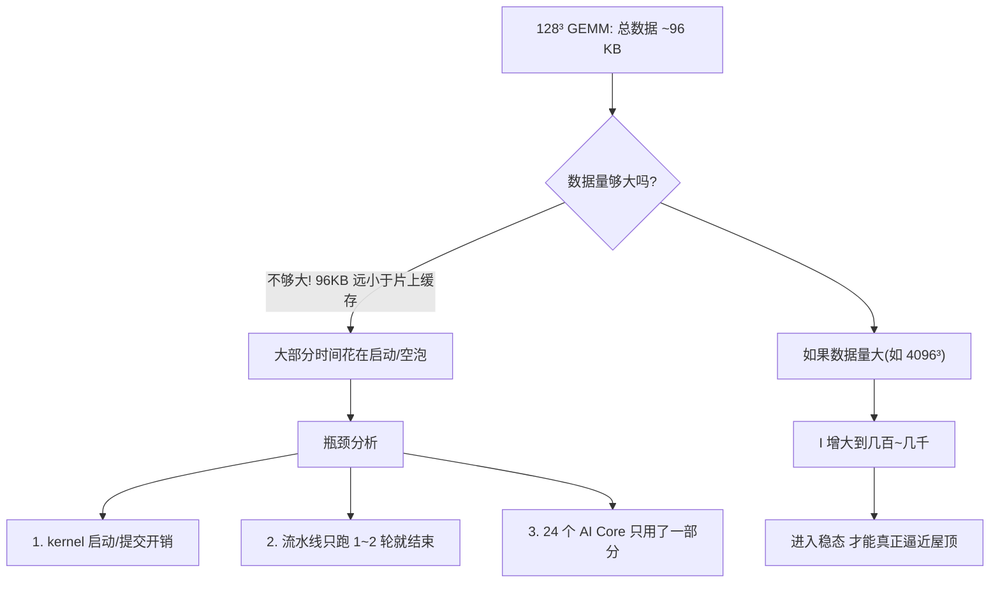

# 06 · 实战：GEMM 128³ 的 Roofline 分析案例

> 面向 0→1 新手：拿本仓库的 GEMM 实测数据，从头到尾走一遍 Roofline 分析流程。
> 本文是 [00 · 算力计算](00-npu-peak-flops-calculation.md) 和 [01 · Roofline 模型](01-roofline-perf-model.md) 的实战落地。

---

## TL;DR

- 128³ GEMM 的计算强度 I ≈ 42.7 FLOP/B，远低于 910B 的山脊点 I_ridge ≈ 197 → **理论上属于带宽受限**。
- 但实测性能只有 11.04 **GFLOPS**（tilelang）和 5.31 GFLOPS（triton），距 910B 峰值 ~315 TFLOPS 差了 **4~5 个数量级**（利用率 ≈ 0.002%~0.004%）→ 说明这么小的算子**根本没进入稳态执行**，真正吃掉时间的是**启动开销、流水线空泡、并行度不足**。
- 核心教训：Roofline 告诉你"天花板在哪一侧"，但**小算子连屋顶的门都没摸到**——Roofline 的前提（kernel 稳定运行、流水线铺满）本身不成立。判断"为什么离屋顶这么远"要靠 profiling（见 [03](03-profiling-tools.md)）。

---

## 概述

前面 [01](01-roofline-perf-model.md) 讲了 Roofline 的公式和判读规则。这篇文档拿仓库里**真实跑出来的数字**，一步一步把公式用起来，让你看到"从数字到判断"的完整链路。

---

## 第 1 步：确定算子的 FLOPs

仓库测的是 `C = A @ B`，其中 `A ∈ ℝ^{128×128}`，`B ∈ ℝ^{128×128}`，`C ∈ ℝ^{128×128}`，输入 fp16，累加器 fp32。

```
每次乘加 = 2 FLOP（1 次乘 + 1 次加）
总乘加次数 = M × N × K = 128 × 128 × 128 = 2,097,152
总 FLOPs = 2 × M × N × K = 2 × 128³ = 4,194,304 ≈ 4.19 MFLOP
```

> 为什么是 M×N×K？输出 C 有 M×N 个元素，每个元素是 A 的一行（K 个）和 B 的一列（K 个）做点积，需要 K 次乘加。

---

## 第 2 步：确定算子的 Bytes

朴素实现下（不做 tiling，A/B 从 GM 各读一趟、C 写回一趟）：

```
输入 A: 128 × 128 × 2B (fp16) = 32,768 B
输入 B: 128 × 128 × 2B (fp16) = 32,768 B
输出 C: 128 × 128 × 2B (fp16) = 32,768 B

总 Bytes ≈ 3 × 32,768 = 98,304 B ≈ 96 KB
```

> 注意：这里按"每个矩阵只从 GM 过一趟"算。实际实现如果有 tiling，A/B 的某些块会在片上复用，GM 流量会低于这个值；但朴素实现下这是下界估计。

---

## 第 3 步：计算算术强度 I

```
I = FLOPs ÷ Bytes = 4,194,304 ÷ 98,304 ≈ 42.7 FLOP/B
```

> 统一口径：读 A 一趟 + 读 B 一趟 + 写 C 一趟，每元素 2 字节，即 `Bytes = 2×(MK + KN + MN)`。本文所有分析都用这一个口径。
> 对比：[01](01-roofline-perf-model.md) 的手算练习用的也是这个口径。若把 C 的中间累加（L0C 上的多轮读写）也计入，Bytes 会变大、I 会变小——那是另一套"含片上流量"的口径，本文不混用。

**人话**：从 HBM 里每搬 1 字节，换来约 43 次浮点运算。这个数偏小——对比大型 GEMM（如 4096³）的 I 可达上千。

---

## 第 4 步：估算 910B 的 P 和 B

> ⚠️ 以下 P 和 B 均为第三方分析师估计值（[来源见 00 章](00-npu-peak-flops-calculation.md)），**华为未公开发布 910B 官方规格书**，标"待核验"。

| 参数 | 估计值 | 说明 |
|---|---|---|
| 算力峰值 P（Cube） | ~315 TFLOPS (FP16，待核验) | 24 核 × 8192 FLOP/周期 × ~1.6 GHz ≈ 314.6；00 章按 1.5/1.8 GHz 推出 295~369 的区间，本文取中值 |
| HBM 带宽 B | ~1.6 TB/s (标称值，待核验) | 与仓库基准脚本 `examples/bench_gelu.py` 的 `HBM_TBPS_QUOTED` 口径一致 |
| 山脊点 I_ridge | P/B = 315/1.6 ≈ **197 FLOP/B** | 带宽受限与计算受限的分界 |

---

## 第 5 步：判断——落在屋顶的哪一段？

```
I (≈42.7)  <<  I_ridge (≈197)

→ 结论：理论上属于带宽受限区（memory-bound）
```

**但这里有个坑**：I 小只是说明"如果 kernel 稳定跑起来，瓶颈会在带宽侧"。问题是——**这个 kernel 小到根本没进入稳定跑起来的状态**。看下一步的实测数据。

---

## 第 6 步：用实测耗时算实际性能

仓库 README 的实测数据（详见 [05 · 四种 DSL 实测解读](05-dsl-benchmark-analysis.md)，原始数据见仓库 [README](https://github.com/SuccinctPaul/Ascend-Notes/blob/main/README.md)）：

| DSL | 耗时 | 实际性能 | 计算 |
|---|---|---|---|
| triton_ascend | 0.79 ms | **5.31 GFLOPS** | 4.19e6 ÷ 0.79e-3 ≈ 5.31e9 FLOP/s |
| tilelang_ascend | 0.38 ms | **11.04 GFLOPS** | 4.19e6 ÷ 0.38e-3 ≈ 1.10e10 FLOP/s |

注意单位：**是 GFLOPS 不是 TFLOPS**——4.19 MFLOP 的算子跑零点几毫秒，性能只有 10⁹~10¹⁰ FLOP/s 量级。

---

## 第 7 步：算利用率——离天花板有多远

```
triton 利用率:  5.31 GFLOPS ÷ 315,000 GFLOPS ≈ 0.0017%
tilelang 利用率: 11.04 GFLOPS ÷ 315,000 GFLOPS ≈ 0.0035%
```

**这不是"离天花板有点远"，而是差了 4~5 个数量级**。Roofline 说"带宽侧上限 = B × I"：

```
带宽侧上限 = 1.6 TB/s × 42.7 FLOP/B ≈ 68.3 TFLOPS
```

即便按带宽受限的屋顶来算（≈68 TFLOPS），实际也只跑到 0.008% 都不到。这么大的差距已经不能用"带宽不够"或"算力不够"解释——**Roofline 的前提（流水线铺满、稳定执行）在这个尺寸上根本不成立**。

---

## 第 8 步：真正的瓶颈在哪？



### 瓶颈 1：kernel 启动开销

一次 kernel 从 host 提交到 device 执行，有固定的 launch 开销（通常几十微秒级）。如果整个 kernel 只跑 0.38 ms，其中可能 0.05~0.1 ms 是纯启动开销，实际计算时间只有 0.28 ms 左右（**推测**，准确占比要用 [03](03-profiling-tools.md) 的 profiling 数据验证）。

### 瓶颈 2：流水线没铺满

多级流水（GM→L1→L0A/B→Cube→L0C→UB→GM）需要几轮才能填满管道。128³ 的数据量太小，可能流水线刚填了一两轮就做完了，大量时间花在启动和排空阶段。

### 瓶颈 3：并行度不足

910B 有 ~24 个 AI Core，但 128×128×128 的 GEMM 可能只切出几个块，分配不到所有核上。大部分核闲置，导致整体利用率低。

---

## 第 9 步：如果加大矩阵会怎样？

对比一下不同矩阵大小的关键指标：

| 矩阵大小 | FLOPs | Bytes (朴素) | I (FLOP/B) | 理论位置 | 预期表现 |
|---|---|---|---|---|---|
| 128³ | 4.19 M | 96 KB | 42.7 | 带宽侧，远低于山脊 | 启动开销主导，利用率极低 |
| 1024³ | 2.15 G | 6.29 MB | 341 | 越过山脊，进入计算侧 | 开始逼近峰值 |
| 4096³ | 137 G | 100.7 MB | 1,365 | 深入计算侧 | 好的 kernel 可达 70-90% 利用率 |

> 注意：1024³ 和 4096³ 的数字是理论推算（`I = N/3`，N 为边长），本仓库未实测（待核验）。

**核心规律**：矩阵越大 → 数据在片上被复用的次数越多 → I 越大 → 点从带宽侧右移到计算侧 → 利用率上升 → 性能逼近屋顶。同时**只有规模够大，流水线和多核才铺得满**——这是同一枚硬币的两面。

---

## 第 10 步：为什么 tilelang 比 triton 快 2.1 倍？

两个 DSL 都跑在同一个 910B 上，矩阵大小一样，为什么 tilelang（0.38 ms）比 triton（0.79 ms）快一倍？

| 维度 | triton_ascend | tilelang_ascend |
|---|---|---|
| tiling 控制 | 编译器决定分块 | 显式 `alloc_L1` / `alloc_L0C` |
| Cube 调度 | 编译器间接调用 | 显式 `T.gemm_v0` 直调 Cube |
| 内存层级 | 编译器管理 | 显式 `T.Scope("L1")` / `T.Scope("C")` |
| 流水线 | 编译器尝试但昇腾后端尚不成熟 | 显式多级流水编排 |

> 以上解释属推理，标注（推测）：tilelang 更快的原因大概率是**显式控制了 L1/L0C 缓冲和 Cube 调度**，减少了编译器在昇腾后端上的次优决策。

---

## 完整分析速查表

| 指标 | 值 | 来源 |
|---|---|---|
| 矩阵规模 | 128×128×128, fp16 | 仓库 README |
| 总 FLOPs | 4,194,304 (~4.19 M) | 公式: 2×M×N×K |
| 总 Bytes (朴素) | 98,304 (~96 KB) | 公式: 2×(MK+KN+MN)，fp16 每元素 2B |
| 算术强度 I | 42.7 FLOP/B | FLOPs ÷ Bytes |
| 910B 峰值 P (Cube) | ~315 TFLOPS (待核验) | [00 章](00-npu-peak-flops-calculation.md) |
| 910B 带宽 B | ~1.6 TB/s (标称，待核验) | 与 bench_gelu.py 口径一致 |
| 山脊点 I_ridge | ~197 FLOP/B | P ÷ B |
| 理论位置 | 带宽侧（I 远小于 I_ridge） | 比较 I 与 I_ridge |
| 带宽侧理论上限 | ~68.3 TFLOPS | B × I |
| triton 实测性能 | 5.31 **G**FLOPS | FLOPs ÷ 实测耗时 |
| tilelang 实测性能 | 11.04 **G**FLOPS | FLOPs ÷ 实测耗时 |
| triton 利用率 | ~0.0017% | 实测 ÷ 峰值 |
| tilelang 利用率 | ~0.0035% | 实测 ÷ 峰值 |
| 真正瓶颈 | 启动开销 + 流水线空泡 + 并行度不足 | 推理（标"推测"） |

---

## TL;DR

| 步骤 | 结论 |
|---|---|
| 算 I | I ≈ 42.7，远小于 I_ridge ≈ 197 |
| 理论判断 | 带宽受限区 |
| 实测性能 | 5~11 **GFLOPS**，距峰值 315 TFLOPS 差 4~5 个数量级（利用率 ~0.002%~0.004%）|
| 真正瓶颈 | 不是带宽，也不是算力——是"工作量太小，硬件没进入稳态" |
| 优化方向 | 加大 tile / 加大矩阵规模 / 减少启动开销 / 提高并行度 |
| 教训 | Roofline 定位"在屋顶哪一侧"，但前提是 kernel 已进入稳态；小算子连稳态都没进——为什么，靠 profiling（见 [03](03-profiling-tools.md)）|

---

## 参考资料

1. **本仓库 README**——128³ GEMM 的实测耗时和精度数据来源：[README.md](https://github.com/SuccinctPaul/Ascend-Notes/blob/main/README.md)
2. **Roofline 经典论文**：Williams et al., *Roofline: An Insightful Visual Performance Model for Multicore Architectures*, CACM 2009：[eScholarship (UC Berkeley)](https://escholarship.org/uc/item/78h8v7mr)
3. **Ascend 910B 第三方分析**（AI Core 数量、频率、算力估计）：[AI Wiki: Huawei Ascend 910B](https://www.aiwiki.ai/wiki/huawei_ascend_910b/raw)（第三方，非华为官方，待核验）
4. **昇腾 msProf 官方文档**——Roofline 瓶颈分析图工具用法：[hiascend.cn](https://www.hiascend.cn/document/detail/zh/canncommercial/800/devaids/opdev/optool/atlasopdev_16_00851.html)
5. **昇腾 Ascend C 算子优化——Tiling 优化**（官方技术文章）：[hiascend.com](https://www.hiascend.com/developer/techArticles/20240920-1)

> ⚠️ **诚实声明**：910B 的 P、B、I_ridge 均为第三方估计值（标"待核验"），华为未公开发布 910B 完整规格书。本案例的分析方法论基于 Roofline 论文和仓库实测数据，方法论本身可复现——换上你目标芯片的实测 P 和 B，流程完全一样。
