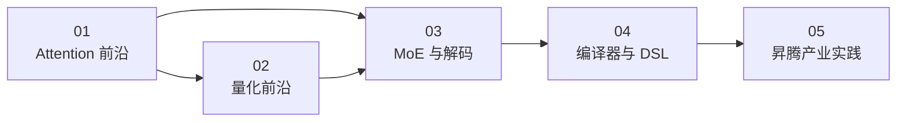

# 00 · 前沿方案总览：业界现在做到哪了

> 正卷（硬件/性能/DSL/算子）教的是**原理和基本功**；这一卷回答另一个问题：
> **截至 2026 年 9 月，学术界和产业界把"算子优化"推到了哪一步？哪些经验值得你直接吸收？**

---

## TL;DR

- 本卷是一份**地图式综述**：Attention、量化、MoE 与解码、编译器/DSL、昇腾生态五个方向的最新方案与经验，每篇都回链到本仓库的原理篇与可运行代码。
- 一条主线贯穿所有方向：**手写 kernel 的经验正在被系统化**——要么编进编译器（自动 warp specialization、自动融合），要么编进推理框架（vLLM/SGLang 的 fused kernel），要么编进 agent（自动算子调优）。
- 昇腾侧的主战场是：ATB/MindIE 的融合算子体系、vllm-ascend 的自定义 aclnn 算子链路（`op_host`/`op_kernel` → aclnn）、以及 CloudMatrix384 代表的系统级协同优化。
- 时效性纪律：本卷信息基于 2026-09 的公开资料（论文/官方文档/GitHub），标注"待核验"的数字未经本仓库实测；前沿迭代极快，读结论更要读**方法**。

---

## 一、为什么要单独开这一卷

正卷回答"算子怎么写、怎么测、怎么优化"（第 01-05 卷），但有两个问题它不回答：

1. **天花板在哪里？** FlashAttention-3 把 H100 上的 attention 打到 75% 峰值利用率；DeepGEMM 把 FP8 GEMM 做到 JIT 动态调优——知道业界最好水平，才知道自己的优化空间是"还有 20%"还是"方向就错了"。
2. **经验值钱在哪？** 业界新方案本质上是把"原理 + 踩坑"系统化：FA3 的 warp specialization 是把"搬运与计算重叠"（本卷 [02 · Tiling 与流水线](/perf/02-tiling-pipeline-overlap)）推到极致；DeepSeek 的细粒度 FP8 量化是"按块 scale"（[08 · 量化](/ops/08-quantization)）的产业终局。**读前沿 = 用新例子复习原理。**

`>` **人话**：正卷给你"锄头和锤子"，这一卷带你去看"别人用这些工具盖到了多高的楼"。

---

## 二、全景地图

| 层次 | 代表方案 | 一句话总结 | 详见 |
|---|---|---|---|
| **Attention 算子** | FlashAttention-3、FlashMLA、NSA/DSA | 异步 warp specialization + 低精度 + 稀疏化，把 attention 的"搬"和"算"同时打满 | [01 · Attention 前沿](/sota/01-sota-attention) |
| **量化与低精度** | DeepSeek FP8 细粒度、DeepGEMM、W4A8/QServe、NVFP4/MXFP4 | 缩放粒度越做越细（张量→块→tile），精度与吞吐的权衡有了系统方法 | [02 · 量化前沿](/sota/02-sota-quantization) |
| **MoE 与解码** | vLLM fused MoE、DeepEP、MTP/投机解码、superkernel | MoE 是"路由 + 分组 GEMM + 通信"的算子组合题；解码侧靠多 token 并行摊薄访存 | [03 · MoE 与解码前沿](/sota/03-sota-moe-decode) |
| **编译器与 DSL** | Triton、TileLang、CUTLASS CuTe DSL、自动 warp specialization | 手写经验正在被编译器吸收：自动流水、自动分核已能到手工 96% 的水平 | [04 · 编译器与 DSL 前沿](/sota/04-sota-compiler) |
| **昇腾生态** | CANN ATB、MindIE、vllm-ascend、CloudMatrix384 | 融合算子库 + 自定义 aclnn 算子链路 + 系统级 P/D 分离，是昇腾算子优化的产业主战场 | [05 · 昇腾产业实践](/sota/05-sota-ascend) |

---

## 三、阅读路径

`>` **人话**：按 01→05 顺序读是完整地图；赶时间的话，昇腾方向的读者可以只读 01 + 02 + 05。

### 与正卷的对应关系

| 正卷原理 | 前沿方案中的样子 |
|---|---|
| [Cube/Vector 访问权域与 DMA](/hardware/02-storage-hierarchy) | FA3 的 producer/consumer warp、昇腾 Cube/Vector 分核流水 |
| [Roofline 与算术强度](/perf/01-roofline-perf-model) | 每个新方案的动机段都在回答"它是带宽受限还是算力受限" |
| [FlashAttention 原理](/ops/07-flash-attention) | FA3 = FA2 + 异步 + 低精度；NSA/DSA = 在 FA 之上做稀疏 |
| [量化 scale 与按块缩放](/ops/08-quantization) | DeepSeek FP8 的 tile/block 细粒度缩放、W4A8、FP4 微块缩放 |
| [GQA 与 KV Cache](/ops/06-gqa-kvcache) | MLA 低秩压缩、KV 量化、P/D 分离的缓存池 |
| [四种 DSL 手册](/dsl/00-dsl-overview) | Triton/TileLang 的产业级应用、自动 warp specialization |

---

## 四、怎么读才能"为我所用"

每篇本卷都按同一个套路展开，建议你带着三个问题读：

1. **它优化的是 Roofline 的哪一侧？** 带宽侧（稀疏化、量化、KV 压缩）还是算力侧（异步流水、张量化）？多数大方案是"两侧都碰一点"的组合拳。
2. **它在哪一层做？** 算子内（kernel 微架构）、算子间（融合/superkernel）、系统级（P/D 分离）。层级越高，越不是"写个更快的 kernel"能解决的。
3. **迁移到昇腾要改什么？** 每篇的"对昇腾的启示"小节回答这个：TMA ↔ MTE、warp specialization ↔ Cube/Vector 分核、FP8 tile scale ↔ 累加器精度纪律。

---

## 常见误区与追问

1. **"前沿 = 论文 SOTA 数字"** 不对。生产可用的方案（vLLM/SGLang 里的 fused kernel）往往比论文最新结果保守一到两代；本卷会区分"论文口径"与"生产口径"。
2. **"新方案一定适用我的场景"** 不一定。稀疏注意力对长上下文收益大，短上下文可能为 indexer 开销倒贴；FP4 需要硬件原生支持。每篇都有"适用条件"。
3. **"数字可以直接引用"** 不行。本卷所有数字注明出处口径（论文实测/官方博客/第三方分析），标"待核验"的表示**本仓库未实测**，与正卷的诚实纪律一致。

---

## TL;DR 末尾汇总

1. 本卷 = 五篇地图式综述：Attention、量化、MoE 与解码、编译器 DSL、昇腾产业。
2. 主线：**手写 kernel 经验正在被编译器、推理框架、agent 三路系统化吸收**。
3. 昇腾读者的重点：ATB 融合算子体系 + vllm-ascend 自定义 aclnn 算子链路 + CloudMatrix 的系统级思维。
4. 所有数字标口径、标日期、标"待核验"；读方法比抄数字重要。

---

## 上一篇 / 下一篇

- 上一篇：[09 · GEMM（四种 DSL 实证）](/ops/09-gemm)（第 04 卷收官）
- 下一篇：[01 · Attention 前沿](/sota/01-sota-attention)

---

## 参考资料

- FlashAttention-3: Fast and Accurate Attention with Asynchrony and Low Precision（arXiv 2407.08608）：https://arxiv.org/abs/2407.08608
- Native Sparse Attention: Hardware-Aligned and Natively Trainable Sparse Attention（arXiv 2502.11089，ACL 2025 Best Paper）：https://arxiv.org/abs/2502.11089
- DeepSeek-V3 Technical Report（FP8 混合精度与细粒度量化，arXiv 2412.19437）：https://arxiv.org/abs/2412.19437
- DeepGEMM（FP8 GEMM 库，GitHub）：https://github.com/deepseek-ai/DeepGEMM
- Serving Large Language Models on Huawei CloudMatrix384（arXiv 2506.12708）：https://arxiv.org/abs/2506.12708
- vLLM Ascend 官方文档：https://docs.vllm.ai/projects/ascend/
