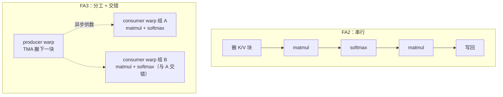
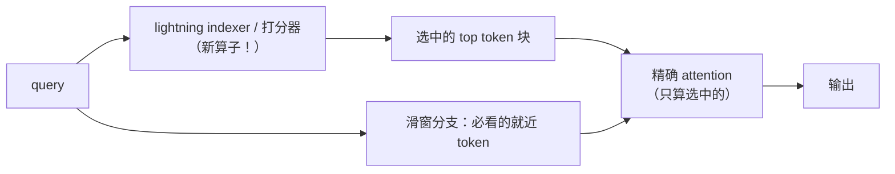

# 01 · Attention 前沿：FlashAttention-3、MLA 与稀疏注意力

> 正卷 [07 · FlashAttention](/ops/07-flash-attention) 讲了"在线 softmax + 分块"的原理。
> 这一篇讲它的下一代：**怎么把"搬"和"算"重叠到极限（FA3）、怎么把 KV 压到极限（MLA）、
> 怎么把"要算的 token"砍到极限（NSA/DSA）**。

---

## TL;DR

- **FlashAttention-3**（H100）= FA2 + 三件事：① warp specialization（搬运 warp 与计算 warp 分工）；② matmul 与 softmax 交错流水（pingpong）；③ 非矩阵乘部分用低精度硬件加速。论文口径 740 TFLOPS（FP8，约 75% 峰值利用率，待核验）。
- **MLA（Multi-head Latent Attention）**：DeepSeek 把 KV 压缩到低秩潜空间，KV Cache 缩一个量级；代价是标准 FlashAttention 不能直接用，催生了专用 kernel（DeepSeek 开源的 **FlashMLA**）。
- **稀疏注意力**：NSA（原生可训练，压缩/选择/滑窗三分支，64K 上下文解码论文口径最高 9× 加速）→ DSA（DeepSeek-V3.2 落地的"lightning indexer + token 选择"）。SGLang 提供了 Day-0 后端支持。
- **对昇腾的启示**：FA3 的三个技术在昇腾上都有同构物——warp specialization ↔ Cube/Vector 分核 + MTE 队列（本仓库 [TileLang 篇](/dsl/03-tilelang-ascend) 的 `T.Scope("C")` + 双缓冲）；softmax 交给低精度单元 ↔ 激活交给 Vector；稀疏化的 indexer 本身是一个新算子。

---

## 一、从 FA2 到 FA3：把异步性用到极限

[FlashAttention 原理篇](/ops/07-flash-attention) 讲过：attention 的痛点是 N×N 中间矩阵，解法是分块 + 在线 softmax。FA2 已经做到"一次遍历、中间不落 GM"。但 FA2 有个隐含假设：**搬运和计算是同一个执行单元串行发的**。

Hopper GPU 给了两样新玩具：**TMA**（异步批量搬运单元）和 **WGMMA**（异步矩阵乘）。FA3 用三个技术把它们吃干：

| 技术 | 做什么 | 对应的老原理 |
|---|---|---|
| **warp specialization** | producer warp 只管 TMA 搬数据，consumer warp 只管 WGMMA 算——分工而非串行 | 双缓冲/生产者-消费者（[Tiling 与流水线](/perf/02-tiling-pipeline-overlap)） |
| **pingpong 交错** | 两个 consumer warp 组交错算不同 query 块：A 组做 softmax 时 B 组做 matmul | 算子内流水（[GELU 与 Cube 重叠](/ops/05-gelu)） |
| **低精度非 matmul** | softmax 的 exp 等非矩阵乘部分用 FP8 张量核心加速，并配合 FA3 提出的精度保持技巧 | 精度换吞吐（[量化篇](/ops/08-quantization)） |

`>` **人话**：FA2 是"一个人搬砖再砌墙"，FA3 是"一个人专门搬、两个人砌墙还轮班"——
`>` 每个角色都满负荷，谁也不等谁。

### 生产口径 vs 论文口径

- 论文口径：H100 FP8 attention 约 740 TFLOPS（75% 峰值利用率，待核验）；
- 生产口径：FA3 已集成进 PyTorch（2.7+ 的 SDP 后端）与推理框架；Blackwell 上的后继实现由 cuDNN/各框架 kernel 接棒，"FlashAttention-4"暂无官方发布（截至 2026-09，待核验）。

**经验**：FA3 的收益不来自"更聪明的数学"（和 FA2 完全一样的在线 softmax），而来自**把微架构的异步资源用满**。这与本仓库 GEMM 四种 DSL 的结论完全一致——差距来自调度，不来自公式。

---

## 二、MLA：把 KV Cache 压到极限的代价

[GQA 篇](/ops/06-gqa-kvcache) 讲过：KV 头数决定 KV Cache 体积。MLA（DeepSeek 提出）走得更远——**低秩联合压缩**：把每个 token 的 K/V 压成一个共享的低秩潜向量（c_KV），注意力计算时再通过两个小矩阵升维还原。

- **收益**：KV Cache 体积比 MHA 缩小一个数量级左右（DeepSeek-V2/V3 口径），长上下文显存压力骤减；
- **代价**：还原步骤与注意力耦合，标准 FlashAttention 不能直接套。两大解法：
  1. **权重吸收（absorption）**：把升维矩阵乘进 Q/K 侧投影，decode 时直接在潜空间算注意力；
  2. **专用 kernel**：prefill 阶段不吸收（算力优先）、decode 阶段吸收（带宽优先），分别用不同 kernel。
- **FlashMLA**：DeepSeek 2025 年开源的官方 MLA kernel 库（Hopper 优化），是 MLA 落地的参考实现。

**经验**：MLA 说明一件事——**注意力结构的创新必然带动 kernel 形态的创新**。算法论文里一行公式（低秩压缩），落到 kernel 层就是"哪些矩阵乘进投影、哪些吸收进 attention、prefill/decode 各用哪条通路"的系统设计。

---

## 三、稀疏注意力：NSA → DSA

分块 + 在线 softmax 解决了"中间矩阵"，但 attention 的计算量仍随序列长度平方增长。稀疏化的思路：**每个 query 只看被选中的一小部分 key/value**。

**NSA（Native Sparse Attention，ACL 2025 Best Paper）** 的两个关键词：

- **硬件对齐（hardware-aligned）**：不是"数学上跳过一些 token"，而是按 tile 粒度跳，让kernel 的访存模式仍然规整；
- **原生可训练（natively trainable）**：训练时就带稀疏，而不是训练后近似。

三分支结构：**压缩分支**（粗粒度看全局）+ **选择分支**（按重要性挑细粒度 block）+ **滑窗分支**（就近 token 必看）。论文口径：64K 上下文解码最高 9× 加速（待核验）。

**DSA（DeepSeek Sparse Attention）**：DeepSeek-V3.2 落地的生产版——用一个小型 **lightning indexer** 给每个 query 打分选 token，再只对选中集合做精确 attention；SGLang 提供 Day-0 后端支持（含 NSA 专用后端）。

**经验**：稀疏化催生了**新算子**（indexer/选择器本身），它们是"小而重"的算子——正是本仓库 ops 卷（element-wise → reduction → attention）基本功的用武之地。

---

## 四、对昇腾的启示

| FA3 / MLA / NSA 的技术 | 昇腾上的同构物 | 本仓库相关篇目 |
|---|---|---|
| producer/consumer warp + TMA | Cube/Vector 分核 + MTE 队列双缓冲 | [TileLang 调度](/dsl/03-tilelang-ascend)、[02 · 流水线](/perf/02-tiling-pipeline-overlap) |
| softmax 交给低精度异步单元 | 逐元素交给 Vector 核，与 Cube 重叠 | [GELU 流水](/ops/05-gelu)、[术语表数据流](/reference/context) |
| MLA 权重吸收 | prefill/decode 双通路也是昇腾推理引擎（ATB/MindIE）的做法 | [05 · 昇腾产业实践](/sota/05-sota-ascend) |
| 稀疏 indexer 算子 | 小算子高频调用，正是 aclnn 自定义算子的典型场景 | [Ascend C 手册](/dsl/04-ascend-c) |
| attention 精度（FP8/在线技巧） | 混合精度纪律：fp16 进、fp32 累加不放松 | [混合精度](/ops/08-quantization) |

`>` **人话**：GPU 圈的 warp specialization，翻译到昇腾就是"Cube 管矩阵乘、Vector 管逐元素、
`>` MTE 管搬运、谁也别闲着"——你在 dsl/03 里写过的每一行调度，都是这些前沿方案的预演。

---

## 常见误区与追问

1. **"FA3 的数学和 FA2 不一样？"** 不一样的地方只在低精度路径的数值处理；核心在线 softmax 完全一致。性能差异全部来自执行调度。
2. **"MLA 比 GQA 好，应该都换 MLA？"** MLA 压缩率高但实现复杂、推理引擎需要专门 kernel；GQA 简单、生态成熟。选型看模型结构（是否从预训练就带 MLA）与引擎支持度。
3. **"稀疏注意力短上下文也快？"** 未必。indexer/打分本身有开销，短序列下可能得不偿失；NSA/DSA 的目标场景是长上下文。
4. **"这些能在昇腾上直接复现？"** 结构可以，代码不行——依赖 Hopper 的 TMA/WGMMA。昇腾上的对应实现要走 Cube/Vector/MTE 的调度（本仓库 dsl 卷的正是这套基本功）。

---

## TL;DR 末尾汇总

1. FA3 = 分工（warp specialization）+ 交错（pingpong）+ 低精度（非 matmul 部分加速）；数学与 FA2 相同，性能全在调度。
2. MLA 用低秩压缩把 KV Cache 缩一个量级，代价是专用 kernel（FlashMLA 是参考实现）。
3. 稀疏注意力 NSA→DSA 的落地形态：新算子（indexer）+ 按 tile 跳的稀疏 attention；长上下文收益大。
4. 对昇腾读者：这三种方案都是"老原理的新组合"，本仓库的正卷恰好是它们的预科教材。

---

## 上一篇 / 下一篇

- 上一篇：[00 · 前沿方案总览](/sota/00-sota-overview)
- 下一篇：[02 · 量化前沿](/sota/02-sota-quantization)

---

## 参考资料

- FlashAttention-3: Fast and Accurate Attention with Asynchrony and Low Precision（arXiv 2407.08608）：https://arxiv.org/abs/2407.08608
- PyTorch 官方博客：FlashAttention-3（warp specialization 与集成）：https://pytorch.org/blog/flashattention-3/
- FlashMLA（DeepSeek 官方 MLA kernel 库，GitHub）：https://github.com/deepseek-ai/FlashMLA
- Native Sparse Attention: Hardware-Aligned and Natively Trainable Sparse Attention（arXiv 2502.11089）：https://arxiv.org/abs/2502.11089
- SGLang 博客：DeepSeek-V3.2 Day-0 支持（NSA 后端）：https://lmsys.org/blog/2025-09-29-deepseek-V32/
- DeepSeek-V2/V3 Technical Report（MLA 结构，arXiv 2405.04434 / 2412.19437）：https://arxiv.org/abs/2412.19437
- Multi-head Latent Attention 综述性解读（社区，观点供参考）：https://champaignmagazine.com/2025/09/30/ai-on-ai-sparse-attention-from-nsa-to-dsa/
