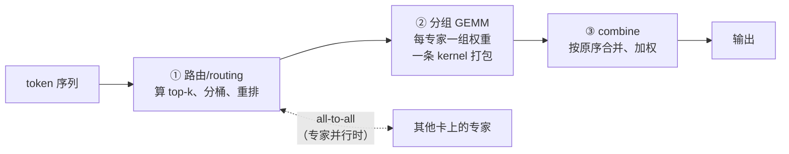

# 03 · MoE 与解码前沿：分组 GEMM、投机解码与 superkernel

> 正卷的算子都是"单算子视角"。这一篇看两个"组合视角"的前沿：
> **MoE 把算子变成"路由 + 分组 GEMM + 通信"的三段流水**；
> **解码侧用投机解码/MTP 把"一个 kernel 只产一个 token"改成"一次产一串"**。

---

## TL;DR

- **MoE kernel 的三段式**：路由（token 分桶重排）→ **分组 GEMM**（每个专家一组权重，一条 kernel 打包所有专家）→ combine（合并回原序）。vLLM 的 fused MoE kernel（Triton）是生产参考实现，支持 AWQ/GPTQ/FP8 等多量化后端。
- **通信成为算子的一部分**：DeepEP（DeepSeek 开源）把专家间 all-to-all 做成低延迟通信 kernel——MoE 优化到深处，"算子"和"通信"的边界已经融合。
- **投机解码 / MTP**：小模型或 MTP 头一次起草多个 token，目标模型一条 kernel **并行验证**一串——把解码的"逐 token 串行访存"摊薄成"逐串访存"。DeepSeek-V3 系的 MTP 是代表。
- **superkernel 趋势**：Mirage 等研究把多个小算子自动融合成"常驻 kernel"，消灭 launch 开销——正是本仓库 [Roofline 案例篇](/perf/06-roofline-case-study) 里"128³ 太小、启动开销吃光收益"的产业级解法。
- **对昇腾的启示**：MoE 的自定义算子（如 `MoeInitRoutingCustom`）已是 vllm-ascend 的实战案例；本仓库 [Ascend C 手册](/dsl/04-ascend-c) 的 kernel + host 结构正是写这类算子的基本功。

---

## 一、MoE kernel：路由 + 分组 GEMM + 通信

MoE 层的数学是"每个 token 只算 top-k 个专家"，但落到 kernel 上是三段工程：

| 环节 | 代表方案 | 值得学的点 |
|---|---|---|
| 路由 + 分组 GEMM 融合 | **vLLM fused MoE**（Triton） | 一条 kernel 内完成重排与分组矩阵乘，支持多量化后端（AWQ/GPTQ/FP8） |
| 专家间通信 | **DeepEP**（DeepSeek 开源） | all-to-all 专用通信 kernel：普通吞吐版 + 低延迟版（纯 RDMA 路径），与 GEMM 重叠调度 |
| 分组 GEMM 本体 | DeepGEMM 的 m-grouped GEMM | 每个 expert 的形状一致、m 维参差——"按 m 分组的 contiguous 布局"是关键数据结构 |
| 混合精度 MoE | MxMoE（ICML 2025） | 按"精度敏感度"给不同专家/层配不同位宽，精度预算花在刀刃上 |

`>` **人话**：稠密 GEMM 是"一锅炖"，MoE 是"分餐制"——难点从"矩阵乘本身"变成
`>`"怎么把人分到桌、菜端上桌（通信）、再合回原位"，这三步每一步都是一个 kernel。

### MoE-Inference-Bench

评测 MoE 推理的基准套件（arXiv 2508.17467），系统性比较不同专家数/并行度/负载下的表现。**经验**：MoE 的性能高度依赖负载均衡——路由倾斜时，分组 GEMM 的"组"大小参差，kernel 效率骤降。测 MoE 必须测倾斜场景。

---

## 二、解码侧：投机解码与 MTP

解码的痛点是**逐 token 串行**：每生成一个 token 都要把全部权重读一遍（[GQA 篇](/ops/06-gqa-kvcache) 的带宽账）。投机解码的思路：**让"贵的一次前向"顺便验证多个 token**。

- **经典形态**：draft 模型（小）快速起草 n 个 token → 目标模型一条前向**并行验证** n+1 个位置 → 接受前缀。验证步的 attention/GEMM 都是"批处理形态"，摊薄了权重读取；
- **MTP（Multi-Token Prediction）**：DeepSeek-V3 系的做法——目标模型自带轻量 MTP 头，训练时就学会一次预测多 token，推理时天然产出"草稿串"，无需外挂小模型；
- **kernel 形态变化**：验证步的 attention 是"多 query 对同一前缀"（与 [FlashMLA](/sota/01-sota-attention) 的 decode kernel 同族），GEMM 是小 batch 大宽度——都要求专门的 decode kernel 而非复用 prefill kernel。

**经验**：投机解码改变的不是单个 kernel，而是**算子的形状分布**（batch 维膨胀的短前向）。推理引擎里"prefill kernel / decode kernel / verify kernel"三套件并存的格局由此而来。

---

## 三、superkernel：把"算子间"也吃掉

本仓库 [06 · Roofline 案例](/perf/06-roofline-case-study) 的结论：128³ 这么小的算子，launch 开销和流水线空泡吃光收益。把镜头拉远，**推理负载里大量"小算子串"（逐元素、归约、小 GEMM）正面临同样的问题**。

- **Mirage（superkernel）**：研究系统，在 tile 级/算子级自动探索，把一串小算子融合成**一个常驻 kernel**（persistent kernel），彻底消灭中间的 launch 与 GM 往返；
- **与图算融合的关系**：本仓库 [01 · 算子融合](/ops/01-elementwise-and-fusion) 讲的 epilogue 融合是"两个邻居手拉手"；superkernel 是"整条链打包"——同一方向的不同粒度。

**经验**：算子优化的层级在不断上移：**kernel 内（tiling/流水）→ 算子间（融合）→ 全链（superkernel）→ 系统级（见下）**。每一层解决的问题都不再是"写个更快的循环"。

---

## 四、系统级：CloudMatrix-Infer 的"算子之外"

当单算子优化接近硬件极限，下一步是系统协同。华为 CloudMatrix384 的推理论文（arXiv 2506.12708）给出代表性示范：

- **P/D/C 三池分离**：prefill、decode、KV cache 拆成独立扩缩的资源池，算子负载各自均匀；
- **UB 统一总线**：384 颗 910C 以对等架构互联，带宽以"多卡堆带宽"补"单卡互联"——系统级吞吐对标 GB200 NVL72（论文口径，芯片数约为其 5 倍，待核验）；
- **算子级配合**：MLA、量化算子、通信算子按"以系统吞吐为目标"重新设计（如为 UB 形状定制的 all-to-all）。

**经验**：这篇文章里"算子优化"的定义已经扩展到"**为拓扑设计算子**"——单卡视角的 Roofline 不再够用，这是产业前沿给教科书式优化观补的一课。

---

## 常见误区与追问

1. **"MoE 快是因为算得少？"** 算得少但搬得乱：路由重排、分组访存、all-to-all 通信都是新增成本；MoE kernel 优化的本质是把这些新增成本压到远小于"省下的计算"。
2. **"投机解码永远快？"** 接受率是命门。草稿质量差时，验证成本白付；对延迟敏感的批处理服务还要考虑"验证批"对在线请求的干扰。
3. **"融合越多越好？"** superkernel 常驻意味着占用资源的时间变长，可能阻塞并发请求；融合粒度是吞吐与延迟的权衡，不是单向竞赛。
4. **"这些与昇腾无关？"** MoE 自定义路由算子已是 vllm-ascend 的实际贡献场景（见 [05 · 昇腾产业实践](/sota/05-sota-ascend)）；P/D 分离在昇腾推理引擎（ATB/MindIE 系）同样是主线路径。

---

## TL;DR 末尾汇总

1. MoE kernel = 路由 + 分组 GEMM + combine，专家并行时通信（DeepEP）成为算子的延伸。
2. 分组 GEMM 的关键数据结构是"按 m 分组的 contiguous 布局"；负载倾斜是性能头号杀手。
3. 投机解码/MTP 改变的是**算子形状分布**，催生 prefill/decode/verify 三套 kernel。
4. superkernel 把融合推到"全链常驻"，是 launch 开销问题的产业级终局之一。
5. 系统级（P/D 分离、为拓扑设计算子）是单算子优化之后的下一层。

---

## 上一篇 / 下一篇

- 上一篇：[02 · 量化前沿](/sota/02-sota-quantization)
- 下一篇：[04 · 编译器与 DSL 前沿](/sota/04-sota-compiler)

---

## 参考资料

- vLLM Fused MoE kernel 文档（Triton 实现，多量化后端）：https://docs.vllm.ai/en/latest/
- DeepEP（专家并行 all-to-all 通信库，GitHub）：https://github.com/deepseek-ai/DeepEP
- DeepGEMM（含 m-grouped FP8 GEMM，GitHub）：https://github.com/deepseek-ai/DeepGEMM
- DeepSeek-V3 Technical Report（MTP 与 MoE 结构，arXiv 2412.19437）：https://arxiv.org/abs/2412.19437
- MoE-Inference-Bench（arXiv 2508.17467）：https://arxiv.org/abs/2508.17467
- MxMoE：Mixed-precision Quantization for MoE（ICML 2025）：https://arxiv.org/abs/2505.10396
- Mirage: Multi-Level Superoptimizer（superkernel，GitHub）：https://github.com/Mirage-project/Mirage
- Serving Large Language Models on Huawei CloudMatrix384（arXiv 2506.12708）：https://arxiv.org/abs/2506.12708
