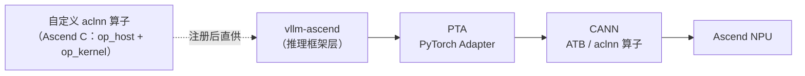

# 05 · 昇腾产业实践：ATB、vllm-ascend 与 CloudMatrix

> 前几篇讲的是"方法"，这一篇讲**昇腾上的产业落地**：华为官方的 ATB 加速库与 MindIE、
> vLLM 官方昇腾后端 vllm-ascend 的自定义算子链路、以及 CloudMatrix384 论文示范的系统级优化。
> **这三层正好对应你学完本仓库后可以走的三条路。**

---

## TL;DR

- **ATB（Ascend Transformer Boost）**：华为官方的 Transformer 推理加速库——融合算子 + 图算机制 + 插件机制，是 MindIE 等推理引擎的底座。"算子级优化"在昇腾产业侧的主形态是**融合算子库**而非裸 kernel。
- **vllm-ascend**：vLLM 官方昇腾后端，已随上游发版（v0.23.0，2026-08）。算子调用链：`vllm-ascend → PTA（PyTorch Adapter）→ CANN（ATB / aclnn）`；社区用**自定义 aclnn 算子**（Ascend C 写 `op_host`/`op_kernel`）填补 CANN 版本滞后的空隙——**这正是本仓库 Ascend C 手册技能的直接用武之地**。
- **CloudMatrix384**：华为的对等扩展系统（384 颗 910C，UB 统一总线），CloudMatrix-Infer 论文示范了 prefill/decode/cache 三池分离与"为拓扑设计算子"，论文口径 6,688 tokens/s/NPU（4K prompt，INT8 口径 1,054 TFLOPS，待核验）。
- **给你的路径**：① 本仓库 examples 手写 kernel 打底 → ② 学 aclnn 自定义算子开发 → ③ 给 vllm-ascend / ATB 生态提算子与优化。

---

## 一、ATB + MindIE：融合算子库是"算子优化"的产业主形态

单打独斗地写一个更快的 kernel，在产业侧价值有限——因为推理引擎要的是**整图性能**。华为的答案是 ATB（Ascend Transformer Boost）：

| 机制 | 做什么 | 对应本仓库的概念 |
|---|---|---|
| **融合算子** | 把 LLM 推理里高频的算子组合（如 norm + 量化、attention 多步）做成单个小库算子 | [01 · 算子融合](/ops/01-elementwise-and-fusion) 的 epilogue 融合 |
| **图算机制** | engine 层面把算子组织成图、做算子间编排与内存复用 | [数据流与生命周期](/hardware/03-host-device-kernel-lifecycle) |
| **插件机制** | 允许业务把自己的算子接进 ATB 的调度框架 | 自定义算子注册（见下节 aclnn） |

MindIE（华为推理引擎）等上层框架都构建在 ATB 之上。**经验**：在昇腾产业语境里，"算子优化工程师"的产出物通常是"ATB/aclnn 形态的融合算子"，而不是独立的 kernel 文件。

---

## 二、vllm-ascend：开源生态里的算子实战链路

vLLM 是目前事实上的推理引擎标准，vllm-ascend 是其官方昇腾后端（已随上游对齐发版，v0.23.0 于 2026-08 发布，待核验）。对你最有价值的是它的**算子分层**：

- **痛点**：PTA/CANN 的版本节奏跟不上 vllm-ascend 的快速迭代，某些新算子（如 MoE 路由 `MoeInitRoutingCustom`）需要**在 vllm-ascend 侧以自定义算子先行**；
- **官方路径**：vllm-ascend 文档给出"添加自定义 aclnn 算子"的完整指南——用 **Ascend C 写 `op_kernel`（device 侧）+ `op_host`（host 侧/tiling）**，经 CANN 工具链编出 aclnn 形态注册进算子库；
- **算子直调 RFC**：社区正在推进绕过中间层、由 vllm-ascend 直接调优算子的机制，进一步降低"好 kernel 上不了车"的摩擦。

`>` **人话**：这就是本仓库 [dsl/04 · Ascend C 手册](/dsl/04-ascend-c) 那套
`>` "kernel + host + CMake" 三件套的产业版——你练习用的 GEMM/GELU/Softmax 结构，
`>` 正是 vllm-ascend 里生产算子的结构。

---

## 三、CloudMatrix384：为拓扑设计算子

[03 篇](/sota/03-sota-moe-decode) 提到系统级优化，CloudMatrix384 论文（arXiv 2506.12708）是昇腾侧的代表作：

- **对等架构**：384 颗 910C 通过 **UB（Unified Bus）** 全互联，没有 NVIDIA NVL72 那样的 hierarchy——跨卡通信像访问本地资源；
- **P/D/C 三池分离**：prefill、decode、KV cache 各自独立扩缩，算子负载在池内均匀；
- **算子级配合**：论文明确列出"operator-level optimizations"作为三大创新之一——为 UB 的通信形状重设计 all-to-all、MLA 与量化算子按系统吞吐目标取舍；
- **数字口径**：4K prompt 下 6,688 tokens/s/NPU；910C 单卡 1,054 TFLOPS（INT8）——均为论文/官方口径，本仓库未实测，待核验。

**经验**：CloudMatrix 的叙事是"**用系统设计换单芯片效率**"（SemiAnalysis 评价：以约 5×芯片数对标 GB200 NVL72，待核验）。对个人开发者，可迁移的不是硬件，而是**思维方式**：优化目标从"单 kernel 最快"变成"整池吞吐最高"。

---

## 四、给你的三条路径

| 阶段 | 做什么 | 本仓库的落点 |
|---|---|---|
| ① 打底 | 用四种 DSL 手写 GEMM/GELU/Softmax，跑通 profiling 与 Roofline 分析 | [dsl 卷](/dsl/00-dsl-overview)、[perf 卷](/perf/00-npu-peak-flops-calculation) |
| ② 进阶 | 学 aclnn 自定义算子开发：Ascend C 写 op_kernel/op_host，接进推理框架 | [dsl/04](/dsl/04-ascend-c) + vllm-ascend《添加自定义 aclnn 算子》指南 |
| ③ 实战 | 给 vllm-ascend / ATB 生态贡献算子与优化（MoE 路由、attention 变体、量化算子） | [01-04 篇](/sota/00-sota-overview) 的方案地图 = 你的选题库 |

`>` **人话**：本仓库带你走到 ① 的终点；② 的入门材料官方文档已经齐了；③ 是开源社区
`>` 真实缺人手的地方——MoE 路由算子就是现成的例子。

---

## 常见误区与追问

1. **"ATB 和 aclnn 是竞争关系？"** 互补。aclnn 是算子库形态的单算子 API；ATB 是面向 Transformer 的融合算子 + 图编排层。推理框架两层都会用。
2. **"vllm-ascend 性能比 MindIE 差很远？"** 两者定位不同：MindIE 是华为全栈商业引擎（深度绑定 ATB），vllm-ascend 是开源生态对齐 vLLM 的后端，性能差距随版本快速收敛（各家口径不一，待核验）。
3. **"CloudMatrix 数字可以直接引用？"** 全部为论文/厂商口径，且系统级对比（芯片数、功耗）口径敏感——引用时务必带上口径声明。
4. **"个人开发者在这套体系里能做什么？"** 自定义 aclnn 算子与 vllm-ascend 社区贡献门槛最友好；ATB 内部开发门槛高但接口（插件）是开放的。

---

## TL;DR 末尾汇总

1. ATB = 融合算子 + 图算 + 插件，是昇腾产业侧"算子优化"的主形态；MindIE 建于其上。
2. vllm-ascend 的自定义 aclnn 算子链路（Ascend C 的 op_kernel + op_host）是本仓库技能的直接变现口。
3. CloudMatrix384 示范"为拓扑设计算子"：P/D/C 分离 + UB 互联 + 系统吞吐优先。
4. 三条路径：examples 打底 → aclnn 自定义算子 → 生态贡献；方案地图（01-04 篇）就是选题库。

---

## 上一篇 / 下一篇

- 上一篇：[04 · 编译器与 DSL 前沿](/sota/04-sota-compiler)
- 下一篇：回到 [首页](/) 制定你自己的下一步，或从 [构建与部署](/deployment) 搭起环境开跑。

---

## 参考资料

- ATB 加速库官方文档（CANN 8.1.RC1，华为昇腾）：https://www.hiascend.com/document/detail/zh/canncommercial/81RC1/developmentguide/acce/ascendtb/ascendtb_0001.html
- vLLM Ascend 官方文档（安装/调优/发版说明）：https://docs.vllm.ai/projects/ascend/
- vLLM Ascend：《添加自定义 aclnn 算子》开发指南：https://docs.vllm.ai/projects/ascend/en/latest/developer_guide/Design_Documents/add_custom_aclnn_op.html
- vllm-ascend RFC：算子直调（Issue #4298）：https://github.com/vllm-project/vllm-ascend/issues/4298
- vllm-ascend RFC：MoeInitRoutingCustom 自定义算子（Issue #5501）：https://github.com/vllm-project/vllm-ascend/issues/5501
- Serving Large Language Models on Huawei CloudMatrix384（arXiv 2506.12708）：https://arxiv.org/abs/2506.12708
- SemiAnalysis：Huawei AI CloudMatrix 384 分析（第三方，观点供参考）：https://newsletter.semianalysis.com/p/huawei-ai-cloudmatrix-384-chinas-answer-to-nvidia-gb200-nvl72
- vllm-ascend 仓库（GitHub）：https://github.com/vllm-project/vllm-ascend
