# 02 · Tiling 与流水线（overlap）优化思路

> 面向 0→1 新手：一个算子是"分块 + 流水"两件事撑起来的。
> 一句话记住：**先决定怎么切（tiling），再决定怎么错开干（overlap/流水线），最后决定要不要派多个核**.

---

## 概述

硬件上只有两件事在真实发生：**搬数据（DMA）** 和 **算数据（Cube/Vector）**。
搬和算如果"一个干完再干另一个"，时间就是加法；如果"一边搬一边算"，时间就是取 max。
**Tiling** 决定每一次搬多少、算多少；**流水线**决定搬和算怎么重叠；**多核并行**决定切成多少份同时算。

**人话**：传送带流水线。与其"装一车→卸一车→再装"，不如让"装下一车"和"算这一车"同时进行。

---

## 为什么需要

- **UB / L1 / L0 这些片上缓冲都很小**（CONTEXT.md：片上缓冲是软件显式管理的，不是硬件 cache）。大矩阵根本塞不进去，必须**切块（tiling）** 分批搬、分批算。
- 不重叠（不 overlap）时，`总时间 ≈ 搬运时间 + 计算时间`，空闲（空泡/idle）大量白白浪费。
- 重叠后，`总时间 ≈ max(搬运时间, 计算时间)`，谁慢谁当瓶颈，另一个被"藏"起来。
- 再叠加上多核，还能把总吞吐按核数放大。

**人话**：不分块放不下，不流水白等待，不问核数浪费一半算力。

---

## 定义

沿用 CONTEXT.md 术语，这里补充 6 个：

| 术语 | 含义 |
|---|---|
| **tiling（分块）** | 把大矩阵切成能装进片上缓冲（UB/L1/L0A/L0B/L0C）的小块，分块后"搬一块→算一块→丢一块→再搬一块" |
| **多级流水（multi-stage / 软件流水）** | 为同一个缓冲准备 N 份（双缓冲=2、三缓冲=3），让 DMA 搬运第 k+1 块时，Cube/Vector 正在算第 k 块 |
| **overlap / 双缓冲（double buffer）** | 特指 N=2 的那级流水：一块在货，一块在算，轮流用 |
| **同步（synchronize）** | 流水段之间要"对表"：数据必须到货了才能开算，算完了才能写回。CANN 用 set/wait 之类编排 |
| **多核并行（multi-core parallel）** | 几十个 AI Core 各算各的输出分片，GEMM 每核各算各的 C，天然并行 |
| **GM→L1→L0A/L0B→Cube→L0C→UB→GM 数据流** | CONTEXT.md 里那条数据通关地图，流水/搬运都发生在这些跳上 |

---

## 主体

### 1）为什么要 tiling：放不下 + 不搬多余

用本仓库 GEMM 说明。假设你非要一次算 4096³ 的 C，光输入 A 就 `4096²×2 B ≈ 32 MB`，显然塞不进几 MB 级别的 UB/L1。
所以 `C[i,j]` 这个 tile 要的 `A[i,k]` 和 `B[k,j]` 两个小条，必须**只把这一个 tile 需要的部分搬进片上**，算完再搬下一个 tile。

例：把 C 切成 `BM×BN` 的小块，K 维每次走 `BK`：

```
for tm in range(M//BM):
  for tn in range(N//BN):
    # 每个输出 tile (BM×BN)：
    for tkk in range(K//BK):          # 沿 K 切片累加
      dma_in ( A[tm][tkk] 存到 L1 → L0A )
      dma_in ( B[tkk][tn] 存到 L1 → L0B )
      cube: C[tm][tn] += A[tm][tkk] @ B[tkk][tn]   # fp16 输入, fp32 累加在 L0C
    dma_out ( C[tm][tn] 从 L0C → GM )
```

**为什么选 `BM·BN·BK`，而不往大里塞**：块越大，单个 tile 的算术强度 `I` 越高（`01` 那篇讲过），越接近计算受限——
但块太大就**超出片上缓冲**了。所以 tiling 本质是在"**往右推 I**"和"**塞得下**"之间取一个平衡点。

**分块尺寸的经验约束**（来自昇腾官方 Tiling 优化文章与社区实践，具体数值应以目标芯片为准，以下为思路）：
- tile 各维最好取 **16 的倍数**（对齐 Cube 的 16×16 粒度，CONTEXT.md 的 MAC 阵列 16×16×16）。
- 每核一次要放的输入+输出总字节要小于 **UB 可用容量**。
- 若要开双缓冲，单份 tile 要再**除以 2**（留一半给流水）。
- 搬运地址一般要 **32 字节对齐**（对 fp16 即 16 个元素）。

**人话**：分块大小像箱子——太小装不满（搬运来回多），太大塞不进高铁行李架（溢出 UB）。对齐到 16 的倍数、给流水留一半，是基本常识。

### 2）多级流水 / overlap：把"搬"藏进"算"

**为什么流水能提速**：搬运引擎（DMA/MTE）和计算引擎（Cube/Vector）是**两个独立硬件**。
只要能让它们在时间轴上错开、都忙起来，总时间就从"加法"变"取大"。

示意（双缓冲，block k 和 k+1 重叠）：

```mermaid
gantt
    title 双缓冲流水 (double buffer) 示意
    dateFormat  s
    axisFormat %S
    section DMA 搬运
    MTE 搬块0        :a0, 0, 1s
    MTE 搬块1        :a1, after a0, 1s
    MTE 搬块2        :a2, after a1, 1s
    section 计算
    Cube 算块0       :b0, after a0, 1s
    Cube 算块1       :b1, after a1, 1s
    Cube 算块2       :b2, after a2, 1s
```



- 最朴素的"串行"：搬完再算（总时间=搬+算）。
- **双缓冲**：`搬运块 k+1` 与 `计算块 k` 同时进行，时间约等于 `max(搬, 算)`。
- **三缓冲/更多级**：再多藏一个阶段（例如把 L1 预取、L0A/B 灌入、Cube、写回也各自拉开），适合 Cube 重、或搬运延迟高的场景。

**实现要点**（昇腾 Ascend C 里常见三板斧，具体 API 名随版本，代之以思路并标注"待核验"）：
- 用**双/多组缓冲**轮换（把分配给 tensor 的片上空间一分为二，一组在算一组在搬）。
- 在"搬完→开算"和"算完→可写回"之间插入**同步原语**（如 `SetEvent` / `WaitEvent` 之类），保证时序正确。
- 在 tile 循环里把它们编成流水：先预取第一块，然后循环里"搬下一块 || 算当前块 || 同步"。

**人话**：别让算力等数据、别让带宽等算力——错开干就是白赚的吞吐。

### 3）多核并行切分：让几十个核都动起来

- **GEMM 天然适合切核**：`C[i,j]` 只依赖 `A` 的某一行和 `B` 的某一列，**核与核之间没有依赖**，各自算各自的分片 C 即可（CONTEXT.md 的"多核并行"术语）。
- 切法一般是"把输出 C 的行/列分成若干块，每核或每组核领一块"。用昇腾的 `SetBlockDim(核数)` 接口指定启几个核；**一般让核数 ≈ 可用 AI Core 数（或 2 倍组合）**，否则有一半核在围观。
- **负载均衡**：让各核处理的块尽量等大小；尾块（整除不掉的余量）要有策略（前几个核多处理一块，或向上取整），避免"一个核干到累死，其他核早就闲了"。

**人话**：开并行不是"顺手开"——开了就要让核都被喂饱，别让某个核拖全队后腿。

### 4）从"朴素"到"可流水"：本仓库四种 DSL 的差异

| 实现 | 谁在 tiling | 谁在管流水 | 谁切核 | 你能控制多少 |
|---|---|---|---|---|
| `python/`（CPU 基准） | 无（整张算） | 无 | 无 | 最低 |
| `ascend_c/` | 你自己写 host tiling + kernel 手工分块 | 你自己 DP（DataCopy/同步双缓冲） | 你 `SetBlockDim` | **最高（字节级）** |
| `triton_ascend/` | 编译器推断 + `tl.block_ptr` 表达块 | 编译器自动 multi-stage | 编译器 `tl.program_id` | 中（块级） |
| `tilelang_ascend/` | 你 `alloc_L1/L0C` 显式指 | `T.Pipelined(num_stages=…)` 显式流水 | 语言/编译器层 | 中偏调度（显式但高层） |

**对应到本仓库**：`tilelang` 写法（`alloc_L1/L0C + T.copy + T.gemm_v0 + T.Pipelined`）基本就是"把上面 1/2/3 部都显式说出来"；
`triton` 更多把细节交给编译器；`ascend_c` 则每个字节每级缓冲都要你亲手管。

### 5）什么时候先做哪件事（套路）

```
① 先做 tiling：让数据装得下，I 拉高 → 收益最大、改动最小
② 再开多核：核都用满 → 吞吐翻倍
③ 最后上流水：把 搬/算 重叠 → 在占用峰值下把空泡挤掉
```

> 反向也成立：如果 `04` profiling 发现 MTE2(搬运)占大头，优先回去扩 tiling / 加深流水；如果 Cube 利用率本来就低，先修计算侧，别先堆流水。

### 5b）用"一段直觉"理解流水收益上不去的边界

流水不是无脑越深越好，有典型"边际递减"：

- **双缓冲→三缓冲**收益最大，再往上（4、5 级）收益就小，因为"先搬的那一版"不再能继续藏住更后面的延迟，反而多耗片上空间。
- **每个 stage 都要占一份片上缓冲**：级数 × 单块大小要 < 片上可用空间。流水工程上常是"空间换时间"——**给流水留的空间和三缓冲是竞争同一个盘子**。
- 只有当"计算相对搬运够重/够深"时，多级流水才划算；如果你的算子本身就是搬运型（Elementwise），搬完才算，多级流水帮不了多少，重心应放在"一次搬更多、少往返"（对应 `04` 症状一）。

**人话**：流水像"多开几个窗口存半成品"——窗口开太多反而是浪费货架（片上空间），够用就好。

### 6）把 tiling 三要素写进一个"检查清单"（写完 kernel 自查用）

写完或改完一个 GEMM kernel，对着这几条过一遍，能拦住一大半性能问题：

- [ ] **装得下**：每个核一次在片上的 输入(+累加器) 之和 < UB/L1 可用容量（含给流水留的份）。
- [ ] **对齐**：tile 搬运的地基层次按 16（Cube 粒度）/ 32 字节（地址对齐）取整，避免搬运"东一榔头西一棒"。
- [ ] **复用够**：A/B 的每个 tile 被 ≥ 若干次输出 tile 复用（K 维合进来算，别每小块重读）。
- [ ] **流水铺了**：搬下一块 与 算当前块 由同步点错开，没有整段"只有搬没有算"的空泡。
- [ ] **核开满**：`blockDim/核数` ≈ 可用 AI Core（或 2 倍组合），各核块大小均衡。
- [ ] **有证据**：用 `03` profile 前后各采一发，确认搬运/计算占比确实在往好处走。

> 这份清单的"数"（多少可用容量、多少核）都应以目标芯片与 CANN 实测为准——**填数字前先量一量，别拍脑袋**；语焉不详处标"待核验"。

### 7）新手 FAQ

- **Q：tiling 是否一定带来正确性变化？** 不。tiling 只改数据流和求和顺序，不改数学；唯一需要留意的是**浮点累加顺序变化可能带来极小误差**（见 `05` 的 tilelang 9.8e-4 那段），对大 K 累加要保留 fp32 累加器。
- **Q：先优化打到多少再停？** 没有固定数；常用做法是用 profile 看"离理论耗时/天花板"还有多大缝（`04` 的判定法）。
- **Q：多级流水在 TileLang / Triton 里怎么不自己写？** TileLang 提供 `T.Pipelined(num_stages=…)`，Triton 后端通常自动做 multi-stage——你只需要在"显式 vs 自动"之间选符合你抽象层级的那个（`05` 讲过抽象梯子）。

---

## 人话总结

1. **tiling** = 把放不下的大矩阵切成能装进片上缓冲的小块，并尽量往"每个字节换更多计算"里顶（对齐 16、留半给流水）。
2. **流水/overlap** = 让 DMA 搬下一块的同时，Cube/Vector 正在算当前块，总时间从"搬+算"变"max(搬,算)"。
3. **多核并行** = 把输出切成多份分给多个 AI Core，各自算各自的 C，别让核闲。
4. 顺序套路：**先 tiling，再多核，最后流水**；若 profiling 显示搬运是主瓶颈，再回头扩分块 / 加深流水。

> 记住一句话：**切得下、错得开、分得匀，性能就上去了。**

---

## 附：一份"开流水"的具体化清单（写代码前先过一遍）

给从没写过流水的新手，把抽象落到可执行的顺序：

```
STEP 0  先分块：确定 tile 尺寸（对齐 16 的倍数、总量 < 片上可用）
STEP 1  决定用几级缓冲：先双缓冲（2），不够再加到 3（别一上来就 4/5）
STEP 2  写搬运：把"下一块"的搬运挂在"当前块"计算之前发起
STEP 3  加同步：在"搬运完成"与"开算"之间、以及"算完"与"可覆盖缓冲"之间插同步
STEP 4  处理收尾：最后一个 tile 不再预取；首块要"先搬再算"打好第一拍
STEP 5  多核：把上述流水写进每个核，并保证各核负责的 tile 均衡
STEP 6  验证：先保证正确（对拍），再用 03 profile 看有没有把 MTE2 藏住
```

> 每一步里"搬运完成才开算 / 算完才可写回"就是**同步**（CONTEXT.md 的"同步"术语），它决定了流水挤得对不对——同步加太多反而拖慢（`04` FAQ 讲过"改完反而慢"），要"该同步才同步"。

## 附2：一个"多核 + 流水"共同作用的直观例子

- 设想 4096×4096 的 GEMM，单核流水铺到极致后，吞吐被单核算力封顶。
- 于是用 `4096/核数` 把 C 切成多份，每核一份——**多核把"吞吐天花板"抬高了**。
- 而每核内部继续 tiling + 流水——**单核内部的搬运被藏住了**。
- 两层叠加，效果是"每核都贴住自己那片的算力天花板，同时还把带宽藏掉了"。
- 这也是为什么 `02` 讲的三件事（tiling/流水/多核）通常是**一起用**，而不是三选一。

**人话**：多核负责"加宽马路"，流水负责"不堵车"，tiling 负责"车装得合适"。三件套闭环才快。

---

## 参考资料

> 以下均为公开可核验来源。

- 华为昇腾官方开发文章《Ascend C 算子优化实用技巧 04——Tiling 优化》（多核切分、L2Cache 切分、核间负载均衡）：
  - https://www.hiascend.com/developer/techArticles/20240920-1
- 华为昇腾官方开发文章《Ascend C 算子优化实用技巧 01——流水优化》（搬运与计算重叠的基本思路）：
  - https://www.hiascend.com/zh/developer/techArticles/20240819-1
- 华为昇腾官方开发文章《Ascend C 算子优化实用技巧 02——内存优化》：
  - https://www.hiascend.com/zh/developer/techArticles/20240823-1
- 华为昇腾官方开发文章《Ascend C 算子优化实用技巧 03——搬运优化》：
  - https://www.hiascend.com/zh/developer/techArticles/20240906-1
- TileLang 官方仓库（`T.Pipelined` 多级流水 / `alloc_L1/L0C` 显式分块的用法可看其文档与示例）：
  - https://github.com/tile-ai/tilelang
- OpenAI Triton 官方文档——矩阵乘法教程（块级编程 + 数据在片上复用的思想可对照）：
  - https://triton-lang.org/main/getting-started/tutorials/03-matrix-multiplication.html

> 注：双/三缓冲的确切 API（`SetEvent/WaitEvent`、`T.Pipelined` 参数等）随 CANN / DSL 版本变化，文中只给思路，具体以对应版本官方文档为准；相关项已标注"待核验"。