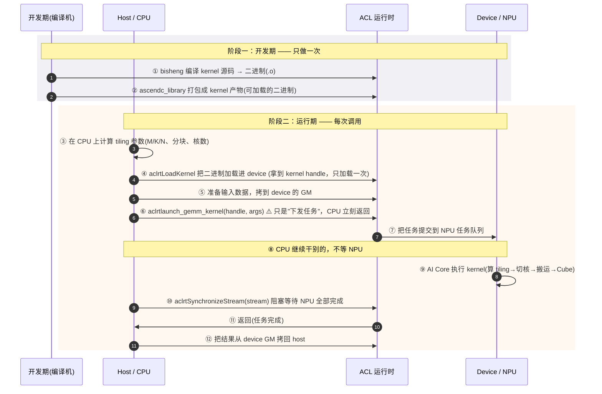

# Ascend-Notes (multi-DSL GEMM on Ascend NPU)

这是一个多 DSL 的 GEMM kernel 学习项目:用 4 种不同的编程语言/DSL(python、ascend_c、
triton_ascend、tilelang_ascend)在昇腾 NPU 上实现同一个 `C = A @ B`,并使它们输出与
CPU 参考基准一致。本术语表钉住理解这些 kernel 所需的领域语言。


## Overview

```text
M1  硬件架构全貌
     AI Core 集群 / AI CPU / DMA / GM(HBM) / 片上存储(UB·L1·L0)
     —— 算子跑在什么样的"物理世界"里

M2  两级系统分工        ← 我们已走到这里的 60%
     host 指挥 / device 干活 / 异步提交 / 同步 / kernel handle

M3  算子完整生命周期
     需求 → 设计 → tiling → kernel → host → 编译(ascendc_library)
     → 加载 → launch → 验证 → 调优 → 部署
     —— 一个算子从出生到上线，走完哪些站

M4  算子分类
     计算算子 / 通信算子 / 图算融合 —— 我们的 GEMM 属于哪类、为什么
```

## 硬件架构

### 图 A · 架构（含"访问权域"，严谨版）

**三条物理事实（一切以这为准）：**
1. **存储分两级**：芯片级（GM / 片上共享存储，全核共享）+ 核内（L1/L0A/L0B/L0C/UB，每核私有）。
2. **L1 是核内统一缓存，Cube 与 Vector 共用**：Cube 经 L1 灌 L0A/L0B，Vector 经 L1 灌 UB。L1 不属于任何单一引擎域。
3. **每个引擎只访问"自己名下的缓冲"**（访问权域边界）：
   - **Cube 域**：Cube 引擎 ↔ 只碰 L0A / L0B / L0C。
   - **Vector 域**：Vector 引擎 ↔ 只碰 UB。
4. **DMA 是唯一"搬运工"**：跨存储层移动、跨域搬运（如 L0C→UB），必须经 DMA，无引擎能直接读别的缓冲。

```mermaid
flowchart TB
    subgraph SYS["芯片级 (全核共享)"]
        GM[("GM / HBM 存 A·B·C 原始数据")]
        SHARE["片上共享存储 核间中转信道 (仅跨核时用)"]
        AICPU["AI CPU 复杂控制/整数逻辑"]
    end

    subgraph CORE["单个 AI Core"]
        direction TB
        L1_["L1 统一缓存 核内共享: Cube 与 Vector 共用"]
        subgraph CUBEDOM["Cube 域 —— 引擎只碰域内缓冲"]
            CUBE["Cube 引擎 矩阵乘 16×16"]
            L0A_[L0A 输入预取]
            L0B_[L0B 输入预取]
            L0C_[L0C 累加器 (fp32)]
        end
        subgraph VECDOM["Vector 域 —— 引擎只碰 UB"]
            UB_[UB 统一缓冲]
            VEC_["Vector 引擎 逐元素运算"]
            SCA_["Scalar 引擎 控制/地址"]
        end
    end

    DMA["DMA 引擎 唯一搬运工"]

    GM <-->|DMA| DMA
    DMA <-->|DMA| SHARE
    DMA <-->|DMA| L1_
    L1_ -->|灌入| L0A_
    L1_ -->|灌入| L0B_
    L0A_ -->|取数| CUBE
    L0B_ -->|取数| CUBE
    CUBE -->|累加结果| L0C_
    DMA <-->|跨域搬运| L0C_
    L1_ -->|灌入| UB_
    DMA <--> UB_
    UB_ <--> VEC_
    UB_ <--> SCA_
```

**看图要抓住的三件事：**
- **域边界**：Cube 引擎在 `CUBEDOM` 里，Vector/Scalar 在 `VECDOM` 里。**引擎只碰自己域的缓冲**——这是"为什么不能在 L0C 上做 ReLU"的硬件原因。
- **L1 是核内枢纽**：Cube 和 Vector 都从 L1 取数据（`L1_→L0A_/L0B_`、`L1_→UB_`），L1 是核内共享，不属于任一引擎域。
- **L0C 到 UB 唯一的路**：必须经 `DMA`。图里 `L0C_` 与 `UB_` **没有直连**——跨域搬运只能走 DMA。


### 图 B · 数据流（有序步骤，标注每步的引擎与域）


**数据流要点：**
- ①→⑥ 是 **Cube 通路**（纯矩阵乘），全程没离开 Cube 域。
- **② 是"可选分叉"**：单核私有数据走 ②a 直达 GM→L1；只有**确实要跨核交换**时才走 ②b 绕共享存储（GEMM 每核各算各的 C，通常用不到）。
- ⑦→⑧ 是 **可选的 Vector 加工通路**，只有做 ReLU/归一化这类逐元素操作时才走；**必须经 DMA 跨域把 L0C 搬进 UB**。
- ⑨ 回写 GM 同样走 DMA。
- **每一步的"搬运"，都是 kernel 代码显式发起的**——这就是"搬运是显式的"。

### M1 · 讲解正文（图文对照）

**一、三层世界的心智模型**
```
┌─ 最外层：GM (HBM) ──────────────┐   容量最大 · 速度最慢 · 数据仓库
│   A / B / C 的原始数据都躺在 HBM │   ← 图一最下方
└──────────────┬───────────────────┘
               │ ① DMA
┌──────────────▼───────────────────┐
│  片上共享存储 (芯片级中层)         │   核间"公共信箱"
│  核 A 的中间结果 → 转给核 B        │   ← 图一中间
└──────────────┬───────────────────┘
               │ ② DMA 分发给各核
┌──────────────▼───────────────────┐
│  AI Core 内部 (每核私有)          │
│  L1 → L0A/B → Cube → L0C → UB    │   最快 · 容量最小
└──────────────────────────────────┘   ← 图二
```
**核心心法：数据离算力越近越快，但容量越小。** 高性能算子只做一件事——尽量把数据搬进
片上、反复复用，别老回 GM 去取。这就是"GM 访问下降 N 倍"的硬件根源。

**二、图 B 解读：数据怎么进 Cube**
图 B 是"数据通关地图"，①-⑨ 每一步都是显式 DMA 搬运或同步：
- **L1 缓冲**：每核私有，装 A/B 子块，对应 `T.alloc_L1`。
- **L0A / L0B**：Cube 的输入预取缓冲，紧贴 Cube，喂矩阵乘的 A、B 分块。
- **L0C**：Cube 的累加器，fp32 累加在此完成。
- **UB → Vector**：要做 ReLU 等逐元素操作，Cube 结果先从 L0C 搬到 UB，再让 Vector 加工。
- **关键点**：Cube 和 Vector 是两个不同引擎，**各自只能碰自己的缓冲**——Cube 碰 L0A/B、
  L0C；Vector 碰 UB。这就是结果必须在 L0C 和 UB 间搬来搬去的原因。

**三、图一解读：多核怎么并行**
图一拉远到芯片级，回答"算子在哪跑、怎么并行"：
- **几十个 AI Core 并行干活**：每核独立跑 kernel，各算各的 C 分片。
- **片上共享存储是核间唯一通道**：核 A 的中间结果经它转给核 B。
- **AI CPU 兜底**：复杂控制流、整数逻辑、地址计算这类 Cube/Vector 接不了的"脏活"。
- **DMA 是唯一搬运工**：GM、共享存储、AI Core 之间所有数据流动都走 DMA。

**四、一个常见误解的澄清**
听到"NPU 的 L1"别以为像 CPU 的 L1 cache 一样**硬件自动管理**。昇腾的 L1/L0/UB 是
**软件显式管理**的——kernel 代码必须用 DMA 手动搬入搬出。这是 NPU 与 CPU 最本质的区别。

**五、一句话串起来**
> 数据从 GM（仓库）出发，经 DMA 穿两层（共享存储 → L1）进到 Cube 眼前，算完累加在
> L0C，要加工就搬到 UB 给 Vector，最后原路 DMA 回 GM。全程每一级搬运都是 kernel
> 代码显式发起的。


### 两级系统分工：host 指挥，device 干活（完整时序）



## NPU架构
```
┌─────────────────────── AI Core ───────────────────────┐
│  ┌─────────┐   ┌─────────┐   ┌─────────┐   ┌───────┐ │
│  │  Cube   │   │ Vector  │   │  Scalar │   │  DMA  │ │
│  │ 单元    │   │ 单元    │   │  标量   │   │ 搬移  │ │
│  │(矩阵乘) │   │(向量)   │   │(控制)   │   │(搬运) │ │
│  └────┬────┘   └────┬────┘   └────┬────┘   └───┬───┘ │
│       └─────────────┼──────────────┼────────────┘     │
│              ┌──────┴──────┐   ┌───┴────┐             │
│              │  L0A / L0B  │   │ L0C    │   ← 片上缓存 │
│              │  L1 缓存    │   └────────┘             │
│              └─────────────┘                          │
│                    ↘                ↗                  │
│              ┌──────────────────┐                     │
│              │   UB 统一缓冲区  │  ← 计算的"工作台"    │
│              └──────────────────┘                     │
└───────────────────────────────────────────────────────┘
```

四个引擎各司其职：

Cube 单元：干矩阵乘法，一次能算一个 16×16×16 的小矩阵块（MAC 阵列），这是速度之王。

### Cube 单元：硬件矩阵乘法引擎
Cube 不是逐元素算乘加的，而是一个硬件专用引擎，一次调用就能算出 16×16 = 256 个输出元素的矩阵乘 C += A·B。

A 分块 16×16，B 分块 16×16，硬件在一个周期内算出 C 分块 16×16。
输入是 fp16，但在片内用 fp32 累加（对应你之前学的精度知识）。
中间结果暂存在 L0C（Cube 的专用累加缓冲）。


### Vector 单元：做逐元素运算（加法、激活、归一化），一次处理一批元素。

### Scalar 单元：跑循环控制、地址计算、判断。

### DMA 引擎：负责把数据从外存（GM）搬进片上缓存，再把结果搬回去——它不计算，只搬运。

数据流是这样走的：GM（全局内存）→ L1 → L0A/L0B → Cube → L0C → UB → GM。


## Language

**GM (Global Memory)**:
昇腾的全局内存,即 HBM 显存,容量大但带宽有限。kernel 通过 `GlobalTensor`/`GM_ADDR`
访问它。类比 CPU 的 RAM。
_Avoid_: 显存、HBM buffer

**片上缓冲 (on-chip buffer, L1 / L0C / UB)**:
昇腾 AI Core 上的高速片上存储,由 **kernel 代码显式管理**——不是硬件自动 cache。
数据必须由 DMA(`T.copy` / `CopyData`)显式搬入,用完再搬回。这是 NPU 与 CPU cache
最本质的区别。
_Avoid_: on-chip cache、片上缓存

**L1**:
Cube/Vector 核的片上高速缓冲,类比 GPU 的 shared memory,存 A/B 的子块。
_Avoid_: L1 cache

**L0C**:
Cube 核的累加器缓冲,存矩阵乘的中间结果(Cube 固有累加语义)。
_Avoid_: fragment、累加寄存器

**L0A / L0B**:
Cube 单元的**输入预取缓冲**,紧贴 Cube,分别喂给矩阵乘的 A、B 分块。
数据由 L1 经 DMA 搬入,喂给 Cube 后即消耗。
_Avoid_: 输入缓存、Cube 输入存储

**UB (Unified Buffer, 统一缓冲)**:
**Vector 单元**的"工作台",逐元素运算(激活/归一化/加偏置)在此做。
Cube 算完的 L0C 结果,常须先搬到 UB,Vector 才能加工。
_Avoid_: 统一缓存、UB buffer

**片上共享存储 (on-chip shared storage)**:
芯片级中层内存,**AI Cores 之间交换数据的"中转站"**。核 A 的中间结果经它转给核 B。
跨核数据必须经过它,这就是数据要"穿过两层 DMA"(GM→共享存储→L1)的原因。
_Avoid_: 共享缓存、L2

**AI CPU**:
昇腾芯片上、但**不在 AI Core 内**的处理器,承接复杂控制流、地址计算、整数逻辑等
Cube/Vector 不适合的"脏活"。与 AI Core 通过片上共享存储/控制总线连接。
_Avoid_: 主核、控制核

**AI Core**:
昇腾的计算核心,一个 AI Core 内含独立的 Cube 单元与 Vector 单元。
_Avoid_: 核、processor core

**Cube 单元**:
AI Core 中专做**矩阵乘**的硬件单元,以 16×16 为计算粒度,是 GEMM 性能的核心来源。
_Avoid_: 矩阵单元、matmul unit

**Vector 单元**:
AI Core 中做**向量运算**(逐元素)的硬件单元,不负责矩阵乘。
_Avoid_: 向量核、vector core

**Scalar 单元**:
AI Core 中跑**标量/控制流**的小核:循环控制、地址计算、条件判断。数据进 Cube/Vector
前的"编排"由它完成,不算真正的数值计算主力。
_Avoid_: 控制核、标量核

**DMA 引擎**:
AI Core 中**专职搬运**数据的硬件单元,不计算。GM、片上共享存储、L1/L0/UB 之间所有
数据流动都经它完成。**没有核能直接读别的缓冲/GM 的块,必须走 DMA。**
_Avoid_: 搬移单元、拷贝引擎

**MAC 阵列 (16×16×16)**:
Cube 单元物理上的乘加器阵列形态,一次可完成 16×16×16 的乘加(256 个输出的累加)。
16×16 的"粒度"就来自这个物理排布,故 tile 维度最好取 16 的倍数。
_Avoid_: 乘法器、MAC unit

**数据流 (dataflow)**:
数据在存储层级间流动的完整路线:
`GM → L1 → L0A/B → Cube → L0C → UB → (Vector) → 回 GM`。
每一跳都是**显式 DMA 搬运 + 同步**。理解数据流 = 理解算子性能的命门。
_Avoid_: 数据通路、数据路径

**多核并行 (multi-core parallel)**:
几十个 AI Core 各自独立跑 kernel,各算各的输出分片,经片上共享存储交换跨核数据。
GEMM 天然无核间依赖(每个 C[i,j] 只依赖 A 一行 + B 一列),故可简单按行/列切分给多核。
_Avoid_: 并行计算、多核计算

**混合精度 (mixed precision)**:
本项目的精度策略:**fp16 输入/输出 + fp32 累加器**。fp16 是 Cube 原生精度(吞吐高),
fp32 累加器保护 K 维累加过程中的**精度损失**(见下条)。
_Avoid_: fp16 精度加速

**精度损失 (precision loss)**:
fp16 尾数仅约 11 位(约 3 位十进制有效数字),累加 K 个乘积时小项会被舍掉。
**这是"有效数字/precision"问题,不是"数值范围/overflow"问题**(fp16 范围达 ±65504,
不会溢出)。用 fp32 累加器正是为了保留这些进位。
_Avoid_: 精度溢出、overflow、累加溢出

**tiling (分块)**:
把大矩阵切成能装进片上缓冲的小块,分块后搬运+计算,这是 GEMM 优化的核心策略。
_Avoid_: 分片、blocking

**抽象梯子 (abstraction ladder)**:
四种 DSL 对内存层级/搬运的控制颗粒度不同:ascend_c 管字节级(逐元素)、triton 管块级
(编译器决定缓冲)、tilelang 管调度(显式指定 L1/L0C 与搬运)。
_Avoid_: 抽象层级、抽象程度

## 两级系统 (host / device)

昇腾算子运行时是**两级体系**:host(CPU)与 device(NPU)分工不同,中间隔着异步任务队列。

**host (主机 / CPU)**:
昇腾算式中跑在 CPU 上的部分。它**不执行 kernel**,只负责:①计算 tiling 参数;②把
输入数据拷入 device 的 GM;③下发任务(异步提交);④显示同步等待结果。类比"教练"。
_Avoid_: 启动端、主控端

**device (昇腾处理器 / NPU)**:
跑在昇腾 AI Core 上的部分,真正执行 kernel 的地方。类比"运动员"。
_Avoid_: 设备端、执行端

**tiling 参数 (分块参数)**:
host 在 CPU 上预先算好的、描述"怎么分块/开几个核/各维尺寸"的标量集合,写进 device 可见
的 GM(`tiling`),kernel 启动后读取。host 算、device 用。
_Avoid_: 分块数据、tiling 数据

**异步提交 (asynchronous launch)**:
`aclrtlaunch_*` 的本质动作:CPU 把 kernel 任务**提交进 NPU 的任务队列**,然后**立刻返回、
不等 NPU 跑完**。CPU 与 NPU 由此**并行**。launch 不是"调用",而是"投递任务单"。
_Avoid_: 调用、下发 kernel、launch(英文)

**同步 (synchronize)**:
`aclrtSynchronizeStream` 等显式操作,阻塞 CPU 直到 NPU 上的一批任务全部完成。因为
launch 是异步的,CPU 想安全读取结果**必须主动同步**,否则可能拿到 NPU 还没写回的旧数据。
_Avoid_: 等待、join

**kernel handle**:
`aclrtLoadKernel` 把编译好的 kernel 二进制加载进 device 后得到的句柄。加载**通常只做
一次**,之后每次 `aclrtLaunch*` 都复用该 handle,不再重新编译/加载。
_Avoid_: kernel 指针、kernel id

**ACL 运行时 (AscendCL)**:
昇腾的运行时库,提供 `aclrtLoadKernel` / `aclrtLaunch*` / `aclrtSynchronizeStream` 等
API,是 host 与 device 之间的桥梁。kernel 的编译加载、任务排队、结果同步都经它完成。
_Avoid_: 引擎、框架